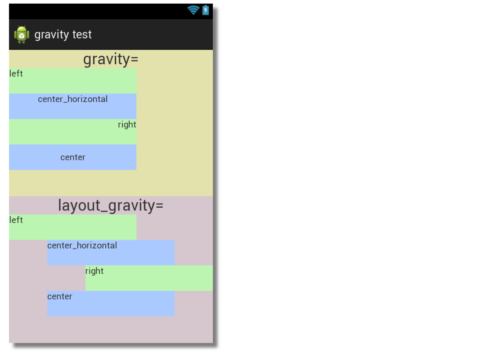

# Basic Layout

- [Basic Layout](#basic-layout)
  - [`View` and `ViewGroup` Objects](#view-and-viewgroup-objects)
  - [Containers](#containers)
  - [Android Layout Attributes](#android-layout-attributes)
    - [Padding versus margin](#padding-versus-margin)
    - [Android match_parent, wrap_content and fill_parent](#android-match_parent-wrap_content-and-fill_parent)
  - [FrameLayout](#framelayout)
  - [LinearLayout](#linearlayout)
    - [Layout Weight](#layout-weight)
    - [gravity and layout_gravity](#gravity-and-layout_gravity)
    - [Dummy `Views` Widgets with `layout_weight` for space in-between](#dummy-views-widgets-with-layout_weight-for-space-in-between)
  - [Relative Layout](#relative-layout)
    - [Center relative to Parent View](#center-relative-to-parent-view)
    - [Align by the parent view](#align-by-the-parent-view)
    - [Place new View relative to existing sibling View](#place-new-view-relative-to-existing-sibling-view)
    - [Align new View relative to existing sibling View](#align-new-view-relative-to-existing-sibling-view)
  - [Constraint Layout](#constraint-layout)
    - [Correct Ways of Anchoring](#correct-ways-of-anchoring)
    - [Dimension Constraints](#dimension-constraints)
    - [Relative Positioning](#relative-positioning)
    - [Toolbar Options](#toolbar-options)
      - [Pack](#pack)
      - [Align](#align)
    - [Chains](#chains)
    - [Virtual Helper Objects](#virtual-helper-objects)
      - [Guideline](#guideline)
      - [Barrier](#barrier)
      - [Group](#group)
  - [ImageView](#imageview)
    - [Load Image:](#load-image)
    - [Important XML Attributes of ImageView :](#important-xml-attributes-of-imageview-)
    - [Vector Asset - Icon](#vector-asset---icon)
  - [ShapeableImageView](#shapeableimageview)
  - [Button](#button)
    - [Material Button](#material-button)
    - [Gradient Button](#gradient-button)
  - [Custom Font](#custom-font)

## `View` and `ViewGroup` Objects

A `View` object is a composition unit. You build a UI by arranging one or more View
objects alongside each other or sometimes embedded in each other. There are two kinds
of views as the Android library defines it, a `“View”` and a `“ViewGroup”`. An example of a
`View` object is a *button* or a *text field*. These objects are meant to be composed alongside
other views, but they are not meant to contain child views; they are intended to stand
alone. A `ViewGroup`, on the other hand, can contain child views which are other views and view groups—it’s the reason why they’re sometimes called *containers*.

<div align="center">
 
</div>

*Each View object ultimately becomes a Java object at runtime*, but we work
with them as XML elements during design time. We don’t have to worry about how
Android inflates the XML into Java objects because that process is invisible to us.

<div align="center">

</div>

The compiler transforms the program source files into Java `byte` codes. The resulting byte
codes are then further converted to a `DEX` file. A `DEX` file is a **Dalvik Executable**;
it’s the executable format that the **Android Runtime**(`ART`) understands. Before the `DEX`
files and other resources get wrapped into an **Android package** (`APK`), it also produces
as a side effect a special file named `“R.class”`. We use the `R.class` to get a
**programmatic reference to the UI elements defined in the layout file.**

## Containers

Apart from creating composite views, the ViewGroup class has another use. They form the
basis for layout managers. *A layout manager is a container responsible for controlling how child views are positioned on the screen, relative to the container and each other*. Android comes with a couple of prebuilt layout managers; Table shows us some of them.

- `LinearLayout`:  Positions the widgets in single `row` or `column`, depending on the selected orientation - `horizontal` or `vertical`. *Each widget can be assigned a `weight` value which determines the amount of space the widget occupies compared to the other widgets*
- `TableLayout`: Arranges the widgets in a *grid format of rows and columns*
- `FrameLayout`: Stacks child views on top of each other. The last entry on the XML layout file is the one on top of the stack
- `RelativeLayout`: Views are positioned relative to other views and the container by specifying *alignments* and *margins* on each view
- `ConstraintLayout`: The ConstraintLayout is the newest layout. It positions widgets relative to each other and the container (like RelativeLayout). But it accomplishes the layout management by using more than just *alignments* and *margins*. It introduces the idea of a `“constraint”` object, which *anchors* a widget to target. This target could be another widget or a container or another anchor point.

## Android Layout Attributes

- `android:id` : This is the ID which uniquely identifies the view
- `android:layout_width` : This is the width of the layout
- `android:layout_height` : This is the height of the layout
- `android:layout_margin` : This is the extra space outside of the view. For example if you give android:marginLeft=20dp, then the view will be arranged after 20dp from left
- `android:layout_padding` : This is similar to android:layout_margin except that it specifies the extra space inside the view
- `android:layout_gravity` : This specifies how child Views are positioned
- `android:layout_weight` : This specifies how much of the extra space in the layout should be allocated to the view
- `android:layout_x` : This specifies the x-coordinate of the layout
- `android:layout_y` : This specifies the y-coordinate of the layout
- `android:layout_width=wrap_content` tells the view to size itself to the dimensions required by its content.
- `android:layout_width=match_parent` tells the view to become as big as its parent view.

**View Identification:**

The syntax for an ID, inside an XML tag is:

- The at-symbol (@) at the beginning of the string indicates that the XML parser should parse and expand the rest of the ID string and identify it as an ID resource
- The plus-symbol (+) means that this is a new resource name that must be created and added to our resources

### Padding versus margin

`Padding` is the space inside the boundaries of a view or element. It is the space between the edges of the view and the view's content, as shown in the figure below.

A view's size includes its padding. The following are commonly used padding attributes:

- `android:padding` - specifies padding for all four edges of the view.
- `android:paddingTop` - specifies padding for the top edge.
- `android:paddingBottom` - specifies padding for the bottom edge.
- `android:paddingStart` - specifies padding for the "starting" edge of the view.
- `android:paddingEnd` - specifies padding for the "ending" edge of the view.
- `android:paddingLeft`-  specifies padding for the left edge.
- `android:paddingRight`-  specifies padding for the right edge.

`Margin` is the space added outside of the view's borders. It is the space from the edge of the view to its parent, as shown in the figure above. The following are commonly used margin attributes:

- `android:layout_margin` - specifies a margin for all four sides of the view.
- `android:layout_marginTop` - specifies extra space on the top side of this view
- `android:layout_marginBottom` - specifies space outside the bottom side of this view.
- `android:layout_marginStart` - specifies space outside the "starting" side of this view.
- `android:layout_marginEnd` - specifies space on the end side of this view.
- `android:layout_marginLeft` - specifies space on the left side of this view.
- `android:layout_marginRight` - specifies space on the right side of this view.

<div align="center">

</div>

### Android match_parent, wrap_content and fill_parent

`wrap_content` — The component just want to display big enough to enclose its content+padding only.
`fill_parent` -The component want to display as big as its parent, and fill in the remaining spaces.
`match_parent` : to match width and height same as its parent attribute tag.

Conclusion :
`fill_parent` and `match_parent` are the same, used when we want the height or width of a view to be as big as its parent view, fill_parent being deprecated.
`wrap_content` is used when we want the view to occupy only as much space as required by it.

<div align="center">

</div>

## FrameLayout

Android Framelayout is a ViewGroup subclass which is used to specify the position of multiple views **placed on the top of each other** to represent a single view screen.

Generally, we can say FrameLayout simply blocks a particular area on the screen to display a single view. Here, all the child views or elements are added in stack format means the most recently added child will be shown on the top of the screen.

But, we can add multiple children view and control their positions only by using `gravity` attributes in FrameLayout.

<div align="center">

</div>

Creating New Layouts: Under `res/layout` folder. Create `Layout Resource File` and add the following code:

```xml
<?xml version="1.0" encoding="utf-8"?>
<FrameLayout xmlns:android="http://schemas.android.com/apk/res/android"
    xmlns:app="http://schemas.android.com/apk/res-auto"
    xmlns:tools="http://schemas.android.com/tools"
    android:layout_width="match_parent"
    android:layout_height="match_parent">

    <ImageView
        android:id="@+id/imageView2"
        android:layout_width="wrap_content"
        android:layout_height="wrap_content"
        app:srcCompat="@drawable/ic_launcher_background" />

    <TextView
        android:id="@+id/textView2"
        android:layout_width="wrap_content"
        android:layout_height="wrap_content"
        android:text="TextView" />
</FrameLayout>
```

<div align="center">

</div>

We can see `TextView` is on top of the other child view - `ImageView`, as Stack with the most recently added child on top.

```xml
<?xml version="1.0" encoding="utf-8"?>
<FrameLayout xmlns:android="http://schemas.android.com/apk/res/android"
    xmlns:app="http://schemas.android.com/apk/res-auto"
    xmlns:tools="http://schemas.android.com/tools"
    android:layout_width="match_parent"
    android:layout_height="wrap_content">

    <ImageView
        android:id="@+id/imageView2"
        android:layout_width="wrap_content"
        android:layout_height="wrap_content"
        android:layout_gravity="center_horizontal"
        android:baselineAlignBottom="false"
        android:paddingBottom="10dp"
        android:textAlignment="center"
        app:srcCompat="@drawable/ic_launcher_background" />

    <TextView
        android:id="@+id/textView2"
        android:layout_width="wrap_content"
        android:layout_height="wrap_content"
        android:layout_gravity="bottom|center_horizontal"
        android:layout_marginBottom="20dp"
        android:background="@color/black"
        android:gravity="center"
        android:text="TextView"
        android:textColor="@color/white" />
</FrameLayout>
```

<div align="center">

</div>

## LinearLayout

Android LinearLayout organizes elements along a single line. We can specify whether that line is vertical or horizontal using `android:orientation`. The orientation is horizontal by default.

A vertical LinearLayout will only have one child per row (so it is a column of single elements), and a horizontal LinearLayout will only have one single row of elements on the screen.

<div align="center">

</div>

### Layout Weight

android:layout_weight attribute depicts the importance of the element. Weight defines how much space a view will consume compared to other views within a LinearLayout. An element with larger weight occupies more screen space.

By default, the Layout Weight is set to `0` for each child view in a linear layout. However, this can be changed manually using:

<div align="center">

</div>

```xml
<LinearLayout xmlns:android="http://schemas.android.com/apk/res/android"
    android:layout_width="match_parent"
    android:layout_height="match_parent"
    android:orientation="horizontal">

    <TextView
        android:layout_weight="1"
        android:text="Name" />

    <TextView
        android:layout_weight="1"
        android:text="Age" />

    <TextView
        android:layout_weight="1"
        android:text="Address" />
</LinearLayout>
```

### gravity and layout_gravity

If we want to set the **gravity of content inside a view** then we will use `"android:gravity"`, and if we want to set the gr**avity of this view (as a whole) with in its parent view** then we will use `"android:layout_gravity"`.

<div align="center">

</div>

### Dummy `Views` Widgets with `layout_weight` for space in-between

<div align="center">

</div>

## Relative Layout

### Center relative to Parent View

<div align="center">

</div>

- `android:layout_centerHorizontal` : Centers the element horizontally within its parent container
- `android:layout_centerInParent` : Centers the element both horizontally and vertically within its container
- `android:layout_centerVertical` : Centers the element vertically within its parent contain

### Align by the parent view

<div align="center">

</div>

- `android:layout_alignParentBottom` : Places the bottom of the element on the bottom of the container
- `android:layout_alignParentLeft` : Places the left of the element on the left side of the container
- `android:layout_alignParentRight` : Places the right of the element on the right side of the container
- `android:layout_alignParentTop` : Places the element at the top of the container

### Place new View relative to existing sibling View

In a RelativeLayout you can keep(position) the new views relative to other existing views. Following attributes can be used for doing so.

Suppose there is one view in the center and its id is given as `android:id="@+id/main"` Therefore, the other new views can be placed relative to this view as following:

<div align="center">

</div>

- `android:layout_above` : Places the element above the specified element
- `android:layout_below` : Places the element below the specified element
- `android:layout_toLeftOf` : Places the element to the left of the specified element
- `android:layout_toRightOf` : Places the element to the right of the specified element

`“@id/XXXXX”` is used to reference an element by its `id`. One thing to remember is that referencing an element before it has been declared will produce an error so `@+id/` should be used in such cases.

### Align new View relative to existing sibling View

If you want to align the new view relative to any existing view, then you can use the following attributes.

<div align="center">

</div>

- `android:layout_alignBaseline` : Aligns baseline of the new element with the baseline of the specified element
- `android:layout_alignBottom` : Aligns the bottom of new element in with the bottom of the specified element
- `android:layout_alignLeft` : Aligns left edge of the new element with the left edge of the specified element
- `android:layout_alignRight` : Aligns right edge of the new element with the right edge of the specified element
- `android:layout_alignTop` : Places top of the new element in alignment with the top of the specified element

Example:

```xml
<RelativeLayout xmlns:android="http://schemas.android.com/apk/res/android"
    android:layout_width="match_parent"
    android:layout_height="match_parent"
    android:orientation="horizontal">

    <TextView
        android:id="@+id/name"
        android:layout_width="wrap_content"
        android:layout_height="wrap_content"
        android:text="Name" />

    <TextView
        android:id="@+id/age"
        android:layout_width="wrap_content"
        android:layout_height="wrap_content"
        android:layout_toRightOf="@id/name"
        android:text="Age" />

    <TextView
        android:id="@+id/address"
        android:layout_width="wrap_content"
        android:layout_height="wrap_content"
        android:layout_below="@id/name"
        android:text="Address" />
</RelativeLayout>
```

<div align="center">

</div>

## Constraint Layout

ConstraintLayout is an advanced version of a Relative layout. It is used to remove the child view hierarchies resulting in improved performance. It is the most commonly used layout for UI Developments. ConstraintLayout gives one adaptable and flexible ways to create views for android apps and is now the default layout in Android Studio which provides us with many ways to place objects.

- [https://developer.android.com/reference/android/support/constraint/ConstraintLayout](https://developer.android.com/reference/android/support/constraint/ConstraintLayout)

A view inside the ConstraintLayout has handles(or *anchor* points) on each side which are used to assign the constraints. Let’s drag and drop a TextView on the layout and assign the constraints to it.

### Correct Ways of Anchoring

> Anchoring just **one** or **both** **vertical** point: ❌ `Top` ❌ `Top-Bottom`

<div align="center">

</div>

<div align="center">

</div>

> Anchoring just **one** or **both** **horizontal** point: ❌ `Start` ❌ `Start-End`

<div align="center">

</div>

<div align="center">

</div>

> Anchoring at least **one** **horizontal** and **one** **vertical** point together: ✔️ `Start-Top` ✔️

<div align="center">

</div>

### Dimension Constraints

<div align="center">

</div>

example:

<div align="center">

</div>

### Relative Positioning
Relative positioning is to constraint a given side of the widget relative to a side of any other widget or to the parent ViewGroup either horizontally or vertically.

You can constrain a widget on the horizontal and vertical axis:

- Horizontal Axis: left, right, start and end sides
- Vertical Axis: top, bottom sides and text baseline

> again both horizontal and vertical axis is required

For example, constraining only horizontal axis, destroy the vertical axis:

<div align="center">

</div>

That's why both X and Y axis is required.

<div align="center">

</div>

> baseline alignment

<div align="center">

</div>

### Toolbar Options

#### Pack

<div align="center">

</div>

#### Align

<div align="center">

</div>

### Chains

A chain is a group of views that are linked to each other with bi-directional position constraints. The views within a chain can be distributed either vertically or horizontally.

Chains can be styled in one of the following ways:

<div align="center">

</div>

<div align="center">

</div>

**Weighted**: When the chain is set to either spread or spread inside, you can fill the remaining space by setting one or more views to `“match constraints” (0dp)`. By default, space is evenly distributed between each view that’s set to `“match constraints,”`

<div align="center">

</div>

but you can assign a **weight** of importance to each view using the attributes:

- `layout_constraintHorizontal_weight`
- `layout_constraintVertical_weight`

For example, on a chain containing three buttons using width MATCH_CONSTRAINT, with the first button using a weight of `1`, second, a weight of `2` and third with a weight of `3`, the space occupied by the third button will be thrice that of the first button and the space occupied by the second button will be twice that of the first button.

<div align="center">

</div>

### Virtual Helper Objects

Virtual Helper Objects are views that are not displayed on the device and are only used for layout purposes.

The three basic Virtual Helper Objects are:

- Guideline
- Barrier
- Group

#### Guideline

Guideline is a helper view that is used to align other views.

The position of all the views that are aligned to a guideline can be changed at once or allowing reactive layout behavior by using percent positioning. A Guideline can be either horizontal or vertical.

To create a guideline, click `Guidelines`  in the toolbar, and then click either `Add Vertical Guideline` or `Add Horizontal Guideline`.

<div align="center">

</div>

Positioning a Guideline is possible in three different ways:

- `layout_constraintGuide_begin` : specifying a fixed distance from the left or the top of a layout
- `layout_constraintGuide_end`: specifying a fixed distance from the right or the bottom of a layout
- `layout_constraintGuide_percent`: specifying a percentage of the width or the height of a layout

In the below figure, all the four TextViews are constrained with the guideline and if I move the guideline all the TextViews that are constrained with the guideline are moving along with it.

<div align="center">

</div>

#### Barrier

A **barrier** is a view that takes references of multiple widgets as input and creates a virtual guideline based on the most extreme widget on the specified side.

Similar to a guideline, a barrier is an invisible line that you can constrain views to. Except a barrier does not define its own position; instead, the barrier position moves based on the position of views contained within it.

This is useful when you want to constrain a view to a set of views rather than to one specific view.

Let’s take a use case and understand the barrier.

Here we have three TextViews what we want is we want TextView with long text to be on the right of `Name` and `Email` TextViews. So we are going to constrain the left anchor point of longer TextView with the right anchor point of `Name` TextView.

> Remember: constrain handle can only be anchored to one point

<div align="center">

</div>

In case if we change the text `Email` to `jhon@gmail.com` you can see the TextView with longer text run over the TextViews on the left of it.

<div align="center">

</div>

To solve this problem we can make use of barrier. Barrier basically takes **reference id** of views as input to create a barrier for them. So we are going to add **references** of TextViews `Name` and `Email` .

<div align="center">

</div>

Select `barrier` from the component tree and change barrier direction to `end`.

<div align="center">

</div>

Now to get the expected result constrain the left anchor point of longer TextView with the barrier.

<div align="center">

</div>

#### Group

Group is a helper view that controls the **visibility** of a set of referenced widgets. **It is a convenient way to hide or show a set of widgets.**

Using Group we don’t have to set the visibility of each widget individually and same as barrier it takes references of multiple widgets.

Group is useful in the case where we want to change the visibility of a set of views like in case of **error** occurred, **loading** where we don’t want to show a set of widgets.

In the below-animated figure, you can see after setting the visibility of the group to **gone** it is no more visible on the screen.

<div align="center">

</div>

## ImageView

### Load Image:

<div align="center">

</div>

### Important XML Attributes of ImageView :

| XML Attribute               | Description                                                 |
| --------------------------- | ----------------------------------------------------------- |
| `android:src/app:srcCompat` | To add the file path of the inserted image                  |
| `android:scaleType`         | To re-size the image or to move it in order to fix its size |

```xml
<ImageView
        android:layout_width="123dp"
        android:layout_height="143dp"
        app:srcCompat="@drawable/cat_1" />
<ImageView
        android:layout_width="123dp"
        android:layout_height="143dp"
        app:srcCompat="@drawable/cat_1"
        android:scaleType="centerCrop"
 />
```

<div align="center">

</div>

### Vector Asset - Icon

<div align="center">

</div>

## ShapeableImageView

<div align="center">

</div>

```xml
<com.google.android.material.imageview.ShapeableImageView
        android:scaleType="centerCrop"
        app:shapeAppearanceOverlay="@style/Circular"
        app:strokeColor="@color/purple_200"
        app:strokeWidth="5dp"
        app:srcCompat="@drawable/cat_1"

        />
    <com.google.android.material.imageview.ShapeableImageView
        android:scaleType="centerCrop"
        app:shapeAppearanceOverlay="@style/CornerSize10Percent"
        app:strokeColor="@color/purple_200"
        app:strokeWidth="5dp"
        app:srcCompat="@drawable/cat_1" />
```

`values/custom_image_style.xml`

```xml
<?xml version="1.0" encoding="utf-8"?>
<resources>
    <style name="Circular" parent="">
        <item name="cornerSize">50%</item>
    </style>
    <style name="CornerSize10Percent" parent="">
        <item name="cornerSize">10%</item>
    </style>
</resources>
```

<div align="center">

</div>

> Tips: use `android:padding` to fix cut-off of rounded corners

```xml
<com.google.android.material.imageview.ShapeableImageView
        app:shapeAppearanceOverlay="@style/Circular"
        android:padding="3dp"
        app:strokeColor="@color/purple_200"
        app:strokeWidth="5dp"
        />
```

<div align="center">

</div>

- All Shape: [https://howtodoandroid.com/shapeableimageview-material-components-android/](https://howtodoandroid.com/shapeableimageview-material-components-android/)
- [https://www.youtube.com/watch?v=jihLJ0oVmGo](https://www.youtube.com/watch?v=jihLJ0oVmGo)


## Button

### Material Button

<div align="center">

</div>

```xml
<com.google.android.material.button.MaterialButton
        style="@style/Widget.MaterialComponents.Button.TextButton.Icon"
        android:text="TextButton"
        app:icon="@android:drawable/ic_btn_speak_now"
/>

<com.google.android.material.button.MaterialButton
        style="@style/Widget.MaterialComponents.Button.OutlinedButton.Icon"
        app:icon="@drawable/ic_baseline_access_time_24"
        android:text="Outlined"
        app:strokeWidth="2dp"
        app:strokeColor = "#673AB7"
/>
```

- [https://material.io/components/buttons/android](https://material.io/components/buttons/android)
- [https://velmurugan-murugesan.medium.com/material-button-in-android-e4391a243b17](https://velmurugan-murugesan.medium.com/material-button-in-android-e4391a243b17)

### Gradient Button

<div align="center">

</div>

`drawable/bg_grad_btn.xml`

```xml
<?xml version="1.0" encoding="utf-8"?>
<shape xmlns:android="http://schemas.android.com/apk/res/android">
    <gradient android:startColor="@color/teal_200"
        android:endColor="@color/purple_200"
        android:angle="0"
        />
    <corners android:radius="5dp"/>
</shape>
```

```xml
<Button
        app:backgroundTint="@null"
        android:background="@drawable/bg_grad_btn"
>

<com.google.android.material.button.MaterialButton
        app:backgroundTint="@null"
        android:background="@drawable/bg_grad_btn"
 />
```

To use a custom drawable background with the MaterialButton you can use the `android:background` attribute. Currently it is very important to add `app:backgroundTint="@null"` to avoid that the custom background doesn't get tinted by default with the `backgroundTint` color.

`theme.xml`

```xml
<style name="Theme.Lab1_ex" parent="Theme.MaterialComponents.DayNight.DarkActionBar">
```

## Custom Font

<div align="center">

</div>

Selected font - `Inter` not yet downloaded. !!Once downloaded it will show in `preview` section.

!! Wait for preview - takes time for download !!

<div align="center">

</div>
