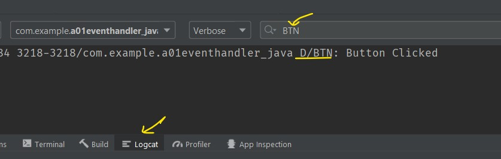

# Event Handling in Android - Java

- [Event Handling in Android - Java](#event-handling-in-android---java)
	- [Android View Binding - Button Onclick Function](#android-view-binding---button-onclick-function)
	- [Android View Binding - Button setOnclickListener](#android-view-binding---button-setonclicklistener)
		- [Introduction to Function Type, Callbacks - typescript/react](#introduction-to-function-type-callbacks---typescriptreact)
		- [Function Type in java??](#function-type-in-java)

## Android View Binding - Button Onclick Function

`activity_main.xml`

```xml
<?xml version="1.0" encoding="utf-8"?>
<androidx.constraintlayout.widget.ConstraintLayout
  <!-- ... -->
>
    <Button
  <!-- ... -->
        android:onClick="onButtonClick"
     <!-- ... -->
 />

</androidx.constraintlayout.widget.ConstraintLayout>
```

`MainActivity.java`

```java
public class MainActivity extends AppCompatActivity {

    @Override
    protected void onCreate(Bundle savedInstanceState) {
        super.onCreate(savedInstanceState);
        setContentView(R.layout.activity_main);

    }
    public void  onButtonClick(View v){
        Log.d("BTN","Button Clicked");
    }
}
```

<div align="center">

</div>

## Android View Binding - Button setOnclickListener

### Introduction to Function Type, Callbacks - typescript/react

```tsx
import React from "react";
// Function type
type CallBackType = (n: number) => void;

// callback function
function AfterDownload(n: number) {
  console.log("Download Completed....");
  alert(`completed in ${n} sec.`);
}
// const AfterDownload: CallBackType = (n) =>{
//   console.log("Download Completed....");
//   alert(`completed in ${n} sec.`);
// }

// callback handler
function Downloader(cb: CallBackType) {
  console.log("Starting Download....");
  const time_taken: number = 5000;
   // calling callback function
  setTimeout(function () {
    cb(time_taken);
  }, time_taken);
}

// Function type
interface OnClickListener {
  (event: React.MouseEvent<HTMLButtonElement>): void;
}
// type ClickHandlerCallBackFunctionType = (
//   event: React.MouseEvent<HTMLButtonElement>
// ) => void;

export default function App() {
   // callback
  const clickHandler: OnClickListener = (e) => {
    console.log("Button Clicked")
     // calling callback handler function
    Downloader(AfterDownload);
  };

  return (
    <div className="App">
      <h1>Hello CodeSandbox</h1>
      <button onClick={clickHandler}>Download</button>
    </div>
  );
}

```

### Function Type in java??

