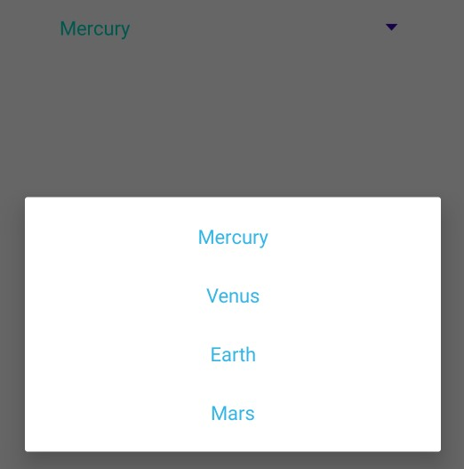
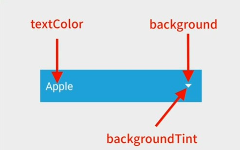
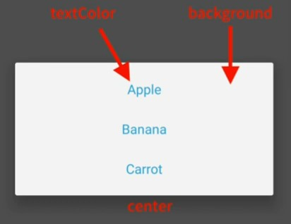

# Event Handling in Android - Java

- [Event Handling in Android - Java](#event-handling-in-android---java)
  - [Android View Binding - Button Onclick Function](#android-view-binding---button-onclick-function)
  - [Android View Binding - Button setOnclickListener](#android-view-binding---button-setonclicklistener)
    - [Introduction to Function Type, Callbacks - typescript/react](#introduction-to-function-type-callbacks---typescriptreact)
    - [Function Type,CallBacks in java??](#function-typecallbacks-in-java)
  - [Example Project](#example-project)
  - [Working with Different Types of Input Views](#working-with-different-types-of-input-views)
    - [CheckBox](#checkbox)
    - [Radio Buttons](#radio-buttons)
    - [Spinner](#spinner)
      - [Populate the Spinner with User Choices](#populate-the-spinner-with-user-choices)
        - [pre-determined array string resource file](#pre-determined-array-string-resource-file)
          - [Customizing Spinner Items Using Resource File](#customizing-spinner-items-using-resource-file)

## Android View Binding - Button Onclick Function

`activity_main.xml`

```xml
    <Button
        android:onClick="onButtonClick"/>
```

`MainActivity.java`

```java
public class MainActivity extends AppCompatActivity {

    @Override
    protected void onCreate(Bundle savedInstanceState) {
        super.onCreate(savedInstanceState);
        setContentView(R.layout.activity_main);

    }
    public void  onButtonClick(View v){
        Log.d("BTN","Button Clicked");
    }
}
```

<div align="center">

</div>

## Android View Binding - Button setOnclickListener

### Introduction to Function Type, Callbacks - typescript/react

simple javascript callback function:

```html
<button id="myBtn">Try it</button>

<script>
function callback() {
  alert ("Hello World!");
}

const btn = document.getElementById("myBtn");
btn.addEventListener("click", callback);
</script>
```

callback example with react:

```tsx
export default function App() {
  const clickHandler = (e) => {
    alert("Button Clicked");
  };

  return (
    <div className="App">
      <button onClick={clickHandler}>Download</button>
    </div>
  );
}
```

Function types with callbacks:

```tsx
import React from "react";
// Function type
type CallBackType = (n: number) => void;

// callback function
function AfterDownload(n: number) {
  console.log("Download Completed....");
  alert(`completed in ${n} sec.`);
}
// const AfterDownload: CallBackType = (n) =>{
//   console.log("Download Completed....");
//   alert(`completed in ${n} sec.`);
// }

// callback handler
function Downloader(cb: CallBackType) {
  console.log("Starting Download....");
  const time_taken: number = 5000;
   // calling callback function
  setTimeout(function () {
    cb(time_taken);
  }, time_taken);
}

// Function type
interface OnClickListener {
  (event: React.MouseEvent<HTMLButtonElement>): void;
}
// type ClickHandlerCallBackFunctionType = (
//   event: React.MouseEvent<HTMLButtonElement>
// ) => void;

export default function App() {
   // callback
  const clickHandler: OnClickListener = (e) => {
    console.log("Button Clicked")
     // calling callback handler function
    Downloader(AfterDownload);
  };

  return (
    <div className="App">
      <h1>Hello CodeSandbox</h1>
      <button onClick={clickHandler}>Download</button>
    </div>
  );
}

```

### Function Type,CallBacks in java??

Before Java 8, we would usually create a class for every case where we needed to encapsulate a single piece of functionality because In java we can't use a function **stand alone** or as a callback. Instead we use `Single Abstract Method Interfaces (SAM Interfaces)`.For example Android's `setOnClickListener()` method  accepts a SAM interface called `View.OnClickListener` .

```java
public interface OnClickListener {
    void onClick(View var1);
}
```

We can use a function(`onClick`) as a callback by implementing the `OnClickListener` interface.

```java
class OnClickCallback implements View.OnClickListener{

    @Override
    public void onClick(View view) {
        Log.d("BTN","Button Clicked");
    }
}
```

Then we pass the `OnClickCallback` object to the `setOnClickListener` method.

```java
Button btn = findViewById(R.id.btn);
btn.setOnClickListener(new OnClickCallback());
```

Comparing Callback passing in `java` with `javascript`:

`javascript`:

```js
function callback() {
  alert ("Hello World!");
}
// const callback = () => {alert ("Hello World!");}

const btn = document.getElementById("myBtn");
btn.addEventListener("click", callback);

```

```java
class OnClickCallback implements View.OnClickListener{

    @Override
    public void onClick(View view) {
        Log.d("BTN","Button Clicked");
    }
}

Button btn = findViewById(R.id.btn);
btn.setOnClickListener(new OnClickCallback());
```

Using An **Anonymous Class** we can declare and instantiate a class at the same time.

```java
btn.setOnClickListener(new View.OnClickListener() {
            @Override
            public void onClick(View view) {
                Log.d("BTN", "Button Clicked");
            }
});
// class OnClickCallback implements View.OnClickListener{
//     @Override
//     public void onClick(View view) {
//         Log.d("BTN","Button Clicked");
//     }
// }
// btn.setOnClickListener(new OnClickCallback());


```

Above code still implied a lot of unnecessary boilerplate code to define something that served as a primitive function representation.

Java 8 brought a powerful new syntactic improvement in the form of **lambda expressions**. A lambda is an anonymous function that we can handle as a first-class language citizen. For instance, we can pass it to or return it from a method.

 **Any interface with aSAM(Single Abstract Method) is a functional interface**, and its implementation may be treated as **lambda expressions**.

```java
View.OnClickListener cb= (view) -> Log.d("BTN","clicked");
btn.setOnClickListener(cb);
// btn.setOnClickListener(view -> Log.d("BTN", "Button Clicked"));

// 1.
//class OnClickCallback implements View.OnClickListener{
//
//    @Override
//    public void onClick(View view) {
//        Log.d("BTN","Button Clicked");
//    }
//}
// btn.setOnClickListener(new OnClickCallback());

// 2.
//  btn.setOnClickListener(new View.OnClickListener() {
//            @Override
//            public void onClick(View view) {
//                Log.d("BTN", "Button Clicked");
//            }
//        });
```

Now, Comparing Callback passing in `java` with `javascript`:

```ts
// interface OnClickLister {
//  (e: MouseEvent): void;
// }
// const callback: OnClickLister = (e: MouseEvent) => {
//  console.log('first');
// };
const callback = (e) => console.log('first';
};
const btn = document.getElementById("myBtn");
btn.addEventListener("click", callback);

```

```java
// class View{
//     public interface OnClickListener {
//         void onClick(View var1);
//     }
// }
Button btn = (Button) findViewById(R.id.btn);
View.OnClickListener callback = (view) -> Log.d("BTN","clicked");
btn.setOnClickListener(callback);
```

> **Full Code:**

`activity_main.xml`

```xml
    <Button
        android:id="@+id/btn"/>
```

`MainActivity.java`

```java
public class MainActivity extends AppCompatActivity {

    @Override
    protected void onCreate(Bundle savedInstanceState) {
        super.onCreate(savedInstanceState);
        setContentView(R.layout.activity_main);
        Button btn = findViewById(R.id.btn);

        btn.setOnClickListener(view -> Log.d("BTN", "Button Clicked"));

    }
}
```

## Example Project

<div align="center">

</div>

```xml
    <EditText
        android:id="@+id/num1"/>

    <EditText
        android:id="@+id/num2"/>

    <Button
        android:id="@+id/btnAdd" />

    <TextView
        android:id="@+id/res" />
```

```java
public class MainActivity extends AppCompatActivity {

    @Override
    protected void onCreate(Bundle savedInstanceState) {
        super.onCreate(savedInstanceState);
        setContentView(R.layout.example1_layout);
        EditText etNum1 = findViewById(R.id.num1);
        EditText etNum2 = findViewById(R.id.num2);
        Button btnAdd = findViewById(R.id.btnAdd);
        TextView tvResult = findViewById(R.id.res);
        tvResult.setVisibility(View.INVISIBLE);
        etNum1.requestFocus();

        btnAdd.setOnClickListener(view -> {
            int n1 = Integer.valueOf(etNum1.getText().toString());
            int n2 = Integer.valueOf(etNum2.getText().toString());
            int result = n1 + n2;
            String msg = "Result :" + result;
            tvResult.setVisibility(View.VISIBLE);
            tvResult.setText(msg);
            Toast.makeText(getApplicationContext(), msg, Toast.LENGTH_LONG).show();
/**
It is not possible to set the gravity of toast in android 11 because this method is deprecated in API 30+
**/
//            Toast toast = Toast.makeText(getApplicationContext(), msg, Toast.LENGTH_LONG);
//            toast.setGravity(Gravity.TOP|Gravity.CENTER_HORIZONTAL, 0, 0);
//            toast.show();
        });
    }

}
```

## Working with Different Types of Input Views

### CheckBox

<div align="center">

</div>

Checkboxes allow the user to select one or more options from a set.

```xml
    <CheckBox
        android:id="@+id/checkbox_meat" />

    <CheckBox
        android:id="@+id/checkbox_cheese"
 />
```

We can access whether or not a checkbox is checked with:

```java
CheckBox checkCheese = (CheckBox) findViewById(R.id.checkbox_cheese);
// Check if the checkbox is checked
boolean isChecked = checkCheese.isChecked();
// Set the checkbox as checked
checkCheese.setChecked(true);
```

and in our activity, we can manage checkboxes using a checked listener with `OnCheckedChangeListener` as show below:

```java
        CheckBox checkCheese = findViewById(R.id.checkbox_cheese);
        //  new CompoundButton.OnCheckedChangeListener(){}
        checkCheese.setOnCheckedChangeListener((v, isChecked) -> {
            if (isChecked) {
                Toast.makeText(this, "Cheese Checked", Toast.LENGTH_LONG).show();
            Log.d("BTN","checked");
            }
        });
```

Handling Set of Checkboxes:

```java
        CheckBox checkCheese = findViewById(R.id.checkbox_cheese);
        CheckBox checkMeat = findViewById(R.id.checkbox_meat);

        CompoundButton.OnCheckedChangeListener checkListener = (view, checked) -> {

            switch (view.getId()) {
                case R.id.checkbox_meat:
                    if (checked) {
                        Log.d("BTN", "Meat Checked");
                    } else {
                        Log.d("BTN", "Meat UnChecked");
                    }
                    break;
                case R.id.checkbox_cheese:
                    if (checked) {
                        Log.d("BTN", "Cheese Checked");
                    } else {
                        Log.d("BTN", "Cheese UnChecked");

                    }
                    break;
            }
        };

        checkCheese.setOnCheckedChangeListener(checkListener);
        checkMeat.setOnCheckedChangeListener(checkListener);
```

[https://developer.android.com/guide/topics/ui/controls/checkbox.html](https://developer.android.com/guide/topics/ui/controls/checkbox.html)

`xml`

### Radio Buttons

<div align="center">

</div>

Radio buttons allow the user to select one option from a set.

To create each radio button option, create a `RadioButton` in the layout. However, because radio buttons are mutually exclusive, we must group them together inside a `RadioGroup`. By grouping them together, the system ensures that only one radio button can be selected at a time

```xml
<RadioGroup
        android:id="@+id/rdGroup"
        android:orientation="vertical">
        <RadioButton
            android:id="@+id/radio_yes"
            android:text="Yes" />

        <RadioButton
            android:id="@+id/radio_no"
            android:text="No" />
</RadioGroup>
<Button
        android:id="@+id/btnSubmit"
        android:text="Submit"
/>
<Button
        android:id="@+id/btnClear"
        android:text="Clear"
/>
```

and within the activity:

```java
        RadioGroup radioGroup = findViewById(R.id.rdGroup);
        radioGroup.setOnCheckedChangeListener((RadioGroup group, int checkedId) -> {
            switch (checkedId) {
                case R.id.radio_yes:
                    Log.d("BTN", "Yes");
                    break;
                case R.id.radio_no:
                    Log.d("BTN", "No");
                    break;
            }
        });
```

```java
 btnSubmit.setOnClickListener(v -> {
            int selectedId = radioGroup.getCheckedRadioButtonId();
            if (selectedId == -1) {
                Toast.makeText(MainActivity.this,
                        "No answer has been selected",
                        Toast.LENGTH_SHORT)
                        .show();
            } else {
                // Get the selected Radio Button
                RadioButton radioButton = radioGroup.findViewById(selectedId);

                // Now display the value of selected item
                // by the Toast message
                Toast.makeText(getApplicationContext(),
                        radioButton.getText(),
                        Toast.LENGTH_SHORT)
                        .show();
            }
        });

        btnClear.setOnClickListener(v -> {
            radioGroup.clearCheck();
        });
```

- [https://developer.android.com/guide/topics/ui/controls/radiobutton#java](https://developer.android.com/guide/topics/ui/controls/radiobutton#java)
- [https://www.geeksforgeeks.org/android-how-to-add-radio-buttons-in-an-android-application/](https://www.geeksforgeeks.org/android-how-to-add-radio-buttons-in-an-android-application/)

### Spinner

<div align="center">

</div>

Spinners provide a quick way to select one value from a set. In the default state, a spinner shows its currently selected value. Touching the spinner displays a dropdown menu with all other available values, from which the user can select a new one.

You can add a spinner to your layout with the Spinner object. You should usually do so in your XML layout with a `<Spinner>` element. For example:

<Spinner
    android:id="@+id/planets_spinner"
/>

To populate the spinner with a list of choices, you then need to specify a `SpinnerAdapter` in your `Activity` or `Fragment` source code.

#### Populate the Spinner with User Choices

The choices you provide for the spinner can come from**any source**, but must be provided through an `SpinnerAdapter`, such as an `ArrayAdapter` if the choices are available in an `array` or a `CursorAdapter` if the choices are available from a database query.

##### pre-determined array string resource file

For instance, if the available choices for your spinner are **pre-determined**, you can provide them with a **string array** defined in a **string resource** file:

`spinner_layout.xml`

<Spinner
    android:id="@+id/planets_spinner"
    android:entries="@array/planets_array"
/>

`src/main/res/values/planets_array.xml`

```xml
<?xml version="1.0" encoding="utf-8"?>
<resources>
    <string-array name="planets_array">
        <item>Mercury</item>
        <item>Venus</item>
        <item>Earth</item>
        <item>Mars</item>
    </string-array>
</resources>
```

With an array such as this one, you can use the following code in your `Activity` or `Fragment` to supply the spinner with the array using an instance of `ArrayAdapter`:


```java
        Spinner spinner = findViewById(R.id.spinner);
        // Create an ArrayAdapter using the string array and a `default spinner layout`
        ArrayAdapter<CharSequence> adapter = ArrayAdapter.createFromResource(this,
                R.array.planets_array,
                android.R.layout.simple_spinner_item);
        // Specify the layout to use when the list of choices appears
        adapter.setDropDownViewResource(android.R.layout.simple_spinner_dropdown_item);
        // Apply the adapter to the spinner
        spinner.setAdapter(adapter);
        /**
         * `simple_spinner_item` and `simple_spinner_dropdown_item` both are default layout
         * */
        spinner.setOnItemSelectedListener(new AdapterView.OnItemSelectedListener() {
            @Override
            public void onItemSelected(AdapterView<?> adapterView, View view, int pos, long id) {
//              Get the selected item out a spinner using:
                String value = spinner.getSelectedItem().toString();
                String value1 = spinner.getItemAtPosition(pos).toString();
                Log.d("BTN", value + " " + pos + " " + id);
            }

            @Override
            public void onNothingSelected(AdapterView<?> adapterView) {}
        });
```

###### Customizing Spinner Items Using Resource File

<div align="center">

</div>

Changing text size on the `<Spinner>` tag has no effect on the actual dropdown items. To change their styles, you need to create a custom array adapter and layout file. First, you should create a spinner_item1.xml

`custom_spinner.xml`

<div align="center">

</div>

```xml
<?xml version="1.0" encoding="utf-8"?>
<TextView
    xmlns:android="http://schemas.android.com/apk/res/android"
    android:id="@android:id/text1"
    style="?attr/spinnerDropDownItemStyle"
    android:singleLine="true"
    android:layout_width="match_parent"
    android:layout_height="?attr/dropdownListPreferredItemHeight"
    android:ellipsize="marquee"
    android:textColor="@android:color/white"
    android:background="@drawable/abc_spinner_mtrl_am_alpha"
    android:backgroundTint="@android:color/white"/>
```

Hiding default `background` and `backgroundTint`:

`activity_main.xml`

```xml
<Spinner
        android:id="@+id/spinner"
        android:entries="@array/planets_array"
        android:background="@android:color/white"
        android:spinnerMode="dialog"
/>
```

`custom_spinner_dropdown.xml`

<div align="center">

</div>

```xml
<?xml version="1.0" encoding="utf-8"?>
<TextView
    xmlns:android="http://schemas.android.com/apk/res/android"
    android:id="@android:id/text1"
    style="?attr/spinnerDropDownItemStyle"
    android:singleLine="true"
    android:layout_width="match_parent"
    android:layout_height="?attr/dropdownListPreferredItemHeight"
    android:ellipsize="marquee"
    android:textColor="@android:color/holo_blue_light"
    android:background="@android:color/white"
    android:textAlignment="center"/>
```

In main activity:

```java
        setContentView(R.layout.activity_main);
        Spinner spinner = (Spinner) findViewById(R.id.spinner);
        ArrayAdapter<CharSequence> adapter = ArrayAdapter.createFromResource(this,
                R.array.planets_array, R.layout.custom_spinner);
        adapter.setDropDownViewResource(R.layout.custom_spinner_dropdown);
        spinner.setAdapter(adapter);
```
