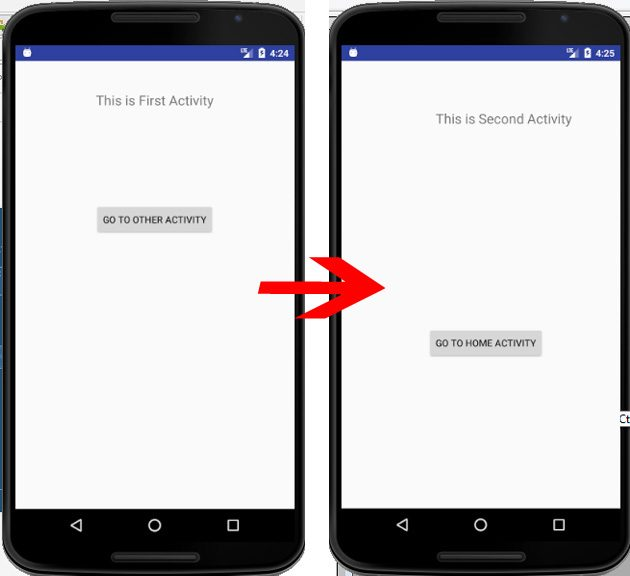
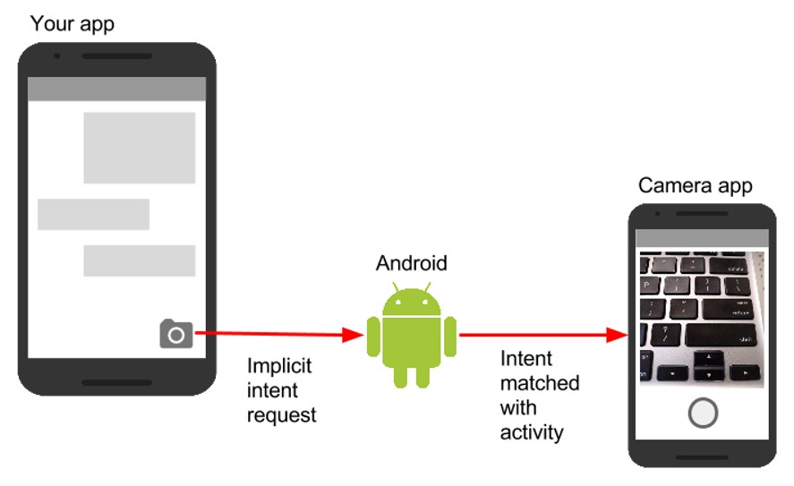
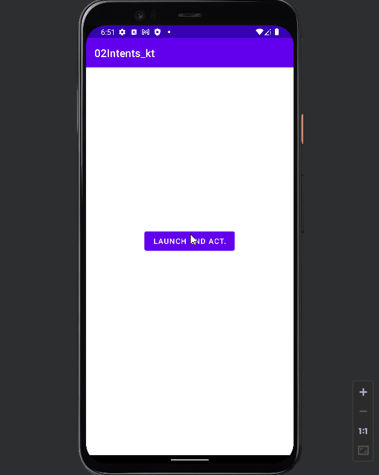
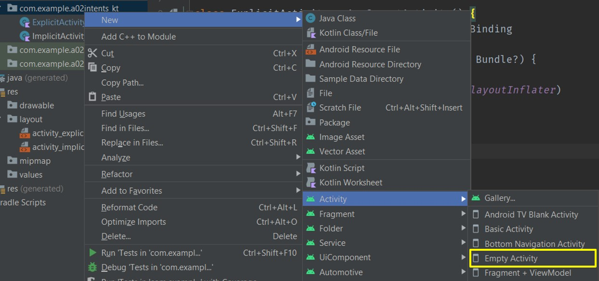
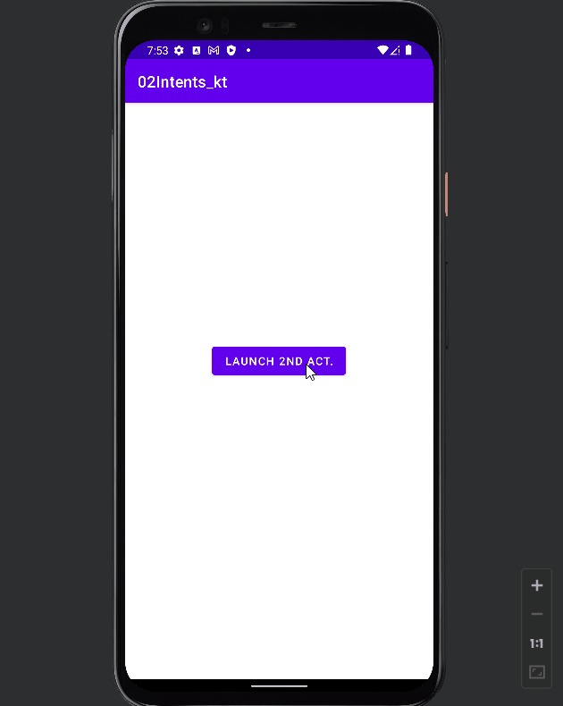
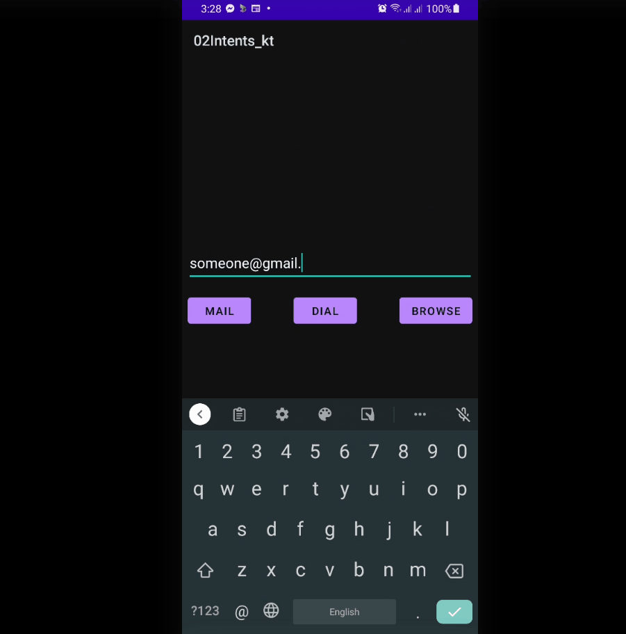
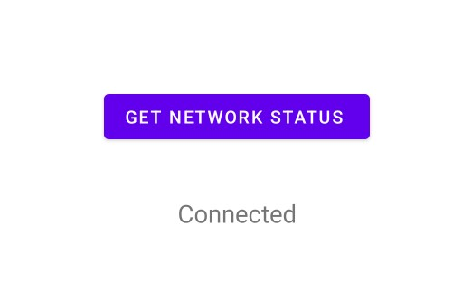
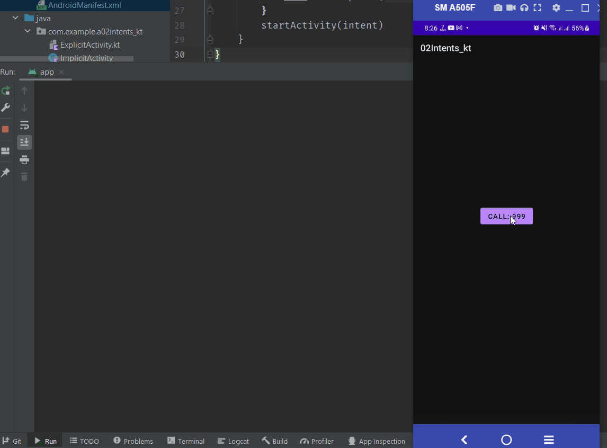
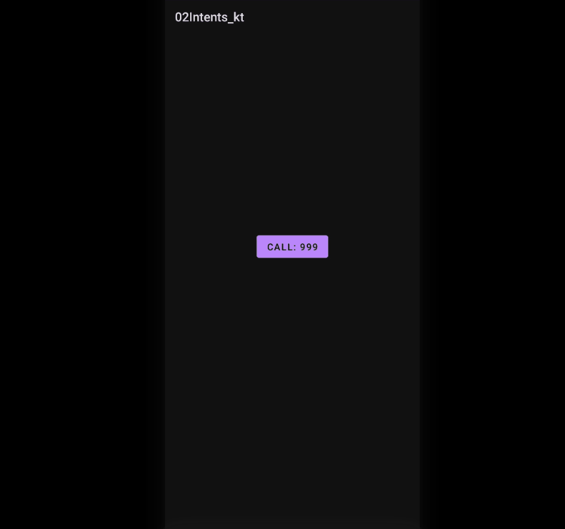
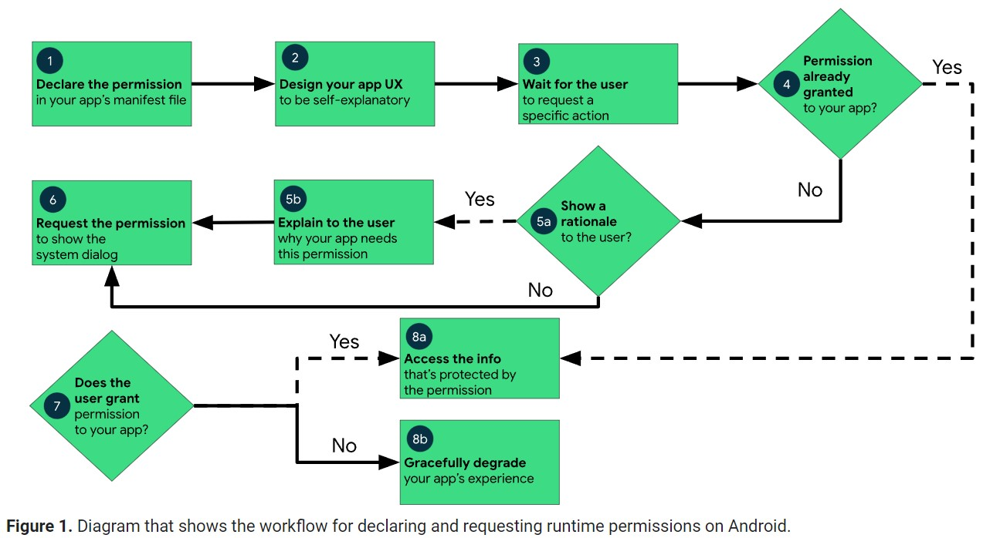

# Intent

- [Intent](#intent)
  - [Intro](#intro)
  - [Intent Filters](#intent-filters)
  - [Explicit Intent](#explicit-intent)
    - [Switching Activities Using Intents](#switching-activities-using-intents)
    - [Send Data to Activities using Extras](#send-data-to-activities-using-extras)
      - [Using `putExtra()`](#using-putextra)
      - [Receiving Data from Intent](#receiving-data-from-intent)
  - [Implicit Intent](#implicit-intent)
  - [Permissions](#permissions)
    - [Normal Permissions: ex Network Connectivity.](#normal-permissions-ex-network-connectivity)
    - [Run-Time Permissions: ex -> Phone Calls](#run-time-permissions-ex---phone-calls)

## Intro

Intent is an **messaging object** which passes between components like **services, content providers, activities**etc.

Intent performs the following three tasks mainly:

1. `Starting an Activity`: An Activity starts/performs a task when we pass the Intent object to the content.startActivity() method. When an intent object is passed to startActivity(), it starts a new activity or an existing one.

2. `Starting a Service`: An Intent object is passed to the content.startService() method, to start a Service. We can also send a required request to an existing service.

3. `Delivering a Broadcast`:Passing the Intent object in content.sendBroadcast(), sends messages to broadcast receivers.

Any Intent object contains the following six things :

- Component Name
- Action
- Data
- Category
- Extras
- Flag

Two important things in intent:

- `action`: The general action to be performed, such as `ACTION_VIEW`, `ACTION_EDIT`, `ACTION_MAIN`, etc.
- `data`: The data to operate on, such as a person record in the contacts database, is expressed as a `Uri`

> Note: Uniform Resource Identifier (`URI`) is a string of characters used to identify a resource. A URI identifies a resource either by location, or a name, or both.

- `Extras`: A Bundle object which contains additional information. It is just an extra key-value pair for the component.

There are two types of intents in android:

- `Implicit` and
- `Explicit`.

**1. Explicit Intent**

Explicit Type are those Intents that specifically mention the component that it targets. The Android system calls these components by explicitly mentioning them. We can use Explicit Intent for the purpose of launching an application component. For example, you might start a new activity within your app in response to a user action, or start a service to download a file in the background.

<div align="center">

</div>

Java:

```java
Intent i = new Intent(getApplicationContext(), ActivityTwo.class);
startActivity(i);
```

**2. Implicit Intent**

Implicit Type of Intents are those that do not mention any component name and only declare the actions.

Implicit Intents specifies these actions that are to be performed. These actions can invoke any application component that can perform these actions. These are useful when your action is important but your application is not capable of performing it.

<div align="center">
 
</div>

<div align="center">

</div>

For example, you may write the following code to view the webpage.

Java:

```java
Intent intent=new Intent(Intent.ACTION_VIEW);
intent.setData(Uri.parse("https://www.geeksforgeeks.org"));
startActivity(intent);
```

- [https://developer.android.com/guide/components/intents-filters](https://developer.android.com/guide/components/intents-filters)

## Intent Filters

**Intent Filters**are expressions in the `Manifest` file of an Android Application. These are responsible for deciding the behavior of the Intent.

- Implicit intent uses the intent filter to serve the user request.
- The intent filter specifies the types of intents that an activity, service, or broadcast receiver can respond.
- Intent filters are declared in the Android manifest file.
- Intent filter must contain `<action>`

Generally, the Intent Filters (`<intent-filter>`) whatever we define in the manifest file can be nested in the corresponding app components and we can specify the type of intents to accept using these three elements.

- `<action>`: It defines the name of an intended action to be accepted and it must be a literal string value of an action, not the class constant.
- `<category>`: It defines the name of an intent category to be accepted and it must be the literal string value of an action, not the class constant.
- `<data>`: It defines the type of data to be accepted and by using one or more attributes we can specify various aspects of the data URI (scheme, host, port, path) and MIME type.

Example:

```xml
<activity
    android:name=".MainActivity"
    android:exported="true">
    <intent-filter>
        <action android:name="android.intent.action.MAIN" />
        <category android:name="android.intent.category.LAUNCHER" />
    </intent-filter>
</activity
```

## Explicit Intent

Explicit Intent specifies the component. In such case, intent provides the external class to be invoked.

```kotlin
Intent i = new Intent(getApplicationContext(), ActivityTwo.class);
//kotlin
//Intent i = Intent(getApplicationContext(), ActivityTwo::class.java);

startActivity(i);
```

### Switching Activities Using Intents

<div align="center">

</div>

Defining launcher activity in manifest file:

`AndroidManifest.xml`

```xml
<activity
    android:name=".FirstActivity"
    android:exported="true">
    <intent-filter>
        <action android:name="android.intent.action.MAIN" />
        <category android:name="android.intent.category.LAUNCHER" />
    </intent-filter>
</activity>
```

Creating New Black Activity - `SecondActivity`:

<div align="center">

</div>

`AndroidManifest.xml` Now:

```xml
        <activity
            android:name=".SecondActivity"
            android:exported="false" />
        <activity
            android:name=".FirstActivity"
            android:exported="true">
            <intent-filter>
                <action android:name="android.intent.action.MAIN" />
                <category android:name="android.intent.category.LAUNCHER" />
            </intent-filter>
        </activity>
```

`FirstActivity.kt`

```kotlin
class FirstActivity : AppCompatActivity() {
    private lateinit var vb: ActivityExplicitBinding

    override fun onCreate(savedInstanceState: Bundle?) {
        super.onCreate(savedInstanceState)
        vb = ActivityExplicitBinding.inflate(layoutInflater)
        val view = vb.root
        setContentView(view)

        vb.btnFirst.setOnClickListener {
            // Launch SecondActivity
            val intent = Intent(this, SecondActivity::class.java)
            startActivity(intent)
        }
    }
}
```

`SecondActivity.kt`

```kotlin
class SecondActivity : AppCompatActivity() {
    private lateinit var vb: ActivitySecondBinding
    override fun onCreate(savedInstanceState: Bundle?) {
        super.onCreate(savedInstanceState)
        vb = ActivitySecondBinding.inflate(layoutInflater)
        val view = vb.root
        setContentView(view)

        vb.btnSecond.setOnClickListener {
            // Launch First Activity
            val intent = Intent(this, FirstActivity::class.java)
            startActivity(intent)
        }

    }
}
```

### Send Data to Activities using Extras

<div align="center">

</div>

Whenever you need data from an activity to be in another activity, you can pass data between then while starting the activities. Intents in android offers this convenient way to pass data between activities using **Extras**.

#### Using `putExtra()`

We can start adding data into the Intent object, we use the method defined in the Intent class putExtra() or `putExtras()` to store certain data as a key value pair or Bundle data object. These key-value pairs are known as Extras in the sense we are talking about Intents.

We’ll see an example of storing a string in this Intent object using a key.

`FirstActivity.kt`

```kotlin
const val KEY_1 = "Name"
const val KEY_2 = "Age"
const val KEY_3 = "isStudent"

class FirstActivity : AppCompatActivity() {
    private lateinit var vb: ActivityExplicitBinding

    override fun onCreate(savedInstanceState: Bundle?) {
        super.onCreate(savedInstanceState)
        vb = ActivityExplicitBinding.inflate(layoutInflater)
        val view = vb.root
        setContentView(view)

        vb.btnFirst.setOnClickListener {
            val name: String = "jhon"
            val age: Int = 22
            val isStudent: Boolean = false
            //val intent = Intent(this, SecondActivity::class.java)
            //intent.putExtra(KEY_1, name)
            //intent.putExtra(KEY_2, age)
            //intent.putExtra(KEY_3, isStudent)
            //or
            val intent = Intent().apply {
                putExtra(KEY_1, name)
                putExtra(KEY_2, age)
                putExtra(KEY_3, isStudent)
            }
            startActivity(intent)
        }
    }
}
```

#### Receiving Data from Intent

`SecondActivity.kt`

```kotlin
class SecondActivity : AppCompatActivity() {
    private lateinit var vb: ActivitySecondBinding

    override fun onCreate(savedInstanceState: Bundle?) {
        super.onCreate(savedInstanceState)
        vb = ActivitySecondBinding.inflate(layoutInflater)
        val view = vb.root
        setContentView(view)

        // Retrieving data from intent
        val name: String? = intent.getStringExtra(KEY_1)
        //Java: Intent intent = getIntent();
        val age: Int = intent.getIntExtra(KEY_1, 0)
        val isStudent: Boolean? = intent.getBooleanExtra(KEY_3, true)

        //vb.tvShow.text = "Name: $name\nAge: $age\nStudent: ${isStudent.toString()}"
        name?.let {
            vb.tvShow.text = "Name: $it\nAge: $age\nStudent: ${isStudent.toString()}"
        }

    }
}
```

## Implicit Intent

<div align="center">

</div>

<div align="center">

</div>

 How an implicit intent is delivered through the system to start another activity:

- Activity `A` creates an Intent with an action description and passes it to `startActivity()`.
- The Android System searches all apps for an intent filter that matches the intent. When a match is found,
- the system starts the matching activity (Activity `B`) by invoking its `onCreate()` method and passing it the Intent.

- [https://developer.android.com/guide/components/intents-common](https://developer.android.com/guide/components/intents-common)
- [https://developer.android.com/guide/components/intents-filters](https://developer.android.com/guide/components/intents-filters)

```xml
    <Button
        android:id="@+id/btnEmail" />

    <Button
        android:id="@+id/btnBrowse" />

    <Button
        android:id="@+id/btnDial"/>

    <EditText
        android:id="@+id/editText"/>
```

```kotlin
class MainActivity : AppCompatActivity() {
    private lateinit var vb: ActivityMainBinding
    override fun onCreate(savedInstanceState: Bundle?) {
        super.onCreate(savedInstanceState)
        vb = ActivityMainBinding.inflate(layoutInflater)
        val view = vb.root
        setContentView(view)

  //Phone Call

        vb.btnDial.setOnClickListener {
            val mobile = vb.editText.text.toString()
            val i = Intent()
            i.action = Intent.ACTION_DIAL
            i.data = Uri.parse("tel://$mobile")
            startActivity(i)
        }

  //Browse Webpage
        vb.btnBrowse.setOnClickListener {
            val address = vb.editText.text.toString()
            val i = Intent().apply {
                action = Intent.ACTION_VIEW
                data = Uri.parse("https://$address")
            }
            startActivity(i)
        }

  //Send Email

  vb.btnEmail.setOnClickListener {
            val email = vb.editText.text.toString()
            val intent = Intent().apply {
                action = Intent.ACTION_SENDTO
                data = Uri.parse("mailto:") // only email apps should handle this
                var emails = listOf(email, "").toTypedArray()
                putExtra(Intent.EXTRA_EMAIL, emails)
                putExtra(Intent.EXTRA_SUBJECT, "Implicit Intents")
                putExtra(Intent.EXTRA_TEXT, "Hello Someone")
            }
            if (intent.resolveActivity(packageManager) != null) {
                startActivity(intent)
            } else Toast.makeText(
                this, "No app to send email. Please install at least one",
                Toast.LENGTH_SHORT
            ).show()

        }

    }
}
```

`AndroidManifest.xml`

```xml
<activity>
 <intent-filter>
  <action android:name="android.intent.action.SENDTO" />
  <category android:name="android.intent.category.DEFAULT" />
  <data android:scheme="mailto" />
 </intent-filter>
</activity>
```

Custom Function For Sending Email:

```kotlin
//  val addresses = listOf(
//                "fake@address.com", "some@add.com").toTypedArray()
//  val subject = "Some title"
//  val text = "Some message<br><br>New Line<br><br>"
//  intentDataEmailCreation(addresses,subject,text)

    private fun intentDataEmailCreation(
        addresses: Array<String>, subject: String, text: String
    ) {
        val intent = Intent(Intent.ACTION_SENDTO).apply {
            data = Uri.parse("mailto:") // only email apps should handle this
            putExtra(Intent.EXTRA_EMAIL, addresses)
            putExtra(Intent.EXTRA_SUBJECT, subject)
            putExtra(Intent.EXTRA_TEXT, text)
        }
        if (intent.resolveActivity(packageManager) != null) {
            startActivity(intent)
        } else Toast.makeText(
            this, "No app to send email. Please install at least one",
            Toast.LENGTH_SHORT
        ).show()
    }
```

- [https://developer.android.com/guide/components/intents-common#ComposeEmail](https://developer.android.com/guide/components/intents-common#ComposeEmail)
- [https://betterprogramming.pub/the-imperfect-android-send-email-action-59610dfd1c2d](https://betterprogramming.pub/the-imperfect-android-send-email-action-59610dfd1c2d)

## Permissions

- [https://developer.android.com/guide/topics/manifest/manifest-intro](https://developer.android.com/guide/topics/manifest/manifest-intro)
- [https://developer.android.com/guide/topics/permissions/overview](https://developer.android.com/guide/topics/permissions/overview)
- [https://developer.android.com/training/permissions/requesting](https://developer.android.com/training/permissions/requesting)

### Normal Permissions: ex Network Connectivity.

Every app project must have an `AndroidManifest.xml` file (with precisely that name) at the root of the project source set. The manifest file describes essential information about your app to the Android build tools, the Android operating system, and Google Play.

Beginning with Android 6.0 (API level 23), the user can approve or reject some app permisions at runtime. But no matter which Android version your app supports, you must declare all permission requests with a `<uses-permission>` element in the manifest. If the permission is granted, the app is able to use the protected features. If not, its attempts to access those features fail.

Your app can also protect its own components with permissions. It can use any of the permissions that are defined by Android, as listed in android.Manifest.permission, or a permission that's declared in another app. Your app can also define its own permissions. A new permission is declared with the `<permission>` element.

`AndroidManifest.xml`

```xml
<manifest>
    <uses-permission android:name="android.permission.ACCESS_NETWORK_STATE" />
    <application >
        <activity
            <intent-filter>
            </intent-filter>
        </activity>
    </application>
</manifest>
```

```kotlin
class NetworkActivity : AppCompatActivity() {
    private lateinit var vb: ActivityNetworkBinding
    override fun onCreate(savedInstanceState: Bundle?) {
        super.onCreate(savedInstanceState)
        vb = ActivityNetworkBinding.inflate(layoutInflater)
        val view = vb.root
        setContentView(view)

        vb.btnStatusBar.setOnClickListener {
            val cm = getSystemService(Context.CONNECTIVITY_SERVICE) as ConnectivityManager
            val networkInfo = cm.activeNetworkInfo
            val isConnected: Boolean = networkInfo != null && networkInfo.isConnected
            vb.tvStatus.text = if (isConnected) "Connected" else "Disconnected"
        }
    }
}
```

<div align="center">

</div>

### Run-Time Permissions: ex -> Phone Calls

```kotlin
class PhoneCallActivity : AppCompatActivity() {
    private lateinit var vb: ActivityPhoneCallBinding
    override fun onCreate(savedInstanceState: Bundle?) {
        super.onCreate(savedInstanceState)
        vb = ActivityPhoneCallBinding.inflate(layoutInflater)
        val view = vb.root
        setContentView(view)

        vb.btnCall.setOnClickListener {
            makePhoneCall()
        }
    }

    private fun makePhoneCall() {
        val intent = Intent().apply {
            action = ACTION_CALL
            data = Uri.parse("tel: 999")
        }
        startActivity(intent)
    }
}
```

But app fails to run as permission is required.

<div align="center">

</div>

Starting from Android 6.0 (API 23), users are not asked for permissions at the time of installation rather developers need to request the permissions at the run time. Only the permissions that are defined in the manifest file can be requested at run time.

Declare the permission in the Android Manifest file: In Android, permissions are declared in the `AndroidManifest.xml` file using the `uses-permission` tag.

```xml
<uses-permission android:name="android.permission.PERMISSION_NAME"/>

<!--Declaring the required permissions-->
<uses-permission android:name="android.permission.READ_EXTERNAL_STORAGE" />
<uses-permission android:name="android.permission.WRITE_EXTERNAL_STORAGE" />
<uses-permission android:name="android.permission.CAMERA" />
```

For Phone Call Permission:

```xml
<manifest>
    <uses-permission android:name="android.permission.CALL_PHONE"/>
    <application >
        <activity
            <intent-filter>
            </intent-filter>
        </activity>
    </application>
</manifest>
```

<div align="center">
    
</div>

Workflow for requesting permissions:

1. Check if the permission is already granted.
2. If not, request the permission.
3. If the permission is granted, do the task.


```kotlin
const val CALL_PERMISSION_CODE = 121

class PhoneCallActivity : AppCompatActivity() {
    //..
    override fun onCreate(savedInstanceState: Bundle?) {
        //...
        vb.btnCall.setOnClickListener {
            //makePhoneCall()
            makeCallAfterPermission()
        }
    }
    private fun makeCallAfterPermission() {
        // Check if Permission Already Granted
        if (ActivityCompat.checkSelfPermission(
                this,
                Manifest.permission.CALL_PHONE
            ) == PackageManager.PERMISSION_GRANTED
        ) {
            // Yes: makeCall
            makePhoneCall()
        } else {
            // NO: request for permission
            requestCallPermission()
        }
    }

    private fun requestCallPermission() {
        ActivityCompat.requestPermissions(
            this, arrayOf(Manifest.permission.CALL_PHONE),
            CALL_PERMISSION_CODE
        )
    }
}
```

<div align="center">

</div>

we can see now that we are requesting for the permission. **But nothings happens as we are not handling the result - user `allows` or `denies` the permission.**

`onRequestPermissionsResult()` is called when user grant or decline the permission. `RequestCode` is one of the parameters of this function which is used to check user action for the corresponding requests. Here a toast message is shown indicating the permission and user action.

Syntax:

```kotlin
override fun onRequestPermissionsResult(requestCode: Int,
        permissions: Array<String>, grantResults: IntArray) {
    super.onRequestPermissionsResult(requestCode, permissions, grantResults)

    when (requestCode) {
        PERMISSION_REQUEST_CODE -> {
            // If request is cancelled, the result arrays are empty.
            if ((grantResults.isNotEmpty() &&
                    grantResults[0] == PackageManager.PERMISSION_GRANTED)) {
                // Permission is granted. Continue the action or workflow
                // in your app.
            } else {
                // Explain to the user that the feature is unavailable because
                // the features requires a permission that the user has denied.
                // At the same time, respect the user's decision. Don't link to
                // system settings in an effort to convince the user to change
                // their decision.
            }
            return
        }

        // Add other 'when' lines to check for other
        // permissions this app might request.
        else -> {
            // Ignore all other requests.
        }
    }
}
```

for our example:

```kotlin
const val CALL_PERMISSION_CODE = 121
class PhoneCallActivity : AppCompatActivity() {
    override fun onCreate(savedInstanceState: Bundle?) {
        //...
        vb.btnCall.setOnClickListener {
            makeCallAfterPermission()
        }
    }

    //...
    private fun requestCallPermission() {
        ActivityCompat.requestPermissions(
            this, arrayOf(Manifest.permission.CALL_PHONE),
            CALL_PERMISSION_CODE
        )
    }

    override fun onRequestPermissionsResult(
        requestCode: Int,
        permissions: Array<String>, grantResults: IntArray
    ) {
        super.onRequestPermissionsResult(requestCode, permissions, grantResults)
        if (requestCode == CALL_PERMISSION_CODE) {
            if ((grantResults.isNotEmpty() && grantResults[0] == PackageManager.PERMISSION_GRANTED)) {
                makePhoneCall()
            } else {
                Toast.makeText(this, "Permission denied to make phone call", Toast.LENGTH_SHORT)
                    .show()
            }
        }
    }
}
```

<div align="center">

</div>

Still we are not handling user declination of the permission. In that case we need to **explain why your app needs the permission and ask the user to grant the permission**.

<div align="center">

</div>

`Rationale` is an android library that helps manage permission request. With Rationale, the permission flow can be reduced to :

<div align="center">
    
</div>

```kotlin
    private fun requestCallPermission(view: View) {
//        ActivityCompat.requestPermissions(
//            this, arrayOf(Manifest.permission.CALL_PHONE),
//            CALL_PERMISSION_CODE
//        )
        // Explain why your app needs the permission
        if (ActivityCompat.shouldShowRequestPermissionRationale(
                this,
                Manifest.permission.CALL_PHONE
            )
        ) {
            val snack = Snackbar.make(
                view, "We need you permission to make. " +
                        "When ask please give the permission", Snackbar.LENGTH_INDEFINITE
            )
            snack.setAction("OK", View.OnClickListener {
                ActivityCompat.requestPermissions(
                    this, arrayOf(Manifest.permission.CALL_PHONE),
                    CALL_PERMISSION_CODE
                )
            })
            snack.show()
        } else {
            ActivityCompat.requestPermissions(
                this, arrayOf(Manifest.permission.CALL_PHONE),
                CALL_PERMISSION_CODE
            )
        }
    }
```

<div align="center">

</div>

Complete:


```kotlin
const val CALL_PERMISSION_CODE = 121

class PhoneCallActivity : AppCompatActivity() {
    private lateinit var vb: ActivityPhoneCallBinding
    override fun onCreate(savedInstanceState: Bundle?) {
        super.onCreate(savedInstanceState)
        vb = ActivityPhoneCallBinding.inflate(layoutInflater)
        val view = vb.root
        setContentView(view)

        vb.btnCall.setOnClickListener {
//            makePhoneCall()
            makeCallAfterPermission(it)
        }
    }

    private fun makePhoneCall() {
        val intent = Intent().apply {
            action = ACTION_CALL
            data = Uri.parse("tel: 9990")
        }
        startActivity(intent)
    }

    private fun makeCallAfterPermission(view: View) {
        // Check if Permission Already Granted
        if (ActivityCompat.checkSelfPermission(
                this,
                Manifest.permission.CALL_PHONE
            ) == PackageManager.PERMISSION_GRANTED
        ) {
            // Yes: makeCall
            makePhoneCall()
        } else {
            // NO: request for permission
            requestCallPermission(view)
        }
    }

    private fun requestCallPermission(view: View) {
//        ActivityCompat.requestPermissions(
//            this, arrayOf(Manifest.permission.CALL_PHONE),
//            CALL_PERMISSION_CODE
//        )
        // Explain why your app needs the permission
        if (ActivityCompat.shouldShowRequestPermissionRationale(
                this,
                Manifest.permission.CALL_PHONE
            )
        ) {
            val snack = Snackbar.make(
                view, "We need you permission to make. " +
                        "When ask please give the permission", Snackbar.LENGTH_INDEFINITE
            )
            snack.setAction("OK", View.OnClickListener {
                ActivityCompat.requestPermissions(
                    this, arrayOf(Manifest.permission.CALL_PHONE),
                    CALL_PERMISSION_CODE
                )
            })
            snack.show()
        } else {
            ActivityCompat.requestPermissions(
                this, arrayOf(Manifest.permission.CALL_PHONE),
                CALL_PERMISSION_CODE
            )
        }
    }

    override fun onRequestPermissionsResult(
        requestCode: Int,
        permissions: Array<String>, grantResults: IntArray
    ) {
        super.onRequestPermissionsResult(requestCode, permissions, grantResults)
        if (requestCode == CALL_PERMISSION_CODE) {
            if ((grantResults.isNotEmpty() && grantResults[0] == PackageManager.PERMISSION_GRANTED)) {
                makePhoneCall()
            } else {
                Toast.makeText(this, "Permission denied to make phone call", Toast.LENGTH_SHORT)
                    .show()
            }
        }
    }
}
```
