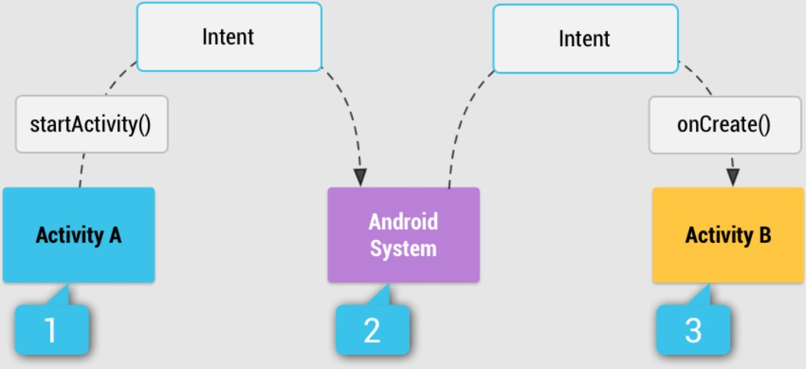

# Intent

- [Intent](#intent)
	- [Intro](#intro)
	- [Explicit Intent](#explicit-intent)
		- [Switching Activivtes Using Intents](#switching-activivtes-using-intents)
		- [Send Data to Activities using Extras](#send-data-to-activities-using-extras)
	- [Implicit Intent](#implicit-intent)

## Intro

Intent is an **messaging object** which passes between components like **services, content providers, activities**etc. Normally `startActivity()` method is used for invoking any activity.

Some of the general functions of intent are:

- Start service
- Launch activity
- Display web page
- Display contact list
- Message broadcasting

There are two important things in intent

- `action`: The general action to be performed, such as `ACTION_VIEW`, `ACTION_EDIT`, `ACTION_MAIN`, etc.
- `data`: The data to operate on, such as a person record in the contacts database, is expressed as a `Uri`

> Note: Uniform Resource Identifier (`URI`) is a string of characters used to identify a resource. A URI identifies a resource either by location, or a name, or both.

There are two types of intents in android:

- `Implicit` and
- `Explicit`.

**1. Explicit Intent**

You'll typically use an explicit intent to start a component in your own app, because you know the class name of the activity or service you want to start. For example, you might start a new activity within your app in response to a user action, or start a service to download a file in the background.

<div align="center">

</div>

Java:

```java
Intent i = new Intent(getApplicationContext(), ActivityTwo.class);
startActivity(i);
```

**2. Implicit Intent**

Implicit intents do not name a specific component, but instead declare a general action to perform, which allows a component from another app to handle it. For example, if you want to show the user a location on a map, you can use an implicit intent to request that another capable app show a specified location on a map.

You don't specify the exact activity (or other component) to run—instead, you include just enough information in the intent about the task you want to perform. The Android system matches the information in your request intent with any activity available on the device that can perform that task. If there's only one activity that matches, that activity is launched. If more than one activity matches the intent, the user is presented with an app chooser and picks which app they would like to perform the task..

<div align="center">
 
</div>

<div align="center">

</div>

For example, you may write the following code to view the webpage.

Java:

```java
Intent intent=new Intent(Intent.ACTION_VIEW);
intent.setData(Uri.parse("https://www.geeksforgeeks.org"));
startActivity(intent);
```

- [https://developer.android.com/guide/components/intents-filters](https://developer.android.com/guide/components/intents-filters)

## Explicit Intent

### Switching Activivtes Using Intents

### Send Data to Activities using Extras

## Implicit Intent

<div align="center">

</div>

<div align="center">

</div>

 How an implicit intent is delivered through the system to start another activity:

 - Activity `A` creates an Intent with an action description and passes it to `startActivity()`.
 - The Android System searches all apps for an intent filter that matches the intent. When a match is found,
 - the system starts the matching activity (Activity `B`) by invoking its `onCreate()` method and passing it the Intent.

- [https://developer.android.com/guide/components/intents-common](https://developer.android.com/guide/components/intents-common)
- [https://developer.android.com/guide/components/intents-filters](https://developer.android.com/guide/components/intents-filters)


```xml
    <Button
        android:id="@+id/btnEmail" />

    <Button
        android:id="@+id/btnBrowse" />

    <Button
        android:id="@+id/btnDial"/>

    <EditText
        android:id="@+id/editText"/>
```

```kotlin
class MainActivity : AppCompatActivity() {
    private lateinit var vb: ActivityMainBinding
    override fun onCreate(savedInstanceState: Bundle?) {
        super.onCreate(savedInstanceState)
        vb = ActivityMainBinding.inflate(layoutInflater)
        val view = vb.root
        setContentView(view)

  //Phone Call

        vb.btnDial.setOnClickListener {
            val mobile = vb.editText.text.toString()
            val i = Intent()
            i.action = Intent.ACTION_DIAL
            i.data = Uri.parse("tel://$mobile")
            startActivity(i)
        }

  //Browse Webpage
        vb.btnBrowse.setOnClickListener {
            val address = vb.editText.text.toString()
            val i = Intent().apply {
                action = Intent.ACTION_VIEW
                data = Uri.parse("https://$address")
            }
            startActivity(i)
        }

  //Send Email

  vb.btnEmail.setOnClickListener {
            val email = vb.editText.text.toString()
            val intent = Intent().apply {
                action = Intent.ACTION_SENDTO
                data = Uri.parse("mailto:") // only email apps should handle this
                var emails = listOf(email, "").toTypedArray()
                putExtra(Intent.EXTRA_EMAIL, emails)
                putExtra(Intent.EXTRA_SUBJECT, "Implicit Intents")
                putExtra(Intent.EXTRA_TEXT, "Hello Someone")
            }
            if (intent.resolveActivity(packageManager) != null) {
                startActivity(intent)
            } else Toast.makeText(
                this, "No app to send email. Please install at least one",
                Toast.LENGTH_SHORT
            ).show()

        }

    }
}
```

`AndroidManifest.xml`

```xml
<activity>
 <intent-filter>
  <action android:name="android.intent.action.SENDTO" />
  <data android:scheme="mailto" />
  <category android:name="android.intent.category.DEFAULT" />
 </intent-filter>
</activity>
```

Custom Function For Sending Email:

```kotlin
//  val addresses = listOf(
//                "fake@address.com", "some@add.com").toTypedArray()
//  val subject = "Some title"
//  val text = "Some message<br><br>New Line<br><br>"
//  intentDataEmailCreation(addresses,subject,text)

    private fun intentDataEmailCreation(
        addresses: Array<String>, subject: String, text: String
    ) {
        val intent = Intent(Intent.ACTION_SENDTO).apply {
            data = Uri.parse("mailto:") // only email apps should handle this
            putExtra(Intent.EXTRA_EMAIL, addresses)
            putExtra(Intent.EXTRA_SUBJECT, subject)
            putExtra(Intent.EXTRA_TEXT, text)
        }
        if (intent.resolveActivity(packageManager) != null) {
            startActivity(intent)
        } else Toast.makeText(
            this, "No app to send email. Please install at least one",
            Toast.LENGTH_SHORT
        ).show()
    }
```

- [https://developer.android.com/guide/components/intents-common#ComposeEmail](https://developer.android.com/guide/components/intents-common#ComposeEmail)
- [https://betterprogramming.pub/the-imperfect-android-send-email-action-59610dfd1c2d](https://betterprogramming.pub/the-imperfect-android-send-email-action-59610dfd1c2d)
