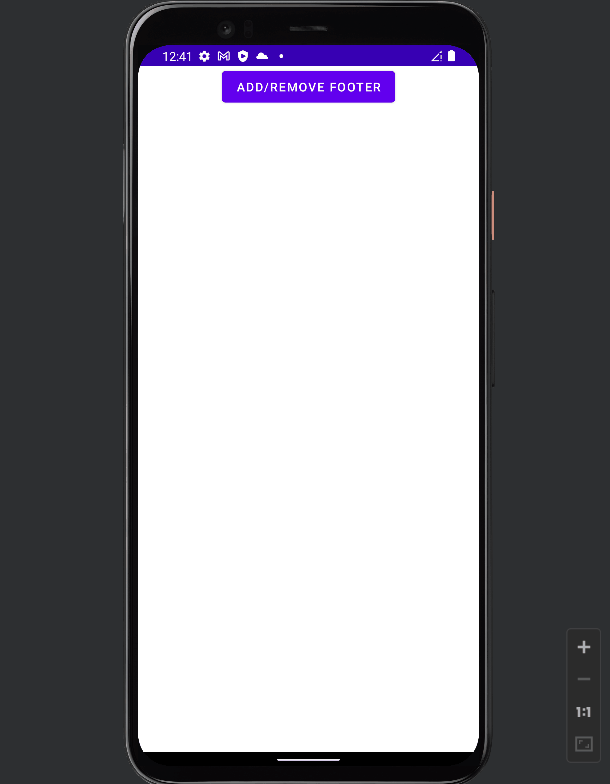
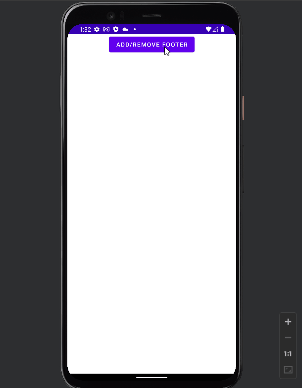
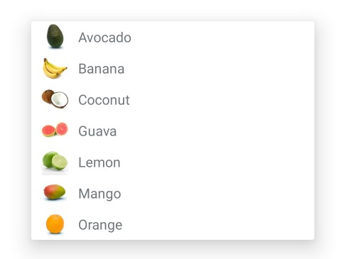
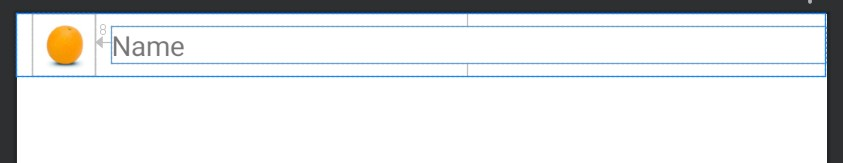

# Dynamic Views In Android

- [Dynamic Views In Android](#dynamic-views-in-android)
  - [Dynamic Views and LayoutInflater](#dynamic-views-and-layoutinflater)
    - [`inflate()` in details](#inflate-in-details)
  - [EX: Custom Spinner - Java](#ex-custom-spinner---java)

## Dynamic Views and LayoutInflater

There are two ways to create UI in android. One is a `static` way and another is `dynamic` or programmatically. Suppose we have a simple layout `activity_main.xml`

```xml
<?xml version="1.0" encoding="utf-8"?>
<LinearLayout xmlns:android="http://schemas.android.com/apk/res/android"
    android:id="@+id/rootLayout"
    android:layout_width="match_parent"
    android:layout_height="match_parent"
    android:orientation="vertical">

    <Button
        android:id="@+id/button"
        android:layout_width="wrap_content"
        android:layout_height="wrap_content"
        android:layout_gravity="center"
        android:text="Add/Remove Footer" />

    <View
        android:id="@+id/view"
        android:layout_width="match_parent"
        android:layout_height="wrap_content"
        android:layout_weight="1" />

<!-- Footer will be added dynamically-->

</LinearLayout>
```

We can display this layout in static way by

```kotlin
override fun onCreate(savedInstanceState: Bundle?) {
    super.onCreate(savedInstanceState)
    setContentView(R.layout.activity_main)
}
```

loading xml layout dynamically: A dynamic way of creating a view means the view is not mentioned in our `activity_main.xml` but we want to show with this in run time. For example, we have another XML for footer in layout folder as `inflate.xml`

```xml
<?xml version="1.0" encoding="utf-8"?>
<LinearLayout xmlns:android="http://schemas.android.com/apk/res/android"
    xmlns:app="http://schemas.android.com/apk/res-auto"
    android:id="@+id/inflateView"
    android:layout_width="match_parent"
    android:layout_height="wrap_content">

    <TextView
        android:id="@+id/tvFooter"
        android:layout_width="match_parent"
        android:layout_height="wrap_content"
        android:background="#2196F3"
        android:padding="20dp"
        android:text="Footer"
        android:textColor="#FFFFFF"
        android:textSize="20sp" />
</LinearLayout>
```

We want to show this footer in run time within our main UI. So here we will inflate `inflate.xml`. See how:

```kotlin
class MainActivity : AppCompatActivity() {
    private lateinit var vb: ActivityMainBinding
    override fun onCreate(savedInstanceState: Bundle?) {
        super.onCreate(savedInstanceState)
        vb = ActivityMainBinding.inflate(layoutInflater)
        val view = vb.root
        setContentView(view)
        var show = false
        vb.button.setOnClickListener {
            if (!show) {
                //get a reference to the already created main layout
                var rootView = findViewById<LinearLayout>(R.id.rootLayout)
                //inflate (create) footer layout dynamically from XML file
                val inflater = LayoutInflater.from(this)
                var footerView = inflater.inflate(R.layout.inflate, null)
                //add our custom layout to the root layout
                rootView.addView(footerView)
                show = true
            } else {
                // remove view
                vb.rootLayout.removeView(findViewById(R.id.inflateView))
                show = false
            }
        }
    }
}
```

<div align="center">

</div>

The `LayoutInflater` takes `XML` file as an input and builds `View` **objects** from it. Fair enough we understood what LayoutInflater do.

Here, `footer` is the `View` Object created from the layout file `inflate` which is the first argument to the inflate method. Then we add this `View` object to the `LinearLayout` object that is already present in the `activity_main.xml` file. Similarly, we can remove this `View` object by calling the `removeView` method.

### `inflate()` in details

`inflate(XMLResource,null)` returns a View object that is the root of the inflated XML file. Then we were adding this `View` object to Root `ViewGroup` that is already present in the `activity_main.xml` file - id: `rootLayout`.

```kotlin
//get a reference to the already created main layout
var rootView = findViewById<LinearLayout>(R.id.rootLayout)
//inflate (create) footer layout dynamically from XML file
val inflater = LayoutInflater.from(this)
val footerView = inflater.inflate(R.layout.inflate, null)
//add our custom layout to the root layout
rootView.addView(footerView)
```

We can also specify the root/parent `ViewGroup` object in which we want to add the `View` object as the second argument to the `inflate()` method.

So instead of above code we can write:

```kotlin
var rootView = findViewById<LinearLayout>(R.id.rootLayout)
val inflater = LayoutInflater.from(this)
//inflate (create) custom layout and add it to the root layout
inflater.inflate(R.layout.inflate, rootView, true)
```

here, `findViewById(R.id.rootLayout)` is the parent layout in which we want to add the inflated `View` object. and `true` is the third argument to the `inflate(XMLResource,root,attachToRoot)` method which tells the `inflate()` method to add the `View` object to the parent layout right away.

`attachToRoot=false` means that the `View` object is not added to the parent layout right away. This can be usefull when we want to customize the `View` object before adding it to the parent layout.


<div align="center">

</div>

Examples of customizing the `View` object are - changing properties of the `SubView`(below example), setting content for `SubView` dynamically (in custom [spinner](#ex-custom-spinner---java), listview, recyclerview etc.) etc.

Here is an example of customizing the `View` object:

```kotlin
//get a reference to the already created main layout
var rootView = findViewById<LinearLayout>(R.id.rootLayout)
//inflate (create) footer layout dynamically from `inflate.xml` file
val inflater = LayoutInflater.from(this)
var footerView = inflater.inflate(R.layout.inflate, rootView, false)
// make changes to our custom layout and its subviews
// get subview from `inflate.xml`
val tvFooter: TextView = footerView.findViewById(R.id.tvFooter)
tvFooter.setBackgroundColor(resources.getColor(R.color.purple_500))
tvFooter.text = "New Footer"
//add our custom layout to the root layout
rootView.addView(footerView)

/**
`inflate.xml`
<LinearLayout
    android:id="@+id/inflateView">
    <TextView
        android:id="@+id/tvFooter"
        android:text="Footer" />
</LinearLayout>
*/
```

<div align="center">

</div>

## EX: Custom Spinner - Java

<div align="center">

</div>

`layout/spinner_layout.xml`

```xml
<Spinner
        android:id="@+id/spinner"
 />
```

`layout/item_fruit.xml`

```xml
<?xml version="1.0" encoding="utf-8"?>
<RelativeLayout xmlns:android="http://schemas.android.com/apk/res/android"
    android:layout_width="match_parent"
    android:layout_height="wrap_content">

    <ImageView
        android:id="@+id/image"
        android:layout_width="32dp"
        android:layout_height="32dp"
        android:layout_marginStart="8dp"
        android:src="@drawable/orange" />

    <TextView
        android:id="@+id/name"
        android:layout_width="match_parent"
        android:layout_height="wrap_content"
        android:layout_centerVertical="true"
        android:layout_marginStart="8dp"
        android:layout_toRightOf="@+id/image"
        android:text="Name" />

</RelativeLayout>
```

<div align="center">

</div>

`Fruit.java`

```java
public class Fruit {
    private String name;
    private int image;
    public Fruit() {}
    public String getName() {return name;}
    public void setName(String name) {
        this.name = name;
    }
    public int getImage() {
        return image;
    }
    public void setImage(int image) {
        this.image = image;
    }
}
```

`Data.java`

```java
public class Data {

    public static List<Fruit> getFruitList() {
        List<Fruit> fruitList = new ArrayList<>();

        Fruit Avocado = new Fruit();
        Avocado.setName("Avocado");
        Avocado.setImage(R.drawable.avocado);
        fruitList.add(Avocado);

        Fruit Banana = new Fruit();
        Banana.setName("Banana");
        Banana.setImage(R.drawable.banana);
        fruitList.add(Banana);

        Fruit Coconut = new Fruit();
        Coconut.setName("Coconut");
        Coconut.setImage(R.drawable.coconut);
        fruitList.add(Coconut);

        Fruit Guava = new Fruit();
        Guava.setName("Guava");
        Guava.setImage(R.drawable.guava);
        fruitList.add(Guava);

        Fruit Lemon = new Fruit();
        Lemon.setName("Lemon");
        Lemon.setImage(R.drawable.lemon);
        fruitList.add(Lemon);

        Fruit Mango = new Fruit();
        Mango.setName("Mango");
        Mango.setImage(R.drawable.mango);
        fruitList.add(Mango);

        Fruit Orange = new Fruit();
        Orange.setName("Orange");
        Orange.setImage(R.drawable.orange);
        fruitList.add(Orange);

        return fruitList;
    }
}
```

`FruitAdapter.java`

```java
public class FruitAdapter extends BaseAdapter {
    private Context context;
    private List<Fruit> fruitList;
    public FruitAdapter(Context context, List<Fruit> fruitList) {
        this.context = context;
        this.fruitList = fruitList;
    }

    @Override
    public int getCount() {
        return fruitList != null ? fruitList.size() : 0;
    }
    @Override
    public Object getItem(int i) {
        return i;
    }
    @Override
    public long getItemId(int i) {
        return i;
    }
    /**
     `getView` method will return the final view that a Spinner will set to it’s row’s ith (first parameter) position.  If Spinner has six rows then compiler will this method for six times. In every iteration,
     compiler will fetch or inflate the XML file which will provide UI widgets (Textview, Button, ImageView etc.)
     for the row item. Then it will set the appropriate values to the UI widgets (Textview, Button, ImageView etc.)
     */
    @Override
    public View getView(int i, View view, ViewGroup viewGroup) {
        // inflate(crate) custom layout for each row from `item_fruit.xml` file
        View customItemView = LayoutInflater.from(context)
                .inflate(R.layout.item_fruit, viewGroup, false);
        //Use the returned View to get it's children
        TextView txtName = customItemView.findViewById(R.id.name);
        ImageView image = customItemView.findViewById(R.id.image);
        //Set content for the SubViews
        txtName.setText(fruitList.get(i).getName());
        image.setImageResource(fruitList.get(i).getImage());
        //return custom View
        return customItemView;
    }
}
```

Here, `customItemView` is `View` object that we created in `item_fruit.xml`

<div align="center">

</div>

`MainActivity.java`

```java
        setContentView(R.layout.spinner_layout);
        Spinner spinner = findViewById(R.id.spinner);

        FruitAdapter fruitAdapter = new FruitAdapter(getApplicationContext(), Data.getFruitList());
        spinner.setAdapter(fruitAdapter);
        spinner.setOnItemSelectedListener(new AdapterView.OnItemSelectedListener() {
            @Override
            public void onItemSelected(AdapterView<?> adapterView, View view, int i, long l) {
                Log.d("BTN",Data.getFruitList().get(i).getName());
            }

            @Override
            public void onNothingSelected(AdapterView<?> adapterView) {

            }
        });
```
