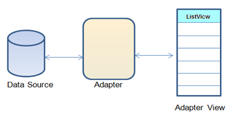
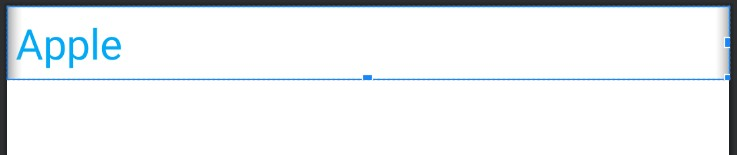
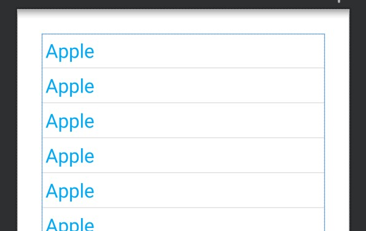
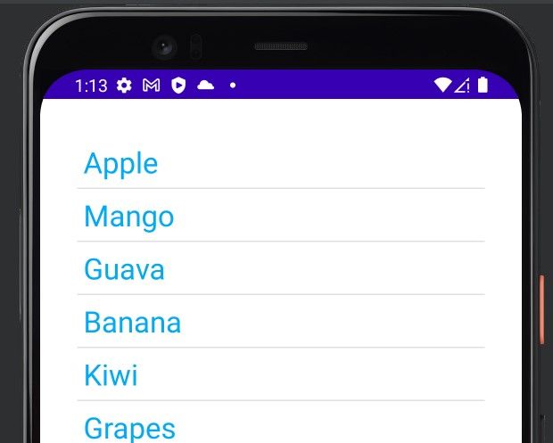
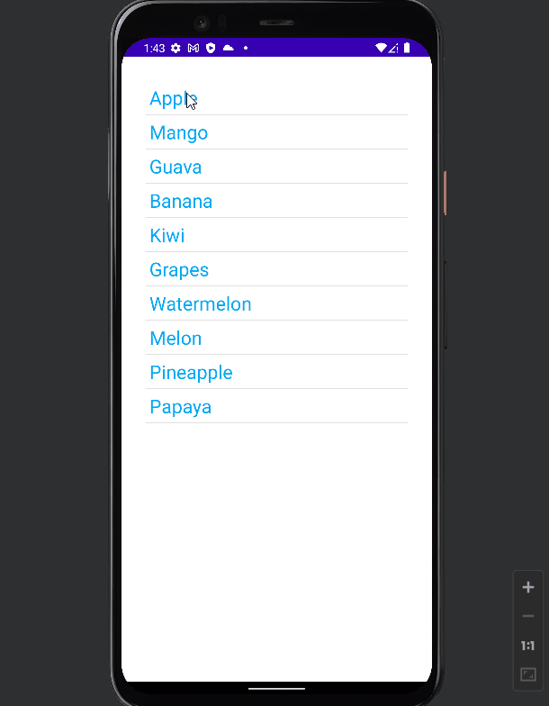
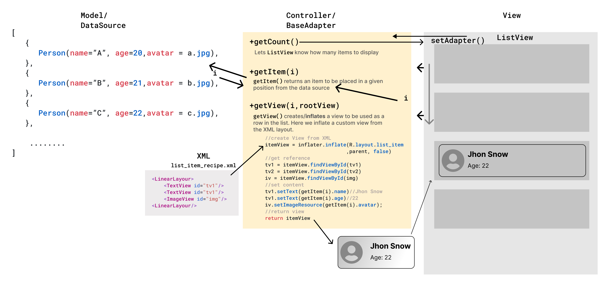

# ListView

## Adapters: Servants of the ListView

<div align="center">

</div>

The `Adapter` acts as a bridge between the **UI Component** and the **Data Source**. It converts data from the data sources into view items that can be displayed into the UI Component. Data Source can be `Arrays`, `HashMap`, `Database`, etc. and UI Components can be `ListView`, `GridView`, Spinner, etc.

The `ArrayAdapter` takes in:

- the current `context`
- a `layout` file specifying what each row in the list should look like
- id of the `textview` to which the data should be bound
- and the `data` that will populate the list as arguments.

```kotlin
public ArrayAdapter(this, R.layout.itemListView, R.id.itemTextView, T[] objects)
```

### Defining the Layout of the ListView’s Rows:

`fruit_item.xml`

```xml
<LinearLayout
    android:layout_width="match_parent"
    android:layout_height="wrap_content">

    <TextView
        android:id="@+id/tvFruitName"
        android:text="Apple"/>
</LinearLayout>
```

<div align="center">

</div>

### Defining the `ListView` in Main Layout

`activity_main.xml`

```xml
<LinearLayout
    android:layout_width="match_parent"
    android:layout_height="match_parent">
    <ListView
        android:id="@+id/lvFruits"
        tools:listitem="@layout/fruit_item"
  		android:layout_width="match_parent"
        android:layout_height="match_parent"/>
</LinearLayout>
```

<div align="center">

</div>

### Defining the `ArrayAdapter`

```kotlin
		vb.lvFruits.adapter = ArrayAdapter(
            this,
            R.layout.fruit_item,
            R.id.tvFruitName,
            arrayOf(
                "Apple",
                "Mango",
                "Guava",
                "Banana",
                "Kiwi",
                "Grapes",
                "Watermelon",
                "Melon",
                "Pineapple",
                "Papaya"
            )
        )
```

<div align="center">

</div>

### `setOnItemClickListener`

```kotlin
		vb.lvFruits.setOnItemClickListener { parent, view, position, id ->
            val text = view.findViewById<TextView>(R.id.tvFruitName).text
            Toast.makeText(this, "Fruit: $text, Pos: $position ", Toast.LENGTH_SHORT)
                .show()
        }
```

<div align="center">

</div>

## Custom Adapter for ListView

<div align="center">
 
</div>
