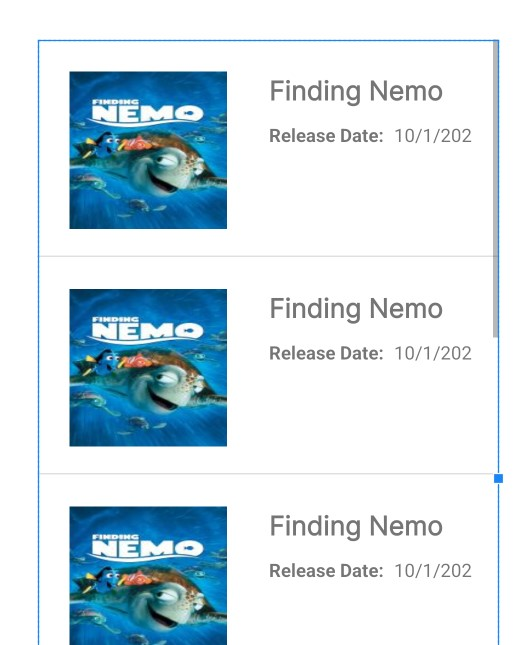
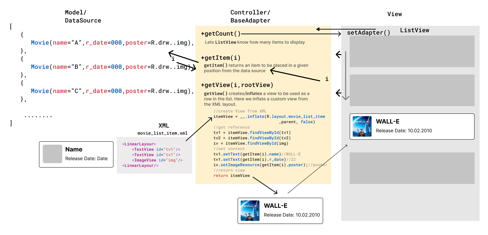
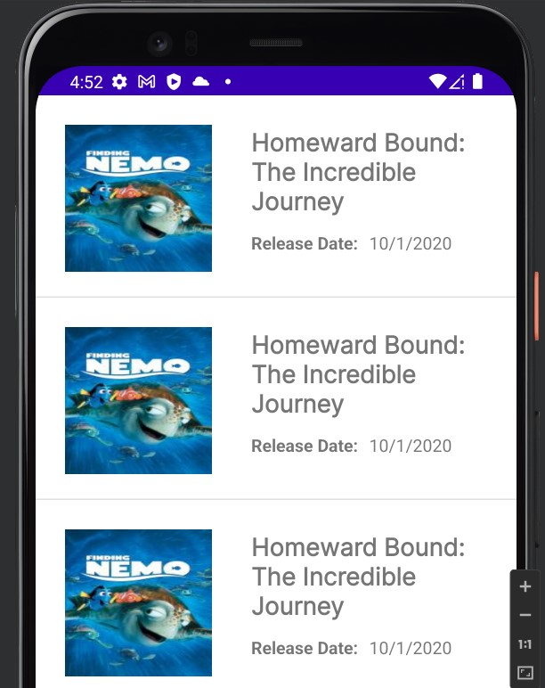
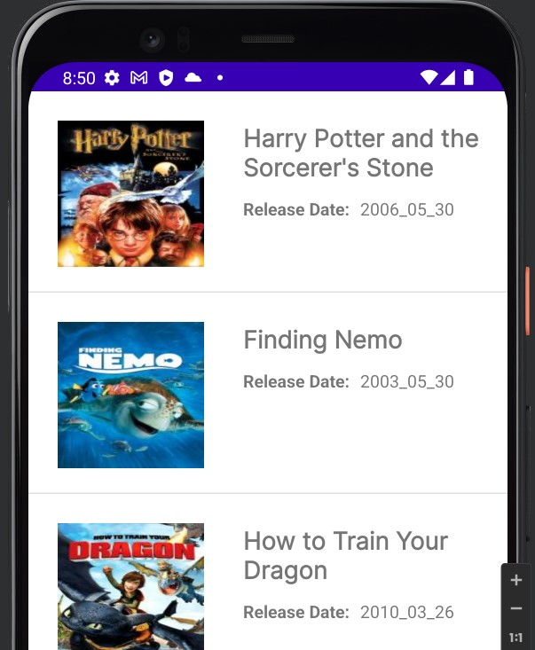
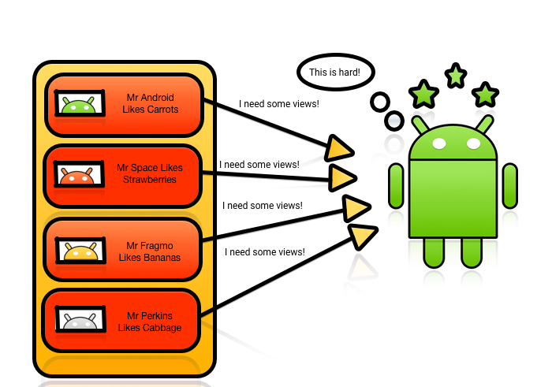
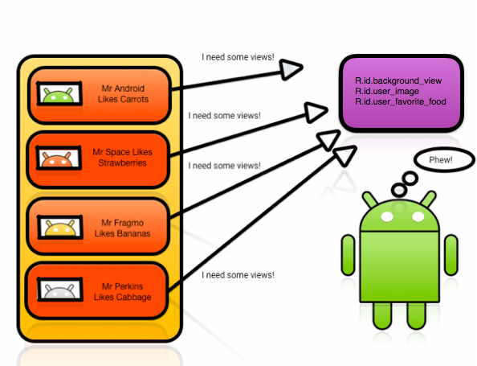
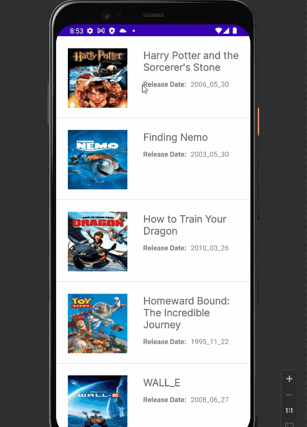
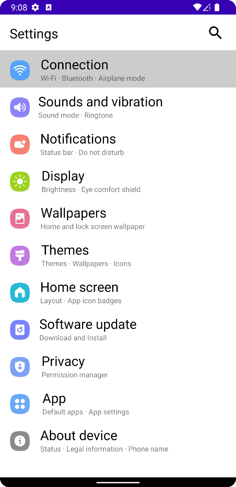
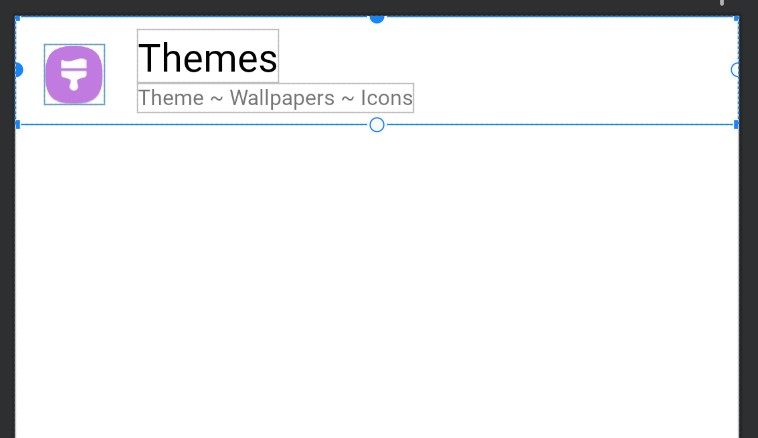

# ListView

- [ListView](#listview)
  - [Adapters: Servants of the ListView](#adapters-servants-of-the-listview)
    - [Defining the Layout of the ListView’s Rows:](#defining-the-layout-of-the-listviews-rows)
    - [Defining the `ListView` in Main Layout](#defining-the-listview-in-main-layout)
    - [Defining the `ArrayAdapter`](#defining-the-arrayadapter)
    - [`setOnItemClickListener`](#setonitemclicklistener)
  - [Custom Adapter for ListView](#custom-adapter-for-listview)
    - [Why Custom Array Adapter??](#why-custom-array-adapter)
    - [Defining the Layout of the ListView’s Rows](#defining-the-layout-of-the-listviews-rows-1)
    - [Defining the `ListView` in Main Layout](#defining-the-listview-in-main-layout-1)
    - [Defining Model Class](#defining-model-class)
    - [Building Adapters](#building-adapters)
    - [Optimizing Performance - `ViewHolder` Pattern](#optimizing-performance---viewholder-pattern)
    - [Change the color of the clicked items](#change-the-color-of-the-clicked-items)
      - [Using Xml Attributes](#using-xml-attributes)
      - [using `lv.setOnItemClickListener()`](#using-lvsetonitemclicklistener)
      - [using `ViewHolder` Pattern](#using-viewholder-pattern)
    - [Ex: Java](#ex-java)
      - [V1](#v1)
      - [V2](#v2)
  - [Important Attributes](#important-attributes)

## Adapters: Servants of the ListView

<div align="center">

</div>

The `Adapter` acts as a bridge between the **UI Component** and the **Data Source**. It converts data from the data sources into view items that can be displayed into the UI Component. Data Source can be `Arrays`, `HashMap`, `Database`, etc. and UI Components can be `ListView`, `GridView`, Spinner, etc.

The ListView asks the adapter what it should display, and the adapter jumps into action:

- It fetches the items to be displayed from the data source
- It decides how they should be displayed
- It passes this information on to the ListView

The `ArrayAdapter` takes in:

- the current `context`
- a `layout` file specifying what each row in the list should look like
- id of the `textview` to which the data should be bound
- and the `data` that will populate the list as arguments.

```kotlin
public ArrayAdapter(this, R.layout.itemListView, R.id.itemTextView, T[] objects)
```

### Defining the Layout of the ListView’s Rows:

`single_textview_layout.xml`

```xml
<?xml version="1.0" encoding="utf-8"?>
<TextView xmlns:android="http://schemas.android.com/apk/res/android"
    android:id="@+id/textView"
    android:layout_width="match_parent"
    android:layout_height="wrap_content"
    android:padding="10dp"
    android:text="Item"
    android:textSize="16sp"
    android:textStyle="bold" />
```

<div align="center">

</div>

### Defining the `ListView` in Main Layout

`activity_main.xml`

```xml
<?xml version="1.0" encoding="utf-8"?>
<ConstraintLayout>
    <ListView
        android:id="@+id/lv"
        android:layout_width="0dp"
        android:layout_height="0dp"
        android:clipToPadding="false"
        android:divider="@color/teal_200"
        android:listSelector="#D09EFB"
        tools:listitem="@layout/single_textview_layout" />
</ConstraintLayout>
```

<div align="center">

</div>

### Defining the `ArrayAdapter`

```kotlin
		vb.lvFruits.adapter = ArrayAdapter(
            this,
            R.layout.single_textview_layout,
            R.id.textView,
            arrayOf(
                "Apple",
                "Mango",
                "Guava",
                "Banana",
                "Kiwi",
                "Grapes",
                "Watermelon",
                "Melon",
                "Pineapple",
                "Papaya"
            )
        )
```

<div align="center">

</div>

### `setOnItemClickListener`

```kotlin
		vb.lvFruits.setOnItemClickListener { parent, view, position, id ->
            val text = view.findViewById<TextView>(R.id.tvFruitName).text
            Toast.makeText(this, "Fruit: $text, Pos: $position ", Toast.LENGTH_SHORT)
                .show()
        }
```

<div align="center">

</div>

## Custom Adapter for ListView

### Why Custom Array Adapter??

Android framework by default provides us the ability to create **listItems which includes only a single information or a single** `TextView`. But we always come across apps that show multiple information in a single ListItem such as Instagram, BookMyShow, Whatsapp and many more. In this case, we need to create our own custom adapter to display multiple information in a single ListItem.

### Defining the Layout of the ListView’s Rows

`movie_list_item.xml`

```xml
<ConstraintLayout
    android:id="@+id/lv_item_container"
    android:layout_width="match_parent"
    android:layout_height="wrap_content">
    <ImageView
        android:id="@+id/imgvPoster"
        android:scaleType="fitXY"
        app:srcCompat="@drawable/finding_nemo"/>

    <TextView
        android:id="@+id/tvMovieName"
        android:layout_width="200dp"
        android:layout_height="wrap_content"
        android:text="Finding Nemo"/>

    <TextView
        android:id="@+id/tvDate"
        android:text="Release Date:" />

    <TextView
        android:id="@+id/tvRelease"
        android:text="10/1/2020" />
</ConstraintLayout>
```

<div align="center">

</div>

### Defining the `ListView` in Main Layout

`activity_main.xml`

```xml
<LinearLayout
    android:layout_width="match_parent"
    android:layout_height="match_parent">
    <ListView
        android:id="@+id/lvMovies"
        tools:listitem="@layout/movie_list_item"
  		android:layout_width="match_parent"
        android:layout_height="match_parent"/>
</LinearLayout>
```

<div align="center">

</div>

### Defining Model Class

`Movie.kt`

```kotlin
class Movie(
    var movie_name: String,
    var release_date: String,
    var img_src: Int
) {
    companion object {
        private val MOVIES = mapOf<Int, Movie>(
            0 to Movie(
                "Harry Potter and the Sorcerer's Stone",
                "2006_05_30",
                R.drawable.harry_potter_and_the_sorcerers_stone_poster
            ),
            1 to Movie("Finding Nemo", "2003_05_30", R.drawable.finding_nemo),
            2 to Movie(
                "How to Train Your Dragon",
                "2010_03_26",
                R.drawable.how_to_train_your_dragon_poster
            ),
            3 to Movie(
                "Homeward Bound: The Incredible Journey",
                "1995_11_22",
                R.drawable.toy_story
            ),
            4 to Movie("WALL_E", "2008_06_27", R.drawable.walle_pi),
            5 to Movie("Moana", "2019_06_27", R.drawable.moana_poster00),
            6 to Movie("The Incredibles", "2004_10_21", R.drawable.the_incredibles),
            7 to Movie("The Toy Story", "2003_10_30", R.drawable.toy_story)
        )

        fun getMovieList(n:Int): ArrayList<Movie> {
            val movieList = ArrayList<Movie>(n)
            for (i in 1..n){
                movieList.add(MOVIES[Random.nextInt(8)]!!)
            }

            return movieList
        }
    }
}
```

### Building Adapters

Define a custom adapter class with the following:

`MovieAdapter.kt`

```kotlin
class MovieAdapter(
    //private val context: Context,
    private val movieList: ArrayList<Movie>
) :
    BaseAdapter() {

}
```

or

Your next step is to implement the adapter methods. Kick it off by placing the following code :

```kotlin
class MovieAdapter(
    //private val context: Context,
    private val movieList: ArrayList<Movie>
) :
    BaseAdapter() {
	//1
    override fun getCount(): Int {
        return dataSource.size
    }

	//2
    override fun getItem(position: Int): Any {
       return dataSource[position]
    }

	//3
    override fun getItemId(position: Int): Long {
         return position.toLong()
    }

	//4
    override fun getView(position: Int, convertView: View?, parent: ViewGroup?): View {
        // get/create/inflate View from XML
        val rowView = LayoutInflater.from(context).inflate(R.layout.movie_list_item, parent, false)
        return rowView
    }
}
```


Here’s a step-by-step breakdown:

1. `getCount()` **lets ListView know how many items to display**, or in other words, it returns the size of your data source.
2. `getItem()` **returns an item to be placed in a given position from the data source**, specifically, Movie objects obtained from dataSource.
3. This implements the `getItemId()` method that **defines a unique ID for each row in the list**. For simplicity, you just use the position of the item as its ID.
4. Finally, `getView()` **creates a view to be used as a row in the list**. Here you define what information shows and where it sits within the ListView. You also inflate a custom view from the XML layout defined in `res/layout/movie_list_item.xml`.

<div align="center">
 
</div>

Set Adapter to ListView in Main Activity:

```kotlin
        val movieList: ArrayList<Movie> = Movie.getMovieList(10)
        //vb.lvMovies.adapter = MovieAdapter(this, movieList)
        vb.lvMovies.adapter = MovieAdapter(movieList)
//        movieList.forEach { Log.d("BTN", it.movie_name) }
        vb.lvMovies.setOnItemClickListener { parent, view, position, id ->
            val text = view.findViewById<TextView>(R.id.tvMovieName).text
            Toast.makeText(this, "Movie: $text, Pos: ${position + 1} ", Toast.LENGTH_SHORT)
                .show()
        }
```

Output:

<div align="center">

</div>

> Problem: `getView()` is returning same view for all items as we are not changing content of each row. So, we need to change/set content of each row. We can do this by accessing the subviews of the item view.


```kotlin
    override fun getView(position: Int, convertView: View?, parent: ViewGroup?): View {
        // create View from XML
        //val rowItemView = LayoutInflater.from(context).inflate(R.layout.movie_list_item, parent, false)
        val rowItemView =
         LayoutInflater.from(parent?.context).inflate(R.layout.movie_list_item, parent, false)
        // get reference of the subviews of `movie_list_item.xml` layout
        val tvMovieName = rowItemView.findViewById<TextView>(R.id.tvMovieName)
        val tvReleaseDate = rowItemView.findViewById<TextView>(R.id.tvRelease)
        val imgvPoster = rowItemView.findViewById<ImageView>(R.id.imgvPoster)
        // set content
        tvMovieName.text = movieList[position].movie_name
        tvReleaseDate.text = movieList[position].release_date
        imgvPoster.setImageResource(movieList[position].img_src)
        return rowItemView
    }
```

<div align="center">

</div>

### Optimizing Performance - `ViewHolder` Pattern

Imagine you’re creating a `ListView` with complicated custom items.

You create a row layout for the items and use that layout inside your adapter. You inflate your item layout in `getView()`, referencing each view with the unique ID you provided in XML to customize and add view logic. You pass that to the `ListView`, and it’s ready to be drawn on the screen. Or is it?

`ListViews` and `GridViews` only do half the job of achieving true memory efficiency. They recycle the item layout, but don’t keep references to the layout children, forcing you to call `findViewById()` for every child of your item layout every time you call `getView()`.

All this calling around can become processor-intensive, especially for complicated layouts. Furthermore, the situation can cause your `ListView` scrolling to become jerky or nonresponsive as it tries to grab view references.

<div align="center">

</div>

Android initially provided a solution to this problem on the Android Developers site with smooth scrolling via the power of the `View Holder` pattern.

With this pattern, a class becomes an in-memory reference to all the views needed to fill your layout. You set the references once and reuse them, working around the performance hit that comes with repeatedly calling `findViewById().`

<div align="center">

</div>

To implement the ViewHolder pattern, open `MovieAdapter` and add the following after the `getView()` method definition:

```kotlin
    private class ViewHolder(view: View) {
        var tvMovieName: TextView = view.findViewById(R.id.tvMovieName)
        var tvReleaseDate: TextView = view.findViewById(R.id.tvRelease)
        var imgvPoster: ImageView = view.findViewById(R.id.imgvPoster)
        var lv_item_container: ConstraintLayout = view.findViewById(R.id.lv_item_container)
    }
```
As you can see, you create a class to hold your exact set of component views for each row view. The `ViewHolder` class stores each of the row’s subviews, and in turn is stored inside the tag field of the layout.

This means you can immediately access the row’s subviews without the need to look them up repeatedly.

```kotlin
override fun getView(position: Int, convertView: View?, parent: ViewGroup?): View {
        val viewHolder: ViewHolder
        var convertView = convertView

        if (convertView == null) {
            // If convert view is null then inflate a custom view and use it as convert view
            convertView = LayoutInflater.from(parent?.context)
                .inflate(R.layout.movie_list_item, parent, false)

            // Create a new view holder instance using convert view
            viewHolder = ViewHolder(convertView)

            // Set the view holder as convert view tag
            convertView.tag = viewHolder
        } else {
            /*
                If convert view is not null then
                initialize the view holder using convert view tag.
            */
            viewHolder = convertView.tag as ViewHolder
        }

        // Display the current color name and value on view holder
        viewHolder.tvMovieName.text = movieList[position].movie_name
        viewHolder.tvReleaseDate.text = movieList[position].release_date
        viewHolder.imgvPoster.setImageResource(movieList[position].img_src)

        // Finally, return the convert view
        return convertView!!
    }
```

### Change the color of the clicked items

<div align="center">

</div>

#### Using Xml Attributes

```xml
android:listSelector="#CCCCCC"
```

#### using `lv.setOnItemClickListener()`

```kotlin
        val movieList: ArrayList<Movie> = Movie.getMovieList(10)
        vb.lvMovies.adapter = MovieAdapter(movieList)
        vb.lvMovies.choiceMode = ListView.CHOICE_MODE_SINGLE
        vb.lvMovies.setOnItemClickListener { parent, view, position, id ->
            val text = view.findViewById<TextView>(R.id.tvMovieName).text
            Toast.makeText(this, "Movie: $text, Pos: ${position + 1} ", Toast.LENGTH_SHORT)
                .show()
            // Change Color of All Clicked Item
//            view.setBackgroundColor(
//                ContextCompat.getColor(
//                    applicationContext,
//                    R.color.white
//                )
//            )
            // Change Color of Only Currently Clicked Item
            for (i in 0 until vb.lvMovies.childCount) {
                if (position == i) {
                    vb.lvMovies.getChildAt(i).setBackgroundColor(Color.rgb(157, 222, 252))
                } else {
                    vb.lvMovies.getChildAt(i).setBackgroundColor(Color.TRANSPARENT)
                }
            }

        }
```

#### using `ViewHolder` Pattern

```kotlin
override fun getView(position: Int, convertView: View?, parent: ViewGroup?): View {
        //...

        // Display the current color name and value on view holder
        viewHolder.tvMovieName.text = movieList[position].movie_name
        viewHolder.tvReleaseDate.text = movieList[position].release_date
        viewHolder.imgvPoster.setImageResource(movieList[position].img_src)

//        // Set a click listener for card view
        viewHolder.lv_item_container.setOnClickListener {
            Toast.makeText(
                parent?.context,
                "Clicked : ${movieList[position].movie_name}", Toast.LENGTH_SHORT
            ).show()

            for (i in 0 until parent!!.childCount) {
                if (i == position) {
                    parent.getChildAt(i).setBackgroundColor(Color.rgb(157, 222, 252))
                } else {
                    parent.getChildAt(i).setBackgroundColor(Color.TRANSPARENT)
                }

            }

        return convertView!!
    }
```

### Ex: Java

<div align="center">

</div>

#### V1

Creating new layout form individual Custom View item

`settting_item_layout.xml`


```xml
<ConstraintLayout >
    <androidx.constraintlayout.widget.ConstraintLayout
        android:layout_width="match_parent"
        android:layout_height="wrap_content"
        android:paddingStart="16dp"
        android:paddingBottom="8dp">

        <ImageView
            android:id="@+id/imageView"/>

        <TextView
            android:id="@+id/tvPrimary"/>

        <TextView
            android:id="@+id/tvSecondary"/>
    </androidx.constraintlayout.widget.ConstraintLayout>
</ConstraintLayout>
```

<div align="center">

</div>

Data:

`Setting.java`

```java
public class Setting {
    String primary;
    String secondary;
    int img;

    public Setting(String primary, String secondary, int img) {
        this.primary = primary;
        this.secondary = secondary;
        this.img = img;
    }

    public static ArrayList<Setting> getSettings() {
        ArrayList<Setting> settings = new ArrayList();
        settings.add(new Setting("Connection", "Wi-Fi · Bluetooth · Airplane mode", R.drawable.connections));
        settings.add(new Setting("Sounds and vibration", "Sound mode · Ringtone", R.drawable.sounds_vibration));
        settings.add(new Setting("Notifications", "Status bar · Do not disturb", R.drawable.notifications));
        settings.add(new Setting("Display", "Brightness · Eye comfort shield", R.drawable.display));
        settings.add(new Setting("Wallpapers", "Home and lock screen wallpaper", R.drawable.wallpaper));
        settings.add(new Setting("Themes", "Themes · Wallpapers · Icons", R.drawable.themes));
        settings.add(new Setting("Home screen", "Layout · App icon badges", R.drawable.home_screen));
        settings.add(new Setting("Software update", "Download and Install", R.drawable.software_update));
        settings.add(new Setting("Privacy", "Permission manager", R.drawable.privacy));
        settings.add(new Setting("App", "Default apps · App settings", R.drawable.apps));
        settings.add(new Setting("About device", "Status · Legal information · Phone name", R.drawable.about_phone));
        return settings;
    }
}
```

Bind data to view:

`SettingAdapter.java`

```java
public class SettingAdapter extends BaseAdapter {
    ArrayList<Setting> settings;
    Context context;

    public SettingAdapter(Context context, ArrayList<Setting> settings) {
        this.settings = settings;
        this.context = context;
    }

    @Override
    public int getCount() {
        return settings.size();
    }

    @Override
    public Object getItem(int position) {
        return position;
    }

    @Override
    public long getItemId(int position) {
        return position;
    }

    @Override
    public View getView(int position, View view, ViewGroup parent) {
        Setting s = settings.get(position);

        View itemView = LayoutInflater.from(context).inflate(R.layout.settting_item_layout, parent, false);
        ImageView img = itemView.findViewById(R.id.imageView);
        TextView primary = itemView.findViewById(R.id.tvPrimary);
        TextView secondary = itemView.findViewById(R.id.tvSecondary);

        img.setImageResource(s.img);
        primary.setText(s.primary);
        secondary.setText(s.secondary);

        return itemView;

    }
}
```

`MainActivity.java`

```java
public class MainActivity extends AppCompatActivity {
    private ActivityMainBinding _;

    @Override
    protected void onCreate(Bundle savedInstanceState) {
        super.onCreate(savedInstanceState);
        _ = ActivityMainBinding.inflate(getLayoutInflater());
        View view = _.getRoot();
        setContentView(view);
        ArrayList<Setting> settings = Setting.getSettings();
        _.lvContainer.setAdapter(new SettingAdapter(this, settings));
        _.lvContainer.setOnItemClickListener((adapterView, view1, i, l) -> {
            Toast.makeText(getApplicationContext(), settings.get(i).primary + " Clicked", Toast.LENGTH_SHORT).show();
        });
    }

}
```

#### V2

Adding Setting Details Activity + ViewHolder Pattern

```java
public class Setting  implements Serializable {
    //..
}

public class MainActivity extends AppCompatActivity {
    private ActivityMainBinding _;

    @Override
    protected void onCreate(Bundle savedInstanceState) {
        super.onCreate(savedInstanceState);
        _ = ActivityMainBinding.inflate(getLayoutInflater());
        View view = _.getRoot();
        setContentView(view);
        ArrayList<Setting> settings = Setting.getSettings();
        _.lvContainer.setAdapter(new SettingAdapter(this, settings));
        _.lvContainer.setOnItemClickListener((adapterView, view1, i, l) -> {
            Toast.makeText(getApplicationContext(), settings.get(i).primary + " Clicked", Toast.LENGTH_SHORT).show();
            Intent intent = new Intent(this, SettingDetailsActivity.class);
            intent.putExtra("bundle", settings.get(i));
            startActivity(intent);
        });
    }
}

public class SettingDetailsActivity extends AppCompatActivity {
    private ActivitySettingDetailsBinding _;

    @Override
    protected void onCreate(Bundle savedInstanceState) {
        super.onCreate(savedInstanceState);
        _ = ActivitySettingDetailsBinding.inflate(getLayoutInflater());
        View view = _.getRoot();
        setContentView(view);
        Intent intent = getIntent();
        Setting setting = (Setting) intent.getSerializableExtra("bundle");
        _.tvSname.setText(setting.primary);
        _.tvSDetails.setText(setting.secondary);
    }

}
```

Utilizing ViewHolder Pattern:

```java
public class SettingAdapter extends BaseAdapter {
    //...

    @Override
    public View getView(int position, View view, ViewGroup parent) {
        Setting s = settings.get(position);
        View convertView = view;
        ViewHolder viewHolder = null;


        if (convertView == null) {
            convertView = LayoutInflater.from(context).inflate(R.layout.settting_item_layout, parent, false);
            viewHolder = new ViewHolder(convertView);
            convertView.setTag(viewHolder);
        } else {
            viewHolder = (ViewHolder) convertView.getTag();
        }


        viewHolder.primary.setText(s.primary);
        viewHolder.secondary.setText(s.secondary);
        viewHolder.img.setImageResource(s.img);
        return convertView;


    }

    private class ViewHolder {
        TextView primary;
        TextView secondary;
        ImageView img;

        public ViewHolder(View view) {
            primary = view.findViewById(R.id.tvPrimary);
            secondary = view.findViewById(R.id.tvSecondary);
            img = view.findViewById(R.id.imageView);
        }


    }
}
```

## Important Attributes

```xml
        android:clipToPadding="true"
        android:divider="#fff"
        android:listSelector="#CCCCCC"
        android:dividerHeight="2dp"
```