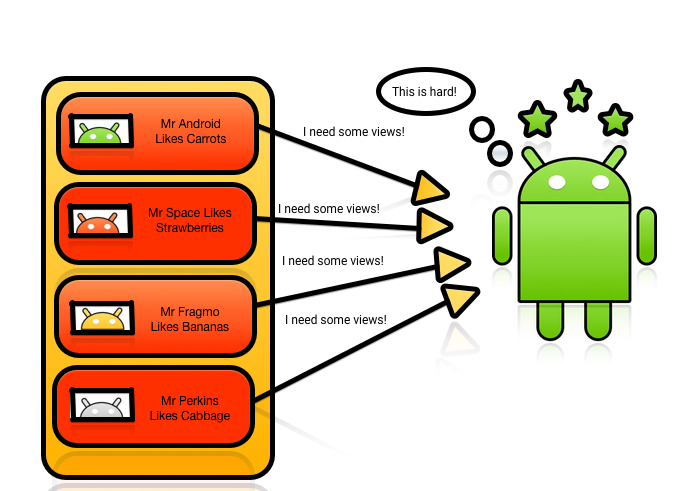
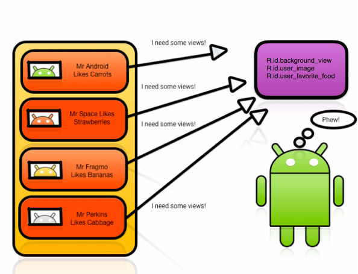
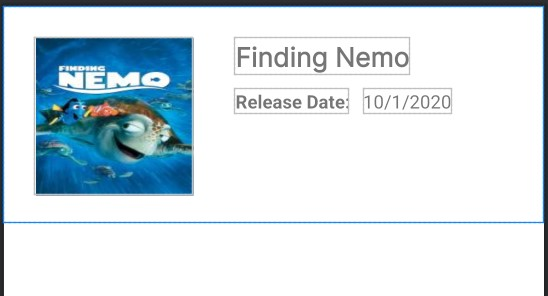
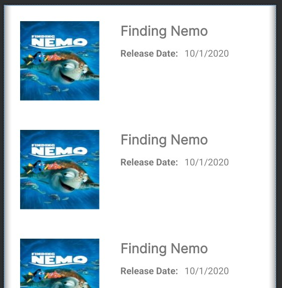
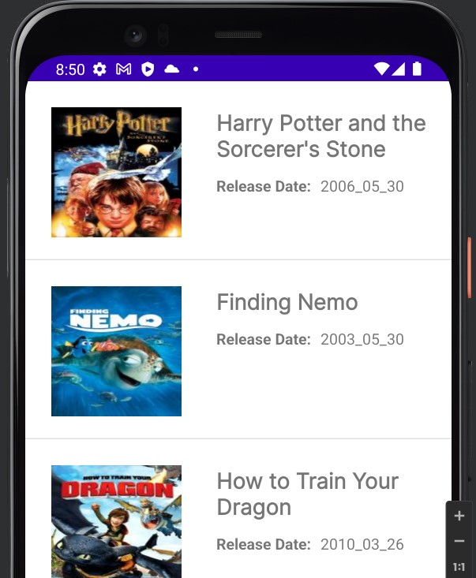
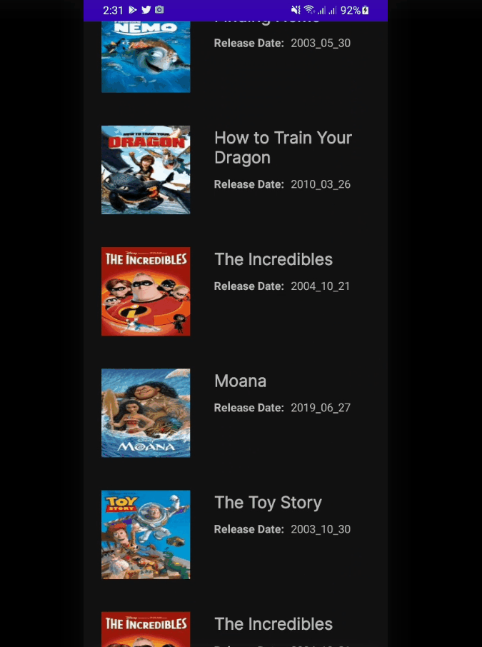

# RecyclerView

- [RecyclerView](#recyclerview)
	- [Downside of ListView](#downside-of-listview)
		- [RecyclerView](#recyclerview-1)
	- [Creating the RecyclerView](#creating-the-recyclerview)
		- [Laying Out RecyclerView Items](#laying-out-recyclerview-items)
		- [Defining the `RecyclerView` in Main Layout](#defining-the-recyclerview-in-main-layout)
		- [Defining Model Class](#defining-model-class)
		- [Adapters for RecyclerView](#adapters-for-recyclerview)
		- [Hooking up the Adapter and RecyclerView](#hooking-up-the-adapter-and-recyclerview)
		- [OnClickListener for RecyclerView](#onclicklistener-for-recyclerview)
			- [Using ViewHolder](#using-viewholder)
				- [Changing Background Color of OnClicked Item](#changing-background-color-of-onclicked-item)

## Downside of ListView

Imagine you’re creating a `ListView` with complicated custom items.

You create a row layout for the items and use that layout inside your adapter. You inflate your item layout in `getView()`, referencing each view with the unique ID you provided in XML to customize and add view logic. You pass that to the `ListView`, and it’s ready to be drawn on the screen. Or is it?

`ListViews` and `GridViews` only do half the job of achieving true memory efficiency. They recycle the item layout, but don’t keep references to the layout children, forcing you to call `findViewById()` for every child of your item layout every time you call `getView()`.

All this calling around can become processor-intensive, especially for complicated layouts. Furthermore, the situation can cause your `ListView` scrolling to become jerky or nonresponsive as it tries to grab view references.

<div align="center">

</div>

Android initially provided a solution to this problem on the Android Developers site with smooth scrolling via the power of the `View Holder` pattern.

With this pattern, a class becomes an in-memory reference to all the views needed to fill your layout. You set the references once and reuse them, working around the performance hit that comes with repeatedly calling `findViewById().`

<div align="center">

</div>

Take note: This is an optional pattern for a ListView or GridView. If you’re unaware of this detail, then you may wonder why your ListViews and GridViews are so slow.

### RecyclerView

The arrival of the `RecyclerView` changed everything. It still uses an `Adapter` to act as a data source; however, you have to create `ViewHolders` to keep references in memory.

To provide a new view, `RecyclerView` either creates a new `ViewHolder` object to inflate the layout and hold those references, or it recycles one from the existing stack.

Now you know why it’s called a `RecyclerView`!

Another perk of using `RecyclerViews` is that they come with default animations that you don’t have to create or add yourself.

Because it requires a `ViewHolder`, the `RecyclerView` knows which animation to apply to which item and adds them as required. You can also create your own animations and apply them as needed.

The last and most interesting component of a `RecyclerView` is its `LayoutManager`. This object positions the RecyclerView’s items and tells it when to recycle items that have transitioned off-screen. The `ListView` used to do this work alone. The RecyclerView has broken out this functionality to allow for different kinds of layouts: `Vertical`, `horizontal`, `grid`, `staggered` or your own!

`LayoutManager` offer three choices by default:

- `LinearLayoutManager` positions items to look like a standard ListView
- `GridLayoutManager` positions items in a grid format similar to a GridView
- `StaggeredGridLayoutManager` positions tems in a staggered grid format.

Create your own `LayoutManagers` to use with a `RecyclerView` if you want extra customization.

## Creating the RecyclerView

To create the RecyclerView, break the work into four parts:

1. Declare the RecyclerView in an activity layout and reference it in the activity Kotlin file.
2. Create a custom item XML layout for RecyclerView for its items.
3. Create the view holder for view items, connect the data source of the RecyclerView and handle the view logic by creating a RecyclerView Adapter.
4. Attach the adapter to the RecyclerView.

### Laying Out RecyclerView Items

`movie_list_item.xml`

```xml
<ConstraintLayout
    android:id="@+id/lv_item_container"
    android:layout_width="match_parent"
    android:layout_height="wrap_content">
    <ImageView
        android:id="@+id/imgvPoster"
        android:scaleType="fitXY"
        app:srcCompat="@drawable/finding_nemo"/>

    <TextView
        android:id="@+id/tvMovieName"
        android:layout_width="200dp"
        android:layout_height="wrap_content"
        android:text="Finding Nemo"/>

    <TextView
        android:id="@+id/tvDate"
        android:text="Release Date:" />

    <TextView
        android:id="@+id/tvRelease"
        android:text="10/1/2020" />
</ConstraintLayout>
```

<div align="center">

</div>

### Defining the `RecyclerView` in Main Layout

`activity_main.xml`

```xml
<?xml version="1.0" encoding="utf-8"?>
<LinearLayout xmlns:android="http://schemas.android.com/apk/res/android"
    xmlns:app="http://schemas.android.com/apk/res-auto"
    xmlns:tools="http://schemas.android.com/tools"
    android:layout_width="match_parent"
    android:layout_height="match_parent"
    tools:context=".MainActivity">


    <androidx.recyclerview.widget.RecyclerView
        android:id="@+id/recyclerView"
        tools:listitem="@layout/movie_list_item"
        android:layout_width="match_parent"
        android:layout_height="match_parent" />
</LinearLayout>
```

<div align="center">

</div>

### Defining Model Class

`Movie.kt`

```kotlin
import kotlin.random.Random

class Movie(
    var movie_name: String,
    var release_date: String,
    var img_src: Int
) {
    companion object {
        private val MOVIES = mapOf<Int, Movie>(
            0 to Movie(
                "Harry Potter and the Sorcerer's Stone",
                "2006_05_30",
                R.drawable.harry_potter_and_the_sorcerers_stone_poster
            ),
            1 to Movie("Finding Nemo", "2003_05_30", R.drawable.finding_nemo),
            2 to Movie(
                "How to Train Your Dragon",
                "2010_03_26",
                R.drawable.how_to_train_your_dragon_poster
            ),
            3 to Movie(
                "Toy Story",
                "2005_11_22",
                R.drawable.toy_story
            ),
            4 to Movie("WALL_E", "2008_06_27", R.drawable.walle_pi),
            5 to Movie("Moana", "2019_06_27", R.drawable.moana_poster00),
            6 to Movie("The Incredibles", "2004_10_21", R.drawable.the_incredibles),
            7 to Movie("The Toy Story", "2003_10_30", R.drawable.toy_story)
        )

        fun getMovieList(n:Int): ArrayList<Movie> {
            val movieList = ArrayList<Movie>(n)
            for (i in 1..n){
               movieList.add(MOVIES[Random.nextInt(8)]!!)
            }

            return movieList
        }
    }
}
```

### Adapters for RecyclerView

Now we make the `RecyclerView` adapter. We make a kt class lets say
`MovieAdapter`. We extend `RecyclerView.Adapter` but it needs a
`ViewHolder` class. So inside `MovieAdapter`, we create `MovieViewHolder` class
which extends from `RecyclerView.ViewHolder`. Then send use
`MovieViewHolder` class in our `MovieAdapter` class. We have to implement
three methods as follows -


```kotlin
    override fun onCreateViewHolder(parent: ViewGroup, viewType: Int): RecyclerView.ViewHolder {
        TODO("Not yet implemented")
    }
```

This is called when the layouts are first time created on the screen.
Item layout is inflated inside the parent container and ViewHolder is
created for this view, whose object needs to be returned.

Sometimes there are no `ViewHolders` available. In this scenario, `RecylerView` will ask `onCreateViewHolder()` from `RecyclerAdapter` to make a new one. We’ll use the item layout — `MovieViewHolder` — to create a view for the `ViewHolder`.

```kotlin
    override fun onBindViewHolder(holder: RecyclerView.ViewHolder, position: Int) {
        TODO("Not yet implemented")
    }
```


This is called to **bind our views with the data**. method uses the view
holder's position to determine what the contents should be. It gets the
view holder of the layout item which populates data into the item
through holder

```kotlin
    override fun getItemCount(): Int {
        TODO("Not yet implemented")
    }
```

This returns the number of list items.

We make constructor for Adapter with `movieList` which acts as a data source and Optionally `context`(needed to inflate the view).

for Example:


```kotlin
//class MovieAdapter(val movieList: ArrayList<Movie>, val context: Context) :
class MovieAdapter(val movieList: ArrayList<Movie>) :
    RecyclerView.Adapter<MovieAdapter.MovieViewHolder>() {
    override fun onCreateViewHolder(
        parent: ViewGroup,
        viewType: Int
    ): MovieAdapter.MovieViewHolder {
        TODO("Not yet implemented")
    }

    override fun onBindViewHolder(holder: MovieAdapter.MovieViewHolder, position: Int) {
        TODO("Not yet implemented")
    }

    override fun getItemCount(): Int {
        TODO("Not yet implemented")
    }

    class MovieViewHolder(itemView: View) : RecyclerView.ViewHolder(itemView) {

    }
}
```

The final code of adapter is as below.


```kotlin
class MovieAdapter(val movieList: ArrayList<Movie>) :
    RecyclerView.Adapter<MovieAdapter.MovieViewHolder>() {
    override fun onCreateViewHolder(
        parent: ViewGroup,
        viewType: Int
    ): MovieViewHolder {
        val inflatedView =
//          LayoutInflater.from(context)
            LayoutInflater.from(parent.context).inflate(R.layout.movie_list_item, parent, false)
        return MovieViewHolder(inflatedView)
    }

    override fun onBindViewHolder(holder: MovieViewHolder, position: Int) {
        holder.tvMovieName.text = movieList[position].movie_name
        holder.tvReleaseDate.text = movieList[position].release_date
        holder.imgvPoster.setImageResource(movieList[position].img_src)
    }


    override fun getItemCount(): Int = movieList.size

    inner class MovieViewHolder(itemView: View) : RecyclerView.ViewHolder(itemView) {
        var tvMovieName: TextView = itemView.findViewById(R.id.tvMovieName)
        var tvReleaseDate: TextView = itemView.findViewById(R.id.tvRelease)
        var imgvPoster: ImageView = itemView.findViewById(R.id.imgvPoster)
    }
}
```

### Hooking up the Adapter and RecyclerView

This is the moment you’ve been waiting for. Connect your adapter to our RecyclerView

```kotlin
inner class MainActivity : AppCompatActivity() {
    private lateinit var vb: ActivityMainBinding
    override fun onCreate(savedInstanceState: Bundle?) {
        super.onCreate(savedInstanceState)
        vb = ActivityMainBinding.inflate(layoutInflater)
        val view = vb.root
        setContentView(view)

        val movieList = Movie.getMovieList(100)
        vb.recyclerView.layoutManager = LinearLayoutManager(this)
        vb.recyclerView.adapter = MovieAdapter(movieList)
    }
}
```

<div align="center">

</div>

### OnClickListener for RecyclerView

#### Using ViewHolder

Implement the required method for `View.OnClickListener` since ViewHolders are responsible for their own event handling.

```kotlin
    inner class MovieViewHolder(itemView: View) : RecyclerView.ViewHolder(itemView),
        View.OnClickListener {
        var tvMovieName: TextView = itemView.findViewById(R.id.tvMovieName)
        var tvReleaseDate: TextView = itemView.findViewById(R.id.tvRelease)
        var imgvPoster: ImageView = itemView.findViewById(R.id.imgvPoster)

        init {
            itemView.setOnClickListener(this)
        }

        override fun onClick(v: View?) {
            var pos: Int = adapterPosition//getAdapterPosition()
            val movie: Movie = movieList[pos]
            // or
            // val movieText = tvMovieName.text
            // val releaseText = tvReleaseDate.text

//            Toast.makeText(v?.context, "Pos: $pos Name:${movie.movie_name}", Toast.LENGTH_SHORT)
//                .show()

            val intent = Intent(v?.context!!, ListDetails::class.java).apply {
                putExtra("name", movie.movie_name)
                putExtra("img", movie.img_src)
            }
            v?.context!!.startActivity(intent)
        }
```

##### Changing Background Color of OnClicked Item

```kotlin
class MovieAdapter(val movieList: ArrayList<Movie>, val context: Context) :
    RecyclerView.Adapter<MovieAdapter.MovieViewHolder>() {
    var index = -1

    override fun onBindViewHolder(holder: MovieViewHolder, position: Int) {
		//...
        if (index == position) {
            holder.container.setBackgroundColor(Color.rgb(157, 222, 252))
        } else {
            holder.container.setBackgroundColor(Color.TRANSPARENT)
        }
    }

	//...

    inner class MovieViewHolder(itemView: View) : RecyclerView.ViewHolder(itemView),
        View.OnClickListener {
        //...
        var container: ConstraintLayout = itemView.findViewById(R.id.rv_item_container)

        override fun onClick(v: View?) {
            var pos: Int = adapterPosition//getAdapterPosition()
            val movie: Movie = movieList[pos]

            index = pos
            notifyDataSetChanged()//invoke onBindViewHolder

            val intent = Intent(v?.context!!, ListDetails::class.java).apply {
                putExtra("name", movie.movie_name)
                putExtra("img", movie.img_src)
            }
            v?.context!!.startActivity(intent)
        }
    }
}
```

<div align="center">

</div>
