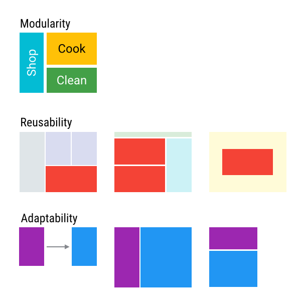
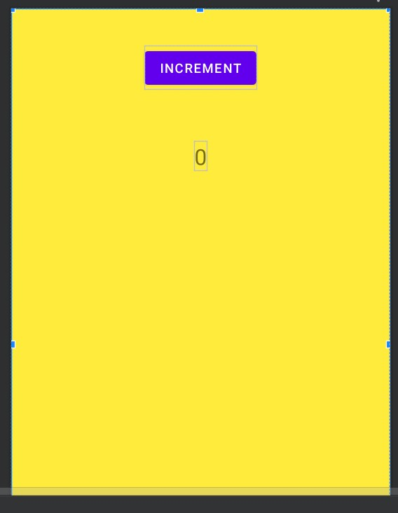
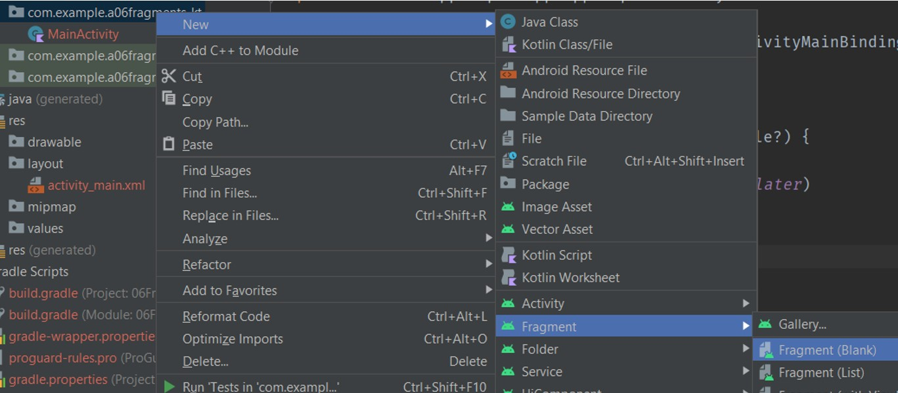
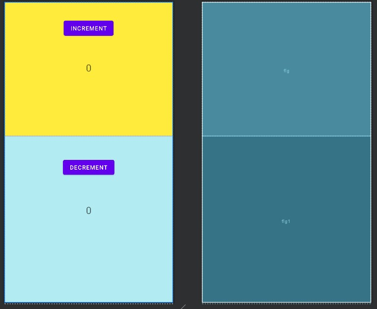
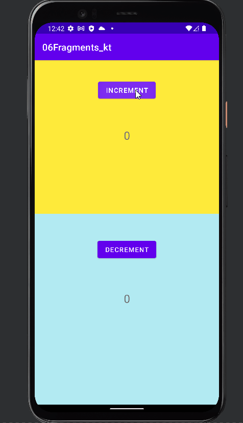

# Fragments

- [Fragments](#fragments)
	- [Intro](#intro)
	- [Defining a Fragment](#defining-a-fragment)
		- [ViewBinding Snippet](#viewbinding-snippet)
	- [Embedding a Fragment in an Activity](#embedding-a-fragment-in-an-activity)
		- [Statically inside `activity_main.xml`](#statically-inside-activity_mainxml)

## Intro

A fragment is an Android component that holds part of the behavior and/or UI of an activity. As the name would suggest, fragments are not independent entities, but are tied to a single activity. In many ways, they have functionality similar to activities.

Fragments provides:

- `Modularity`: Dividing complex activity code across fragments for better organization and maintenance.
- `Reusability`: Placing behavior or UI parts into fragments that multiple activities can share.
- `Adaptability`: Representing sections of a UI as different fragments and utilizing different layouts depending on screen orientation and size.

<div align="center">

</div>

## Defining a Fragment

A fragment, like an activity, has an XML layout file and a Java class that represents the Fragment controller.

The XML layout file is just like any other layout file, and can be named `fragment_count_up.xml`. Think of them as a partial (re-usable) activity:

`fragment_count_up.xml`

```xml
<ConstraintLayout >
    <Button
        android:id="@+id/bntAdd"
        android:text="increment"/>
    <TextView
        android:id="@+id/textView2"
        android:text="0"/>
</ConstraintLayout>
```

<div align="center">

</div>

The Kotlin controller for a fragment looks like:

```kotlin
class CountUpFragment : Fragment() {
    override fun onCreateView(
        inflater: LayoutInflater, container: ViewGroup?,
        savedInstanceState: Bundle?
    ): View? {
        // Inflate the layout for this fragment
        val fragmentView = inflater.inflate(R.layout.fragment_count_up, container, false)
        val btnAdd = fragmentView.findViewById<Button>(R.id.bntAdd)
        val tvAdd = fragmentView.findViewById<TextView>(R.id.tvAdd)
        var count = 0
        btnAdd.setOnClickListener {
            tvAdd.text = (count++).toString()
        }
        return fragmentView
    }


}
```

For another Fragment `CountDownFragment`, we can simplify the code above  Using `ViewBindings`,:

`fragment_count_down.xml`

```xml
<ConstraintLayout >
    <Button
        android:id="@+id/btnMin"
        android:text="increment"/>
    <TextView
        android:id="@+id/tvMin"
        android:text="0"/>
</ConstraintLayout>
```

```kotlin
class CountDownFragment : Fragment() {
    private lateinit var vb: FragmentCountDownBinding
    override fun onCreateView(
        inflater: LayoutInflater, container: ViewGroup?,
        savedInstanceState: Bundle?
    ): View? {
        // Inflate the layout for this fragment
        vb = FragmentCountDownBinding.inflate(inflater, container, false)
        var count = 0
        vb.btnMin.setOnClickListener {
            vb.tvMin.text = (count--).toString()
        }
        return vb.root
    }
}
```

Here `FragmentCountDownBinding` came from `fragment_count_down.xml`

We can also create Blank Fragments Component using IDE

<div align="center">

</div>

### ViewBinding Snippet

```kotlin
	private lateinit var vb: $ViewBinding$
    override fun onCreateView(
        inflater: LayoutInflater, container: ViewGroup?,
        savedInstanceState: Bundle?
    ): View? {
        // Inflate the layout for this fragment
        vb = $ViewBinding$.inflate(inflater, container, false)
        return vb.root
    }
```

## Embedding a Fragment in an Activity

There are two ways to add a fragment to an activity: dynamically using `Java/Kotlin` and statically using `XML`.

### Statically inside `activity_main.xml`

To add the fragment statically, simply embed the fragment in the activity's xml layout file:

`activity_main.xml`

```xml
<ConstraintLayout>
    <fragment
        android:name="com.example.a06fragments_kt.CountUpFragment"
        tools:layout="@layout/fragment_count_up"
        />
	<fragment
        android:name="com.example.a06fragments_kt.CountDownFragment"
        tools:layout="@layout/fragment_count_down" />
</ConstraintLayout>
```

<div align="center">

</div>

No need to change `MainActivity.kt`

```kotlin
class MainActivity : AppCompatActivity() {
    private lateinit var vb: ActivityMainBinding
    override fun onCreate(savedInstanceState: Bundle?) {
        super.onCreate(savedInstanceState)
        vb = ActivityMainBinding.inflate(layoutInflater)
        val view = vb.root
        setContentView(view)
    }
}
```

Just Run the app and we will see the fragment inside the activity:

<div align="center">

</div>