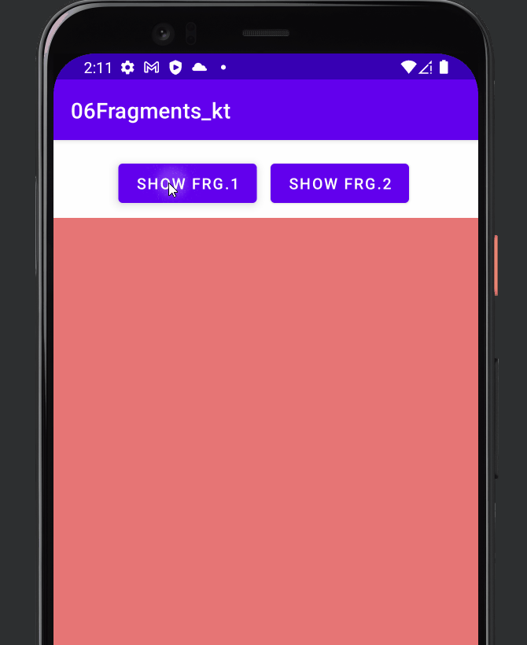
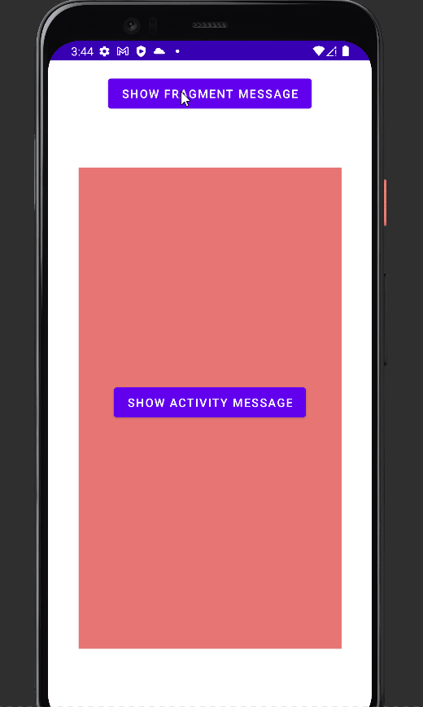

# Fragments

- [Fragments](#fragments)
  - [Intro](#intro)
  - [Defining a Fragment](#defining-a-fragment)
    - [ViewBinding Snippet](#viewbinding-snippet)
  - [Embedding a Fragment in an Activity](#embedding-a-fragment-in-an-activity)
    - [Statically inside `activity_main.xml`](#statically-inside-activity_mainxml)
    - [Dynamically inside `MainActivity.kt`](#dynamically-inside-mainactivitykt)
    - [add, remove and replace](#add-remove-and-replace)
  - [Fragment Lifecycle](#fragment-lifecycle)
  - [Communicating with Fragments](#communicating-with-fragments)
    - [Using Bundle](#using-bundle)
      - [From Activity to Fragment:](#from-activity-to-fragment)
    - [Using Methods](#using-methods)
    - [Using Interface](#using-interface)

## Intro

A fragment is an Android component that holds part of the behavior and/or UI of an activity. As the name would suggest, fragments are not independent entities, but are tied to a single activity. In many ways, they have functionality similar to activities.

Fragments provides:

- `Modularity`: Dividing complex activity code across fragments for better organization and maintenance.
- `Reusability`: Placing behavior or UI parts into fragments that multiple activities can share.
- `Adaptability`: Representing sections of a UI as different fragments and utilizing different layouts depending on screen orientation and size.

<div align="center">

</div>

## Defining a Fragment

A fragment, like an activity, has an XML layout file and a Java class that represents the Fragment controller.

The XML layout file is just like any other layout file, and can be named `fragment_count_up.xml`. Think of them as a partial (re-usable) activity:

`fragment_count_up.xml`

```xml
<ConstraintLayout >
    <Button
        android:id="@+id/bntAdd"
        android:text="increment"/>
    <TextView
        android:id="@+id/textView2"
        android:text="0"/>
</ConstraintLayout>
```

<div align="center">

</div>

The Kotlin controller for a fragment looks like:

```kotlin
class CountUpFragment : Fragment() {
    override fun onCreateView(
        inflater: LayoutInflater, container: ViewGroup?,
        savedInstanceState: Bundle?
    ): View? {
        // Inflate the layout for this fragment
        val fragmentView = inflater.inflate(R.layout.fragment_count_up, container, false)
        val btnAdd = fragmentView.findViewById<Button>(R.id.bntAdd)
        val tvAdd = fragmentView.findViewById<TextView>(R.id.tvAdd)
        var count = 0
        btnAdd.setOnClickListener {
            tvAdd.text = (count++).toString()
        }
        return fragmentView
    }


}
```

or For **Better Performance**, get the reference to the view inside `onViewCreated` method:

```kotlin
class CountUpFragment : Fragment() {

    override fun onCreateView(
        inflater: LayoutInflater, container: ViewGroup?,
        savedInstanceState: Bundle?
    ): View? {

        return inflater.inflate(R.layout.fragment_count_up, container, false)
    }

    override fun onViewCreated(view: View, savedInstanceState: Bundle?) {
        super.onViewCreated(view, savedInstanceState)
        val btnAdd = view.findViewById<Button>(R.id.bntAdd)
        val tvAdd = view.findViewById<TextView>(R.id.tvAdd)
        var count = 0
        btnAdd.setOnClickListener {
            tvAdd.text = (++count).toString()
        }
    }
}
```

see [Fragment Lifecycle](#fragment-lifecycle) for more details.


For another Fragment `CountDownFragment`, we can simplify the code above  Using `ViewBindings`,:

`fragment_count_down.xml`

```xml
<ConstraintLayout >
    <Button
        android:id="@+id/btnMin"
        android:text="increment"/>
    <TextView
        android:id="@+id/tvMin"
        android:text="0"/>
</ConstraintLayout>
```

```kotlin
class CountDownFragment : Fragment() {
    private lateinit var fvb: FragmentCountDownBinding

    override fun onCreateView(
        inflater: LayoutInflater, container: ViewGroup?,
        savedInstanceState: Bundle?
    ): View? {
        // Inflate the layout for this fragment
        fvb = FragmentCountDownBinding.inflate(inflater, container, false)
        return fvb.root
    }

    override fun onViewCreated(view: View, savedInstanceState: Bundle?) {
        super.onViewCreated(view, savedInstanceState)
        var count = 0
        fvb.btnMin.setOnClickListener {
            fvb.tvMin.text = (--count).toString()
            Toast.makeText(requireContext(), "value: $count", Toast.LENGTH_SHORT).show()
//            Toast.makeText(view.context, "value: $count", Toast.LENGTH_SHORT).show()
        }
    }
}
```

Here `FragmentCountDownBinding` came from `fragment_count_down.xml`

We can also create Blank Fragments Component using IDE

<div align="center">

</div>

### ViewBinding Snippet

```kotlin

    private lateinit var fvb: $ViewBinding$

    override fun onCreateView(
        inflater: LayoutInflater, container: ViewGroup?,
        savedInstanceState: Bundle?
    ): View? {
        // Inflate the layout for this fragment
        fvb = $ViewBinding$.inflate(inflater, container, false)
        return fvb.root
    }

    override fun onViewCreated(view: View, savedInstanceState: Bundle?) {
        super.onViewCreated(view, savedInstanceState)
        $END$
    }
```

## Embedding a Fragment in an Activity

There are two ways to add a fragment to an activity: dynamically using `Java/Kotlin` and statically using `XML`.

### Statically inside `activity_main.xml`

To add the fragment statically, simply embed the fragment in the activity's xml layout file:

`activity_main.xml`

```xml
<ConstraintLayout>
    <fragment
        android:name="com.example.a06fragments_kt.CountUpFragment"
        tools:layout="@layout/fragment_count_up"
        />
	<fragment
        android:name="com.example.a06fragments_kt.CountDownFragment"
        tools:layout="@layout/fragment_count_down" />
</ConstraintLayout>
```

<div align="center">

</div>

No need to change `MainActivity.kt`

```kotlin
class MainActivity : AppCompatActivity() {
    private lateinit var vb: ActivityMainBinding
    override fun onCreate(savedInstanceState: Bundle?) {
        super.onCreate(savedInstanceState)
        vb = ActivityMainBinding.inflate(layoutInflater)
        val view = vb.root
        setContentView(view)
    }
}
```

Just Run the app and we will see the fragment inside the activity:

<div align="center">

</div>

### Dynamically inside `MainActivity.kt`

<div align="center">

</div>

The second way is by adding the fragment dynamically in Java/Kotlin using the `FragmentManager`. The `FragmentManager` class and the `FragmentTransaction` class allow us to `add`, `remove` and `replace` fragments in the layout of our activity at **runtime**.

In this case, you want to add a `"placeholder"` container (usually a `FrameLayout`) to our activity where the fragment is inserted at runtime:

`activity_main.xml`

```xml
<ConstraintLayout>
    <Button
        android:id="@+id/btnShow1"/>
    <Button
        android:id="@+id/btnShow2"/>
    <FrameLayout
        android:id="@+id/placeholder">
    </FrameLayout>
</ConstraintLayout>
```

and then you can use the `FragmentManager` to create a `FragmentTransaction` which allows us to add fragments to the `FrameLayout` at runtime:

```java
// Begin the transaction
FragmentTransaction ft = getSupportFragmentManager().beginTransaction();
// Replace the contents of the container with the new fragment
ft.replace(R.id.your_placeholder, new FooFragment());
// or ft.add(R.id.your_placeholder, new FooFragment());
// Complete the changes added above
ft.commit();
```

`MainActivity.kt`

```kotlin
class MainActivity : AppCompatActivity() {
    private lateinit var vb: ActivityMainBinding
    override fun onCreate(savedInstanceState: Bundle?) {
        super.onCreate(savedInstanceState)
        vb = ActivityMainBinding.inflate(layoutInflater)
        val view = vb.root
        setContentView(view)

        vb.btnShow1.setOnClickListener {
            supportFragmentManager
                .beginTransaction()
                .replace(R.id.placeholder,CountUpFragment())
                .commit()
        }
        vb.btnShow2.setOnClickListener {
            supportFragmentManager
                .beginTransaction()
                .replace(R.id.placeholder,CountDownFragment())
                .commit()
        }
    }
}
```

If the fragment should always be within the activity, use XML to statically add the fragment but in more complex cases be sure to use the Java/Kotlin-based approach.

### add, remove and replace

```kotlin
        val addFragment = findViewById<Button>(R.id.addFragment)
        addFragment.setOnClickListener {
            val fragment = OneFragment()
            supportFragmentManager
                .beginTransaction()
                .add(R.id.fragmentContainer, fragment, "OneFragmentTag")
                .commit()
        }
        val removeFragment = findViewById<Button>(R.id.removeFragment)
        removeFragment.setOnClickListener {
            val fragment = supportFragmentManager.findFragmentById(R.id.fragmentContainer)
            //or using Tag
            val fragmentOne = supportFragmentManager.findFragmentByTag("OneFragmentTag")
            fragment?.let {
                supportFragmentManager
                    .beginTransaction()
                    .remove(fragment)
                    .commit()
            }
        }

        val replaceFragment = findViewById<Button>(R.id.replaceFragment)
        replaceFragment.setOnClickListener {
            val fragment = TwoFragment()
            with(supportFragmentManager.beginTransaction()) {
                replace(R.id.fragmentContainer, fragment, "OneFragmentTag")
                addToBackStack(null)
                setTransition(FragmentTransaction.TRANSIT_FRAGMENT_FADE)
                commit()
            }
        }
```

## Fragment Lifecycle

Fragment has many methods which can be overridden to plug into the lifecycle (similar to an Activity):

- `onAttach()` is called when a fragment is connected to an activity.
- `onCreate()` is called to do initial creation of the fragment.
- `onCreateView()` is called by Android once the Fragment should inflate a view.
- `onViewCreated()` is called after onCreateView() and ensures that the fragment's root view is non-null. Any view setup should happen here. E.g., view lookups, attaching listeners.
- `onActivityCreated()` is called when host activity has completed its onCreate() method.
- `onStart()` is called once the fragment is ready to be displayed on screen.
- `onResume()` - Allocate “expensive” resources such as registering for location, sensor updates, etc.
- `onPause()` - Release “expensive” resources. Commit any changes.
- `onDestroyView()` is called when fragment's view is being destroyed, but the fragment is still kept around.
- `onDestroy()` is called when fragment is no longer in use.
- `onDetach()` is called when fragment is no longer connected to the activity.


<div align="center">

</div>

The most common ones to override are `onCreateView` which is in almost every fragment to setup the inflated view, `onCreate` for any data initialization and `onActivityCreated` used for setting up things that can only take place once the Activity has been fully created.

Here's an example of how you might use the various fragment lifecycle events:

```java
public class SomeFragment extends Fragment {
    ThingsAdapter adapter;
    FragmentActivity listener;

    // This event fires 1st, before creation of fragment or any views
    // The onAttach method is called when the Fragment instance is associated with an Activity.
    // This does not mean the Activity is fully initialized.
    @Override
    public void onAttach(Context context) {
        super.onAttach(context);
        if (context instanceof Activity){
            this.listener = (FragmentActivity) context;
        }
    }

    // This event fires 2nd, before views are created for the fragment
    // The onCreate method is called when the Fragment instance is being created, or re-created.
    // Use onCreate for any standard setup that does not require the activity to be fully created
    @Override
    public void onCreate(Bundle savedInstanceState) {
        super.onCreate(savedInstanceState);
        ArrayList<Thing> things = new ArrayList<Thing>();
        adapter = new ThingsAdapter(getActivity(), things);
    }

    // The onCreateView method is called when Fragment should create its View object hierarchy,
    // either dynamically or via XML layout inflation.
    @Override
    public View onCreateView(LayoutInflater inflater, ViewGroup parent, Bundle savedInstanceState) {
        return inflater.inflate(R.layout.fragment_some, parent, false);
    }

    // This event is triggered soon after onCreateView().
    // onViewCreated() is only called if the view returned from onCreateView() is non-null.
    // Any view setup should occur here.  E.g., view lookups and attaching view listeners.
    @Override
    public void onViewCreated(View view, Bundle savedInstanceState) {
        super.onViewCreated(view, savedInstanceState);
        ListView lv = (ListView) view.findViewById(R.id.lvSome);
        lv.setAdapter(adapter);
    }

    // This method is called when the fragment is no longer connected to the Activity
    // Any references saved in onAttach should be nulled out here to prevent memory leaks.
    @Override
    public void onDetach() {
        super.onDetach();
        this.listener = null;
    }

    // This method is called after the parent Activity's onCreate() method has completed.
    // Accessing the view hierarchy of the parent activity must be done in the onActivityCreated.
    // At this point, it is safe to search for activity View objects by their ID, for example.
    @Override
    public void onActivityCreated(Bundle savedInstanceState) {
        super.onActivityCreated(savedInstanceState);
    }
}
```

## Communicating with Fragments

Fragments should generally only communicate with their direct parent activity. Fragments communicate through their parent activity allowing the activity to manage the inputs and outputs of data from that fragment coordinating with other fragments or activities. Think of the Activity as the controller managing all interaction with each of the fragments contained within.

The important thing to keep in mind is that **fragments should not directly communicate with each other and should generally only communicate with their parent activity**. Fragments should be modular, standalone and reusable components. The fragments allow their parent activity to respond to intents and callbacks in most cases.

There are three ways a fragment and an activity can communicate:

- **Bundle** - Activity can construct a fragment and set arguments
- **Methods** - Activity can call methods on a fragment instance
- **Listener** - Fragment can fire listener events on an activity via an interface

### Using Bundle

#### From Activity to Fragment:

`MainActivity.kt`

```kotlin
class MainActivity : AppCompatActivity() {
    private lateinit var vb: ActivityMainBinding
    override fun onCreate(savedInstanceState: Bundle?) {
        super.onCreate(savedInstanceState)
        vb = ActivityMainBinding.inflate(layoutInflater)
        val view = vb.root
        setContentView(view)

        val bundle = Bundle()
        bundle.putString("KEY","Message from Activity")
        val fragment = OneFragment()
        fragment.arguments = bundle
        supportFragmentManager
            .beginTransaction()
            .add(R.id.main_container, fragment)
            .commit()
    }
}
```

```kotlin
class OneFragment : Fragment() {
    private lateinit var fvb: FragmentOneBinding
    private var myValue:String? = null
    override fun onCreate(savedInstanceState: Bundle?) {
        super.onCreate(savedInstanceState)
        myValue = arguments?.getString("KEY")
        Toast.makeText(requireContext(), "$myValue", Toast.LENGTH_SHORT).show();
    }


    override fun onCreateView(
        inflater: LayoutInflater, container: ViewGroup?,
        savedInstanceState: Bundle?
    ): View? {
        // Inflate the layout for this fragment
        fvb = FragmentOneBinding.inflate(inflater, container, false)
        return fvb.root
    }
}
```

**Using Factory Methods Approach**:

```kotlin
private const val ARG_PARAM1 = "param1"
private const val ARG_PARAM2 = "param2"
class TwoFragment : Fragment() {
    private var param1: String? = null
    private var param2: String? = null

    override fun onCreate(savedInstanceState: Bundle?) {
        super.onCreate(savedInstanceState)
        arguments?.let {
            param1 = it.getString(ARG_PARAM1)
            param2 = it.getString(ARG_PARAM2)
        }
    }

    override fun onCreateView(
        inflater: LayoutInflater, container: ViewGroup?,
        savedInstanceState: Bundle?
    ): View? {
        return inflater.inflate(R.layout.fragment_two, container, false)
    }

    companion object {
        /**
         * Use this factory method to create a new instance of
         * this fragment using the provided parameters.
         *
         * @param param1 Parameter 1.
         * @param param2 Parameter 2.
         * @return A new instance of fragment TwoFragment.
         */
        // TODO: Rename and change types and number of parameters
        @JvmStatic
        fun newInstance(param1: String, param2: String) =
            TwoFragment().apply {
                arguments = Bundle().apply {
                    putString(ARG_PARAM1, param1)
                    putString(ARG_PARAM2, param2)
                }
            }
    }
```

Now, Creating a Fragment with a Factory Method:
`MainActivity.kt`

```kotlin
class MainActivity : AppCompatActivity() {
    private lateinit var vb: ActivityMainBinding
    override fun onCreate(savedInstanceState: Bundle?) {
        super.onCreate(savedInstanceState)
        vb = ActivityMainBinding.inflate(layoutInflater)
        val view = vb.root
        setContentView(view)

        //val bundle = Bundle()
        //bundle.putString("KEY","Message from Activity")
        //val fragment = OneFragment()
        //fragment.arguments = bundle
        //supportFragmentManager
        //    .beginTransaction()
        //    .add(R.id.main_container, fragment, "OneFragmentTag")
        //    .commit()

        val fragmentTwo = TwoFragment.newInstance("Hello","World")
        supportFragmentManager
            .beginTransaction()
            .add(R.id.main_container, fragmentTwo, "OneFragmentTag")
            .commit()
    }
}
```

### Using Methods

Here is an example of how we might invoke a method of fragment and pass data to it from main activity as well as how we might receive data from a fragment and invoke a method of main activity from fragment:

<div align="center">

</div>

`activity_main.xml`

```xml
<ConstraintLayout>
    <Button
        android:id="@+id/btnShowFrag"
        android:text="Show Fragment Message"/>

    <FrameLayout>
        android:id="@+id/main_container"
    </FrameLayout>

</ConstraintLayout>
```

`MainActivity.kt`

```kotlin
class MainActivity : AppCompatActivity() {
    private lateinit var vb: ActivityMainBinding
    override fun onCreate(savedInstanceState: Bundle?) {
        super.onCreate(savedInstanceState)
        vb = ActivityMainBinding.inflate(layoutInflater)
        val view = vb.root
        setContentView(view)

        supportFragmentManager
            .beginTransaction()
            .add(R.id.main_container, OneFragment(), "OneFragmentTag")
            .commit()

        vb.btnShowFrag.setOnClickListener {
            val oneFragment =
                supportFragmentManager.findFragmentById(R.id.main_container) as OneFragment
            val data = "XXXXX"
            oneFragment.showFragmentMessage(data)
        }

    }

    fun showActivityMessage(data: String) {

        Toast.makeText(
            this, "This Message is from Activity\n" +
                    "Data receive from Fragment:$data", Toast.LENGTH_SHORT
        ).show()
    }
}
```

`fragment_one.xml`

```xml
<FrameLayout >
    <ConstraintLayout>
        <Button
            android:id="@+id/btnShowAct"/>
    </ConstraintLayout>
</FrameLayout>
```

`OneFragment.kt`

```kotlin
class OneFragment : Fragment() {
    private lateinit var fvb: FragmentOneBinding
    override fun onCreateView(
        inflater: LayoutInflater, container: ViewGroup?,
        savedInstanceState: Bundle?
    ): View? {
        // Inflate the layout for this fragment
        fvb = FragmentOneBinding.inflate(inflater, container, false)
        return fvb.root
    }

    override fun onViewCreated(view: View, savedInstanceState: Bundle?) {
        super.onViewCreated(view, savedInstanceState)
        fvb.btnShowAct.setOnClickListener {
            val data = "YYYYYY"
            //getActivity()
            activity?.let {
                (it as MainActivity).showActivityMessage(data)
            }

        }
    }

    fun showFragmentMessage(data: String?) {
        activity?.let {
            Toast.makeText(it, "This message is from Fragment\nData sent from Activity:$data", Toast.LENGTH_SHORT)
                .show()
        }
    }

}
```

### Using Interface

see [How to Communicate Between ClassA & ClassB using Interface](https://github.com/dev-SR/exercise/tree/main/Java/functional-programming/00functional_interface_or_function_type#ex-communication-between-classa--classb)

Let's say `Activity` has a method called `activityMethod()` of type `MethodFromActivity`. We can use this interface to communicate with the activity from the fragment by having a reference of interface - `MethodFromActivity` in the fragment.

Also, To make sure `Activity` has `activityMethod()` method, we have to check if the activity has implemented the `MethodFromActivity` using `onAttach()` method.

`ThreeFragment.kt`

```kotlin
class ThreeFragment : Fragment() {
    private lateinit var fvb: FragmentThreeBinding

    interface MethodFromActivity {
        fun activityMethod()
    }

    var callback: MethodFromActivity? = null

    override fun onCreateView(
        inflater: LayoutInflater, container: ViewGroup?,
        savedInstanceState: Bundle?
    ): View? {
        // Inflate the layout for this fragment
        fvb = FragmentThreeBinding.inflate(inflater, container, false)
        return fvb.root
    }

    override fun onViewCreated(view: View, savedInstanceState: Bundle?) {
        super.onViewCreated(view, savedInstanceState)
        fvb.btnShow.setOnClickListener {
            //invoke the activity method
            callback?.activityMethod()
        }
    }

    //make sure Activity has `activityMethod`.

    override fun onAttach(context: Context) {
        super.onAttach(context)
        callback = context as? MethodFromActivity
        /**
         * `Activity` class is passed as `context`.
         * if `MethodFromActivity` interface is implemented by Activity
         * then `context` - Activity can be casted to `MethodFromActivity`
         * */

        if (callback == null)
            throw ClassCastException("$context must implement MethodFromActivity")
    }

    override fun onDetach() {
        super.onDetach()
        callback = null
    }

}
```

Now implement `ThreeFragment.MethodFromActivity` inside `MainActivity.kt`

```kotlin
class MainActivity : AppCompatActivity(), ThreeFragment.MethodFromActivity {
    private lateinit var vb: ActivityMainBinding
    override fun onCreate(savedInstanceState: Bundle?) {
        super.onCreate(savedInstanceState)
        vb = ActivityMainBinding.inflate(layoutInflater)
        val view = vb.root
        setContentView(view)

        supportFragmentManager
            .beginTransaction()
            .add(R.id.main_container, ThreeFragment())
            .commit()

    }

    override fun activityMethod() {
        Toast.makeText(
            this, "This Message is from Activity", Toast.LENGTH_SHORT
        ).show()
    }
}
```
