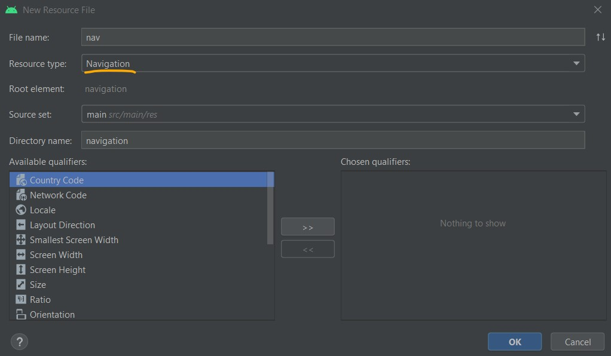
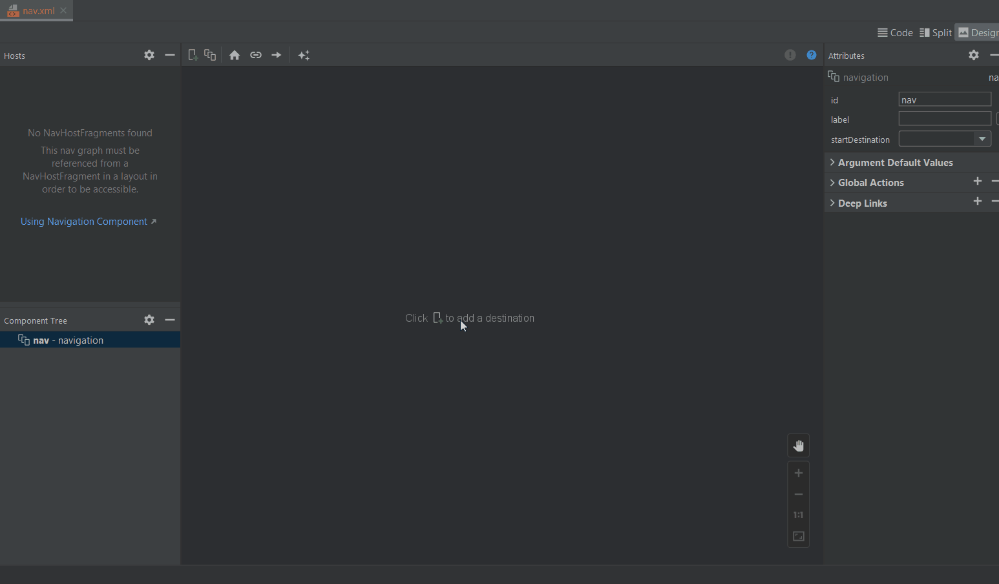
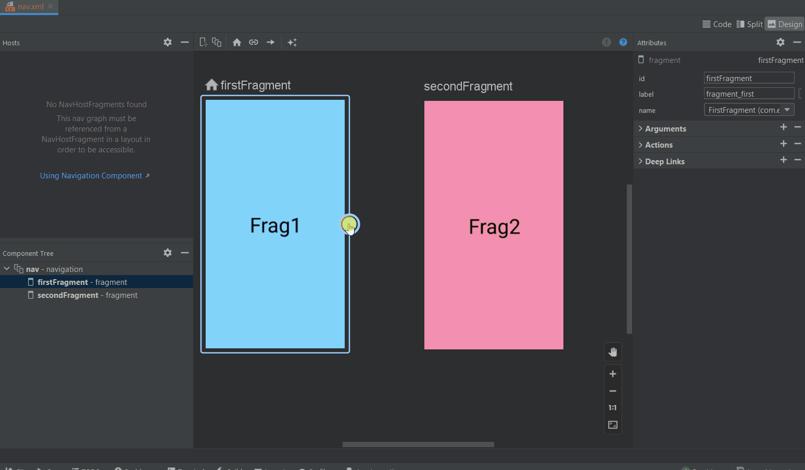
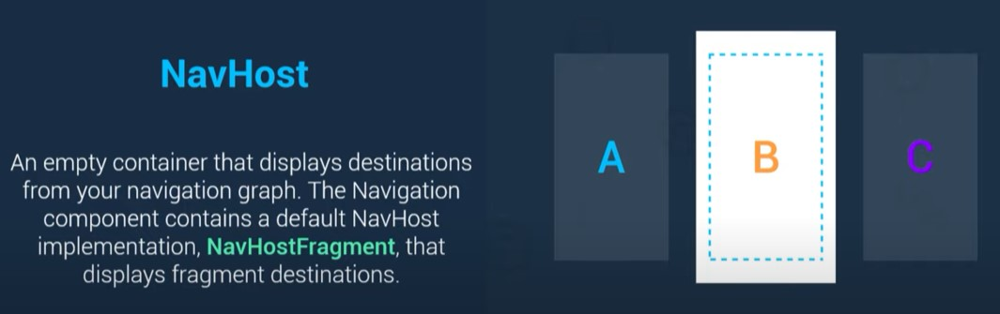
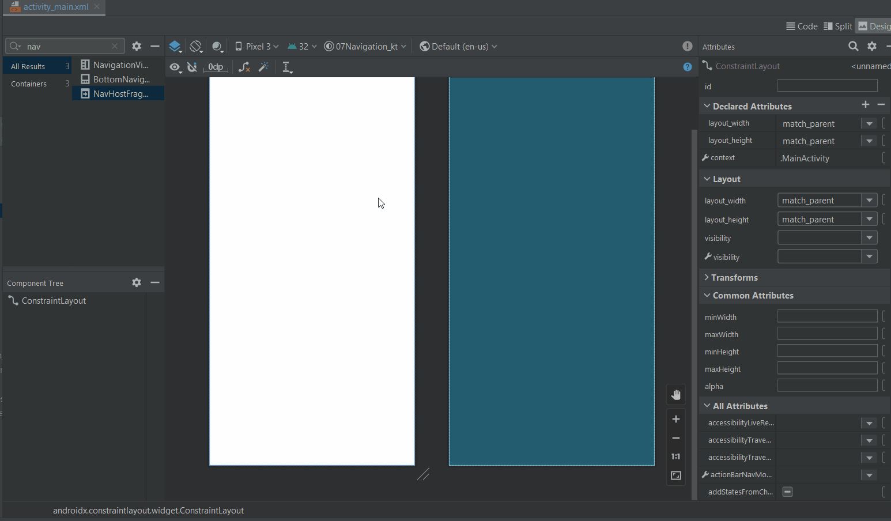
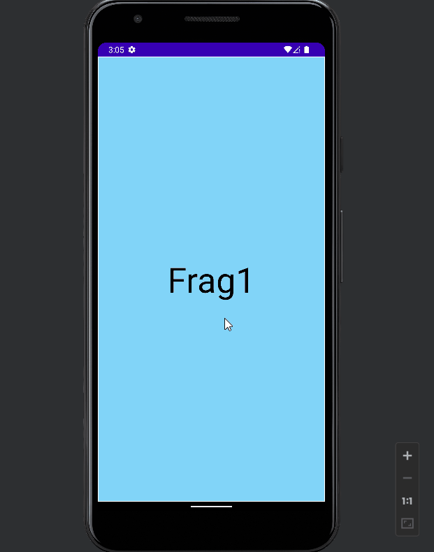

# Navigation Component

- [Navigation Component](#navigation-component)
	- [Basic Implementation](#basic-implementation)
		- [Creating Navigation Graph and Fragments](#creating-navigation-graph-and-fragments)
		- [Add Actions to Navigate:](#add-actions-to-navigate)
		- [Navigation Host](#navigation-host)
		- [Navigation Controller](#navigation-controller)

The Navigation component is a suite of libraries, tooling and guidance for in-app navigation.
The component centralizes all of the navigation information of your app in a `navigation graph`,
providing a robust framework for implementing everything from simple button clicks to
complex navigation UI patterns.

## Basic Implementation

### Creating Navigation Graph and Fragments

Navigation graph: An XML resource that contains all navigation-related information in one centralized location. This includes all of the individual content areas within your app, called destinations, as well as the possible paths that a user can take through your app.

<div align="center">

</div>

Create a new project and add the following dependencies:

[dependencies](https://developer.android.com/jetpack/androidx/releases/navigation)

```gradle
	def nav_version = "2.4.1"
	// Kotlin
	implementation "androidx.navigation:navigation-fragment-ktx:$nav_version"
	implementation "androidx.navigation:navigation-ui-ktx:$nav_version"
```

Create New Resource File : `New > Android Resource File` > Resource Type: `Navigation`

<div align="center">

</div>

Create new fragment : `New > Fragment`  or using Navigation Component -> `New Destination > Create New Destination` to create a new fragment:

<div align="center">

</div>

Adding `fragments` to the navigation graph:

<div align="center">

</div>

Here we can see that first fragment is added to the navigation graph as a start destination which can be changed.

### Add Actions to Navigate:

Now let’s add an `action` to navigate from firstFragment to secondFragment and vice-versa.

<div align="center">

</div>

Here is the `action` added to the navigation graph XML file:

```xml
<navigation
    android:id="@+id/nav"
    app:startDestination="@id/firstFragment">
    <fragment
        android:id="@+id/firstFragment">
        <action
            android:id="@+id/action_firstFragment_to_secondFragment"
            app:destination="@id/secondFragment" />
    </fragment>
    <fragment
        android:id="@+id/secondFragment">
        <action
            android:id="@+id/action_secondFragment_to_firstFragment"
            app:destination="@id/firstFragment" />
    </fragment>
</navigation>
```

### Navigation Host

NavHost: An empty container that displays destinations from your navigation graph. The Navigation component contains a default NavHost implementation, `NavHostFragment`, which displays fragment destinations.


<div align="center">

</div>

Adding `navigation host` to the main activity with the help of navigation graph XML file:

<div align="center">

</div>

### Navigation Controller

NavController: An object that manages app navigation within a `NavHost`. The `NavController` orchestrates the swapping of destination content in the NavHost as users move throughout your app.


<div align="center">

</div>

Implementing `navigation controller` with the help of `action` id to navigate from `FirstFragment` to `SecondFragment`:

`FirstFragment`

```kotlin
class FirstFragment : Fragment() {
    private lateinit var fvb: FragmentFirstBinding

    override fun onCreateView(
        inflater: LayoutInflater, container: ViewGroup?,
        savedInstanceState: Bundle?
    ): View? {
        // Inflate the layout for this fragment
        fvb = FragmentFirstBinding.inflate(inflater, container, false)
        return fvb.root
    }

    override fun onViewCreated(view: View, savedInstanceState: Bundle?) {
        super.onViewCreated(view, savedInstanceState)
        fvb.tvFrag1.setOnClickListener {
			// Navigation Controller
            Navigation.findNavController(view)
                .navigate(R.id.action_firstFragment_to_secondFragment)
        }
    }
}
```

navigate from `SecondFragment` to `FirstFragment`:

```kotlin
class SecondFragment : Fragment() {
    private lateinit var fvb: FragmentSecondBinding

    override fun onCreateView(
        inflater: LayoutInflater, container: ViewGroup?,
        savedInstanceState: Bundle?
    ): View? {
        // Inflate the layout for this fragment
        fvb = FragmentSecondBinding.inflate(inflater, container, false)
        val view = fvb.root

        fvb.tvFrag2.setOnClickListener {
            Navigation.findNavController(view).navigate(R.id.action_secondFragment_to_firstFragment)
        }
        return view
    }
}
```

<div align="center">

</div>