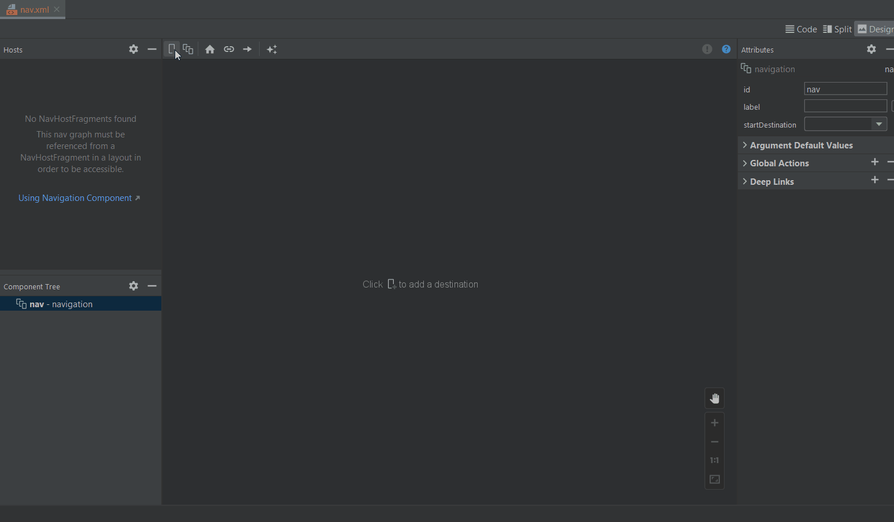
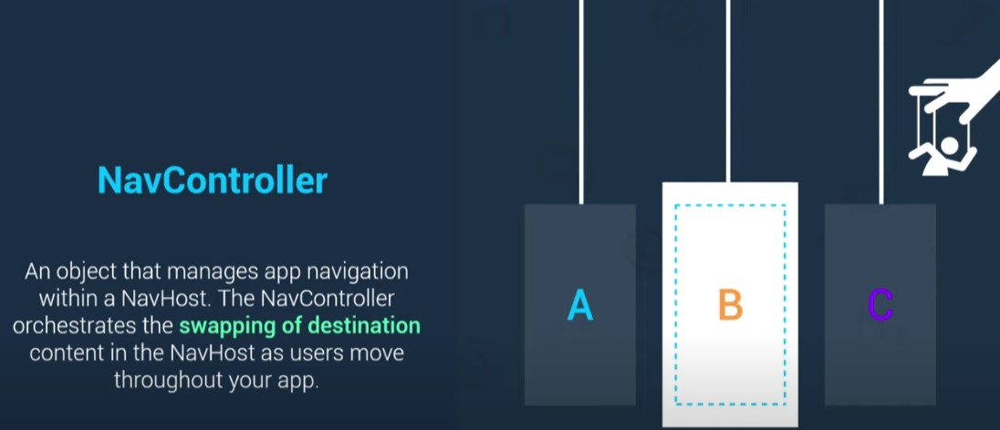
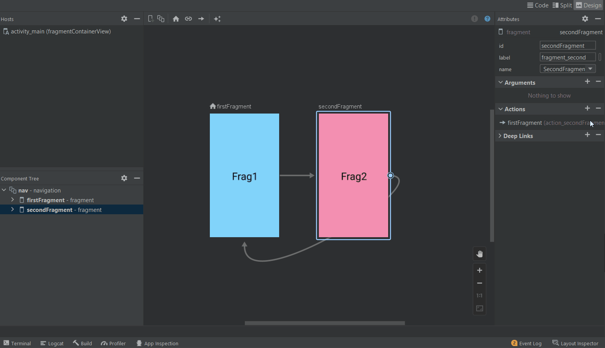
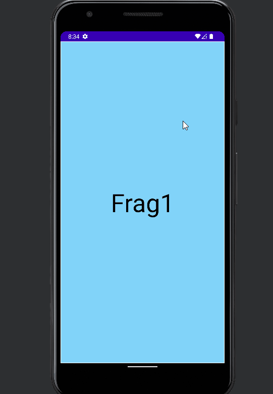
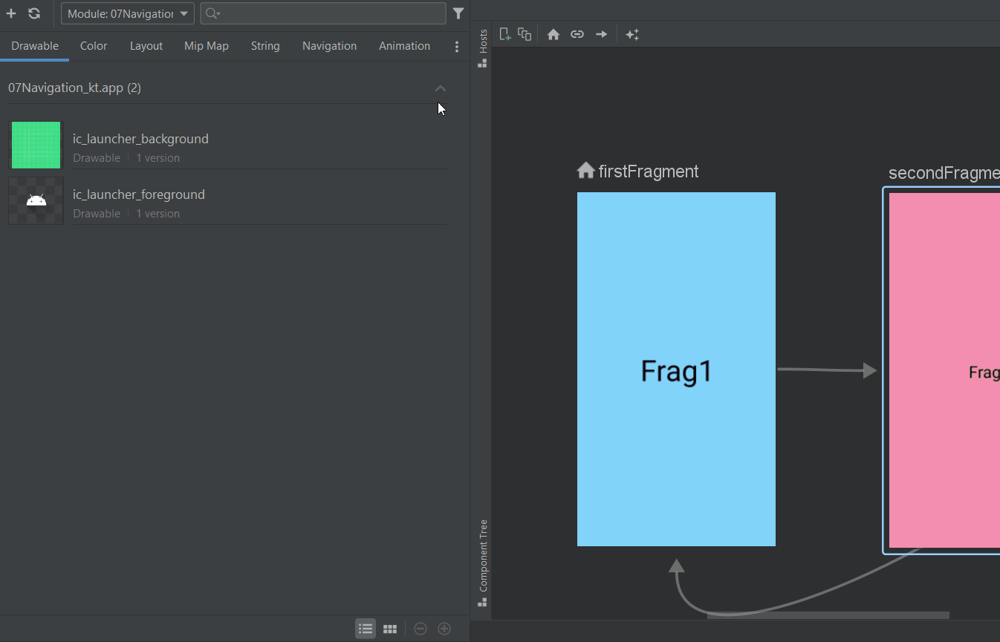
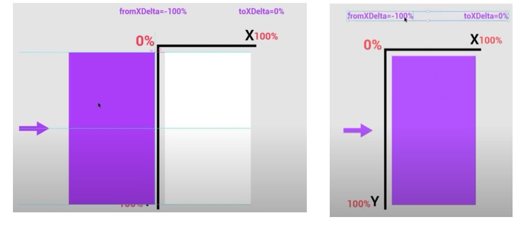
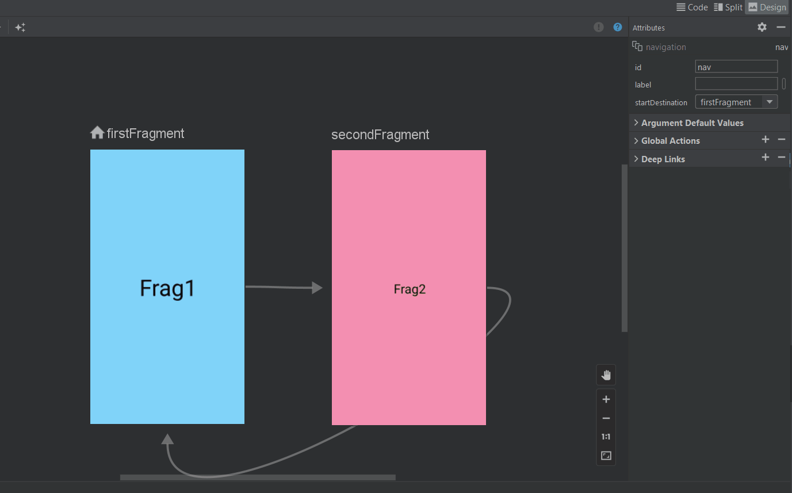
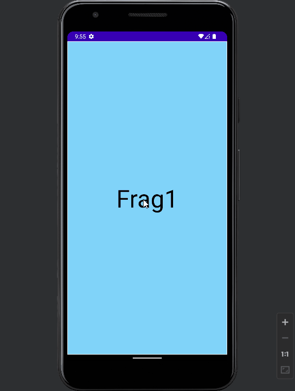

# Navigation Component

- [Navigation Component](#navigation-component)
  - [Basic Implementation](#basic-implementation)
    - [Creating Navigation Graph and Fragments](#creating-navigation-graph-and-fragments)
    - [Add Actions to Navigate](#add-actions-to-navigate)
    - [Navigation Host](#navigation-host)
    - [Navigation Controller](#navigation-controller)
  - [Passing Arguments: Safe Args](#passing-arguments-safe-args)
  - [Animation](#animation)

The Navigation component is a suite of libraries, tooling and guidance for in-app navigation.
The component centralizes all of the navigation information of your app in a `navigation graph`,
providing a robust framework for implementing everything from simple button clicks to
complex navigation UI patterns.

## Basic Implementation

### Creating Navigation Graph and Fragments

Navigation graph: An XML resource that contains all navigation-related information in one centralized location. This includes all of the individual content areas within your app, called destinations, as well as the possible paths that a user can take through your app.

<div align="center">

</div>

Create a new project and add the following dependencies:

[dependencies](https://developer.android.com/jetpack/androidx/releases/navigation)

```gradle
	def nav_version = "2.4.1"
	// Kotlin
	implementation "androidx.navigation:navigation-fragment-ktx:$nav_version"
	implementation "androidx.navigation:navigation-ui-ktx:$nav_version"
```

Create New Resource File : `New > Android Resource File` > Resource Type: `Navigation`

<div align="center">

</div>

Create new fragment : `New > Fragment`  or using Navigation Component -> `New Destination > Create New Destination` to create a new fragment:

<div align="center">

</div>

Adding `fragments` to the navigation graph:

<div align="center">

</div>

Here we can see that first fragment is added to the navigation graph as a start destination which can be changed.

### Add Actions to Navigate

Now let’s add an `action` to navigate from firstFragment to secondFragment and vice-versa.

<div align="center">

</div>

Here is the `action` added to the navigation graph XML file:

```xml
<navigation
    android:id="@+id/nav"
    app:startDestination="@id/firstFragment">
    <fragment
        android:id="@+id/firstFragment">
        <action
            android:id="@+id/action_firstFragment_to_secondFragment"
            app:destination="@id/secondFragment" />
    </fragment>
    <fragment
        android:id="@+id/secondFragment">
        <action
            android:id="@+id/action_secondFragment_to_firstFragment"
            app:destination="@id/firstFragment" />
    </fragment>
</navigation>
```

### Navigation Host

NavHost: An empty container that displays destinations from your navigation graph. The Navigation component contains a default NavHost implementation, `NavHostFragment`, which displays fragment destinations.


<div align="center">

</div>

Adding `navigation host` to `main_activity` layout:

<div align="center">

</div>

### Navigation Controller

NavController: An object that manages app navigation within a `NavHost`. The `NavController` orchestrates the swapping of destination content in the NavHost as users move throughout your app.


<div align="center">

</div>

Implementing `navigation controller` with the help of `action` id to navigate from `FirstFragment` to `SecondFragment`:

`FirstFragment`

```kotlin
import androidx.navigation.Navigation
import androidx.navigation.Navigation.findNavController

class FirstFragment : Fragment() {
    private lateinit var fvb: FragmentFirstBinding

    override fun onCreateView(
        inflater: LayoutInflater, container: ViewGroup?,
        savedInstanceState: Bundle?
    ): View? {
        // Inflate the layout for this fragment
        fvb = FragmentFirstBinding.inflate(inflater, container, false)
        return fvb.root
    }

    override fun onViewCreated(view: View, savedInstanceState: Bundle?) {
        super.onViewCreated(view, savedInstanceState)
        fvb.tvFrag1.setOnClickListener {
			// Navigation Controller
            Navigation.findNavController(view)
                .navigate(R.id.action_firstFragment_to_secondFragment)
        }
    }
}
```

navigate from `SecondFragment` to `FirstFragment`:

```kotlin
class SecondFragment : Fragment() {
    private lateinit var fvb: FragmentSecondBinding

    override fun onCreateView(
        inflater: LayoutInflater, container: ViewGroup?,
        savedInstanceState: Bundle?
    ): View? {
        // Inflate the layout for this fragment
        fvb = FragmentSecondBinding.inflate(inflater, container, false)
        val view = fvb.root

        fvb.tvFrag2.setOnClickListener {
            Navigation.findNavController(view).navigate(R.id.action_secondFragment_to_firstFragment)
        }
        return view
    }
}
```

Also, using `import androidx.navigation.fragment.findNavController`

```kotlin
import androidx.navigation.fragment.findNavController

        fvb.tvFrag1.setOnClickListener {
//            Navigation.findNavController(view)
//                .navigate(R.id.action_firstFragment_to_secondFragment)
            findNavController().navigate(R.id.action_firstFragment_to_secondFragment)
        }
```

<div align="center">

</div>

## Passing Arguments: Safe Args

<div align="center">

</div>

The Navigation component has a Gradle plugin called Safe Args that generates simple object and builder classes for type-safe navigation and access to any associated arguments. Safe Args is strongly recommended for navigating and passing data, because it ensures type-safety.

To add Safe Args to your project, include the following classpath in `Project/Top level` `build.gradle` file:

[Safe Args Dependency](https://developer.android.com/guide/navigation/navigation-pass-data#groovy)

```groovy
buildscript {
    repositories {
        google()
    }
    dependencies {
        def nav_version = "2.4.1"
        classpath "androidx.navigation:navigation-safe-args-gradle-plugin:$nav_version"
    }
}
```
You must also apply kotlin plugins.

To generate Kotlin  language code suitable for Kotlin modules, add this line to your app or module level `build.gradle` file:

```groovy
plugins {
  id 'androidx.navigation.safeargs.kotlin'
}
```

We are going to use `Safe Args` to pass data from `FirstFragment` to `SecondFragment`, so we have to add argument to the `SecondFragment` in the `navigation graph` XML file:

<div align="center">

</div>


Passing arguments to `SecondFragment`:

```kotlin
class FirstFragment : Fragment() {
    override fun onViewCreated(view: View, savedInstanceState: Bundle?) {
        super.onViewCreated(view, savedInstanceState)
        fvb.tvFrag1.setOnClickListener {
//          findNavController().navigate(R.id.action_firstFragment_to_secondFragment)
            val action = FirstFragmentDirections.actionFirstFragmentToSecondFragment(100)
            findNavController().navigate(action)
        }
    }
}
```

Retrieving arguments in `SecondFragment`:

```kotlin
class SecondFragment : Fragment() {

    override fun onCreateView(
        inflater: LayoutInflater, container: ViewGroup?,
        savedInstanceState: Bundle?
    ): View? {
        fvb = FragmentSecondBinding.inflate(inflater, container, false)
        val view = fvb.root

        // Retrieving arguments
        arguments?.let {
            val args = SecondFragmentArgs.fromBundle(it)
            val number = args.number // Arg name : `number`
            Log.d("Fragments", number.toString())
            fvb.tvFrag2.text = "Sent From Frag1 : ${number.toString()}"
        }

        fvb.tvFrag2.setOnClickListener {
            findNavController().navigate(R.id.action_secondFragment_to_firstFragment)
        }
        return view
    }
}
```

<div align="center">

</div>

## Animation

<div align="center">

</div>

`from_left.xml`

```xml
<?xml version="1.0" encoding="utf-8"?>
<set xmlns:android="http://schemas.android.com/apk/res/android">
    <translate
        android:duration="300"
        android:fromXDelta="-100%"
        android:toXDelta="0%" />
</set>
```

<div align="center">

</div>

Adding `from_left` animation to action: `action_firstFragment_to_secondFragment` as `Enter` Transition:

<div align="center">

</div>

<div align="center">

</div>


result:

<div align="center">

</div>