# Clean Architecture

- [Clean Architecture](#clean-architecture)
  - [Using the Architecture Components](#using-the-architecture-components)
  - [MVVM Intro](#mvvm-intro)
    - [MVVM vs MVP](#mvvm-vs-mvp)
    - [ViewModel](#viewmodel)
      - [Instantiation using Factory Methods](#instantiation-using-factory-methods)
    - [`LiveData`](#livedata)
      - [Advanced LiveData](#advanced-livedata)
        - [transformations](#transformations)
        - [mediators](#mediators)
  - [MVVM with Room example](#mvvm-with-room-example)
    - [Room](#room)
      - [Room Entity class](#room-entity-class)
      - [DAO Interface](#dao-interface)
        - [Why use Flow instead of LiveData?](#why-use-flow-instead-of-livedata)
      - [RoomDatabase Class](#roomdatabase-class)
      - [Repository Class in Android MVVM](#repository-class-in-android-mvvm)
    - [ViewModel Class v1](#viewmodel-class-v1)
    - [activity_main.xml v1](#activity_mainxml-v1)
    - [Main Activity v1](#main-activity-v1)
    - [Result: v1](#result-v1)


## Using the Architecture Components

Here is a short diagram to introduce the Architecture Components and how they work together.

<div align="center">
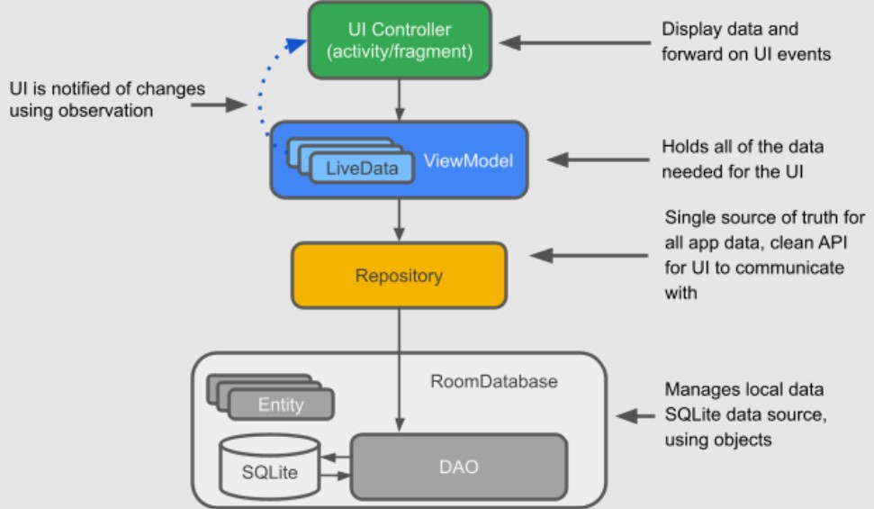
</div>

`LiveData`: A data holder class that can be observed. Always holds/caches the latest version of data, and notifies its observers when data has changed. LiveData is lifecycle aware. UI components just observe relevant data and don't stop or resume observation. LiveData automatically manages all of this since it's aware of the relevant lifecycle status changes while observing.

`ViewModel`: Acts as a communication center between the Repository (data) and the UI. The UI no longer needs to worry about the origin of the data. ViewModel instances survive Activity/Fragment recreation.

`Repository`: A class that you create that is primarily used to manage multiple data sources.

`Entity`: Annotated class that describes a database table when working with Room.

`Room database`: Simplifies database work and serves as an access point to the underlying SQLite database (hides SQLiteOpenHelper). The Room database uses the DAO to issue queries to the SQLite database.

`SQLite database`: On device storage. The Room persistence library creates and maintains this database for you.

`DAO`: Data access object. A mapping of SQL queries to functions. When you use a DAO, you call the methods, and Room takes care of the rest.


Example:

<div align="center">
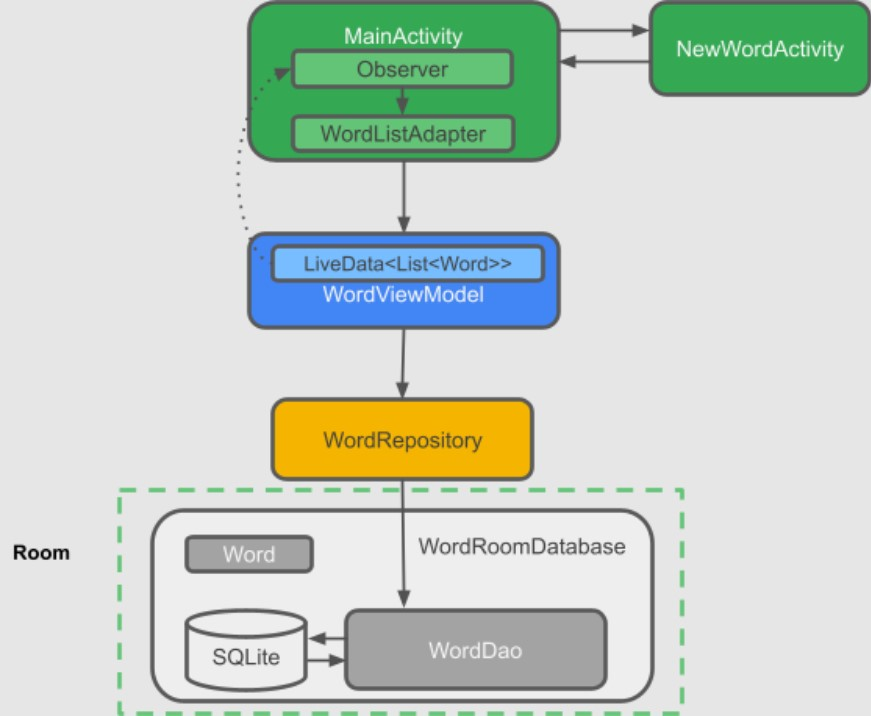
</div>

## MVVM Intro

<div align="center">
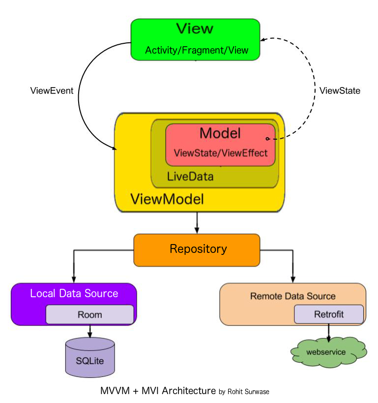
</div>

[source](https://proandroiddev.com/best-architecture-for-android-mvi-livedata-viewmodel-71a3a5ac7ee3)

`Model` - `View`  - `ViewModel`

- State persistence across configuration changes
- Separation of concerns
- Testability

- `Model` -> data and business logic
- `View` -> display layer, android specific logic activities, layouts etc
- `ViewModel` -> Connection between the other layers, Provides lifecycle management and data availability

<div align="center">
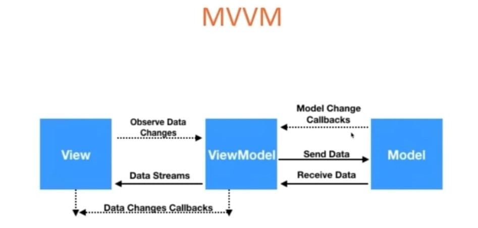
</div>

- `ViewModel` does not have a reference to a `View`
- `View` subscribes to streams of data
- `ViewModel` sends data streams to any and all subscribers (`Views`)
- `ViewModel` updates view when data changes
- `ViewModel` interacts with the `Model` to retrieve data
- `Model` keeps `ViewModel` updated

Broadly speaking:

- ViewModel interacts with the Model (API, database, etc) to get the necessary data and updating it if required.
- ViewModel exposes data streams of the state. Any component can subscribe to the stream and receive updates regarding the state. Here, a view component (activity, fragment, viewgroup, etc) will subscribe to the exposed data streams. On every update, the view component will render itself.
- When user takes a certain action (eg. save a note, etc), the view would ask the ViewModel to perform certain actions. The ViewModel would update the Model, create a new state and dispatch it to the data streams.
- View component would receive the update and render the updated state.

<div align="center">
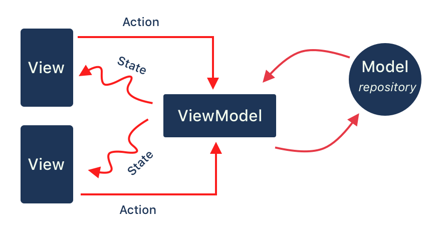
</div>

### MVVM vs MVP

- `MVP`:  Presenter references View.
- `MVVM`: ViewModel holds no references
- `View - Presenter`:   1 to 1 relationship
- `View - ViewModel`:  1 to many relationship

### ViewModel

The `ViewModel` class is designed to store and manage UI-related data in a lifecycle conscious way. The `ViewModel` class allows data to survive configuration changes such as screen rotations.

The Android framework manages the lifecycles of UI controllers, such as activities and fragments. The framework may decide to destroy or re-create a UI controller in response to certain user actions or device events that are completely out of your control.

If the system destroys or re-creates a UI controller, any transient UI-related data you store in them is lost. For example, your app may include a list of users in one of its activities. When the activity is re-created for a configuration change, the new activity has to re-fetch the list of users. For simple data, the activity can use the `onSaveInstanceState()` method and restore its data from the bundle in onCreate(), but this approach is only suitable for small amounts of data that can be serialized then deserialized, not for potentially large amounts of data like a list of users or bitmaps.

Another problem is that UI controllers frequently need to make asynchronous calls that may take some time to return. The UI controller needs to manage these calls and ensure the system cleans them up after it's destroyed to avoid potential memory leaks. This management requires a lot of maintenance, and in the case where the object is re-created for a configuration change, it's a waste of resources since the object may have to reissue calls it has already made.

UI controllers such as activities and fragments are primarily intended to display UI data, react to user actions, or handle operating system communication, such as permission requests. Requiring UI controllers to also be responsible for loading data from a database or network adds bloat to the class. Assigning excessive responsibility to UI controllers can result in a single class that tries to handle all of an app's work by itself, instead of delegating work to other classes. Assigning excessive responsibility to the UI controllers in this way also makes testing a lot harder.

It's easier and more efficient to separate out view data ownership from UI controller logic.

- Resolves Lifecycle / state problem
- Resolves Asynchronous calls problem
- ViewModel has a separate lifecycle
  - Outlives Activity and Fragment

<div align="center">
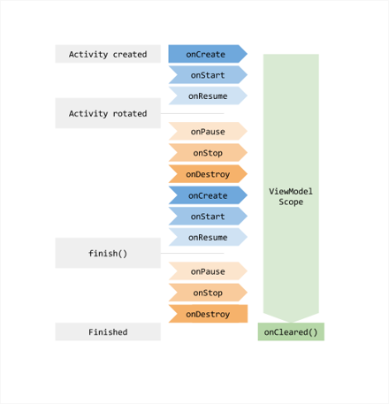
</div>

- `ViewModel` **holds no `View` references**
- `LiveData` - **observer pattern**
- `ViewModel` (typically) holds no `Android` related objects (Application, Context, Resources, etc)
- Multiple Views can attach to a ViewModel to solve **data sharing** between view element like fragments

For, Example:

```xml
    <TextView
        android:id="@+id/tvShow"/>
    <Button
        android:id="@+id/btnAdd"
        android:text="Add"/>
```

`MainActivity.kt`

```kotlin
class MainActivity : AppCompatActivity() {
    private lateinit var vb: ActivityMainBinding
    private var count = 0
    override fun onCreate(savedInstanceState: Bundle?) {
        super.onCreate(savedInstanceState)
        vb = ActivityMainBinding.inflate(layoutInflater)
        val view = vb.root
        setContentView(view)
        vb.tvShow.text = count.toString();
        vb.btnAdd.setOnClickListener {
            count++
            vb.tvShow.text = count.toString()
        }
    }
}
```

Now, If we try to rotate the device after incrementing, data do not survive upon screen rotations.

<div align="center">
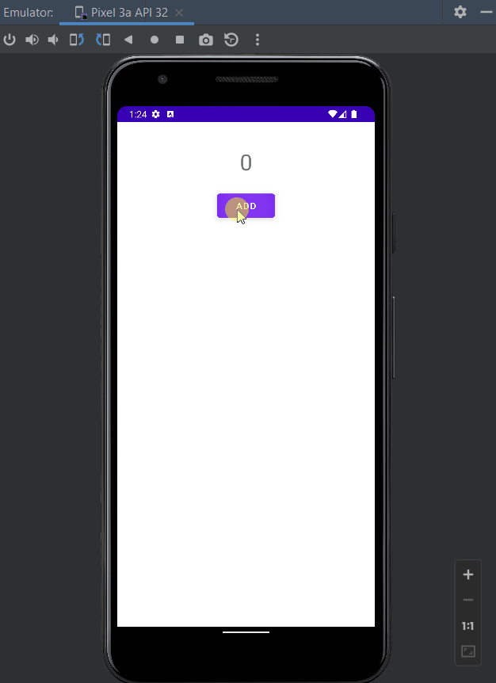
</div>

Architecture Components provides `ViewModel` helper class for the UI controller that is responsible for preparing data for the UI. `ViewModel` objects are automatically retained during configuration changes so that data they hold is immediately available to the next activity or fragment instance.

Add [ViewModel Dependency](https://developer.android.com/jetpack/androidx/releases/lifecycle)

```gradle
    def lifecycle_version = "2.5.0-alpha03"
    // ViewModel
    implementation "androidx.lifecycle:lifecycle-viewmodel-ktx:$lifecycle_version"
```

Define a ViewModel:

```kotlin
import androidx.lifecycle.ViewModel

class MainActivityViewModel : ViewModel() {
    var count = 0
    fun getUpdatedCounter(): Int {
        return ++count
    }
}
```

We can then access the value from an activity as follows:

```kotlin
class MainActivity : AppCompatActivity() {
    private lateinit var vb: ActivityMainBinding

    //    private var count = 0
    private lateinit var viewModel: MainActivityViewModel
    override fun onCreate(savedInstanceState: Bundle?) {
        super.onCreate(savedInstanceState)
        vb = ActivityMainBinding.inflate(layoutInflater)
        val view = vb.root
        setContentView(view)
        /**Associate the UI Controller and ViewModel*/
        viewModel = ViewModelProvider(this).get(MainActivityViewModel::class.java);

        /**Use the ViewModel in your UI Controller*/
        //vb.tvShow.text = count.toString();
        vb.tvShow.text = viewModel.count.toString();
        vb.btnAdd.setOnClickListener {
            /**Use the ViewModel in your UI Controller*/
            //count++
            //vb.tvShow.text = count.toString()
            vb.tvShow.text = viewModel.getUpdatedCounter().toString()
        }
    }
}
```

<div align="center">
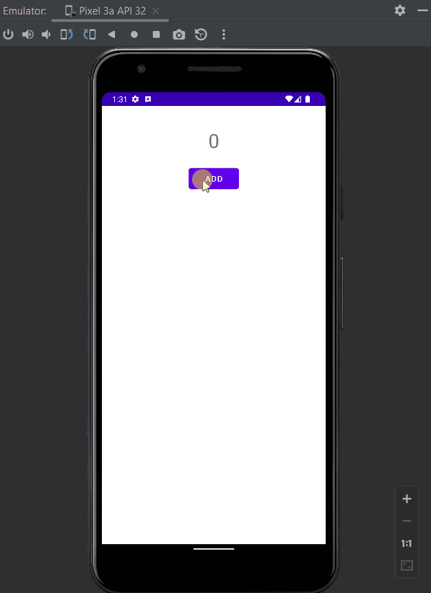
</div>

#### Instantiation using Factory Methods

```kotlin
class MainActivityViewModel(initial: Int) : ViewModel() {
    var count:Int = 0

    init {
       count = initial
    }
    fun getUpdatedCounter(): Int {
        return ++count
    }
    class Factory(private val initial: Int) : ViewModelProvider.Factory {
        override fun <T : ViewModel> create(modelClass: Class<T>): T {
            return MainActivityViewModel(initial) as T
        }
    }
}
```

Error:

>> Inheritance from an interface with '@JvmDefault' members is only allowed with -Xjvm-default option

Resolving Error:

```gradle
android {
    kotlinOptions {
        jvmTarget = '1.8'
        freeCompilerArgs += [
                '-Xjvm-default=enable'
        ]
    }
}
```

Factory Implementation:

```kotlin
class MainActivity : AppCompatActivity() {
    private lateinit var vb: ActivityMainBinding
    private lateinit var viewModel: MainActivityViewModel
    override fun onCreate(savedInstanceState: Bundle?) {
        super.onCreate(savedInstanceState)
        vb = ActivityMainBinding.inflate(layoutInflater)
        val view = vb.root
        setContentView(view)
        /**Associate the UI Controller and ViewModel*/
        // Data source :- repository :- model
        val dataRepo = 10
        // Factory:
        val factory = MainActivityViewModel.Factory(dataRepo)
        // ViewModel initialization:
        viewModel = ViewModelProvider(this, factory).get(MainActivityViewModel::class.java)
//      viewModel = ViewModelProvider(this).get(MainActivityViewModel::class.java);

        /**Use the ViewModel in your UI Controller*/
        vb.tvShow.text = viewModel.count.toString();
        vb.btnAdd.setOnClickListener {
            vb.tvShow.text = viewModel.getUpdatedCounter().toString()
        }
    }
}
```

### `LiveData`

<div align="center">
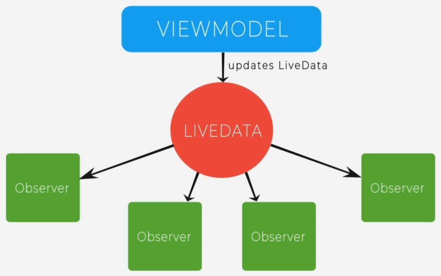
</div>

- **LiveData ensures your UI matches data state**
  - Live Data follows the `observer pattern` -  a one to many dependency between objects so that one object changes state, all of its dependents are notified and updated automatically.
- **No memory leaks**
  - Observers are bound to Lifecycle objects
  - Lifecycle objects are cleaned up after their associated lifecycle is destroyed
- **No crashes due to stopped activities**
  - If the observer's lifecycle is inactive, such as in the case of an activity in the back stack, then it
    doesn't receive any Live Data events
- **No more manual lifecycle handling**
  - Ul components just observe relevant data and don't stop or resume observation.
  - Live Data automatically manages all of this since it's aware of the relevant lifecycle status changes while observing.
- **Data is always up to date**
  - What happens if a lifecycle becomes inactive?
  - It would receive the latest data upon becoming active again.
- **Proper configuration changes**
  - On configuration changes, like device rotation, immediately latest available data is received.
  - Prevents redundant requests to network or db

Flow of LiveData:

<div align="center">
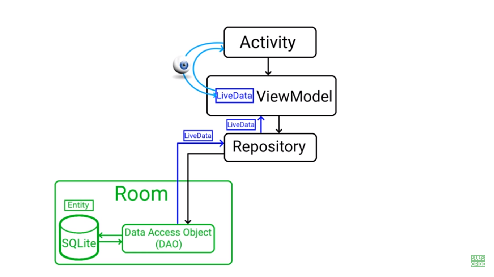
</div>

<div align="center">
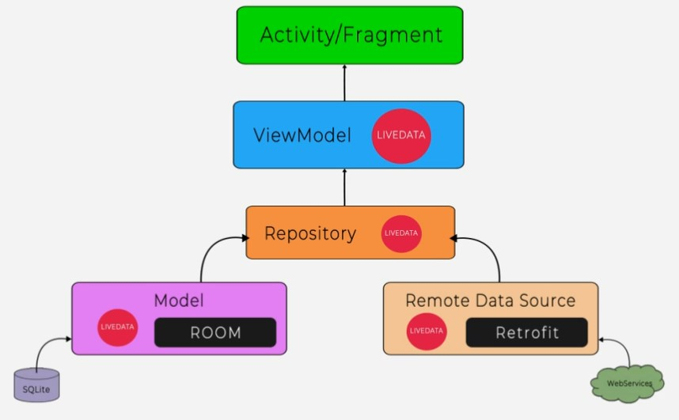
</div>

Dependencies:

```gradle
// LiveData
    implementation "androidx.lifecycle:lifecycle-livedata-ktx:$lifecycle_version"
```

Incorporate LiveData into the ViewModel:


```kotlin
class MainActivityViewModel(initial: Int) : ViewModel() {
    //    var count:Int = 0
    private val count = MutableLiveData<Int>()

    //    init {count = initial }
    init {
        count.value = initial
    }

    fun getCountValue(): LiveData<Int> = count
//    fun getUpdatedCounter(): Int {
//        return ++count
//    }

    fun updateCounter() {
        count.value = (count.value!! + 1)
    }

    class Factory(private val initial: Int) : ViewModelProvider.Factory {
        override fun <T : ViewModel> create(modelClass: Class<T>): T {
            return MainActivityViewModel(initial) as T
        }
    }
}
```

Subscribe to LiveData:

```kotlin
class MainActivity : AppCompatActivity() {
    private lateinit var vb: ActivityMainBinding
    private lateinit var viewModel: MainActivityViewModel

    override fun onCreate(savedInstanceState: Bundle?) {
        super.onCreate(savedInstanceState)
        vb = ActivityMainBinding.inflate(layoutInflater)
        val view = vb.root
        setContentView(view)
        /**Associate the UI Controller and ViewModel*/
        val dataRepo = 10 // Data source
        val factory = MainActivityViewModel.Factory(dataRepo) // Factory
        viewModel =
            ViewModelProvider(this, factory).get(MainActivityViewModel::class.java) // ViewModel

        /**Use the ViewModel in your UI Controller*/
        //vb.tvShow.text = count.toString();
//        vb.tvShow.text = viewModel.count.toString();
//        vb.btnAdd.setOnClickListener {
//            /**Use the ViewModel in your UI Controller*/
//            //count++
//            //vb.tvShow.text = count.toString()
//            vb.tvShow.text = viewModel.getUpdatedCounter().toString()
//        }

        // Observe the LiveData, passing in this activity as the LifecycleOwner and the observer.
        viewModel.getCountValue().observe(this) { count ->
            vb.tvShow.text = count.toString()
        }
        // Update live data
        vb.btnAdd.setOnClickListener {
            viewModel.updateCounter()
        }
    }
}
```

2 ways to update value Live date value:

- From the Main thread

```kotlin
loadingStateLiveData.value = LoadingState.LOADING
loadingStateLiveData.setValue(LoadingState.LOADING)
```

- From a background thread

```kotlin
loadingStateLiveData.postValue(LoadingState.LOADED)
```

#### Advanced LiveData

##### transformations

Transform a value of a LiveData

.map


```kotlin
val orderLiveData: LiveData<Order>
val orderName: LiveData<String> = Transformations.map(orderLiveData) {order -> order.name}
```

.switchMap


```kotlin
fun getOrders(query: String): LiveData<List<Order>> { ... }
val ordersLiveData = Transformations.switchMap(queryLiveData) {query -> getOrders(query)}
```

##### mediators

- Merge multiple data sources
- Any update in sources triggers the observers

```kotlin
val ordersData = MediatorLiveData<List<Order>>()
ordersData.addSource(_allOrdersLiveData) {ordersData.value = it}
ordersData.addSource(_searchOrdersLiveData) {ordersData.value = it}
```

## MVVM with Room example

```groovy
apply plugin: "kotlin-kapt"

dependencies {
    def lifecycle_version = "2.5.0-alpha03"
    // ViewModel
    implementation "androidx.lifecycle:lifecycle-viewmodel-ktx:$lifecycle_version"
    // LiveData
    implementation "androidx.lifecycle:lifecycle-livedata-ktx:$lifecycle_version"
    // Room
    def room_version = "2.4.2"
    implementation "androidx.room:room-runtime:$room_version"
    kapt "androidx.room:room-compiler:$room_version"
    // Kotlin Extensions and Coroutines support for Room
    implementation "androidx.room:room-ktx:$room_version"
    //coroutines
    implementation "org.jetbrains.kotlinx:kotlinx-coroutines-core:1.6.0"
    //// Coroutines(includes kotlin flow)
    implementation 'org.jetbrains.kotlinx:kotlinx-coroutines-android:1.3.9'

}
```

### Room

#### Room Entity class


```kotlin
import androidx.room.ColumnInfo
import androidx.room.Entity
import androidx.room.PrimaryKey
@Entity(tableName = "subscriber_data_table")
data class Subscriber(
    @ColumnInfo(name = "subscriber_name")
    var name: String,

    @ColumnInfo(name = "subscriber_email")
    var email: String,

    @PrimaryKey(autoGenerate = true)
    @ColumnInfo(name = "subscriber_id")
    var id: Int? = null,
)
```

#### DAO Interface

Room allows us to receive the data query as a list, live data or flow. Therefore, we could have written the return types as `List<Subscriber>`  , `LiveData<List<Subscriber>>` or `Flow<List<Subscriber>>`.

```kotlin
@Dao
interface SubscriberDAO {
    @Insert
    suspend fun insertSubscriber(subscriber: Subscriber) : Long

    @Update
    suspend fun updateSubscriber(subscriber: Subscriber) : Int

    @Delete
    suspend fun deleteSubscriber(subscriber: Subscriber) : Int

    @Query("DELETE FROM subscriber_data_table")
    suspend fun deleteAll() : Int

    @Query("SELECT * FROM subscriber_data_table")
    fun getAllSubscribers():Flow<List<Subscriber>>
}
```

##### Why use Flow instead of LiveData?

However, considering MVVM architecture, getting data as a Flow is the best practice. We can easily convert the Flow into LiveData inside the ViewModel. **Since LiveData needs a lifecycle, using LiveData inside repository or below classes can cause unexpected errors**.

#### RoomDatabase Class

```kotlin
import android.content.Context
import androidx.room.Database
import androidx.room.Room
import androidx.room.RoomDatabase

@Database(entities = [Subscriber::class], version = 1)
abstract class SubscriberDatabase : RoomDatabase() {
    abstract val subscriberDAO: SubscriberDAO

    companion object {
        @Volatile
        private var INSTANCE: SubscriberDatabase? = null
        fun getInstance(context: Context): SubscriberDatabase {
            synchronized(this) {
                var instance = INSTANCE
                if (instance == null) {
                    instance = Room.databaseBuilder(
                        context.applicationContext,
                        SubscriberDatabase::class.java,
                        "subscriber_data_database"
                    ).build()
                }
                return instance
            }
        }
    }
}
```

#### Repository Class in Android MVVM

```kotlin
import android.content.Context
import kotlinx.coroutines.flow.Flow


class SubscriberRepository(context: Context) {
    private val dao: SubscriberDAO = SubscriberDatabase.getInstance(context).subscriberDAO

//    val subscribers = dao.getAllSubscribers()
//    fun getAllSubscriber(): LiveData<List<Subscriber>> {
//        return dao.getAllSubscribers()
//    }
    fun getAllSubscriber(): Flow<List<Subscriber>> {
        return dao.getAllSubscribers()
    }

    suspend fun insert(subscriber: Subscriber): Long {
        return dao.insertSubscriber(subscriber)
    }

    suspend fun update(subscriber: Subscriber): Int {
        return dao.updateSubscriber(subscriber)
    }

    suspend fun delete(subscriber: Subscriber): Int {
        return dao.deleteSubscriber(subscriber)
    }

    suspend fun deleteAll(): Int {
        return dao.deleteAll()
    }
}
```

### ViewModel Class v1

```kotlin
import androidx.lifecycle.*
import kotlinx.coroutines.launch

class SubscriberViewModel(private val repository: SubscriberRepository) : ViewModel() {

    val inputName = MutableLiveData<String>()
    val inputEmail = MutableLiveData<String>()
    val saveOrUpdateButtonText = MutableLiveData<String>()
    val clearAllOrDeleteButtonText = MutableLiveData<String>()

    private var isSave = true
    private lateinit var subscriberToSaveOrUpdate: Subscriber

    init {
        saveOrUpdateButtonText.value = "Save"
        clearAllOrDeleteButtonText.value = "Clear All"
    }


    fun saveOrUpdate(name: String, email: String) {
        if (isSave) {
            insert(Subscriber(name, email))
            inputName.value = ""
            inputEmail.value = ""
        } else {
            update(subscriberToSaveOrUpdate)
        }
    }

    fun deleteOrClearAll(subscriber: Subscriber? = null) {
        if (isSave) {
            clearAll()
        } else {
            subscriber?.let {
                delete(it)
            }
        }
    }


    private fun update(subscriber: Subscriber) {
        viewModelScope.launch {
            repository.update(subscriber)
        }
    }

    private fun insert(subscriber: Subscriber) {
        viewModelScope.launch {
            repository.insert(subscriber)
        }
    }

    private fun clearAll() {
        viewModelScope.launch {
            repository.deleteAll()
        }
    }

    private fun delete(subscriber: Subscriber) {
        viewModelScope.launch {
            repository.delete(subscriber)
        }
    }

//Using liveData
//    fun getSavedSubscribers(): LiveData<List<Subscriber>> = repository.getAllSubscriber()
//  Flow -> then convert to liveData
    fun getSavedSubscribers() = liveData {
        repository.getAllSubscriber().collect {
            emit(it)
        }
    }

    class Factory(
        private val repository: SubscriberRepository
    ) : ViewModelProvider.Factory {
        override fun <T : ViewModel> create(modelClass: Class<T>): T {
            if (modelClass.isAssignableFrom(SubscriberViewModel::class.java)) {
                return SubscriberViewModel(repository) as T
            }
            throw IllegalArgumentException("Unknown View Model class")
        }
    }
}
```

### activity_main.xml v1

```xml
<ConstraintLayout>
    <EditText
        android:id="@+id/etName"
        android:hint="Name"/>
    <EditText
        android:id="@+id/etEmail"
        android:hint="Email"/>
    <Button
        android:id="@+id/btn_save_or_update"
        android:text="BTN"/>
    <Button
        android:id="@+id/btn_clearAll_delete"
        android:text="BTN2"/>
</ConstraintLayout>
```

<div align="center">
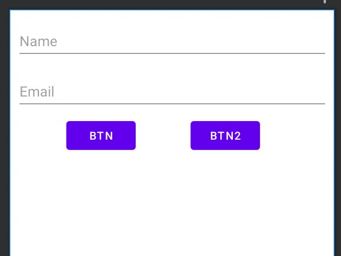
</div>

### Main Activity v1

```kotlin
class MainActivity : AppCompatActivity() {
    private lateinit var vb: ActivityMainBinding

    //    private var count = 0
    private lateinit var viewModel: SubscriberViewModel
    override fun onCreate(savedInstanceState: Bundle?) {
        super.onCreate(savedInstanceState)
        vb = ActivityMainBinding.inflate(layoutInflater)
        val view = vb.root
        setContentView(view)
        val repository = SubscriberRepository(applicationContext)
        val factory = SubscriberViewModel.Factory(repository)
        viewModel = ViewModelProvider(this, factory).get(SubscriberViewModel::class.java)

        observeInputText()
        observeButtonText()
        vb.btnSaveOrUpdate.setOnClickListener {
            val currentName = vb.etName.text.toString()
            val currentEmail = vb.etEmail.text.toString()
            viewModel.saveOrUpdate(currentName, currentEmail)
        }
        vb.btnClearAllDelete.setOnClickListener {
            viewModel.deleteOrClearAll()
        }
        viewModel.getSavedSubscribers().observe(this) {
            Log.d("MVVM", it.toString())
        }
    }

    private fun observeButtonText() {
        viewModel.saveOrUpdateButtonText.observe(this) {
            vb.btnSaveOrUpdate.text = it
        }
        viewModel.clearAllOrDeleteButtonText.observe(this) {
            vb.btnClearAllDelete.text = it
        }
    }

    private fun observeInputText() {
        viewModel.inputName.observe(this) {
            vb.etName.setText(it)
        }
        viewModel.inputEmail.observe(this) {
            vb.etEmail.setText(it)
        }
    }
}
```

### Result: v1

<div align="center">
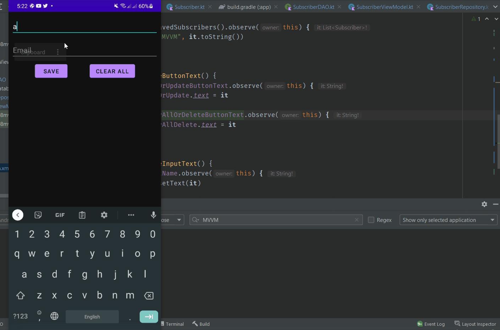
</div>