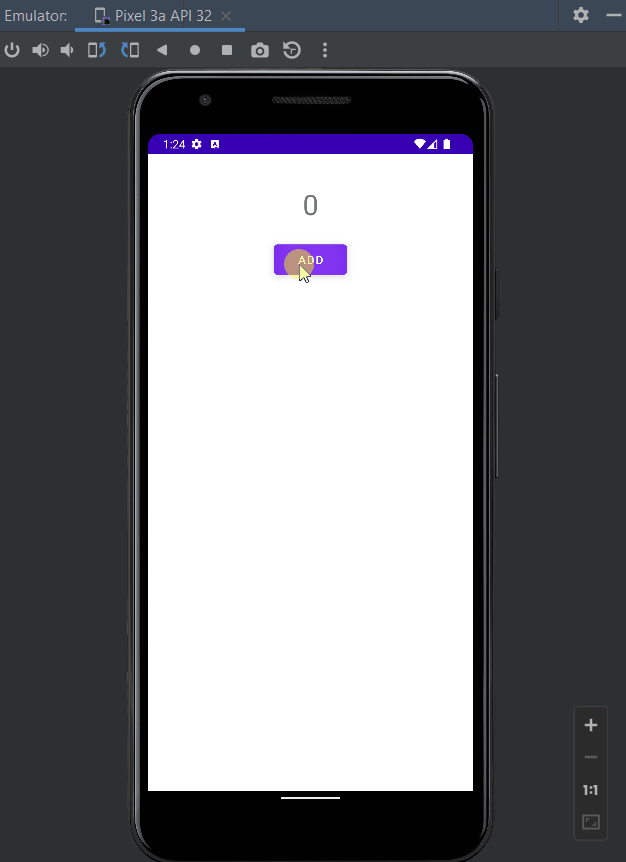
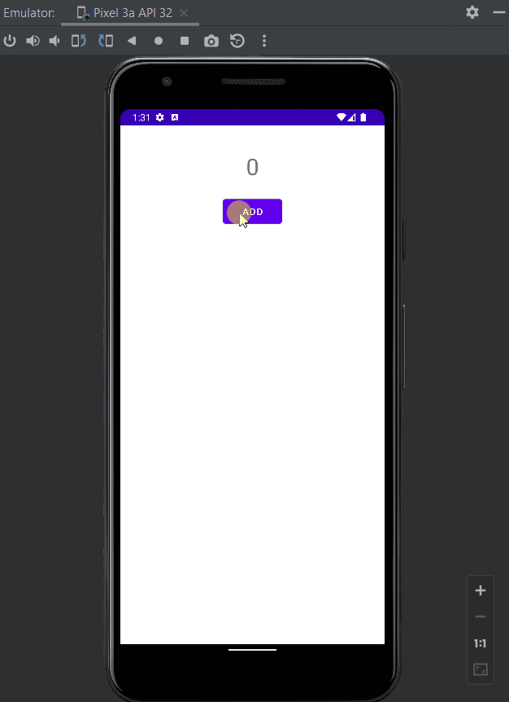

# MVVP

## ViewModel

The `ViewModel` class is designed to store and manage UI-related data in a lifecycle conscious way. The `ViewModel` class allows data to survive configuration changes such as screen rotations.

The Android framework manages the lifecycles of UI controllers, such as activities and fragments. The framework may decide to destroy or re-create a UI controller in response to certain user actions or device events that are completely out of your control.

If the system destroys or re-creates a UI controller, any transient UI-related data you store in them is lost. For example, your app may include a list of users in one of its activities. When the activity is re-created for a configuration change, the new activity has to re-fetch the list of users. For simple data, the activity can use the `onSaveInstanceState()` method and restore its data from the bundle in onCreate(), but this approach is only suitable for small amounts of data that can be serialized then deserialized, not for potentially large amounts of data like a list of users or bitmaps.

Another problem is that UI controllers frequently need to make asynchronous calls that may take some time to return. The UI controller needs to manage these calls and ensure the system cleans them up after it's destroyed to avoid potential memory leaks. This management requires a lot of maintenance, and in the case where the object is re-created for a configuration change, it's a waste of resources since the object may have to reissue calls it has already made.

UI controllers such as activities and fragments are primarily intended to display UI data, react to user actions, or handle operating system communication, such as permission requests. Requiring UI controllers to also be responsible for loading data from a database or network adds bloat to the class. Assigning excessive responsibility to UI controllers can result in a single class that tries to handle all of an app's work by itself, instead of delegating work to other classes. Assigning excessive responsibility to the UI controllers in this way also makes testing a lot harder.

It's easier and more efficient to separate out view data ownership from UI controller logic.

For, Example:

```xml
    <TextView
        android:id="@+id/tvShow"/>
    <Button
        android:id="@+id/btnAdd"
        android:text="Add"/>
```

`MainActivity.kt`

```kotlin
class MainActivity : AppCompatActivity() {
    private lateinit var vb: ActivityMainBinding
    private var count = 0
    override fun onCreate(savedInstanceState: Bundle?) {
        super.onCreate(savedInstanceState)
        vb = ActivityMainBinding.inflate(layoutInflater)
        val view = vb.root
        setContentView(view)
        vb.tvShow.text = count.toString();
        vb.btnAdd.setOnClickListener {
            count++
            vb.tvShow.text = count.toString()
        }
    }
}
```

Now, If we try to rotate the device after incrementing, data do not survive upon screen rotations.

<div align="center">

</div>

Architecture Components provides `ViewModel` helper class for the UI controller that is responsible for preparing data for the UI. `ViewModel` objects are automatically retained during configuration changes so that data they hold is immediately available to the next activity or fragment instance.

Add [ViewModel Dependency](https://developer.android.com/jetpack/androidx/releases/lifecycle)

```gradle
    def lifecycle_version = "2.5.0-alpha03"
    // ViewModel
    implementation "androidx.lifecycle:lifecycle-viewmodel-ktx:$lifecycle_version"
```

Define a ViewModel:

```kotlin
import androidx.lifecycle.ViewModel

class Model {
    var count = 0

    fun getUpdatedCounter(): Int {
        return ++count
    }
}

class MainActivityViewModel : ViewModel() {
    private var model: Model = Model()
    fun getCurrentCount(): Int {
        return model.count
    }

    fun getUpdatedCounter(): Int {
        return model.getUpdatedCounter()
    }
}
```

We can then access the value from an activity as follows:

```kotlin
class MainActivity : AppCompatActivity() {
    private lateinit var vb: ActivityMainBinding

    //    private var count = 0
    private lateinit var viewModel: MainActivityViewModel
    override fun onCreate(savedInstanceState: Bundle?) {
        super.onCreate(savedInstanceState)
        vb = ActivityMainBinding.inflate(layoutInflater)
        val view = vb.root
        setContentView(view)
        /**Associate the UI Controller and ViewModel*/
        viewModel = ViewModelProvider(this).get(MainActivityViewModel::class.java);

        /**Use the ViewModel in your UI Controller*/
        //vb.tvShow.text = count.toString();
        vb.tvShow.text = viewModel.getCurrentCount().toString();
        vb.btnAdd.setOnClickListener {
            /**Use the ViewModel in your UI Controller*/
            //count++
            //vb.tvShow.text = count.toString()
            vb.tvShow.text = viewModel.getUpdatedCounter().toString()
        }
    }
}
```

<div align="center">

</div>
