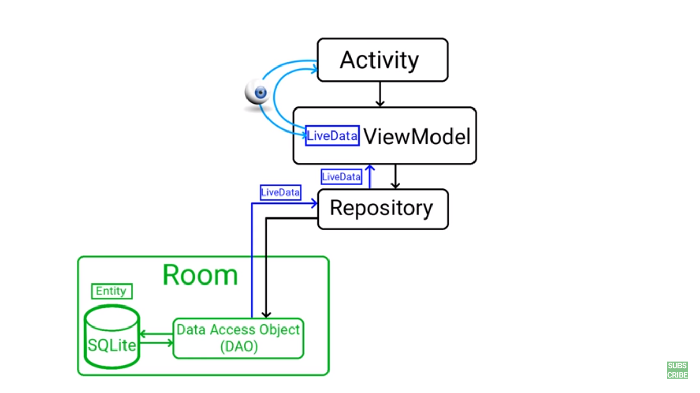
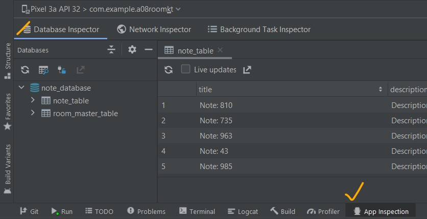

# Room Database

- [Room Database](#room-database)
  - [Dependencies](#dependencies)
  - [Components of Room](#components-of-room)
    - [1. Entity](#1-entity)
      - [Entities annotations](#entities-annotations)
    - [2. Dao](#2-dao)
    - [3. Database](#3-database)
    - [4. Repository](#4-repository)
    - [5. CoroutineScope and CRUD](#5-coroutinescope-and-crud)
    - [6. Database Inspector](#6-database-inspector)

## Dependencies

we must configure the Room Database’s dependencies as shown below:

For kotlin, apply `kapt` plugin at the top of the `build.gradle` dependency file:

```gradle
apply plugin: "kotlin-kapt"

dependencies {
    def room_version = "2.4.2"
    implementation "androidx.room:room-runtime:$room_version"
    kapt "androidx.room:room-compiler:$room_version"
    // Kotlin Extensions and Coroutines support for Room
    implementation "androidx.room:room-ktx:$room_version"
}
```

[from here](https://developer.android.com/training/data-storage/room#groovy)

Create the entity that will be our data class in Room Database, for example, Course.

## Components of Room

The three main components of the room are Entity, Database, and DAO.

- `Entity`: Entity is a modal class that is annotated with `@Entity`. This class is having variables that will be our columns and the class is our table.
- `Database`: It is an `abstract` class where we will be storing all our database entries which we can call Entities.
- `DAO`: The full form of `DAO` is a `Database Access Object` which is an `interface` class with the help of it we can perform different operations in our database.

<div align="center">

</div>

### 1. Entity

Represents a table within the database. `Room` creates a table for each class that has `@Entity` annotation, the fields in the class correspond to columns in the table. Therefore, the entity classes tend to be small model classes that don’t contain any logic.

#### Entities annotations

Before we get started with modeling our entities, we need to know some useful annotations and their attributes.

- `@Entity` — every model class with this annotation will have a mapping table in DB
    - `foreignKeys` — names of foreign keys
    - `indices` — list of indicates on the table
    - `primaryKeys` — names of entity primary keys
tableName
- `@PrimaryKey` — as its name indicates, this annotation points the primary key of the entity. autoGenerate — if set to true, then SQLite will be generating a unique id for the column
- `@PrimaryKey(autoGenerate = true)`
- `@ColumnInfo` — allows specifying custom information about column
- `@ColumnInfo(name = “column_name”)`
- `@Ignore` — field will not be persisted by Room
- `@Embeded` — nested fields can be referenced directly in the SQL queries.


```kotlin
import androidx.room.Entity
import androidx.room.PrimaryKey
@Entity(tableName = "note_table")
data class Note(
    val title: String,
    val description: String,
    val priority: Int,
    @PrimaryKey(autoGenerate = true) val id: Int? = null
)
```

### 2. Dao

The full form of `DAO` is a `Database Access Object` which is an `interface` class with the help of it we can perform different operations in our database.


```kotlin
import androidx.room.*
@Dao
interface NoteDao {

    @Insert
    suspend fun insert(note: Note)

    @Update
    suspend fun update(note: Note)

    @Delete
    suspend fun delete(note: Note)

    @Query("delete from note_table")
    suspend fun deleteAllNotes()

    @Query("select * from note_table order by priority desc")
    suspend fun getAllNotes(): List<Note>
}
```

### 3. Database

Contains the database holder and serves as the main access point for the underlying connection to your app’s persisted, relational data.

To create a database we need to define an abstract class that extends `RoomDatabase`. This class is annotated with `@Database`, lists the entities contained in the database, and the `DAOs` which access them.

```kotlin
@Database(entities = [Note::class], version = 1)
abstract class NoteDatabase : RoomDatabase() {
    abstract fun noteDao(): NoteDao
    companion object {
        private var instance: NoteDatabase? = null
        @Synchronized
        fun getInstance(ctx: Context): NoteDatabase {
            if (instance == null)
                instance = Room.databaseBuilder(
                    ctx.applicationContext,
                    NoteDatabase::class.java,
                    "note_database"
                )
                    //.allowMainThreadQueries() // run on main thread
                    .fallbackToDestructiveMigration()
                    .build()
            return instance!!
        }
    }
}
```

### 4. Repository

Repository is a class that is responsible for fetching data from the database and updating it.

```kotlin
class NoteRepository(context: Context) {
    private val db = NoteDatabase.getInstance(context).noteDao()

    suspend fun insertNote(note: Note) {
        db.insert(note)
    }
    suspend fun getNotes(): List<Note> {
        return db.getAllNotes()
    }
    suspend fun clearNotes(){
        db.deleteAllNotes()
    }
    suspend fun deleteNote(note: Note){
        db.delete(note)
    }
}
```

### 5. CoroutineScope and CRUD

CoroutineScope defines a new scope for coroutines. This means that context elements and cancellations are propagated automatically to the child coroutines running within. Various types of scopes can be used when considering the design of your application. Scopes usually bind internally to a Job to ensure structured concurrency.

Since coroutine builder functions are extensions on CoroutineScope, starting a coroutine is as simple as calling launch and async among other builder methods right inside the Coroutine-Scoped class.

A few scope types:

- `GlobalScope`: A scope bound to the application. Use this when the component running doesn’t get destroyed easily. For example, in Android using this scope from the application class should be OK. Using it from an activity, however, is not recommended. Imagine you launch a coroutine from the global scope. The activity is destroyed, but the request is not finished beforehand. This may cause either a crash or memory leak within your app.
- `ViewModel Scope`: A scope bound to a view model. Use this when including the architecture components ktx library. This scope binds coroutines to the view model. When it is destroyed, the coroutines running within the ViewModel’s context will be cancelled automatically.
- `Custom Scope`: A scope bound to an object extending Coroutine scope. When you extend CoroutineScope from your object and tie it to an associated Job, you can manage the coroutines running within this scope. For example, you call job = Job() from your activity’s onCreate and job.cancel() from onDestroy() to cancel any coroutines running within this component’s custom scope.


```kotlin
class MainActivity : AppCompatActivity() {
    private lateinit var vb: ActivityMainBinding
    override fun onCreate(savedInstanceState: Bundle?) {
        super.onCreate(savedInstanceState)
        vb = ActivityMainBinding.inflate(layoutInflater)
        val view = vb.root
        setContentView(view)

        val repository = NoteRepository(applicationContext)
        CoroutineScope(Dispatchers.IO).launch {
//            //insert
            for (i in 0..5) {
                repository.insertNote(
                    Note(
                        "Note: ${Random.nextInt(1000)}",
                        "Description",
                        priority = Random.nextInt(5)
                    )
                )
            }

            //read
            withContext(Dispatchers.Main) {
                for (i in NoteRepository(applicationContext).getNotes()) {
                    Log.d("LOG_DB", i.title)
                }
            }
//            repository.clearNotes()

        }
    }

}
```

### 6. Database Inspector


<div align="center">

</div>