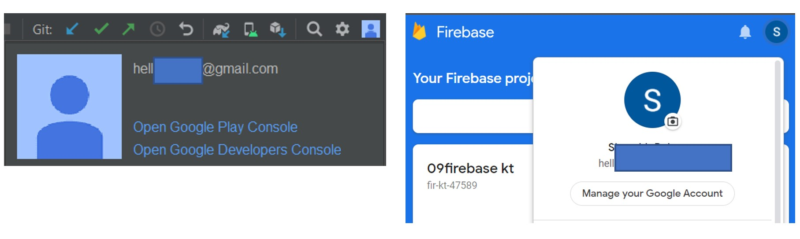
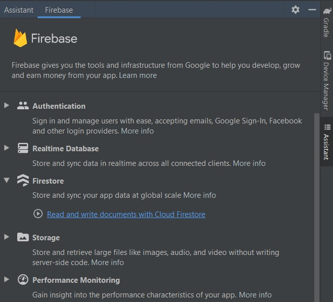
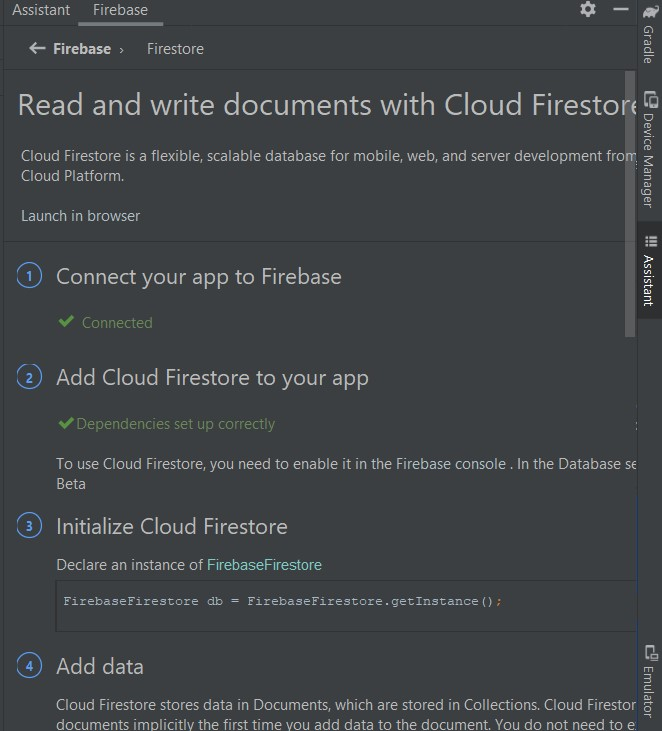
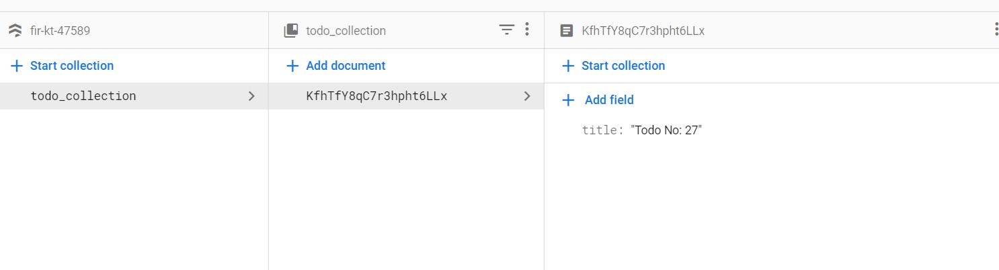
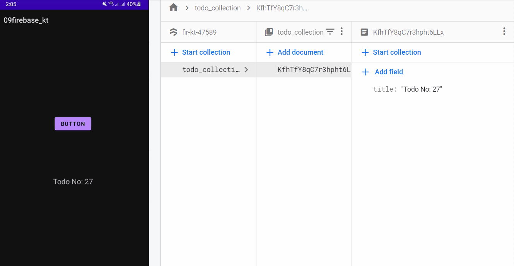
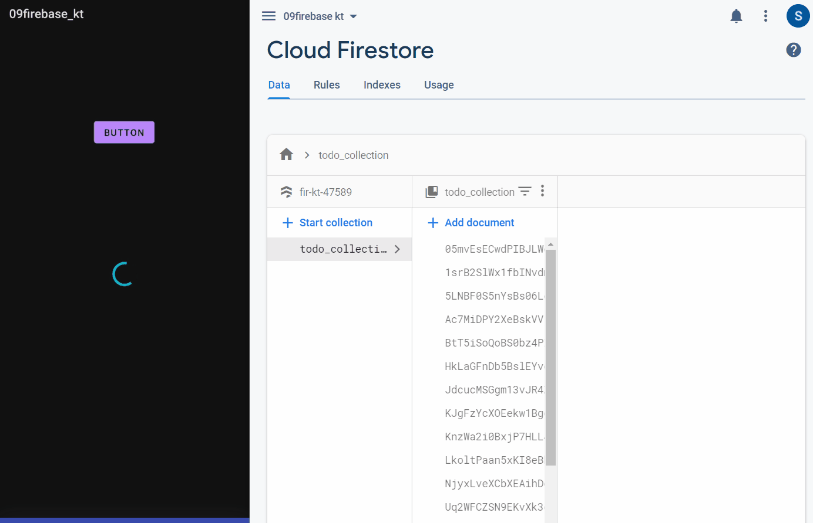

# Firebase, Cloud FireStore

- [Firebase, Cloud FireStore](#firebase-cloud-firestore)
  - [Add Firebase using the Firebase Assistant](#add-firebase-using-the-firebase-assistant)
    - [Kotlin + KTX](#kotlin--ktx)
    - [final](#final)
  - [Simple Read and Write with FireStore](#simple-read-and-write-with-firestore)
  - [MVVM & Kotlin Flow](#mvvm--kotlin-flow)
    - [Doc](#doc)
    - [Data Class](#data-class)
    - [Repository using Kotlin Flow](#repository-using-kotlin-flow)
    - [ViewModel](#viewmodel)
    - [Activity](#activity)
    - [UI State Events](#ui-state-events)
      - [Event Class](#event-class)
      - [Updated Repository](#updated-repository)
      - [Updated ViewModel](#updated-viewmodel)
      - [Updated Activity](#updated-activity)
      - [Final Result](#final-result)
  - [FirestoreCleanArchitecture 🚀](#firestorecleanarchitecture-)
    - [Model](#model)
    - [State](#state)
    - [HiltAndroidApp](#hiltandroidapp)
    - [AppModule](#appmodule)
    - [Repository](#repository)
    - [HiltViewModel](#hiltviewmodel)
    - [MainActivity](#mainactivity)

## Add Firebase using the Firebase Assistant

!!Must be connected to Firebase and Android Studio from the same account!!

<div align="center">

</div>

- Connect to FireStore from Android Studio: `Tools > Firebase > Cloud FireStore > Connect to FireStore`

<div align="center">

</div>

- Wait for Browser Launch: Click `"Add Project"` to create a new project.
- Add dependencies:(Replace Later with KTX)


<div align="center">

</div>

- [https://firebase.google.com/docs/android/setup](https://firebase.google.com/docs/android/setup)

### Kotlin + KTX

You can use the alternative Kotlin extensions (KTX) libraries which enable you to write beautiful and idiomatic Kotlin code.

- replace `implementation 'com.google.firebase:firebase-firestore`  with  `implementation 'com.google.firebase:firebase-firestore-ktx'`

- [https://firebase.google.com/docs/android/setup#kotlin+ktx_2](https://firebase.google.com/docs/android/setup#kotlin+ktx_2)

- [https://github.com/firebase/firebase-android-sdk/blob/master/docs/ktx/firestore.md](https://github.com/firebase/firebase-android-sdk/blob/master/docs/ktx/firestore.md)

### final

```kotlin
    def lifecycle_version = "2.5.0-alpha03"
    // ViewModel
    implementation "androidx.lifecycle:lifecycle-viewmodel-ktx:$lifecycle_version"
    // LiveData
    implementation "androidx.lifecycle:lifecycle-livedata-ktx:$lifecycle_version"
    // Lifecycles only (without ViewModel or LiveData)
    implementation "androidx.lifecycle:lifecycle-runtime-ktx:$lifecycle_version"
    implementation "com.google.firebase:firebase-firestore-ktx:24.1.0"
    //coroutines
    implementation "org.jetbrains.kotlinx:kotlinx-coroutines-core:1.6.0"
    implementation 'org.jetbrains.kotlinx:kotlinx-coroutines-android:1.3.9'
    // This is required to support coroutine calls like await() for firebase objects.
    implementation 'org.jetbrains.kotlinx:kotlinx-coroutines-play-services:1.1.1'
```

## Simple Read and Write with FireStore

- [https://cloud.google.com/firestore/docs/how-to](https://cloud.google.com/firestore/docs/how-to)

<div align="center">

</div>

<div align="center">

</div>

```kotlin
import com.google.firebase.firestore.DocumentId
import com.google.firebase.firestore.FirebaseFirestore

data class Todo(
    var title: String? = "",
    @DocumentId var todoId: String? = "",
)

class MainActivity : AppCompatActivity() {
    private lateinit var vb: ActivityMainBinding
    private lateinit var viewModel: FireStoreViewModel
    private val fireStoreInstance = FirebaseFirestore.getInstance().collection("todo_collection")

    override fun onCreate(savedInstanceState: Bundle?) {
        super.onCreate(savedInstanceState)
        vb = ActivityMainBinding.inflate(layoutInflater)
        val view = vb.root
        setContentView(view)

        readRealtime {
            var value = "";
            it.forEach { todo: Todo -> value += "\n${todo.title}" }
            Log.d("FireStore", value)
            vb.textView.text = value
        }

        vb.button.setOnClickListener {
            add()
        }

    }

    private fun add() {
        fireStoreInstance.add(Todo("Todo No: ${Random.nextInt(5, 100)}"))
    }

    private fun readRealtime(cb: (List<Todo>) -> Unit) {
        fireStoreInstance.addSnapshotListener { querySnapshot, _ ->
            cb(querySnapshot?.toObjects(Todo::class.java)!!)

        }
    }

    private fun readOneTime(cb: (List<Todo>) -> Unit) {
        fireStoreInstance.get().addOnCompleteListener { task ->
            task.result?.let {
                cb(task.result!!.toObjects(Todo::class.java))
            };
//            if (task.isSuccessful) {
//                for (document in task.result!!) {
//                    Log.d("FireStore", document.id + " => " + document.data)
//                }
//            } else {
//                Log.w("FireStore", "Error getting documents.", task.exception)
//            }
        }
    }
}
```

## MVVM & Kotlin Flow

### Doc

- [https://betterprogramming.pub/how-to-use-kotlin-coroutines-with-firebase-6f8577a3e00f](https://betterprogramming.pub/how-to-use-kotlin-coroutines-with-firebase-6f8577a3e00f)
- [https://medium.com/firebase-tips-tricks/how-to-use-kotlin-flows-with-firestore-6c7ee9ae12f3](https://medium.com/firebase-tips-tricks/how-to-use-kotlin-flows-with-firestore-6c7ee9ae12f3)
- [https://abhishekan.tech/android/kotlin/2021/02/16/Cloud-Firestore-with-Kotlin-Coroutines-and-Flow-API.html](https://abhishekan.tech/android/kotlin/2021/02/16/Cloud-Firestore-with-Kotlin-Coroutines-and-Flow-API.html)
- [https://medium.com/firebase-tips-tricks/how-to-make-a-clean-architecture-android-app-using-mvvm-firestore-and-jetpack-compose-abdb5e02a2d8](https://medium.com/firebase-tips-tricks/how-to-make-a-clean-architecture-android-app-using-mvvm-firestore-and-jetpack-compose-abdb5e02a2d8)

### Data Class

```kotlin
import com.google.firebase.firestore.DocumentId

data class Todo(
    var title: String? = "",
    @DocumentId var todoId: String? = "",
)
```

### Repository using Kotlin Flow

In Firestore terms, a `flow` can be used with a snapshot listener. We can attach a listener when the flow is first collected and then detach it when the flow is cancelled. This can be really useful for things like live feeds, chat applications, and apps where some data is being continuously updated.

- [https://developer.android.com/kotlin/flow#callback](https://developer.android.com/kotlin/flow#callback)

`callbackFlow` is a flow builder that lets you convert `callback-based APIs` into flows. As an example, the Firebase `Firestore` Android APIs use `callbacks`. To convert these APIs to flows and listen for Firestore database updates, we could use the following code:

```kotlin
import com.google.firebase.firestore.DocumentReference
import com.google.firebase.firestore.ktx.firestore
import com.google.firebase.firestore.ktx.toObject
import com.google.firebase.firestore.ktx.toObjects
import com.google.firebase.ktx.Firebase
import kotlinx.coroutines.channels.awaitClose
import kotlinx.coroutines.flow.Flow
import kotlinx.coroutines.flow.callbackFlow
import kotlinx.coroutines.flow.flow
import kotlinx.coroutines.tasks.await

class FirebaseRepository {
    private val fireStoreInstance = Firebase.firestore.collection("todo_collection")

//    fun add(todo: Todo) {
//        fireStoreInstance.add(todo)
//    }

    suspend fun addTodoToFirestore(todo: Todo) = flow {
        try {
//          val todoId = fireStoreInstance.document().id
            val docRef: DocumentReference = fireStoreInstance.add(todo).await()
            emit(todo)
        } catch (e: Exception) {
            emit(e.message ?: e.toString())
        }
    }

    /**
     * Unlike the flow builder, callbackFlow allows values to be emitted from
     * a different CoroutineContext with the send function or
     * outside a coroutine with the offer function.
     * */

    suspend fun getTodosFromFirestore(): Flow<List<Todo>> = callbackFlow {
        //callbackFlow * Suspends until the callback is invoked
        // Registers callback to firestore, which will be called on new events
        val snapshotListener = fireStoreInstance.addSnapshotListener { snapshot, err ->
            if (snapshot == null) {
                return@addSnapshotListener
            }
            // Sends events to the flow! Consumers will get the new events
            try {
//                trySend(snapshot.toObjects(Todo::class.java)).isSuccess
                trySend(snapshot.toObjects<Todo>()).isSuccess
            } catch (e: Throwable) {
                // Event couldn't be sent to the flow

            }
        }
        // The callback inside awaitClose will be executed when the flow is
        // either closed or cancelled.
        // In this case, remove the callback from Firestore
        awaitClose {
            snapshotListener.remove()
        }
    }

}
```

Anyways, the main element to note here is the `CallbackFlow`. **A callback flow is used (as the name suggests) to attach a flow to a callback like the Firebase snapshot listener**. The basic steps being done here are:

- Creating a **listener registration** inside a callback flow
- Cancelling the registration in case of any error
- Emitting the results via the `trySend()` method
- Calling `awaitClose`

Now, `awaitClose` needs a special mention here. This single statement keeps this flow active and ensures it waits till it’s closed or cancelled. When it’s closed, we can safely detach the Firebase listener we attached earlier.

Unlike the flow builder, `callbackFlow` allows values to be emitted from a different `CoroutineContext`.

### ViewModel

```kotlin
class FireStoreViewModel(val context: Context, var repository: FirebaseRepository) :
    ViewModel() {
//   fun getTodosAsLiveData() = repository.getTodosFromFirestore().asLiveData()
    suspend fun getTodosAsLiveData2() = liveData {
        repository.getTodosFromFirestore().collect {
            emit(it)
        }
    }
    fun getTodosAsFlow() = repository.getTodosFromFirestore()

    private val _addMessage = MutableLiveData<String>()
    val addMessage:LiveData<String> = _addMessage
    fun addTodo() {
        viewModelScope.launch {
            repository.addTodoToFirestore(Todo("Todo No: ${Random.nextInt(5, 100)}")).collect() {
                val todo = it as Todo
                _addMessage.value = "${todo.title} Added"
//                Log.d("Firestore", "${todo.title} added")
            }
        }
    }

    class Factory(private val context: Context, private val initial: FirebaseRepository) :
        ViewModelProvider.Factory {
        override fun <T : ViewModel> create(modelClass: Class<T>): T {
            return FireStoreViewModel(context, initial) as T
        }
    }
}
```

### Activity

```kotlin
class MainActivity : AppCompatActivity() {
    private lateinit var vb: ActivityMainBinding
    private lateinit var viewModel: FireStoreViewModel


    override fun onCreate(savedInstanceState: Bundle?) {
        super.onCreate(savedInstanceState)
        vb = ActivityMainBinding.inflate(layoutInflater)
        val view = vb.root
        setContentView(view)


        // ViewModel Initialization:
        val factory = FireStoreViewModel.Factory(applicationContext, FirebaseRepository())
        viewModel = ViewModelProvider(this, factory).get(FireStoreViewModel::class.java)

        //OP1: Observe LiveData
        viewModel.getTodosAsLiveData2().observe(this) {
            var value = "";
            it.forEach { todo: Todo -> value += "\n${todo.title}" }
            Log.d("FireStore", value)
            vb.textView.text = value
        }

        //OP2: Collect Flow
        /**
         *  Lifecycles only (without ViewModel or LiveData)
         *  implementation "androidx.lifecycle:lifecycle-runtime-ktx:$lifecycle_version"

            lifecycleScope.launch(Dispatchers.IO) {
                viewModel.getTodosAsFlow().collect {
                    withContext(Dispatchers.Main) {
                        var value = "";
                        it.forEach { todo: Todo -> value += "\n${todo.title}" }
                        Log.d("Firestore", value)
                        vb.textView.text = value
                    }
                }
            }

         */


        vb.button.setOnClickListener {
            viewModel.addTodo()
        }

        viewModel.addMessage.observe(this) {
            Toast.makeText(applicationContext, it, Toast.LENGTH_SHORT).show()
        }
    }

}
```

### UI State Events

#### Event Class

Now let’s begin by creating a State class for handling the states of operations that happen.

```kotlin
//List<out T> in Kotlin is equivalent to List<? extends T> in Java.
sealed class UiState<out T> {
    class Loading<out T> : UiState<T>()
    data class Success<out T>(val data: T) : UiState<T>()
    data class Failed<out T>(val message: String) : UiState<T>()
}
```

#### Updated Repository

```kotlin
import com.google.firebase.firestore.ktx.firestore
import com.google.firebase.firestore.ktx.toObjects
import com.google.firebase.ktx.Firebase
import kotlinx.coroutines.channels.awaitClose
import kotlinx.coroutines.flow.Flow
import kotlinx.coroutines.flow.callbackFlow
import kotlinx.coroutines.flow.flow
import kotlinx.coroutines.tasks.await

class FirebaseRepository {
    private val fireStoreInstance = Firebase.firestore.collection("todo_collection")
    suspend fun addTodoToFirestore(todo: Todo) = flow {
        try {
            emit(UiState.Loading())
            fireStoreInstance.add(todo).await()
            emit(UiState.Success(todo))
        } catch (e: Exception) {
            emit(UiState.Failed(e.message ?: e.toString()))
        }
    }

    suspend fun getTodosFromFirestore(): Flow<UiState<List<Todo>>> = callbackFlow {
        trySend(UiState.Loading()).isSuccess

        val snapshotListener = fireStoreInstance.addSnapshotListener { snapshot, err ->
            if (snapshot != null) {
                val todos = snapshot.toObjects<Todo>()
                trySend(UiState.Success(todos)).isSuccess
            } else {
                trySend(UiState.Failed(err?.message ?: err.toString())).isFailure
            }
        }
        awaitClose {
            snapshotListener.remove()
        }
    }

}
```

#### Updated ViewModel

```kotlin
import androidx.lifecycle.*
import kotlinx.coroutines.launch
import kotlin.random.Random


class FireStoreViewModel(var repository: FirebaseRepository) :
    ViewModel() {
//   fun getTodosAsLiveData() = repository.getTodosFromFirestore().asLiveData()
    suspend fun getTodosAsLiveData2() = liveData {
        repository.getTodosFromFirestore().collect {
            emit(it)
        }
    }
//
//    fun getTodosAsFlow() = repository.getTodosFromFirestore()

    private val _addMessage = MutableLiveData<UiState<Todo>>()
    val addMessage: LiveData<UiState<Todo>> = _addMessage


    fun addTodo() {
        viewModelScope.launch {
            repository.addTodoToFirestore(Todo("Todo No: ${Random.nextInt(5, 100)}")).collect() {
                _addMessage.value = it as UiState<Todo>
            }
        }
    }


    class Factory(private val initial: FirebaseRepository) :
        ViewModelProvider.Factory {
        override fun <T : ViewModel> create(modelClass: Class<T>): T {
            return FireStoreViewModel(initial) as T
        }
    }
}
```

#### Updated Activity

```kotlin
class MainActivity : AppCompatActivity() {
    private lateinit var vb: ActivityMainBinding
    private lateinit var viewModel: FireStoreViewModel


    override fun onCreate(savedInstanceState: Bundle?) {
        super.onCreate(savedInstanceState)
        vb = ActivityMainBinding.inflate(layoutInflater)
        val view = vb.root
        setContentView(view)


        // ViewModel Initialization:
        val factory = FireStoreViewModel.Factory(FirebaseRepository())
        viewModel = ViewModelProvider(this, factory)[FireStoreViewModel::class.java]

        //Observe LiveData
        viewModel.getTodosAsLiveData2().observe(this) {
            when (it) {
                is UiState.Loading -> {
                    Log.d("FireStore", "LOADING")

                    showProgress()
                }
                is UiState.Success -> {
                    hideProgress()
                    Log.d("FireStore", "${it.data}")
                    var value = "";
                    it.data.forEach { todo: Todo -> value += "\n${todo.title}" }
                    vb.textView.text = value
                }
                is UiState.Failed -> {
                    Log.d("FireStore", "${it.message}")
                }
            }

        }
        vb.button.setOnClickListener {
            viewModel.addTodo()
        }

        viewModel.addMessage.observe(this) {
            when (it) {
                is UiState.Loading -> {
                    showProgress()

                }
                is UiState.Success -> {
                    Toast.makeText(applicationContext, "${it.data.title} Added", Toast.LENGTH_SHORT)
                        .show()
                }
                else -> {
                    Toast.makeText(applicationContext, "Failed", Toast.LENGTH_SHORT)
                        .show()
                }
            }
        }
    }

    private fun showProgress() {
        vb.progressBar.visibility = View.VISIBLE
    }

    private fun hideProgress() {
        vb.progressBar.visibility = View.GONE
    }
}
```

#### Final Result

<div align="center">

</div>

## FirestoreCleanArchitecture 🚀

### Model

```kotlin
import com.google.firebase.firestore.DocumentId
import com.google.firebase.firestore.FirebaseFirestore

data class Todo(
    var title: String? = "",
    @DocumentId var todoId: String? = "",
)
```

### State

```kotlin
sealed class Response<out T> {
    object Loading : Response<Nothing>()

    data class Success<out T>(
        val data: T
    ) : Response<T>()

    data class Error(
        val message: String
    ) : Response<Nothing>()
}
```

### HiltAndroidApp

```kotlin
import android.app.Application
import dagger.hilt.android.HiltAndroidApp

@HiltAndroidApp
class MyApplication : Application() {}
```

### AppModule

```kotlin
@Module
@ExperimentalCoroutinesApi
@InstallIn(SingletonComponent::class)
object FireStoreAppModule {
    // How to get FireStore Instance??
    @Provides
    fun provideFirebaseFirestore() = FirebaseFirestore.getInstance()

    //How to get FireStore Ref?? -> gets FireStore Instance first...then passed to this fun as param.
    @TodoRef //param type:FirebaseFirestore same with `provideOtherRef` fun
    @Provides
    fun provideTodosRef(db: FirebaseFirestore) = db.collection("todo_collection")

    @OtherRef //param type:FirebaseFirestore same with `provideTodosRef` fun
    @Provides
    fun provideOtherRef(db: FirebaseFirestore) = db.collection("other_collection")


    // How to construct TodoRepository?
    @Provides
    fun provideTodosRepository(
        @TodoRef
        todoRef: CollectionReference,
    ) = TodoRepository(todoRef)
}

@Qualifier
@Retention(AnnotationRetention.BINARY)
annotation class TodoRef

@Qualifier
@Retention(AnnotationRetention.BINARY)
annotation class OtherRef
```

### Repository

```kotlin
class TodoRepository @Inject constructor(
    @TodoRef // todoRef will be injected by hilt
    private val todoRef: CollectionReference
) {
    //So need of: private val todoRef = Firebase.firestore.collection("todo_collection")
    suspend fun getTodosFromFirestore() = callbackFlow {
        val snapshotListener = todoRef.addSnapshotListener { snapshot, e ->
            val response = if (snapshot != null) {
                val books = snapshot.toObjects<Todo>()
                Response.Success(books)
            } else {
                Response.Error(e?.message ?: e.toString())
            }
            trySend(response).isSuccess
        }
        awaitClose {
            snapshotListener.remove()
        }
    }

}
```

### HiltViewModel

```kotlin
@HiltViewModel
class MainViewModel @Inject constructor(
    private val cartService: CartService,
    private val todoRepository: TodoRepository
) : ViewModel() {

    private val _todos = mutableStateOf<Response<List<Todo>>>(Response.Loading)
    val todos: State<Response<List<Todo>>> = _todos

    init {
        getBooks()
    }

    private fun getBooks() {
        viewModelScope.launch {
            todoRepository.getTodosFromFirestore().collect { response ->
                _todos.value = response
            }
        }
    }
}
```

### MainActivity

```kotlin
@AndroidEntryPoint
class MainActivity : ComponentActivity() {
    private val viewModel by viewModels<MainViewModel>()
    override fun onCreate(savedInstanceState: Bundle?) {
        super.onCreate(savedInstanceState)
        setContent {
            Theme {
                Surface(
                    modifier = Modifier.fillMaxSize(),
                    color = MaterialTheme.colors.background
                ) {
                    MyApp(viewModel)
                }
            }
        }
    }
}

@Composable
fun MyApp(viewModel: MainViewModel) {
    when (viewModel.todos.value) {
        is Response.Loading -> CircularProgressIndicator()
        is Response.Success -> Log.d(
            "firestore_log",
            (viewModel.todos.value as Response.Success<List<Todo>>).data.toString()
        )
    }
}
```
