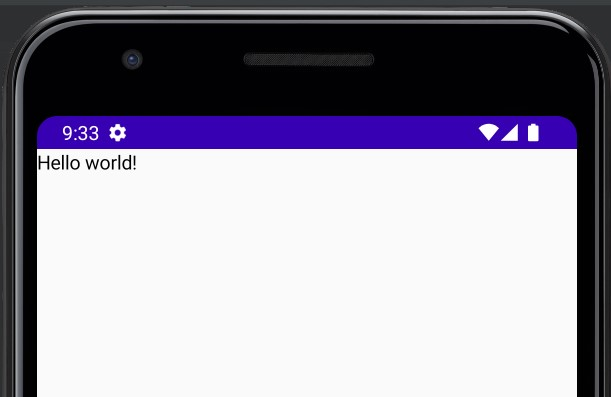

# Jetpack Compose

- [Jetpack Compose](#jetpack-compose)
  - [Introduction](#introduction)
  - [Composable functions](#composable-functions)
    - [Add a text element](#add-a-text-element)
    - [Define a composable function](#define-a-composable-function)
    - [Preview](#preview)
  - [Layouts](#layouts)
    - [Add multiple texts](#add-multiple-texts)
    - [Using a Column](#using-a-column)
    - [Add an image element](#add-an-image-element)
    - [Configuring layout](#configuring-layout)
  - [Material Design](#material-design)
    - [Enable dark theme Preview](#enable-dark-theme-preview)
  - [Lists and animations](#lists-and-animations)
    - [Data](#data)
    - [Create a list of messages](#create-a-list-of-messages)
    - [Animate messages while expanding](#animate-messages-while-expanding)
  - [EX2](#ex2)

## Introduction

Jetpack Compose is Android’s modern toolkit for building native UI. It simplifies and accelerates UI development on Android. Quickly bring your app to life with less code, powerful tools, and intuitive Kotlin APIs.

- [https://developer.android.com/courses/pathways/compose](https://developer.android.com/courses/pathways/compose)
- [https://developer.android.com/jetpack/compose/documentation](https://developer.android.com/jetpack/compose/documentation)

## Composable functions

Jetpack Compose is built around **composable functions**. These functions let you define your app's UI programmatically by describing how it should look and providing data dependencies, rather than focusing on the process of the UI's construction (initializing an element, attaching it to a parent, etc.). To create a composable function, just add the `@Composable` annotation to the function name.

### Add a text element

```kotlin
class MainActivity : ComponentActivity() {
    override fun onCreate(savedInstanceState: Bundle?) {
        super.onCreate(savedInstanceState)
        setContent {
            Text("Hello world!")
        }
    }
}
```

First, we’ll display a `“Hello world!”` text by adding a text element inside the `onCreate` method. You do this by defining a `content` block, and calling the `Text()` function. The `setContent` block defines the activity's layout where we call composable functions. Composable functions can only be called from other composable functions.

Jetpack Compose uses a Kotlin compiler plugin to transform these composable functions into the app's UI elements. For example, the `Text()` function that is defined by the Compose UI library displays a text label on the screen.

<div align="center">

</div>

### Define a composable function

To make a function composable, add the `@Composable` annotation. To try this out, define a `MessageCard()` function which is passed a name, and uses it to configure the text element.

```kotlin
class MainActivity : ComponentActivity() {
    override fun onCreate(savedInstanceState: Bundle?) {
        super.onCreate(savedInstanceState)
        setContent {
            MessageCard("Android")
        }
    }
}

@Composable
fun MessageCard(name: String) {
    Text(text = "Hello $name!")
}
```

### Preview

Android Studio adds a preview window. This window shows a preview of the UI elements created by composable functions marked with the `@Preview` annotation. To update the previews at any time, click the refresh button at the top of the preview window.

```kotlin
@Preview(showBackground = true)
@Composable
fun DefaultPreview() {
    MessageCard("Android")
}
```

<div align="center">

</div>

## Layouts

UI elements are hierarchical, with elements contained in other elements. In Compose, you build a UI hierarchy by calling composable functions from other composable functions.

<div align="center">

</div>

### Add multiple texts

```kotlin
class MainActivity : ComponentActivity() {
    override fun onCreate(savedInstanceState: Bundle?) {
        super.onCreate(savedInstanceState)
        setContent {
            MessageCard(Message("Android", "Jetpack Compose"))
        }
    }
}

data class Message(val author: String, val body: String)

@Composable
fun MessageCard(msg: Message) {
    Text(text = msg.author)
    Text(text = msg.body)
}

@Preview(showBackground = true)
@Composable
fun PreviewMessageCard() {
    MessageCard(
        msg = Message("Android", "Jetpack Compose")
    )
}
```

This code creates two text elements inside the content view. However, since we haven't provided any information about how to arrange them, **the text elements are drawn on top of each other**, making the text unreadable.

<div align="center">

</div>

### Using a Column

The `Column` function lets us arrange elements **vertically**. Add Column to the `MessageCard()` function.
We can use `Row` to arrange items **horizontally** and `Box` to **stack elements** like FrameLayout.

<div align="center">

</div>

```kotlin
@Composable
fun MessageCard(msg: Message) {
    Column {
        Text(text = msg.author)
        Text(text = msg.body)
    }
}
```

<div align="center">

</div>

### Add an image element

Let's enrich our message card by adding a profile picture of the sender. Use the Resource Manager to import an image from your photo library or use this one. Add a Row composable to have a well structured design and an Image composable inside it:

<div align="center">

</div>

### Configuring layout

Our message layout has the right structure but its elements aren't well spaced and the image is too big! To decorate or configure a composable, Compose uses `modifiers`. They allow you to change the composable's size, layout, appearance or add high-level interactions, such as making an element clickable. You can chain them to create richer composables. Let's use some of them to improve the layout:

```kotlin
@Composable
fun MessageCard(msg: Message) {
    // Add padding around our message
    Row(modifier = Modifier.padding(all = 8.dp)) {
        Image(
            painter = painterResource(R.drawable.profile_picture),
            contentDescription = "Contact profile picture",
            modifier = Modifier
                // Set image size to 40 dp
                .size(40.dp)
                // Clip image to be shaped as a circle
                .clip(CircleShape),
            // align center
            alignment = Alignment.Center,
            // fit image
            contentScale = ContentScale.Crop

        )
        //https://medium.com/mobile-app-development-publication/jetpack-compose-image-content-scaletype-fully-illustrated-bfdf2de7ef5

        // Add a horizontal space between the image and the column
        Spacer(modifier = Modifier.width(8.dp))

        Column {
            Text(text = msg.author)
            // Add a vertical space between the author and message texts
            Spacer(modifier = Modifier.height(4.dp))
            Text(text = msg.body)
        }
    }
}
```

<div align="center">

</div>

## Material Design

Jetpack Compose provides an implementation of Material Design and its UI elements out of the box.

<div align="center">

</div>

To start, we wrap our `MessageCard` function with the Material theme created in the project, using `~/ui/theme/Theme.kt/ComposeTheme` in this case. Do it both in the @Preview and in the setContent function.

```kotlin
@Composable
fun ComposeTheme (
    darkTheme: Boolean = isSystemInDarkTheme(),
    content: @Composable () -> Unit
) {
    val colors = if (darkTheme) {
        DarkColorPalette
    } else {
        LightColorPalette
    }

    MaterialTheme(
        colors = colors,
        typography = Typography,
        shapes = Shapes,
        content = content
    )
}
```

We'll improve the appearance of our `MessageCard` composable using Material Design styling.

```kotlin
class MainActivity : ComponentActivity() {
    override fun onCreate(savedInstanceState: Bundle?) {
        super.onCreate(savedInstanceState)
        setContent {
            ComposeTheme {
                MessageCard(Message("Android", "Jetpack Compose"))
            }
        }
    }
}

@Composable
fun MessageCard(msg: Message) {
 Surface() { // Surface() can be ignored; used for background color miss-match
        Row(modifier = Modifier.padding(all = 8.dp)) {
            Image(
                painter = painterResource(R.drawable.profile_picture),
                contentDescription = null,
                modifier = Modifier
                    .size(40.dp)
                    .clip(CircleShape)
                    .border(1.5.dp, MaterialTheme.colors.secondary, CircleShape)
            )
            Spacer(modifier = Modifier.width(8.dp))

            Column {
                Text(
                    text = msg.author,
                    color = MaterialTheme.colors.secondaryVariant,
                    style = MaterialTheme.typography.subtitle2
                )

                Spacer(modifier = Modifier.height(4.dp))

                Surface(
                    shape = MaterialTheme.shapes.medium,
                    //or
                    //shape = RoundedCornerShape(4.dp),
                    elevation = 1.dp,
                ) {
                    Text(
                        text = msg.body,
                        modifier = Modifier.padding(all = 4.dp),
                        style = MaterialTheme.typography.body2
                    )
                }
            }
        }
    }
}
```

<div align="center">

</div>

### Enable dark theme Preview

We can create multiple previews in your file as separate functions, or add multiple annotations to the same function.

Let's add a new preview annotation and enable night mode:

```kotlin
@Preview(name = "Light Mode")
@Preview(
    uiMode = Configuration.UI_MODE_NIGHT_YES,
    showBackground = true,
    name = "Dark Mode"
)
@Composable
fun PreviewMessageCard() {
    ComposeTheme {
        MessageCard(
            msg = Message("Android", "Jetpack Compose")
        )
    }
}
```

<div align="center">

</div>

## Lists and animations

Lists and animations are everywhere in apps. In this lesson, we will learn how Compose makes it easy to create lists and fun to add animations.

<div align="center">

</div>

### Data

```kotlin
object SampleData {
    // Sample conversation data
    val getConversations = listOf(
        Message(
            "Colleague",
            "Test...Test...Test..."
        ),
        Message(
            "Colleague",
            "List of Android versions:\n" +
                    "Android KitKat (API 19)\n" +
                    "Android Lollipop (API 21)\n" +
                    "Android Marshmallow (API 23)\n" +
                    "Android Nougat (API 24)\n" +
                    "Android Oreo (API 26)\n" +
                    "Android Pie (API 28)\n" +
                    "Android 10 (API 29)\n" +
                    "Android 11 (API 30)\n" +
                    "Android 12 (API 31)\n"
        ),
        Message(
            "Colleague",
            "I think Kotlin is my favorite programming language.\n" +
                    "It's so much fun!"
        ),
        //...
    )
}
```

### Create a list of messages

We need to create a Conversation function that will show multiple messages. For this use case, we can use Compose’s `LazyColumn` and `LazyRow`. These composables render only the elements that are visible on screen, so they are designed to be very **efficient** for long lists. At the same time, they avoid the complexity of `RecyclerView` with `XML` layouts.

In this code snippet, you can see that `LazyColumn` has an `items` child. It takes a `List` as a parameter and its `lambda` receives a parameter we’ve named `message` (we could have named it whatever we want) which is an instance of `Message`. In short, **this lambda is called for each item of the provided List**.

```kotlin
//..
ComposeTheme {
 Surface(modifier = Modifier.fillMaxSize()) {
  Conversation(SampleData.getConversations)
 }
}
//..
@Composable
fun Conversation(messages: List<Message>) {
    LazyColumn {
        items(messages) { message ->
            MessageCard(message)
        }
    }
}

```

<div align="center">

</div>

### Animate messages while expanding

We will add the ability to expand a message to show a longer one, animating both the content size and the background color.

To store this local UI state, we need to keep track of whether a message has been expanded or not. To keep track of this state change, we have to use the functions remember and `mutableStateOf`.

Composable functions can store local state in memory by using `remember`, and track changes to the value passed to `mutableStateOf`. **Composables (and their children) using this state will get redrawn automatically when the value is updated**. We call this `recomposition`.

By using Compose’s state APIs like remember and mutableStateOf, any changes to state automatically update the UI.

Now we can change the background of the message content based on `isExpanded` when we click on a message. We will use the `clickable` modifier to handle click events on the composable. Instead of just toggling the background color of the Surface, we will animate the background color by gradually modifying its value from `MaterialTheme.colors.surface` to `MaterialTheme.colors.primary` and vice versa. To do so, we will use the `animateColorAsState` function. Lastly, we will use the `animateContentSize` modifier to animate the message container size smoothly:

for more on [animation](https://developer.android.com/jetpack/compose/animation)

```kotlin
@Composable
fun MessageCard(msg: Message) {
    Row(modifier = Modifier.padding(all = 8.dp)) {
        Image(
            painter = painterResource(R.drawable.profile_picture),
            contentDescription = null,
            modifier = Modifier
                .size(40.dp)
                .clip(CircleShape)
                .border(1.5.dp, MaterialTheme.colors.secondaryVariant, CircleShape)
        )
        Spacer(modifier = Modifier.width(8.dp))

        // We keep track if the message is expanded or not in this
        // variable
        var isExpanded by remember { mutableStateOf(false) }
        // surfaceColor will be updated gradually from one color to the other
        val surfaceColor: Color by animateColorAsState(
            if (isExpanded) MaterialTheme.colors.primary else MaterialTheme.colors.surface,
        )

        // We toggle the isExpanded variable when we click on this Column
        Column(modifier = Modifier.clickable { isExpanded = !isExpanded }) {
            Text(
                text = msg.author,
                color = MaterialTheme.colors.secondaryVariant,
                style = MaterialTheme.typography.subtitle2
            )

            Spacer(modifier = Modifier.height(4.dp))

            Surface(
                shape = MaterialTheme.shapes.medium,
                elevation = 1.dp,
                // surfaceColor color will be changing gradually from primary to surface
                color = surfaceColor,
                // animateContentSize will change the Surface size gradually
                modifier = Modifier.animateContentSize().padding(1.dp)
            ) {
                Text(
                    text = msg.body,
                    modifier = Modifier.padding(all = 4.dp),
                    // If the message is expanded, we display all its content
                    // otherwise we only display the first line
                    maxLines = if (isExpanded) Int.MAX_VALUE else 1,
                    style = MaterialTheme.typography.body2
                )
            }
        }
    }
}
```

<div align="center">

</div>

## EX2

```kotlin
class MainActivity : ComponentActivity() {
    override fun onCreate(savedInstanceState: Bundle?) {
        super.onCreate(savedInstanceState)
        setContent {
            ComposeTheme {
                MyApp()
            }
        }
    }
}

@Composable
private fun MyApp() {
    var shouldShowOnboarding by rememberSaveable { mutableStateOf(true) }

    if (shouldShowOnboarding) {
        OnboardingScreen(onContinueClicked = { shouldShowOnboarding = false })
    } else {
        Greetings()
    }
}

@Composable
private fun OnboardingScreen(onContinueClicked: () -> Unit) {
    Surface {
        Column(
            modifier = Modifier.fillMaxSize(),
            verticalArrangement = Arrangement.Center,
            horizontalAlignment = Alignment.CenterHorizontally
        ) {
            Text("Welcome to the Basics Codelab!")
            Button(
                modifier = Modifier.padding(vertical = 24.dp),
                onClick = onContinueClicked
            ) {
                Text("Continue")
            }
        }
    }
}

@Composable
private fun Greetings(names: List<String> = List(1000) { "$it" }) {
    LazyColumn(modifier = Modifier.padding(vertical = 4.dp)) {
        items(items = names) { name ->
            Greeting(name = name)
        }
    }
}

@Composable
private fun Greeting(name: String) {
    Card(
        backgroundColor = MaterialTheme.colors.primary,
        modifier = Modifier.padding(vertical = 4.dp, horizontal = 8.dp)
    ) {
        CardContent(name)
    }
}

@Composable
private fun CardContent(name: String) {
    var expanded by remember { mutableStateOf(false) }

    Row(
        modifier = Modifier
            .padding(12.dp)
            .animateContentSize(
                animationSpec = spring(
                    dampingRatio = Spring.DampingRatioMediumBouncy,
                    stiffness = Spring.StiffnessLow
                )
            )
    ) {
        Column(
            modifier = Modifier
                .weight(1f)
                .padding(12.dp)
        ) {
            Text(text = "Hello, ")
            Text(
                text = name,
                style = MaterialTheme.typography.h4.copy(
                    fontWeight = FontWeight.ExtraBold
                )
            )
            if (expanded) {
                Text(
                    text = ("Composem ipsum color sit lazy, " +
                            "padding theme elit, sed do bouncy. ").repeat(4),
                )
            }
        }
        IconButton(onClick = { expanded = !expanded }) {
            Icon(
                imageVector = if (expanded) Filled.ExpandLess else Filled.ExpandMore,
//                contentDescription = if (expanded) "Show less" else "Show more" ,
                contentDescription = null
            )
        }
    }
}

@Preview(
    showBackground = true,
    widthDp = 320,
    uiMode = UI_MODE_NIGHT_YES,
    name = "DefaultPreviewDark"
)
@Preview(showBackground = true, widthDp = 320)
@Composable
fun DefaultPreview() {
    ComposeTheme {
        Greetings()
    }
}

@Preview(showBackground = true, widthDp = 320, heightDp = 320)
@Composable
fun OnboardingPreview() {
    ComposeTheme {
        OnboardingScreen(onContinueClicked = {})
    }
}
```

<div align="center">

</div>

`Theme.kt`

```kotlin
val Navy = Color(0xFF073042)
val Blue = Color(0xFF4285F4)
val LightBlue = Color(0xFFD7EFFE)
val Chartreuse = Color(0xFFEFF7CF)

private val DarkColorPalette = darkColors(
    surface = Blue,
    onSurface = Navy,
    primary = Navy,
    onPrimary = Chartreuse
)

private val LightColorPalette = lightColors(
    surface = Blue,
    onSurface = Color.White,
    primary = LightBlue,
    onPrimary = Navy
)

@Composable
fun ComposeTheme(
    darkTheme: Boolean = isSystemInDarkTheme(),
    content: @Composable () -> Unit
) {
    val colors = if (darkTheme) {
        DarkColorPalette
    } else {
        LightColorPalette
    }

    MaterialTheme(
        colors = colors,
        typography = typography,
        shapes = shapes,
        content = content
    )
}
```
