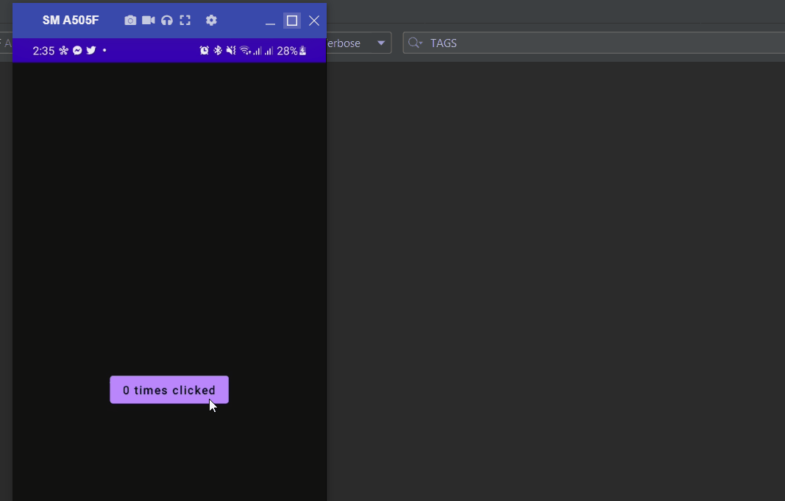
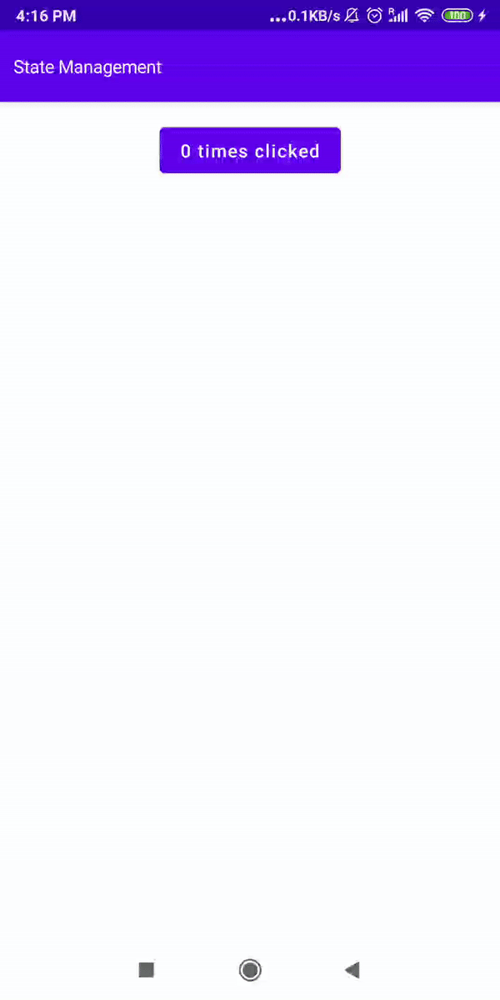
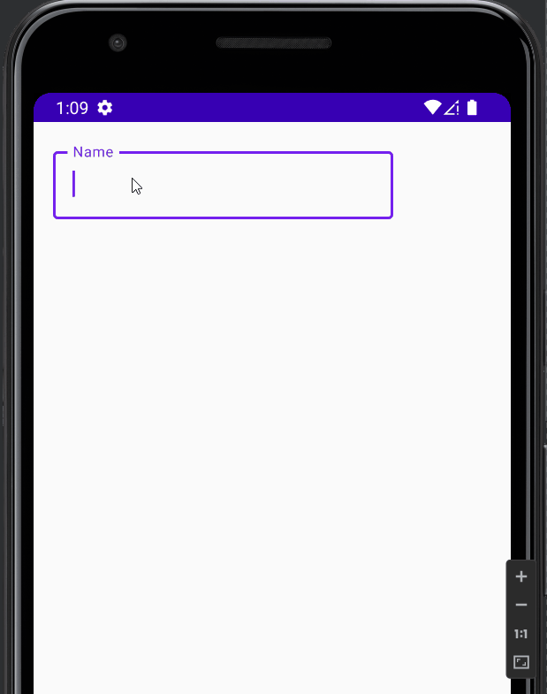
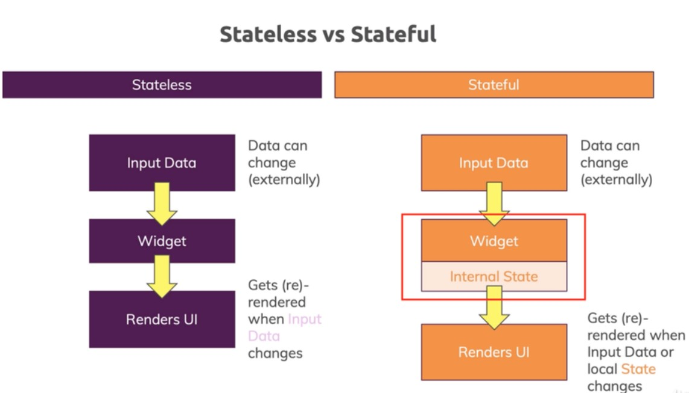
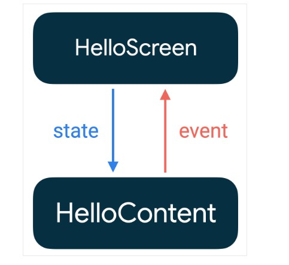

# Sate Management In Jetpack Compose

- [Sate Management In Jetpack Compose](#sate-management-in-jetpack-compose)
  - [Intro](#intro)
  - [State and composition](#state-and-composition)
    - [No State Example](#no-state-example)
    - [With State Object](#with-state-object)
    - [Remember](#remember)
    - [Remember Saveable](#remember-saveable)
    - [`TextField` State](#textfield-state)
    - [Stateful versus stateless](#stateful-versus-stateless)
  - [State hoisting](#state-hoisting)
  - [ViewModels as source of truth](#viewmodels-as-source-of-truth)
  - [UI State MVVM](#ui-state-mvvm)

## Intro

**State in an app is any value that can change over time**.

_The `state` is an object that is connected/subscribed to one or more widgets, contains data, and eager to update the widgets from that data. If there’s any change happens in data, it notifies all widgets to whom it’s connected. The values of the state are changed at runtime._

- [https://developer.android.com/jetpack/compose/state](https://developer.android.com/jetpack/compose/state)
- [https://developer.android.com/codelabs/jetpack-compose-state](https://developer.android.com/codelabs/jetpack-compose-state)

## State and composition

In jetpack compose the concept of state management is the same as `Observable` pattern which stated that if there is any change that occurs in the subscribed object, it triggers all of its dependent objects automatically.

In addition to the above concept, jetpack compose has some functional change, which states that the subscribed
`@composable function(s)` recomposes itself with the new data when the state/object value is updated and doesn’t affect or update the whole UI.

### No State Example

If we create the object without state, it doesn't update our UI when our data get changed.

```kotlin
@Composable
fun App() {
    Surface(modifier = Modifier.fillMaxSize()) {
        Column(
            horizontalAlignment = Alignment.CenterHorizontally,
            verticalArrangement = Arrangement.Center
        ) {
            NoState()
        }
    }
}
@Composable
fun NoState() {
    var clickCount = 0
    Column {
        Button(onClick = {
            clickCount++
            Log.d("TAGS", "NoState: $clickCount")
        }) {
            Text(text = "$clickCount times clicked")
        }
    }
}
```

<div align="center">

</div>

Why it doesn't update the UI?

It just changes the value of the variable, but our UI needs to refresh. For auto UI refresh, we need state objects. If we use a state object, our UI will get refreshed automatically when data gets changed. Let's test the same code with the state object.

### With State Object

```kotlin
@Composable
fun MutableStateClick() {
    var clickCount by mutableStateOf(0)//Not recommended
    Column {
        Button(onClick = { clickCount++ }) {
            Text(text = "$clickCount times clicked")
        }
    }
}
```

<div align="center">

</div>

**It works as expected. But it has some problems, if we use this state object with child composable it will not work. When we use this code, Android studio will give a warning and it recommended using it along with remember.**

### Remember

The `remember` keyword can store a mutable or an immutable object. If value changes, it will trigger recomposition(refresh the UI) to update the widgets.


```kotlin
@Composable
fun RememberSample() {
    var clickCount by remember { mutableStateOf(0) }
    Column {
        Button(onClick = { clickCount++ }) {
            Text(text = "$clickCount times clicked")
        }
    }
}
```


Remember works with child composable also. You can pass as an argument to our child composable function.

Drawback:

- If our device orientation gets changed, the value will reset.
- If we want to keep the data even if the activity recreated/orientation change happened, use "rememberSavable".

### Remember Saveable

Use `rememberSaveable` to restore our UI state after an activity or process is recreated. rememberSaveable retains state across recompositions. In addition, rememberSaveable also retains state across activity and process recreation.

```kotlin
@Composable
fun RememberSaveableSample() {
    var clickCount = rememberSaveable { mutableStateOf(0) }
    Column {
        Button(onClick = { clickCount.value++ }) {
            Text(text = "" + clickCount.value + " times clicked")
        }
    }
}
```

<div align="center">

</div>

### `TextField` State

As a result, things like `TextField` don’t automatically update like they do in imperative XML based views. A composable has to explicitly be told the new state in order for it to update accordingly.

<div align="center">

</div>

```kotlin
@Composable
fun HelloContent() {
    Column(modifier = Modifier.padding(16.dp)) {
        var name by remember { mutableStateOf("") }
        if (name.isNotEmpty()) {
            Text(
                text = "Hello, $name!",
                modifier = Modifier.padding(bottom = 8.dp),
                style = MaterialTheme.typography.h5
            )
        }
        OutlinedTextField(
            value = name,
            onValueChange = { name = it },
            label = { Text("Name") }
        )
    }
}
```

### Stateful versus stateless

A composable that uses `remember` to store an object creates internal state, making the composable `stateful`. `HelloContent` is an example of a `stateful` composable because it holds and modifies its `name` state internally. This can be useful in situations where a caller doesn't need to control the state and can use it without having to manage the state themselves. However, composables with internal state tend to be less reusable and harder to test.

A `stateless` composable is a composable that doesn't hold any state. An easy way to achieve stateless is by using [State hoisting](#state-hoisting)

As we develop reusable composables, we often want to expose both a stateful and a stateless version of the same composable. The stateful version is convenient for callers that don't care about the state, and the stateless version is necessary for callers that need to control or hoist the state.

<div align="center">

</div>

## State hoisting

State hoisting in Compose is a pattern of moving state to a composable's caller to make a composable stateless. The general pattern for state hoisting in Jetpack Compose is to replace the state variable with two parameters:

- `value`: T: the current value to display
- `onValueChange: (T) -> Unit`: an event that requests the value to change, where T is the proposed new value

However, we are not limited to `onValueChange`. If more specific events are appropriate for the composable we should define them using lambdas like `ExpandingCard` does with onExpand and `onCollapse`.

State that is hoisted this way has some important properties:

- `Single source of truth`: By moving state instead of duplicating it, we're ensuring there's only one source of truth. This helps avoid bugs.
- `Encapsulated`: Only stateful composables will be able to modify their state. It's completely internal.
- `Shareable`: Hoisted state can be shared with multiple composables. Say we wanted to name in a different composable, hoisting would allow us to do that.
- `Interceptable`: callers to the stateless composables can decide to ignore or modify events before changing the state.
- `Decoupled`: the state for the stateless `ExpandingCard` may be stored anywhere. For example, it's now possible to move `name` into a `ViewModel`.

In the example case, we extract the `name` and the `onValueChange` out of `HelloContent` and move them up the tree to a `HelloScreen` composable that calls `HelloContent`.

```kotlin
@Composable
fun HelloScreen() {
    var name by rememberSaveable { mutableStateOf("") }

    HelloContent(name = name, onNameChange = { name = it })
}

@Composable
fun HelloContent(name: String, onNameChange: (String) -> Unit) {
    Column(modifier = Modifier.padding(16.dp)) {
        Text(
            text = "Hello, $name",
            modifier = Modifier.padding(bottom = 8.dp),
            style = MaterialTheme.typography.h5
        )
        OutlinedTextField(
            value = name,
            onValueChange = onNameChange,
            label = { Text("Name") }
        )
    }
}
```

By hoisting the state out of `HelloContent`, it's easier to reason about the composable, reuse it in different situations, and test. `HelloContent` is decoupled from how its state is stored. Decoupling means that if you modify or replace HelloScreen, you don't have to change how `HelloContent` is implemented.

<div align="center">

</div>

The pattern where the state goes down, and events go up is called a `unidirectional` data flow. In this case, the state goes down from `HelloScreen` to `HelloContent` and events go up from `HelloContent` to `HelloScreen`. By following unidirectional data flow, you can decouple composables that display state in the UI from the parts of your app that store and change state.

## ViewModels as source of truth

If plain state holders classes are in charge of the UI logic and UI elements' state, a ViewModel is a special type of state holder that is in charge of:

- providing access to the business logic of the application that is usually placed in other layers of the hierarchy such as the business and data layers, and
- preparing the application data for presentation in a particular screen, which becomes the screen or UI state.

ViewModels have a longer lifetime than the Composition because they survive configuration changes. They can follow the lifecycle of the host of Compose content–that is, activities or fragments–or the lifecycle of a destination or the Navigation graph if you're using the Navigation library. Because of their longer lifetime, ViewModels should not hold long-lived references to state bound to the lifetime of the Composition. If they do, it could cause memory leaks.

At the same time, we'll explore using `mutableStateListOf` in a `ViewModel` and see how it simplifies state code compared to `LiveData<List>` when targeting Compose.

`mutableStateListOf` allows us to create an instance of `MutableList` that is `observable`. This means that we can work with todoItems in the same way we work with a MutableList, removing the overhead of working with `LiveData<List>`.

```kotlin
data class TodoItem(val todo_id: Int, val data: String)
class TodoViewModel : ViewModel() {

    // remove the LiveData and replace it with a mutableStateListOf
    //private var _todoItems = MutableLiveData(listOf<TodoItem>())
    //val todoItems: LiveData<List<TodoItem>> = _todoItems

    // state: todoItems -captures the same behavior as the LiveData version.
    var todoItems = mutableStateListOf(TodoItem(1, "A"), TodoItem(2, "A"))
        private set

    // event: addItem
    fun addItem(item: TodoItem) {
        todoItems.add(item)
    }

    // event: removeItem
    fun removeItem(item: TodoItem) {
        todoItems.remove(item)
    }
}
```

```kotlin
@Composable
private fun TodoActivityScreen(todoViewModel: TodoViewModel) {
    TodoScreen(
        items = todoViewModel.todoItems,
//        onAddItem = todoViewModel::addItem,
//        onRemoveItem = todoViewModel::removeItem
        vm = todoViewModel
    )
}

@Composable
fun TodoScreen(
    items: List<TodoItem>,
//    onAddItem: (TodoItem) -> Unit,
//    onRemoveItem: (TodoItem) -> Unit
    vm: TodoViewModel
) {
    Column(
        modifier = Modifier.fillMaxWidth(),
        horizontalAlignment = Alignment.CenterHorizontally
    ) {
        Spacer(modifier = Modifier.size(10.dp))
        Button(onClick = {
            val id = Random.nextInt(3, 100)
//            onAddItem(TodoItem(id, "$id Added"))
            vm.addItem(TodoItem(id, "$id Added"))
        }) {
            Text(text = "Add")
        }
        LazyColumn {
            items(items) { item ->
                Card(modifier = Modifier
                    .padding(10.dp)
                    .fillMaxWidth()
                    .clickable {
                        vm.removeItem(item)
                    }) {

                    Text(text = "$item", modifier = Modifier.padding(5.dp))
                }
            }
        }
    }
}
```

```kotlin
class MainActivity : ComponentActivity() {
    override fun onCreate(savedInstanceState: Bundle?) {
        super.onCreate(savedInstanceState)
        setContent {
            ComposeTheme {
                val vm: TodoViewModel by viewModels()
                Surface(modifier = Modifier.fillMaxSize()) {
                    TodoActivityScreen(vm)
                }
            }
        }
    }
}
```

## UI State MVVM

```kotlin
data class User(val name: String)
class ViewModelStore : ViewModel() {
    private val _uiState = MutableStateFlow<UiState<List<User>>>(UiState.Empty())
    val uiState: StateFlow<UiState<List<User>>> = _uiState

    init {
        fetchWeather()
    }

    //List<out T> in Kotlin is equivalent to List<? extends T> in Java.
    sealed class UiState<out T> {
        class Empty<out T> : UiState<T>()
        class Loading<out T> : UiState<T>()
        data class Success<out T>(val data: T) : UiState<T>()
        data class Error<out T>(val message: String) : UiState<T>()
    }

    private fun fetchWeather() {
        _uiState.value = UiState.Loading()
        viewModelScope.launch(Dispatchers.IO) {

            getListOfUsers().collect {
	              _uiState.value = UiState.Success(it)
               // _uiState.value =UiState.Error("Error")
            }
        }
    }

    suspend fun getListOfUsers() = flow {
        val listUsers = listOf(User("A"), User("B"), User("C"), User("D"))
        delay(2000)
        emit(listUsers)
    }
    suspend fun throwError() = flow {
        delay(2000)
        emit(0)
    }
}

class MainActivity : ComponentActivity() {
    override fun onCreate(savedInstanceState: Bundle?) {
        super.onCreate(savedInstanceState)
        setContent {
            ComposeTheme {
                // A surface container using the 'background' color from the theme
                Surface(
                    modifier = Modifier.fillMaxSize(),
                    color = MaterialTheme.colors.background
                ) {
                    val vm: ViewModelStore by viewModels()
                    when (val state = vm.uiState.collectAsState().value) {
                        is ViewModelStore.UiState.Loading ->
                            Column(
                                modifier = Modifier.fillMaxSize(),
                                verticalArrangement = Arrangement.Center,
                                horizontalAlignment = Alignment.CenterHorizontally
                            ) {
                                CircularProgressIndicator()
                            }
                        is ViewModelStore.UiState.Error -> Text(state.message)
                        is ViewModelStore.UiState.Success -> {
                            Greeting(list = state.data)
                        }
                        else -> {}
                    }
                }
            }
        }
    }
}

@Composable
fun Greeting(list: List<User>) {
    LazyColumn {
        items(list) { i ->
            Text(text = "Hello ${i.name}!")
        }
    }
}

@Preview(showBackground = true)
@Composable
fun DefaultPreview() {
    ComposeTheme {
        Surface(
            modifier = Modifier.fillMaxSize(),
            color = MaterialTheme.colors.background
        ) {
            Greeting(listOf(User("A"), User("B"), User("C"), User("D")))
        }
    }
}
```
