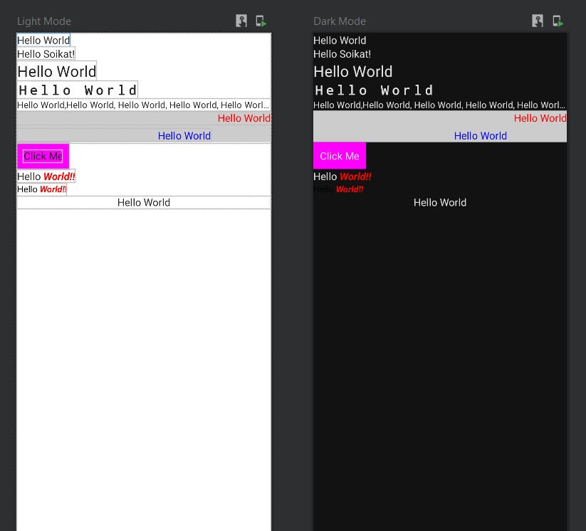
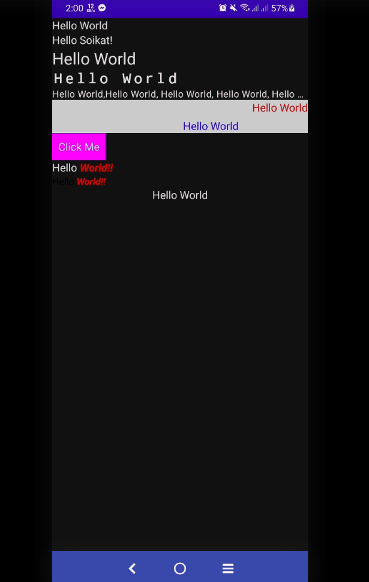

# Jetpack Compose Built-in UI Element - Part I

- [Jetpack Compose Built-in UI Element - Part I](#jetpack-compose-built-in-ui-element---part-i)
  - [Text](#text)
    - [Init](#init)
    - [StyleText](#styletext)
    - [FontText](#fonttext)
    - [TextOverflow](#textoverflow)
    - [TextAlignment](#textalignment)
    - [Clickable Text](#clickable-text)
    - [TextSpan](#textspan)
    - [TextSpanClick](#textspanclick)
    - [TextSelection](#textselection)
  - [Button](#button)
    - [Button Init](#button-init)

## Text

### Init

<div align="center">

</div>

<div align="center">

</div>

```kotlin
@Preview(name = "Light Mode", showBackground = true)
@Preview(
    uiMode = Configuration.UI_MODE_NIGHT_YES,
    showBackground = true,
    name = "Dark Mode"
)
@Composable
fun DefaultPreview() {
    ComposeTheme {
        TextExample()
    }
}
@Composable
fun TextExample() {
    Surface(modifier = Modifier.fillMaxSize(), color = MaterialTheme.colors.background) {
        Column(modifier = Modifier.fillMaxWidth()) {
            JustText()
            TextParameter(name = "Soikat")
            StyleText()
            FontText()
            TextOverflowEx()
            TextAlignment()
            TextWithClick()
            TextSpan()
            TextSpanClick()
            TextSelection()
        }
    }
}

@Composable
fun JustText() {
    Text(text = "Hello World")
}

@Composable
fun TextParameter(name: String) {
    Text(text = "Hello $name!")
}
//...
```

### StyleText

```kotlin
@Composable
fun StyleText() {
    Text(text = "Hello World", style = MaterialTheme.typography.h5)
}
```

### FontText

```kotlin
@Composable
fun FontText() {
    Text(
        text = "Hello World",
        style = TextStyle(
            fontFamily = FontFamily.Monospace,
            fontWeight = FontWeight.Bold,
            fontSize = 20.sp,
            letterSpacing = 5.sp
        )
    )
}
```

### TextOverflow

```kotlin
@Composable
fun TextOverflowEx() {
    Text(
        text = "Hello World,Hello World, Hello World, Hello World, Hello World, Hello World,  Hello World,   ",
        maxLines = 1,
        overflow = TextOverflow.Ellipsis,
        style = MaterialTheme.typography.body2
    )
}
```

### TextAlignment

```kotlin
@Composable
fun TextAlignment() {
    Surface(color = Color.LightGray) {
        Column() {

            Text(
                text = "Hello World",
                color = Color.Red,
                modifier = Modifier.fillMaxWidth(),
                textAlign = TextAlign.End
            )
            Spacer(modifier = Modifier.padding(3.dp))
            Text(
                text = "Hello World",
                color = Color.Blue,
                modifier = Modifier.width(300.dp),
                textAlign = TextAlign.End
            )
        }
    }

}
```

### Clickable Text

```kotlin
@Composable
fun TextWithClick() {
    val context = LocalContext.current
    Surface(color = Color.Magenta) {
        Text(text = "Click Me",
            modifier = Modifier
                .padding(10.dp)
                .clickable {
                    Toast
                        .makeText(context, "Clicked...", Toast.LENGTH_SHORT)
                        .show()
                })
    }

}
```

### TextSpan

```kotlin
@Composable
fun TextSpan() {
    Text(buildAnnotatedString {
        append("Hello ")
        withStyle(
            style = SpanStyle(
                color = Color.Red,
                fontWeight = FontWeight.Bold,
                fontStyle = FontStyle.Italic
            )
        ) {
            append("World!!")
        }
    })
}
```

### TextSpanClick

```kotlin
@Composable
fun TextSpanClick() {
    val context = LocalContext.current

    val span = buildAnnotatedString {
        append("Hello ")
        pushStringAnnotation(tag = "click", annotation = "annotation")
        withStyle(
            style = SpanStyle(
                color = Color.Red,
                fontWeight = FontWeight.Bold,
                fontStyle = FontStyle.Italic
            )
        ) {
            append("World!!")
        }
        pop()
    }
    ClickableText(text = span, onClick = { offset ->
        span.getStringAnnotations(tag = "click", start = offset, end = offset).firstOrNull()
            ?.let { annotation ->
                Toast
                    .makeText(context, annotation.item, Toast.LENGTH_SHORT)
                    .show()
            }
    })

}
```

### TextSelection

```kotlin
@Composable
fun TextSelection() {
    SelectionContainer {
        Text(text = "Hello World", modifier = Modifier.fillMaxWidth(), textAlign = TextAlign.Center)
    }
}
```

## Button

### Button Init

