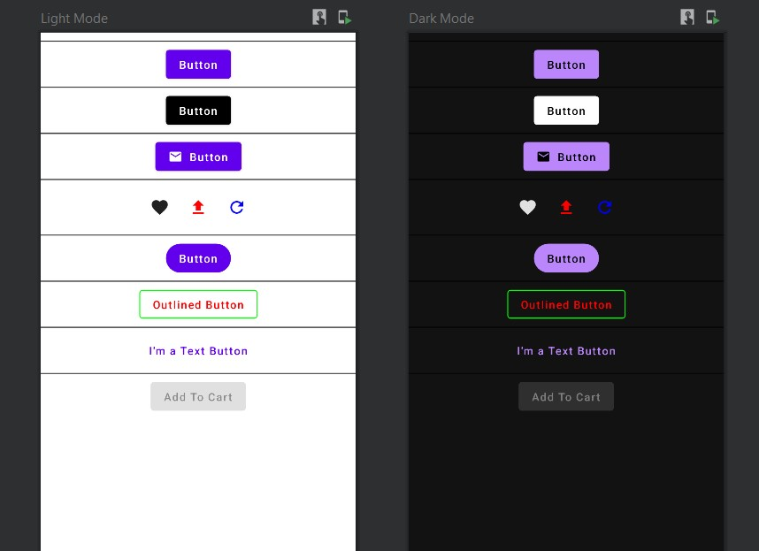
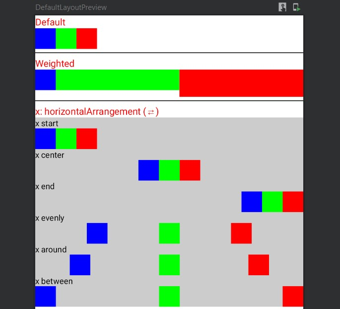
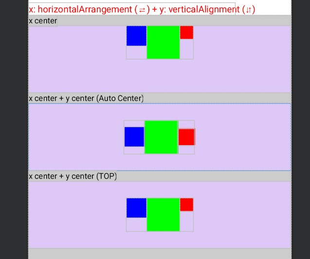
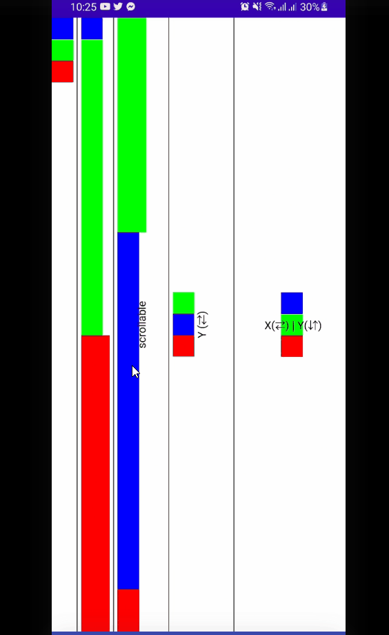
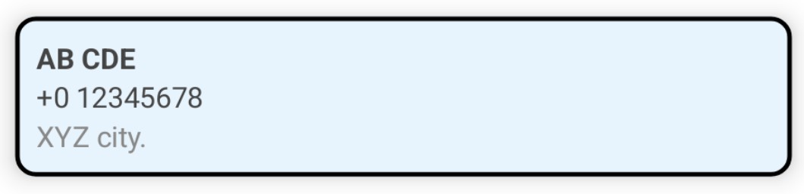
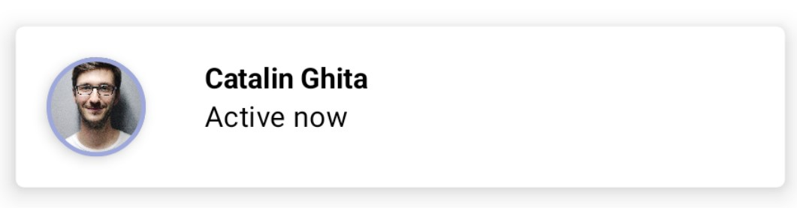
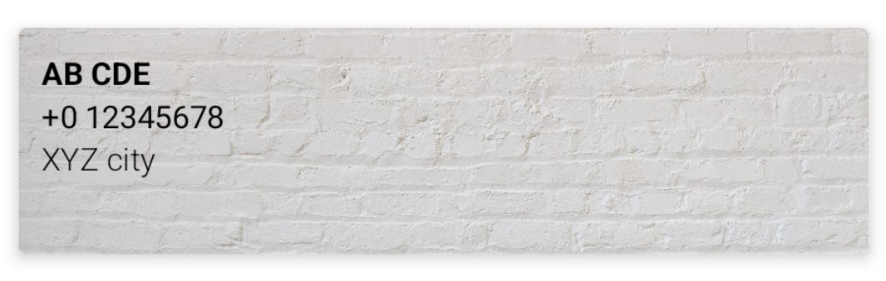
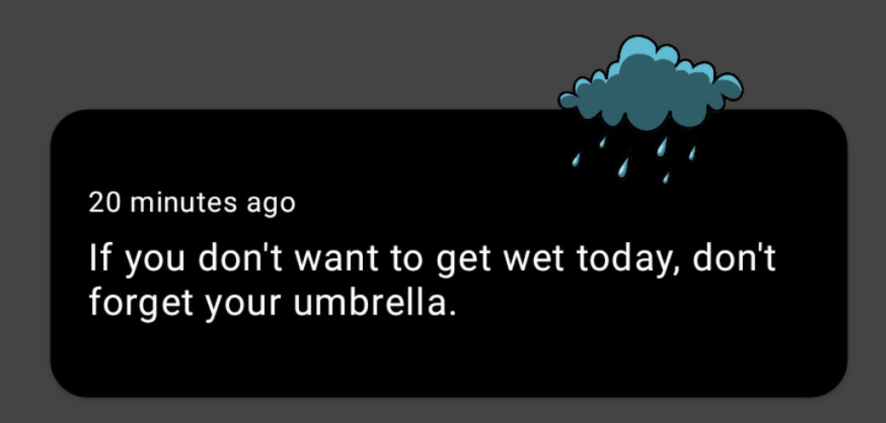
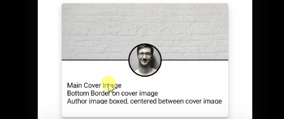

# Jetpack Compose Built-in UI Element - Part I

- [Jetpack Compose Built-in UI Element - Part I](#jetpack-compose-built-in-ui-element---part-i)
  - [Resources](#resources)
  - [Modifiers](#modifiers)
    - [Order of Modifiers](#order-of-modifiers)
  - [Text](#text)
    - [Init](#init)
    - [StyleText](#styletext)
    - [FontText](#fonttext)
    - [TextOverflow](#textoverflow)
    - [TextAlignment](#textalignment)
    - [Clickable Text](#clickable-text)
    - [TextSpan](#textspan)
    - [TextSpanClick](#textspanclick)
    - [TextSelection](#textselection)
  - [Button](#button)
    - [Button Init](#button-init)
    - [Basic](#basic)
    - [ColorButton](#colorbutton)
    - [IconTextButton](#icontextbutton)
    - [IconButtons](#iconbuttons)
    - [ButtonShape](#buttonshape)
    - [OutlinedButton](#outlinedbutton)
    - [TextButton](#textbutton)
    - [DisableButton](#disablebutton)
  - [RowLayout](#rowlayout)
    - [Default](#default)
    - [Weighted](#weighted)
    - [x: horizontalArrangement (⇄)](#x-horizontalarrangement-)
    - [x: horizontalArrangement (⇄) + y: verticalAlignment (⇵)](#x-horizontalarrangement---y-verticalalignment-)
      - [x center only](#x-center-only)
      - [x center + y center (Auto Center)](#x-center--y-center-auto-center)
      - [x center + y center (Top)](#x-center--y-center-top)
  - [Column Layout](#column-layout)
    - [Default Column Layout](#default-column-layout)
    - [Weighted Column Layout](#weighted-column-layout)
    - [verticalScroll](#verticalscroll)
    - [Y: verticalArrangement (⇵)](#y-verticalarrangement-)
    - [X:horizontalAlignment(⇄) + Y: verticalArrangement (⇵)](#xhorizontalalignment--y-verticalarrangement-)
  - [Image](#image)
    - [Image Basic](#image-basic)
    - [Icons](#icons)
  - [Card](#card)
    - [CardEx1](#cardex1)
    - [CardEx2](#cardex2)
    - [CardEx3](#cardex3)
    - [CardEx4🚀](#cardex4)
    - [CardEx5🚀](#cardex5)
    - [CardEx6: Custom Interaction](#cardex6-custom-interaction)

## Resources

- [https://developer.android.com/reference/kotlin/androidx/compose/material/package-summary#top-level-functions](https://developer.android.com/reference/kotlin/androidx/compose/material/package-summary#top-level-functions)

## Modifiers

- [https://www.jetpackcompose.net/jetpack-compose-modifiers](https://www.jetpackcompose.net/jetpack-compose-modifiers)
- [https://appdevnotes.com/jetpack-compose-modifiers/](https://appdevnotes.com/jetpack-compose-modifiers/)
- [https://developer.android.com/reference/kotlin/androidx/compose/ui/Modifier](https://developer.android.com/reference/kotlin/androidx/compose/ui/Modifier)

There are 4 things we can do with modifiers.

- We use modifiers to decorate or add behavior to Compose UI elements.
- We use them for processing user input.
- We can make ui elements interactive using modifiers. That means using modifiers we can make an ui element `clickable`, `zoomable` , `draggable` or `scrollable`.
- Also, we can use modifiers to add information like accessibility labels to a ui element.

### Order of Modifiers

## Text

### Init

<div align="center">

</div>

<div align="center">

</div>

```kotlin
@Preview(name = "Light Mode", showBackground = true)
@Preview(
    uiMode = Configuration.UI_MODE_NIGHT_YES,
    showBackground = true,
    name = "Dark Mode"
)
@Composable
fun DefaultPreview() {
    ComposeTheme {
        TextExample()
    }
}
@Composable
fun TextExample() {
    Surface(modifier = Modifier.fillMaxSize(), color = MaterialTheme.colors.background) {
        Column(modifier = Modifier.fillMaxWidth()) {
            JustText()
            TextParameter(name = "Soikat")
            StyleText()
            FontText()
            TextOverflowEx()
            TextAlignment()
            TextWithClick()
            TextSpan()
            TextSpanClick()
            TextSelection()
        }
    }
}

@Composable
fun JustText() {
    Text(text = "Hello World")
}

@Composable
fun TextParameter(name: String) {
    Text(text = "Hello $name!")
}
//...
```

### StyleText

```kotlin
@Composable
fun StyleText() {
    Text(text = "Hello World", style = MaterialTheme.typography.h5)
}
```

### FontText

```kotlin
@Composable
fun FontText() {
    Text(
        text = "Hello World",
        style = TextStyle(
            fontFamily = FontFamily.Monospace,
            fontWeight = FontWeight.Bold,
            fontSize = 20.sp,
            letterSpacing = 5.sp
        )
    )
}
```

or:

```kotlin
@Composable
fun FontText() {
    Text(
        text = "Hello World",
        fontFamily = FontFamily.Monospace,
        fontWeight = FontWeight.W800,
        fontSize = 20.sp,
        letterSpacing = 5.sp
    )
}
```

### TextOverflow

```kotlin
@Composable
fun TextOverflowEx() {
    Text(
        text = "Hello World,Hello World, Hello World, Hello World, Hello World, Hello World,  Hello World,   ",
        maxLines = 1,
        overflow = TextOverflow.Ellipsis,
        style = MaterialTheme.typography.body2
    )
}
```

### TextAlignment

```kotlin
@Composable
fun TextAlignment() {
    Surface(color = Color.LightGray) {
        Column() {

            Text(
                text = "Hello World",
                color = Color.Red,
                modifier = Modifier.fillMaxWidth(),
                textAlign = TextAlign.End
            )
            Spacer(modifier = Modifier.padding(3.dp))
            Text(
                text = "Hello World",
                color = Color.Blue,
                modifier = Modifier.width(300.dp),
                textAlign = TextAlign.End
            )
        }
    }

}
```

### Clickable Text

```kotlin
@Composable
fun TextWithClick() {
    val context = LocalContext.current
    Surface(color = Color.Magenta) {
        Text(text = "Click Me",
            modifier = Modifier
                .padding(10.dp)
                .clickable {
                    Toast
                        .makeText(context, "Clicked...", Toast.LENGTH_SHORT)
                        .show()
                })
    }

}
```

### TextSpan

```kotlin
@Composable
fun TextSpan() {
    Text(buildAnnotatedString {
        append("Hello ")
        withStyle(
            style = SpanStyle(
                color = Color.Red,
                fontWeight = FontWeight.Bold,
                fontStyle = FontStyle.Italic
            )
        ) {
            append("World!!")
        }
    })
}
```

### TextSpanClick

```kotlin
@Composable
fun TextSpanClick() {
    val context = LocalContext.current

    val span = buildAnnotatedString {
        append("Hello ")
        pushStringAnnotation(tag = "click", annotation = "annotation")
        withStyle(
            style = SpanStyle(
                color = Color.Red,
                fontWeight = FontWeight.Bold,
                fontStyle = FontStyle.Italic
            )
        ) {
            append("World!!")
        }
        pop()
    }
    ClickableText(text = span, onClick = { offset ->
        span.getStringAnnotations(tag = "click", start = offset, end = offset).firstOrNull()
            ?.let { annotation ->
                Toast
                    .makeText(context, annotation.item, Toast.LENGTH_SHORT)
                    .show()
            }
    })

}
```

### TextSelection

```kotlin
@Composable
fun TextSelection() {
    SelectionContainer {
        Text(text = "Hello World", modifier = Modifier.fillMaxWidth(), textAlign = TextAlign.Center)
    }
}
```

## Button

<div align="center">

</div>

### Button Init

```kotlin
@Composable
fun ButtonExample() {
    Surface(modifier = Modifier.fillMaxSize(), color = MaterialTheme.colors.background) {
        Column(
            modifier = Modifier.fillMaxWidth(),
            horizontalAlignment = Alignment.CenterHorizontally
        ) {
            SpaceLine()
            JustButton()
            SpaceLine()
            ColorButton()
            SpaceLine()
            IconTextButton()
            SpaceLine()
            IconButtons()
            SpaceLine()
            ButtonShape()
            SpaceLine()
            OutlinedButtonExample()
            SpaceLine()
            TextButtonExample()
            SpaceLine()
            DisableButton()
        }
    }
}
@Composable
fun SpaceLine() {
    Spacer(
        modifier = Modifier
            .padding(vertical = 10.dp)
            .height(1.dp)
            .fillMaxWidth()
            .background(Color.Black)
    )
}
@Preview(name = "Light Mode", showBackground = true)
@Preview(
    uiMode = Configuration.UI_MODE_NIGHT_YES,
    showBackground = true,
    name = "Dark Mode"
)
@Composable
fun ButtonPreview() {
    ComposeTheme {
        ButtonExample()
    }
}
```

### Basic

```kotlin
@Composable
fun JustButton() {
    val context = LocalContext.current
    Button(onClick = {
        Toast.makeText(context, "Button Clicked", Toast.LENGTH_SHORT).show()
    }) {
        Text("Button")
    }
}
```

### ColorButton

```kotlin
@Composable
fun ColorButton() {
    val context = LocalContext.current
    val isLight = MaterialTheme.colors.isLight
    Button(
//       Not colors = Color.Black,//Required: ButtonColors
        colors = if (isLight) buttonColors(Color.Black) else buttonColors(Color.White),
        onClick = {
            Toast.makeText(context, "Button Clicked", Toast.LENGTH_SHORT).show()
        }) {
        Text("Button", color = if (isLight) Color.White else Color.Black)
    }
}
```

### IconTextButton

```kotlin
@Composable
fun IconTextButton() {
    val context = LocalContext.current
    Button(
        onClick = {
            Toast.makeText(context, "Button Clicked", Toast.LENGTH_SHORT).show()
        }) {
        Icon(
            Icons.Filled.Email,
            contentDescription = null,
            modifier = Modifier.size(ButtonDefaults.IconSize)
        )
        Spacer(modifier = Modifier.size(ButtonDefaults.IconSpacing))
        Text("Button")
    }

}
```

### IconButtons

```kotlin
@Composable
fun IconButtons() {
    //    implementation "androidx.compose.material:material-icons-extended:$compose_version"
    Row {
        IconButton(onClick = { }) {
            Icon(
                Icons.Filled.Favorite,
                contentDescription = "Localized description"
            )
        }

        IconButton(onClick = { }) {
            Icon(
                Icons.Filled.Upload,
                contentDescription = "Localized description",
                tint = Color.Red
            )
        }

        IconButton(onClick = { }) {
            Icon(
                Icons.Filled.Refresh,
                contentDescription = "Localized description",
                tint = Color.Blue
            )
        }

    }
}
```

### ButtonShape

```kotlin
@Composable
fun ButtonShape() {
    Button(
        onClick = {},
        shape = RoundedCornerShape(100.dp),
//        shape = CutCornerShape(10),
        elevation = null
    ) {
        Text(text = "Button")
    }
}
```

### OutlinedButton

```kotlin
@Composable
fun OutlinedButtonExample() {
    OutlinedButton(
        onClick = { /* Do something! */ },
        border = BorderStroke(
            ButtonDefaults.OutlinedBorderSize,
            color = Color.Green
        ),
        colors = ButtonDefaults.outlinedButtonColors(contentColor = Color.Red)

    ) {
        Text("Outlined Button")
    }
}
```

### TextButton

```kotlin
@Composable
fun TextButtonExample() {
    TextButton(onClick = { /* Do something! */ }) {
        Text("I'm a Text Button")
    }
}
```

### DisableButton

```kotlin
@Composable
fun DisableButton() {
    Button(
        onClick = {},
        enabled = false
    ) {
        Text("Add To Cart")
    }
}
```

## RowLayout

<div align="center">

</div>

<div align="center">

</div>

```kotlin
@Composable
fun LayoutExample() {
    Surface(modifier = Modifier.fillMaxSize()) {
        Column(
            modifier = Modifier.fillMaxWidth(),
        ) {
            Text("Default", color = Color.Red)
            RowExample1()
            SpaceLineRow()
            Text("Weighted", color = Color.Red)
            RowExample2()
            SpaceLineRow()
            Text("x: horizontalArrangement (⇄)", color = Color.Red)
            RowExample3()
            SpaceLineRow()
            Text("x: horizontalArrangement (⇄) + y: verticalAlignment (⇵)", color = Color.Red)
            RowExample4()
            SpaceLineRow()
        }
    }
}

@Composable
fun SpaceLineRow() {
    Spacer(
        modifier = Modifier
            .padding(vertical = 5.dp)
            .height(1.dp)
            .fillMaxWidth()
            .background(Color.Black)
    )
}
```

### Default

```kotlin
@Composable
fun RowExample1() {
    Row {
        Box(modifier = Modifier.size(30.dp).background(Color.Blue))
        Box(modifier = Modifier.size(30.dp).background(Color.Green))
        Box(modifier = Modifier.size(30.dp).background(Color.Red))
    }
}
```

### Weighted

```kotlin
@Composable
fun RowExample2() {
    Row {
        Box(modifier = Modifier.size(30.dp).background(Color.Blue)
        )
        Box(modifier = Modifier
                .height(30.dp)
                .weight(1f)
                .background(Color.Green)
        )
        Box(modifier = Modifier
                .height(40.dp)
                .weight(1f)
                .background(Color.Red)
        )
    }
}
```

### x: horizontalArrangement (⇄)

Arrangement is used to specify the arrangement of child elements in "Column" and "Row" layouts in the axis direction (vertical and horizontal).

Available values for Rows are:

`horizontalArrangement` =

- `Arrangement.Start`
- `Arrangement.Center`
- `Arrangement.End`
- `Arrangement.SpaceEvenly`
- `Arrangement.SpaceBetween`
- `Arrangement.SpaceAround`

```kotlin
@Composable
fun RowExample3() {
    Surface(color = Color.LightGray) {
        Column {
            Text(text = "x start", style = TextStyle(fontSize = 12.sp))
            ArrangementStart()
            Text(text = "x center", style = TextStyle(fontSize = 12.sp))
            ArrangementCenter()
            Text(text = "x end", style = TextStyle(fontSize = 12.sp))
            ArrangementEnd()
            Text(text = "x evenly", style = TextStyle(fontSize = 12.sp))
            ArrangeEvenly()
            Text(text = "x around", style = TextStyle(fontSize = 12.sp))
            ArrangeAround()
            Text(text = "x between", style = TextStyle(fontSize = 12.sp))
            ArrangeBetween()
        }
    }
}
```

For example:

```kotlin
@Composable
fun ArrangeEvenly() {
    Row(
        modifier = Modifier.fillMaxWidth(),
        horizontalArrangement = Arrangement.SpaceEvenly
    ) {
        Box(modifier = Modifier.size(30.dp).background(Color.Blue))
        Box(modifier = Modifier.size(30.dp).background(Color.Green))
        Box(modifier = Modifier.size(30.dp).background(Color.Red))
    }
}
```

### x: horizontalArrangement (⇄) + y: verticalAlignment (⇵)

<div align="center">

</div>

```kotlin
@Composable
fun RowExample4() {
    Surface(color = Color.LightGray) {
        Column(Modifier.fillMaxSize()) {
            Text(text = "x center", style = TextStyle(fontSize = 12.sp))
            RowOnlyX()
            Text(text = "x center + y center (Auto Center)", style = TextStyle(fontSize = 12.sp))
            RowXY1()
            Text(text = "x center + y center (TOP)", style = TextStyle(fontSize = 12.sp))
            RowXY2()
        }
    }
}
```

#### x center only

```kotlin
@Composable
fun RowOnlyX() {
    val configuration = LocalConfiguration.current
    val screenWidth = configuration.screenWidthDp
    val screenHeight = configuration.screenHeightDp
    Row(
        modifier = Modifier
            .size(width = screenWidth.dp, height = 100.dp)
            .background(Color(0xFFDDC8F7)),
        horizontalArrangement = Arrangement.Center,
        ) {
        Box(modifier = Modifier.size(30.dp).background(Color.Blue))
        Box(modifier = Modifier.size(50.dp).background(Color.Green))
        Box(modifier = Modifier.size(20.dp).background(Color.Red))
    }
}
```

#### x center + y center (Auto Center)

```kotlin
@Composable
fun RowOnlyX() {
    val configuration = LocalConfiguration.current
    val screenWidth = configuration.screenWidthDp
    val screenHeight = configuration.screenHeightDp
    Row(
        modifier = Modifier
            .size(width = screenWidth.dp, height = 100.dp)
            .background(Color(0xFFDDC8F7)),
        horizontalArrangement = Arrangement.Center,
        verticalAlignment = Alignment.CenterVertically
        ) {
            Box(modifier = Modifier.size(30.dp).background(Color.Blue))
            Box(modifier = Modifier.size(50.dp).background(Color.Green))
            Box(modifier = Modifier.size(20.dp).background(Color.Red))
    }
}
```

#### x center + y center (Top)

```kotlin
@Composable
fun RowOnlyX() {
    val configuration = LocalConfiguration.current
    val screenWidth = configuration.screenWidthDp
    val screenHeight = configuration.screenHeightDp
    Row(
        modifier = Modifier
            .size(width = screenWidth.dp, height = 100.dp)
            .background(Color(0xFFDDC8F7)),
        verticalAlignment = Alignment.CenterVertically,
        horizontalArrangement = Arrangement.Center
    ) {
            Row(verticalAlignment = Alignment.Top) {
                Box(modifier = Modifier.size(30.dp).background(Color.Blue))
                Box(modifier = Modifier.size(50.dp).background(Color.Green))
                Box(modifier = Modifier.size(20.dp).background(Color.Red))
            }
    }
}
```

## Column Layout

<div align="center">

</div>

```kotlin
@Composable
fun ColumnLayoutExample() {
    Surface(modifier = Modifier.fillMaxSize()) {
        Row {
            ColumnExample1()
            SpaceLineCol()
            ColumnExample2()
            SpaceLineCol()
            ColumnExample3()
            SpaceLineCol()
            ColumnExample4()
            SpaceLineCol()

        }
    }
}
@Composable
fun SpaceLineCol() {
    Spacer(
        modifier = Modifier
            .padding(horizontal = 10.dp)
            .width(1.dp)
            .fillMaxHeight()
            .background(Color.Black)
    )
}
```

### Default Column Layout

```kotlin
@Composable
fun ColumnExample1() {
    Column {
        Box(modifier = Modifier.size(30.dp).background(Color.Blue))
        Box(modifier = Modifier.size(30.dp).background(Color.Green))
        Box(modifier = Modifier.size(30.dp).background(Color.Red))
    }
}
```

### Weighted Column Layout

```kotlin
@Composable
fun ColumnExample2() {
    Column {
        Box(modifier = Modifier.size(30.dp).background(Color.Blue))
        Box(
            modifier = Modifier
                .width(30.dp)
                .weight(1f)
                .background(Color.Green)
        )
        Box(
            modifier = Modifier
                .width(40.dp)
                .weight(1f)
                .background(Color.Red)
        )

    }
}
```

### verticalScroll

```kotlin

@Composable
fun ColumnExample3() {
    Box {
        Column(
            modifier = Modifier.verticalScroll(rememberScrollState())
        ) {
            Box(modifier = Modifier
                    .size(40.dp, height = 300.dp)
                    .background(Color.Green)
            )
            Box(modifier = Modifier
                    .size(30.dp, height = 500.dp)
                    .background(Color.Blue)
            )
            Box(modifier = Modifier
                    .size(30.dp, height = 600.dp)
                    .fillMaxSize()
                    .background(Color.Red)
            )
        }
        Text(
            modifier = Modifier
                .rotate(-90f)
                .align(Alignment.Center),
            text = "scrollable"
        )
    }
}
```

### Y: verticalArrangement (⇵)

```kotlin
@Composable
fun ColumnExample4() {
    val configuration = LocalConfiguration.current
    val screenHeight = configuration.screenHeightDp
    Box(
        modifier = Modifier.size(width = 80.dp, height = screenHeight.dp),
        contentAlignment = Alignment.Center
    ) {
        Text(
            modifier = Modifier
                .rotate(-90f),
            text = "Y (⇄)"
        )
        Column(
            modifier = Modifier.size(width = 80.dp, height = screenHeight.dp),
            verticalArrangement = Arrangement.Center
        ) {
            Box(modifier = Modifier.size(30.dp).background(Color.Blue))
            Box(modifier = Modifier.size(30.dp).background(Color.Green))
            Box(modifier = Modifier.size(30.dp).background(Color.Red))

        }
    }
}
```

### X:horizontalAlignment(⇄) + Y: verticalArrangement (⇵)

```kotlin
@Composable
fun ColumnExample5() {
    Box(
        modifier = Modifier.fillMaxSize(),
        contentAlignment = Alignment.Center
    ) {

        Column(
            modifier = Modifier.fillMaxSize(),
            verticalArrangement = Arrangement.Center,
            horizontalAlignment = Alignment.CenterHorizontally
        ) {
            Box(modifier = Modifier.size(30.dp).background(Color.Blue))
            Box(modifier = Modifier.size(30.dp).background(Color.Green))
            Box(modifier = Modifier.size(30.dp).background(Color.Red))
        }
        Text(
            modifier = Modifier.align(Alignment.Center),
            text = " X(⇄) | Y(⇵)",
            color = Color.Black
        )
    }
}
```

## Image

### Image Basic

```kotlin
Image(
     painter = painterResource(id = R.drawable.background),
     contentDescription = null,
     contentScale = ContentScale.Crop,
     modifier = Modifier.clip(CircleShape).size(100.dp),
)
```

### Icons

```kotlin
Icon(
    Icons.Filled.Upload,
    contentDescription = "Localized description",
    tint = Color.Red,
    modifier = Modifier.size(ButtonDefaults.IconSize)
)
```

## Card

### CardEx1

<div align="center">

</div>

```kotlin
@Composable
fun Card1() {
    val context = LocalContext.current
    Card(
        modifier = Modifier
            .fillMaxWidth()
            .padding(10.dp)
            .clickable(
                onClick = {
                    Toast
                        .makeText(context, "Clicked", Toast.LENGTH_SHORT)
                        .show()
                }),
        backgroundColor = Color(0xFFE7F3FD),
        contentColor = Color.DarkGray,
        elevation = 8.dp,
        shape = RoundedCornerShape(10.dp),
        border = BorderStroke(2.dp, Color.Black)

    ) {
        Column(modifier = Modifier.padding(all = 10.dp)) {
            Text("AB CDE", fontWeight = FontWeight.W700)
            Text("+0 12345678")
            Text("XYZ city.", color = Color.Gray)
        }
    }
}
```

### CardEx2

<div align="center">

</div>

```kotlin
@Composable
fun CardEx() {
    val context = LocalContext.current
    Card(
        modifier = Modifier
            .fillMaxWidth()
            .padding(10.dp)),
        elevation = 8.dp
    ) {
        Row(
            modifier = Modifier
                .padding(15.dp)
                .fillMaxWidth()
        ) {
            Card(
                shape = CircleShape,
                border = BorderStroke(2.dp, color = Color(0xFF9FA8DA)),
                modifier = Modifier.size(48.dp),
                elevation = 4.dp
            ) {
                Image(
                    painter = painterResource(id = R.drawable.profile),
                    contentScale = ContentScale.Crop,
                    modifier = Modifier.size(48.dp),
                    contentDescription = "Profile picture holder"
                )
            }
            Spacer(modifier = Modifier.padding(horizontal = 10.dp))
            Column(
                modifier = Modifier
                    .padding(start = 8.dp),
                verticalArrangement = Arrangement.aligned(Alignment.CenterVertically)
            ) {
                Text("Catalin Ghita", fontWeight = FontWeight.Bold)
                Text(
                    text = "Active now",
                    style = MaterialTheme.typography.body2
                )
            }
        }
    }
}
```

### CardEx3

<div align="center">

</div>

```kotlin
@Composable
fun CardEx() {
    Card(
        elevation = 4.dp,
        modifier = Modifier
            .fillMaxWidth()
            .height(120.dp)
            .padding(10.dp)
    ) {
        Image(
            painter = painterResource(id = R.drawable.background),
            contentScale = ContentScale.Crop,
            contentDescription = null,
        )
        Column(modifier = Modifier.padding(10.dp)) {
            Text("AB CDE", fontWeight = FontWeight.W700)
            Text("+0 12345678")
            Text("XYZ city", fontWeight = FontWeight.W300)
        }
    }
}
```

### CardEx4🚀

<div align="center">

</div>

```kotlin
@Composable
fun WeatherUpdateCard() {
    Surface(
        modifier = Modifier
            .fillMaxWidth(),
        color = Color.DarkGray
    ) {
        Box(Modifier.padding(10.dp)) {
            Card(
                shape = RoundedCornerShape(16.dp),
                modifier = Modifier
                    .padding(top = 40.dp, start = 16.dp, end = 16.dp, bottom = 8.dp),
                backgroundColor = Color.Black
            ) {
                Column(
                    modifier = Modifier.padding(16.dp)
                ) {
                    Spacer(modifier = Modifier.height(15.dp))
                    Text(
                        text = "20 minutes ago",
                        style = MaterialTheme.typography.caption,
                        color = Color.White
                    )

                    Spacer(modifier = Modifier.height(5.dp))
                    Text(
                        text = "If you don't want to get wet today, don't forget your umbrella.",
                        style = MaterialTheme.typography.body1,
                        color = Color.White
                    )
                    Spacer(modifier = Modifier.height(15.dp))
                }
            }
            Image(
                painter = painterResource(id = R.drawable.cloudy),
                contentDescription = "weather overlap image",
                modifier = Modifier
                    .size(80.dp)
                    .align(alignment = Alignment.TopEnd)
                    .offset(x = (-60).dp)
            )
        }
    }
}
```

### CardEx5🚀

<div align="center">

</div>

```kotlin
@Composable
fun AuthorUi() {
    Card(modifier = Modifier
        /* Card Style */
        .fillMaxWidth(0.8f)
        .height(250.dp)
        .padding(5.dp),
        elevation = 8.dp
    ) {
        Column(modifier = Modifier
            /* Card Will Contain One Column and Three Rows*/
            .fillMaxSize(),
            verticalArrangement = Arrangement.Top) {

            /* Row #1 --> Cover Image */
            Row(modifier = Modifier
                .fillMaxWidth()
                .fillMaxHeight(0.5f)
                .drawWithContent {
                    drawContent()
                    val strokeWidth = Stroke.DefaultMiter
                    val x = size.width
                    val y = size.height // - strokeWidth
                    drawLine(
                        brush = SolidColor(Color.Black),
                        strokeWidth = strokeWidth,
                        cap = StrokeCap.Square,
                        start = Offset.Zero.copy(y = y),
                        end = Offset(x = x, y = y)
                    )
                },
                horizontalArrangement = Arrangement.Start) {
                Image(painter = painterResource(id =  R.drawable.background), contentDescription = "Cover Image", contentScale = ContentScale.Crop)
            }

            /* Row #2 --> Author Image */
            Row(modifier = Modifier
                .fillMaxWidth(),
                //.offset(0.dp, (-32).dp),
                horizontalArrangement = Arrangement.Center) {
                Box(modifier = Modifier
                    .size(64.dp)
                    .offset(0.dp, (-32).dp)
                    .border(2.dp, Color.Black, shape = CircleShape)
                    .clip(CircleShape)){
                    Image(painter = painterResource(id =  R.drawable.profile), contentDescription = "Author Image", contentScale = ContentScale.Crop)
                }

            }

            /* Row #3 --> Title/Heading/Description */
            Row(
                modifier = Modifier
                    .fillMaxWidth(),
                horizontalArrangement = Arrangement.Start)
            {
                Box(modifier = Modifier
                    .offset(0.dp, (-25).dp)
                    .padding(10.dp, 0.dp, 10.dp, 0.dp)
                    .verticalScroll(rememberScrollState())
                ){
                    Text(text = "Main Cover Image\n" +
                            "Bottom Border on cover image\n" +
                            "Author image boxed, centered between cover image and  title\n" +
                            "Circular Border applied to cover image\n" +
                            "Title/Heading Box\n" +
                            "Vertical Scroll applied to Title box for long headings.\n" +
                            "Round Border radius applied to Card",
                        style = TextStyle(Color.Black, fontSize = 12.sp)
                    )
                }
            }

        }
    }
}
```

### CardEx6: Custom Interaction

```kotlin
@Composable
fun CreateMutableInteraction(): MutableInteractionSource = remember {
    MutableInteractionSource()
}

@Composable
fun CreateIndication(bounded: Boolean = true, color: Color = Color.Gray) = rememberRipple(
    bounded = bounded,
    color = color
)

@Composable
fun Card2() {
    val context = LocalContext.current
    Card(
        modifier = Modifier
            .fillMaxWidth()
            .padding(10.dp)
            .clickable(
                interactionSource = CreateMutableInteraction(),
                indication = CreateIndication(),
                onClick = {
                    Toast
                        .makeText(context, "Clicked", Toast.LENGTH_SHORT)
                        .show()
                }),
        elevation = 8.dp
    ) {
        Text(text = "Card Custom Interaction", modifier = Modifier.padding(10.dp))
    }

}
```
