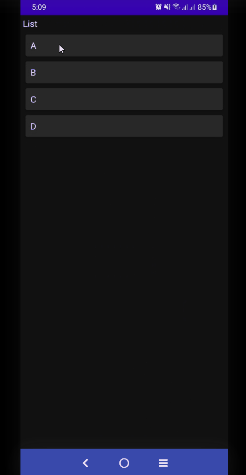
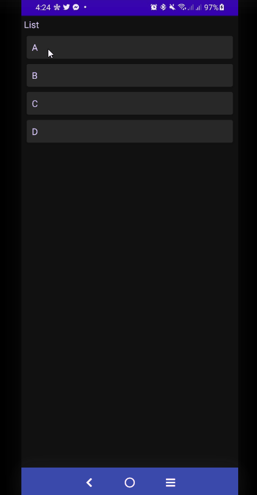
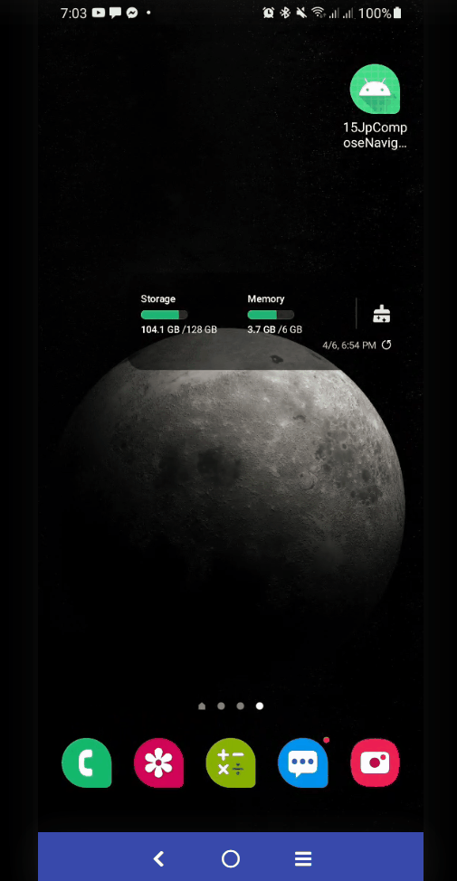
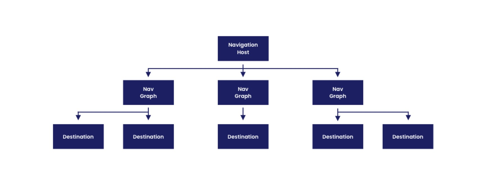

# Navigation In JetPack Compose

- [Navigation In JetPack Compose](#navigation-in-jetpack-compose)
  - [Setup](#setup)
  - [Getting started](#getting-started)
    - [Creating a NavHost](#creating-a-navhost)
    - [Navigate to a composable](#navigate-to-a-composable)
      - [Navigation and the back stack](#navigation-and-the-back-stack)
    - [Navigate with arguments](#navigate-with-arguments)
    - [Adding optional arguments](#adding-optional-arguments)
  - [👉 Cleaning Up](#-cleaning-up)
  - [Nested Navigation](#nested-navigation)
    - [Without Nested Navigation](#without-nested-navigation)
      - [Hiding Status Bar for Splash Screen](#hiding-status-bar-for-splash-screen)
      - [Define Screens](#define-screens)
      - [Building NavHost](#building-navhost)
      - [Building Screens](#building-screens)
    - [With Nested Navigation 🚀](#with-nested-navigation-)
      - [Improved Screen Definitions 🚀](#improved-screen-definitions-)

## Setup

```groovy
 def nav_version = "2.4.1"
 implementation "androidx.navigation:navigation-compose:$nav_version"
```

[https://developer.android.com/jetpack/compose/navigation#groovy](https://developer.android.com/jetpack/compose/navigation#groovy)

## Getting started

The `NavController` is the central API for the Navigation component. It is stateful and keeps track of the back stack of composables that make up the screens in your app and the state of each screen.

You can create a NavController by using the `rememberNavController`() method in your composable:

```kotlin
val navController = rememberNavController()
```

You should create the `NavController` in the place in your composable hierarchy where all composables that need to reference it have access to it. This follows the principles of `state hoisting` and allows you to use the NavController and the state it provides via `currentBackStackEntryAsState()`to be used as the source of truth for updating composables outside of your screens.

```kotlin
@Composable
fun MyApp() {
    BuildNavigation()
}

@Composable
fun BuildNavigation() {
    val navController = rememberNavController()
    //..
}
```

### Creating a NavHost

Each `NavController` must be associated with a single `NavHost` composable. The NavHost links the NavController with a navigation graph that specifies the composable destinations that you should be able to navigate between. As you navigate between composables, the content of the `NavHost` is automatically `recomposed`. Each composable destination in the navigation graph is associated with a route.

Creating the `NavHost` requires the `NavController` previously created via `rememberNavController()` and the route of the starting destination of your graph.

```kotlin
@Composable
fun BuildNavigation() {
    val navController = rememberNavController()
    NavHost(navController = navController, startDestination = "/list_screen") {
     //..
    }
}
```

You can add to your navigation structure by using the `composable()` method. This method requires that you provide a `route` and the `composable` that should be linked to the destination:

```kotlin
@Composable
fun BuildNavigation() {
    val navController = rememberNavController()
    NavHost(navController = navController, startDestination = "/list_screen") {
        composable(route = "/list_screen") {
            ListScreen(navController = navController)
        }
        composable(route = "/details_screen") {
            DetailsScreen(navController = navController)
        }
    }
}
```

### Navigate to a composable

To navigate to a composable destination in the navigation graph, you must use the `navigate()` method. `navigate()` takes a single String parameter that represents the destination’s route. To navigate from a composable within the navigation graph, call `navigate()`:

```kotlin
@Composable
fun ListScreen(navController: NavController) {
    Column(
        modifier = Modifier
            .fillMaxSize()
            .padding(5.dp),
    ) {
        Text(text = "List")
        Spacer(modifier = Modifier.size(5.dp))
        LazyColumn {
            items(lists) { i ->
                Card(
                    modifier = Modifier
                        .fillMaxWidth()
                        .padding(5.dp)
                        .clickable {
                            navController.navigate("/details_screen")

                        }, elevation = 4.dp
                ) {
                    Text(text = "$i", modifier = Modifier.padding(10.dp))
                }
            }
        }
    }
}

@Composable
fun DetailsScreen(navController: NavController) {
    Column(
        modifier = Modifier.fillMaxSize(),
        horizontalAlignment = Alignment.CenterHorizontally,
        verticalArrangement = Arrangement.Center
    ) {
        Text(text = "DetailsScreen")
        Spacer(modifier = Modifier.size(5.dp))
        Button(onClick = {
//            navController.navigate("/list_screen")
            navController.popBackStack()
        }) {
            Text(text = "Go to List")
        }
    }
}
```

<div align="center">

</div>

#### Navigation and the back stack

You should only call navigate() as part of a callback and not as part of your composable itself, to avoid calling navigate() on every recomposition.

By default, navigate() adds your new destination to the back stack. You can modify the behavior of navigate by attaching additional navigation options to our navigate() call:

```kotlin
// Pop everything up to the "home" destination off the back stack before
// navigating to the "friendslist" destination
navController.navigate("friendslist") {
    popUpTo("home")
}

// Pop everything up to and including the "home" destination off
// the back stack before navigating to the "friendslist" destination
navController.navigate("friendslist") {
    popUpTo("home") { inclusive = true }
}

// Navigate to the "search” destination only if we’re not already on
// the "search" destination, avoiding multiple copies on the top of the
// back stack
navController.navigate("search") {
    launchSingleTop = true
}
```

See the [popUpTo](https://developer.android.com/guide/navigation/navigation-navigate#back-stack) guide for more use cases.

### Navigate with arguments

Navigation compose also supports passing arguments between composable destinations. In order to do this, you need to add argument placeholders to the route.

```kotlin
    NavHost(navController = navController, startDestination = "/list_screen") {
        //..
        composable(
            route = "/details_screen/{item_id}",
        ) {
            //..
        }
    }
```

By default, all arguments are parsed as strings. You can specify another type by using the `arguments` parameter to set a `type`:

```kotlin
    NavHost(navController = navController, startDestination = "/list_screen") {
        //..
        composable(
            route = "/details_screen/{item_id}",
            arguments = listOf(navArgument("item_id") { type = NavType.StringType })//optional
        ) {
            //..
        }
    }
```

You should extract the `NavArguments` from the `NavBackStackEntry` that is available in the lambda of the `composable()` function.

```kotlin
    NavHost(navController = navController, startDestination = "/list_screen") {
        //..
        composable(
            route = "/details_screen/{item_id}",
            //arguments = listOf(navArgument("item_id") { type = NavType.StringType })
        ) { backStackEntry ->
            //extract the `NavArguments` from the `NavBackStackEntry`
            val id = backStackEntry.arguments?.getString("item_id")

            DetailsScreen(navController = navController, id)
        }
    }
```

**To pass the argument to the destination, you need to add the value to the route in place of the placeholder in the call to `navigate()`**:

```kotlin
navController.navigate("profile/1")
```

```kotlin
@Composable
fun ListScreen(navController: NavController) {
    Column(
        modifier = Modifier
            .fillMaxSize()
            .padding(5.dp),
    ) {
        Text(text = "List")
        Spacer(modifier = Modifier.size(5.dp))
        LazyColumn {
            items(lists) { i ->
                Card(
                    modifier = Modifier
                        .fillMaxWidth()
                        .padding(5.dp)
                        .clickable {
                            val index = lists.indexOf(i)
                            navController.navigate("/details_screen/$index")
                        }, elevation = 4.dp
                ) {
                    Text(text = "$i", modifier = Modifier.padding(10.dp))
                }
            }
        }
    }
}

@Composable
fun DetailsScreen(navController: NavController, id: String?) {
    Column(
        modifier = Modifier.fillMaxSize(),
        horizontalAlignment = Alignment.CenterHorizontally,
        verticalArrangement = Arrangement.Center
    ) {

        id?.let {
            val itemId = it.toInt()
            val item = lists[itemId]
            Text(text = "$item")
        }
        Spacer(modifier = Modifier.size(5.dp))
        Button(onClick = {
//            navController.navigate("/list_screen")
            navController.popBackStack()
        }) {
            Text(text = "Go to List")
        }
    }
}
```

For a list of supported types, see [Pass data between destinations](https://developer.android.com/guide/navigation/navigation-pass-data#supported_argument_types)

<div align="center">

</div>

### Adding optional arguments

Navigation Compose also supports optional navigation arguments. Optional arguments differ from required arguments in two ways:

- They must be included using query parameter syntax (`"?argName={argName}"`)
- They must have a `defaultValue` set, or have `nullability = true` (which implicitly sets the default value to `null`)

This means that all optional arguments must be explicitly added to the `composable()` function as a list:

```kotlin
composable(
    "profile?userId={userId}",
    arguments = listOf(navArgument("userId") { defaultValue = "me" })
) { backStackEntry ->
    Profile(navController, backStackEntry.arguments?.getString("userId"))
}
```

Now, even if there is no argument passed to the destination, the `defaultValue` of `"me"` will be used instead.

The structure of handling the arguments through the routes means that your composables remain completely independent of Navigation and are much more testable.

## 👉 Cleaning Up

As you can imagine, repeating our routes everywhere we want to navigate isn’t a very scalable approach. We want to be able to re-use the routes. This will prevent us from introducing bugs with a typo and help us when we want to change our navigation logic. There are a few approaches for this, i.e. defining all routes as constants in an object (or multiple).

`sealed classes` is a bit easier to read and generally easier to maintain.

```kotlin
sealed class Screen(val route: String) {
    object List : Screen("/list_screen")
    object Details : Screen("/details_screen/{item_id}") {
        fun createRoute(id: Int) = "/details_screen/$id"
    }
}
```

```kotlin
class MainActivity : ComponentActivity() {
    override fun onCreate(savedInstanceState: Bundle?) {
        super.onCreate(savedInstanceState)
        setContent {
            NavigationTheme {
                // A surface container using the 'background' color from the theme
                Surface(
                    modifier = Modifier.fillMaxSize(),
                    color = MaterialTheme.colors.background
                ) {
                    MyApp()
                }
            }
        }
    }
}

@Composable
fun MyApp() {
    BuildNavigation()
}

val lists = listOf("A", "B", "C", "D")

@Composable
fun BuildNavigation() {
    val navController = rememberNavController()
    NavHost(navController = navController, startDestination = Screen.List.route) {
        composable(
//            route = "/list_screen",
            route = Screen.List.route
        ) {
            ListScreen(navController = navController)
        }
        composable(
//            route = "/details_screen/{item_id}",
            route = Screen.Details.route
        ) { backStackEntry ->
            val id = backStackEntry.arguments?.getString("item_id")
            DetailsScreen(navController = navController, id)
        }
    }
}


@Composable
fun ListScreen(navController: NavController) {
    Column(
        modifier = Modifier
            .fillMaxSize()
            .padding(5.dp),
    ) {
        Text(text = "List")
        Spacer(modifier = Modifier.size(5.dp))
        LazyColumn {
            items(lists) { i ->
                Card(
                    modifier = Modifier
                        .fillMaxWidth()
                        .padding(5.dp)
                        .clickable {
                            val index = lists.indexOf(i)
                            navController.navigate(route = Screen.Details.createRoute(index))
                        }, elevation = 4.dp
                ) {
                    Text(text = "$i", modifier = Modifier.padding(10.dp))
                }
            }
        }
    }
}

@Composable
fun DetailsScreen(navController: NavController, itemId: String?) {
    Column(
        modifier = Modifier.fillMaxSize(),
        horizontalAlignment = Alignment.CenterHorizontally,
        verticalArrangement = Arrangement.Center
    ) {

        itemId?.let {
            val id = itemId.toInt()
            val item = lists[id]
            Text(text = "$item")
        }

        Spacer(modifier = Modifier.size(5.dp))
        Button(onClick = {
            navController.popBackStack()
        }) {
            Text(text = "Go to List")
        }
    }
}
```

## Nested Navigation

Destinations can be grouped into a nested graph to modularize a particular flow in your app’s UI. An example of this could be a self-contained login flow.

<div align="center">

</div>

### Without Nested Navigation

<div align="center">

</div>

#### Hiding Status Bar for Splash Screen

```kotlin
@Composable
fun NavigationTheme(
    darkTheme: Boolean = isSystemInDarkTheme(),
    content: @Composable () -> Unit
) {
    //S: hide status bar
    //https://github.com/google/accompanist/tree/main/systemuicontroller
    //implementation "com.google.accompanist:accompanist-systemuicontroller:0.24.5-alpha"
    val systemUiController = rememberSystemUiController()
    systemUiController.isStatusBarVisible = false // Status bar
//    systemUiController.isNavigationBarVisible = false // Navigation bar
   //systemUiController.isSystemBarsVisible = false // Status & Navigation bars
    //E: hide status bar

    val colors = if (darkTheme) {
        DarkColorPalette
    } else {
        LightColorPalette
    }


    MaterialTheme(
        colors = colors,
        typography = Typography,
        shapes = Shapes,
        content = content
    )
}
```

#### Define Screens

```kotlin
sealed class Screen(val route: String) {
    object Splash : Screen("splash_screen")
    object Login : Screen("login_screen")
    object Register : Screen("register_screen")
    object List : Screen("list_screen")
    object Details : Screen("details_screen/{item_id}") {
        fun createRoute(id: Int) = "details_screen/$id"
    }
}
```

#### Building NavHost

```kotlin
@Composable
fun MyApp() {
    BuildNavigation()
}
@Composable
fun BuildNavigation() {
    val navController = rememberNavController()
    NavHost(navController = navController, startDestination = Screen.Splash.route) {
        composable(route = Screen.Splash.route) {
            SplashScreen(navController = navController)
        }
        composable(route = Screen.Login.route) {
            LoginScreen(navController = navController)
        }
        composable(route = Screen.Register.route) {
            RegisterScreen(navController = navController)
        }
        composable(route = Screen.List.route) {
            ListScreen(navController = navController)
        }
        composable(route = Screen.Details.route) { backStackEntry ->
            val id = backStackEntry.arguments?.getString("item_id")
            DetailsScreen(navController = navController, id)
        }
    }
}
```

#### Building Screens

```kotlin
@Composable
fun SplashScreen(navController: NavController) {
    val scale = remember {
        Animatable(0f)        //  androidx.compose.animation.core
    }
    val systemUiController = rememberSystemUiController()
    // Animation
    LaunchedEffect(key1 = true) {
        scale.animateTo(
            targetValue = 0.7f,
            // tween Animation
            animationSpec = tween(
                durationMillis = 800,
                easing = {
                    OvershootInterpolator(4f).getInterpolation(it)
                })
        )
        // Customize the delay time
        delay(1000L)

        systemUiController.isStatusBarVisible = true //Show Status bar
        systemUiController.setStatusBarColor(Color.Black)

        navController.navigate(route = Screen.Login.route) {
            popUpTo(0)
        }
    }

    Box(
        contentAlignment = Alignment.Center,
        modifier = Modifier.fillMaxSize()
    ) {
        Image(
            painter = painterResource(id = R.drawable.ic_launcher_background),
            contentDescription = "Logo",
            modifier = Modifier.scale(scale.value)
        )
    }
}

@Composable
fun LoginScreen(navController: NavController) {
    Column(
        modifier = Modifier.fillMaxSize(),
        horizontalAlignment = Alignment.CenterHorizontally,
        verticalArrangement = Arrangement.Center
    ) {
        Text(text = "LoginPage", style = MaterialTheme.typography.h2)
        Button(
            onClick = {
                navController.navigate(route = Screen.List.route) {
                    popUpTo(0)
                }
            }) {
            Text(text = "Login")
        }
        Spacer(modifier = Modifier.size(10.dp))
        Row {
            Text(text = "Not registered yet? ", style = MaterialTheme.typography.subtitle1)
            Text(
                text = "Create New Account",
                style = MaterialTheme.typography.subtitle1,
                color = MaterialTheme.colors.primary,
                modifier = Modifier.clickable {
                    navController.navigate(route = Screen.Register.route){ popUpTo(0)}
                },
            )
        }
    }
}

@Composable
fun RegisterScreen(navController: NavController) {
    Column(
        modifier = Modifier.fillMaxSize(),
        horizontalAlignment = Alignment.CenterHorizontally,
        verticalArrangement = Arrangement.Center
    ) {
        Text(text = "RegisterPage", style = MaterialTheme.typography.h2)
        Button(onClick = { navController.navigate(route = Screen.List.route) { popUpTo(0) } }) {
            Text(text = "Register")
        }
        Spacer(modifier = Modifier.size(10.dp))
        Row {
            Text(text = "Already have an Account? ", style = MaterialTheme.typography.subtitle1)
            Text(
                text = "Sign In",
                style = MaterialTheme.typography.subtitle1,
                color = MaterialTheme.colors.primary,
                modifier = Modifier.clickable {
                    navController.navigate(route = Screen.Login.route){ popUpTo(0)}
                },
            )
        }
    }
}


val lists = listOf("A", "B", "C", "D")

@Composable
fun ListScreen(navController: NavController) {
    Column(
        modifier = Modifier
            .fillMaxSize()
            .padding(5.dp),
    ) {
        Text(text = "List")
        Spacer(modifier = Modifier.size(5.dp))
        LazyColumn {
            items(lists) { i ->
                Card(
                    modifier = Modifier
                        .fillMaxWidth()
                        .padding(5.dp)
                        .clickable {
                            val index = lists.indexOf(i)
                            navController.navigate(route = Screen.Details.createRoute(index))
                        }, elevation = 4.dp
                ) {
                    Text(text = "$i", modifier = Modifier.padding(10.dp))
                }
            }
        }
    }
}

@Composable
fun DetailsScreen(navController: NavController, itemId: String?) {
    Column(
        modifier = Modifier.fillMaxSize(),
        horizontalAlignment = Alignment.CenterHorizontally,
        verticalArrangement = Arrangement.Center
    ) {

        itemId?.let {
            val id = itemId.toInt()
            val item = lists[id]
            Text(text = "$item")
        }

        Spacer(modifier = Modifier.size(5.dp))
        Button(onClick = {
            navController.popBackStack()
        }) {
            Text(text = "Go to List")
        }
    }
}
```

### With Nested Navigation 🚀

<div align="center">

</div>

The nested graph encapsulates its destinations. As with the root graph, a nested graph must have a destination identified as the start destination by its route. This is the destination that is navigated to when you navigate to the route associated with the nested graph.


```kotlin
const val ROOT_ROUTE = "root"
const val AUTH_ROUTE = "auth"
const val HOME_ROUTE = "home"

@Composable
fun BuildNavigation() {
    val navController = rememberNavController()
    NavHost(
        navController = navController,
        startDestination = Screen.Splash.route,
        //route = ROOT_ROUTE //(optional)
    ) {
        composable(route = Screen.Splash.route) {
            SplashScreen(navController = navController)
        }
        loginGraph(navController = navController)
        homeGraph(navController = navController)
   }
}

fun NavGraphBuilder.homeGraph(navController: NavController) {
    //home/list
    //home/registration
    navigation(startDestination = Screen.List.route, route = HOME_ROUTE) {
        composable(route = Screen.List.route) {
            ListScreen(navController = navController)
        }
        composable(route = Screen.Details.route) { backStackEntry ->
            val id = backStackEntry.arguments?.getString("item_id")
            DetailsScreen(navController = navController, id)
        }
    }
}

fun NavGraphBuilder.loginGraph(navController: NavController) {
    //auth/login
    //auth/registration
    navigation(startDestination = Screen.Login.route, route = AUTH_ROUTE) {
        composable(route = Screen.Login.route) {
            LoginScreen(navController = navController)
        }
        composable(route = Screen.Register.route) {
            RegisterScreen(navController = navController)
        }
    }
}

//.. all are the same


@Composable
fun LoginScreen(navController: NavController) {
    //...
        Button(
            onClick = {
                /** Now any option is possible */
//                navController.navigate(route = Screen.List.route) {
//                    popUpTo(0)
//                }
                //or
//                navController.popBackStack()
//                navController.navigate(route = HOME_ROUTE)
                //Or
              navController.navigate(route = HOME_ROUTE) { popUpTo(0) }
            }) {
            Text(text = "Login")
        }
      //...
    }
}

@Composable
fun RegisterScreen(navController: NavController) {
   //..
        Button(onClick = {
            navController.navigate(route = HOME_ROUTE) {
                popUpTo(0)
            }
        }) {
            Text(text = "Register")
        }
    }
}
```

#### Improved Screen Definitions 🚀

```kotlin
const val ROOT_ROUTE = "root"
const val AUTH_ROUTE = "auth"
const val HOME_ROUTE = "home"

sealed class AuthScreen(val route: String) {
    object Login : AuthScreen("login_screen")
    object Register : AuthScreen("register_screen")
}

sealed class HomeScreen(val route: String) {
    object List : HomeScreen("list_screen")
    object Details : HomeScreen("details_screen/{item_id}") {
        fun createRoute(id: Int) = "details_screen/$id"
    }
}

sealed class RootScreen(val route: String) {
    object Splash : RootScreen("splash_screen")
}
```
