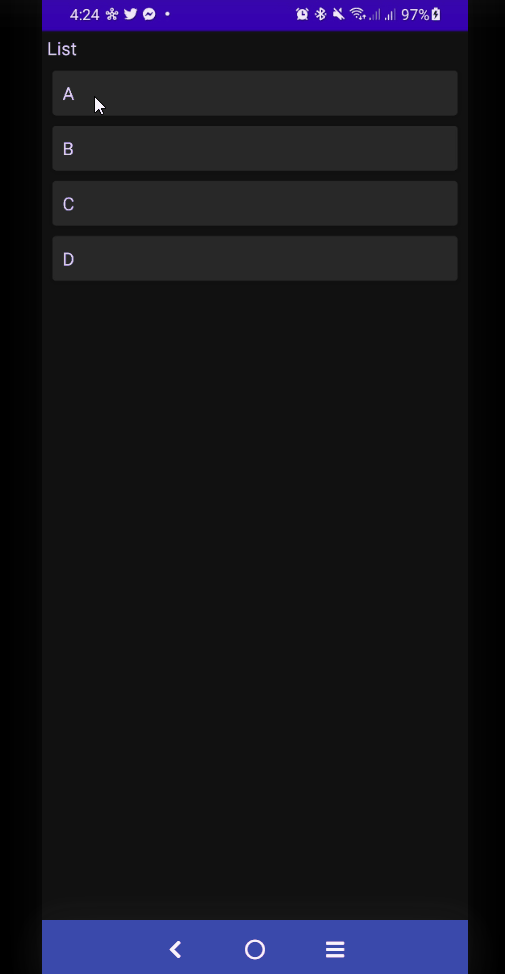
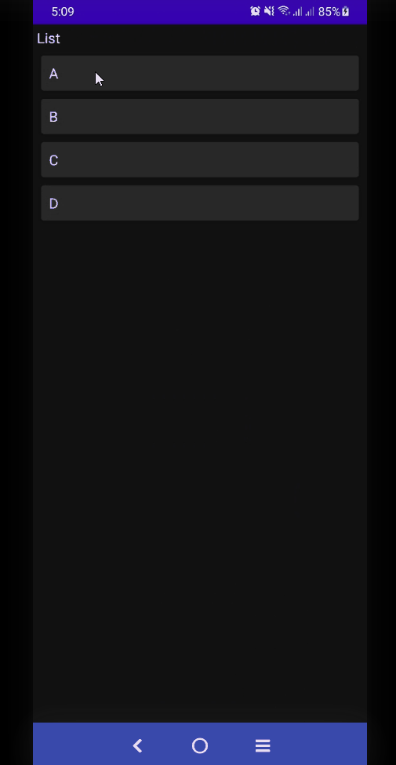
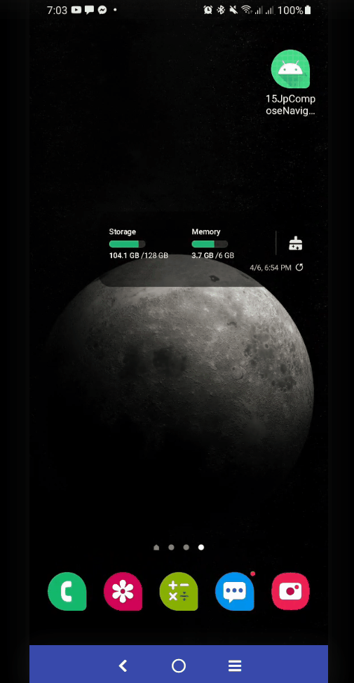
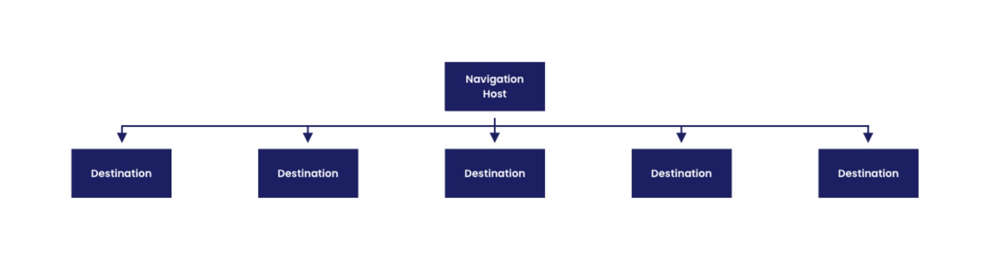
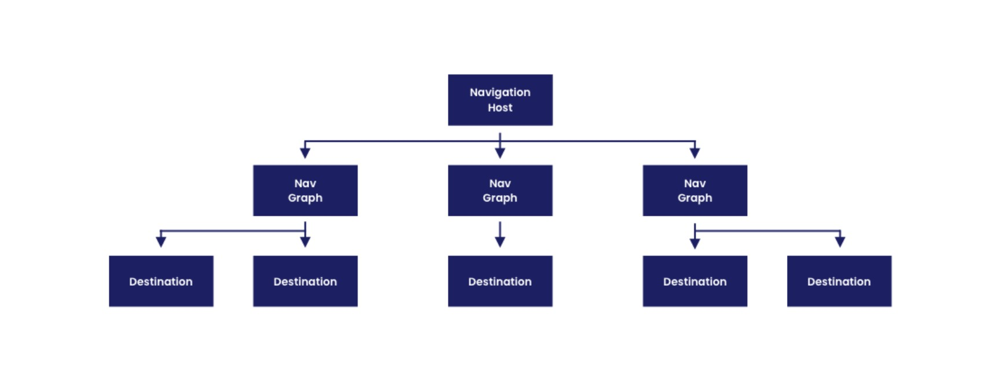
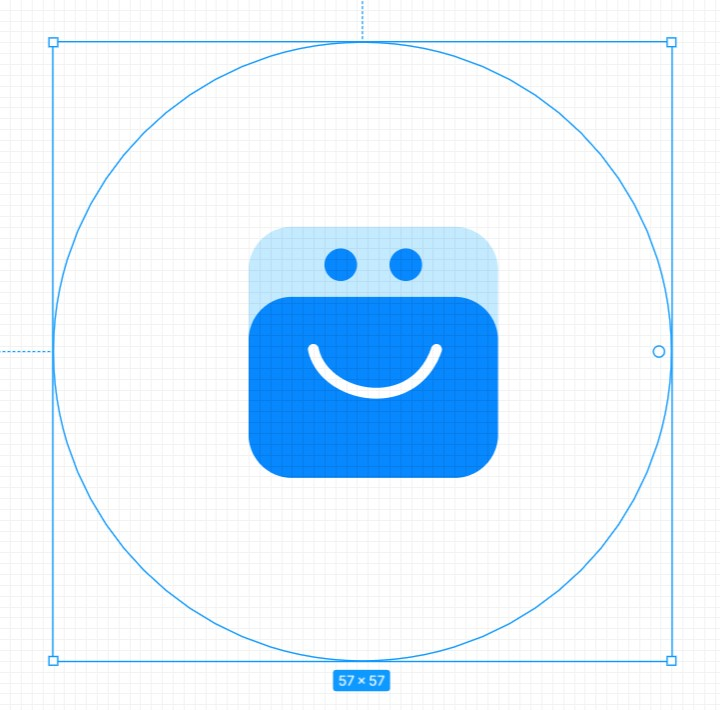
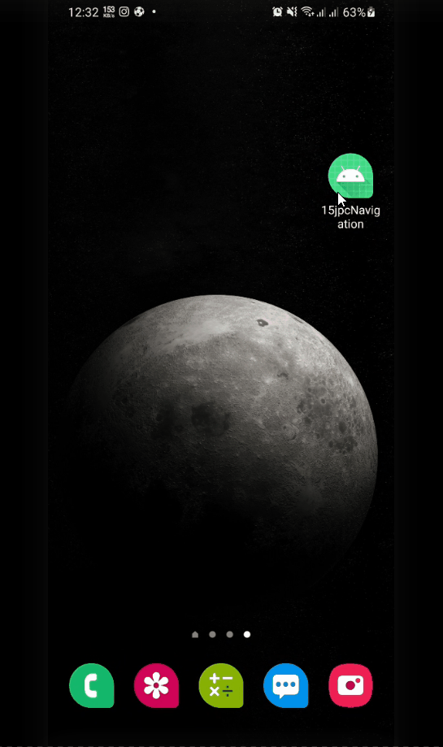
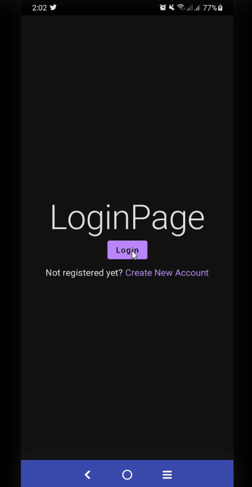
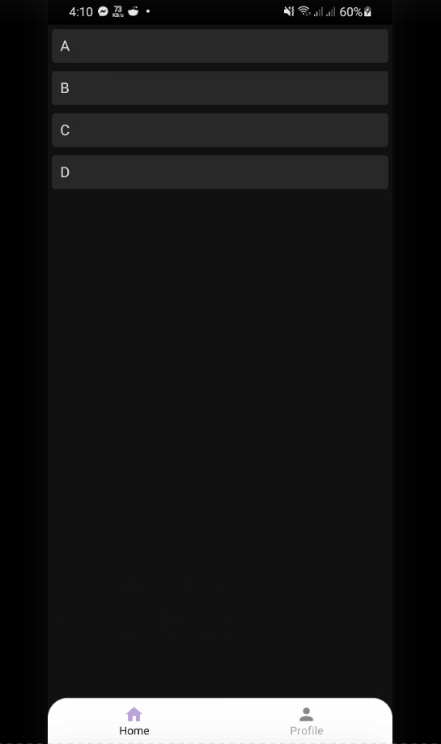

# Navigation In JetPack Compose

- [Navigation In JetPack Compose](#navigation-in-jetpack-compose)
  - [Setup](#setup)
  - [Getting started](#getting-started)
    - [Creating a NavHost](#creating-a-navhost)
    - [Navigate to a composable](#navigate-to-a-composable)
      - [Navigation and the back stack](#navigation-and-the-back-stack)
    - [Navigate with arguments](#navigate-with-arguments)
    - [Adding optional arguments](#adding-optional-arguments)
  - [👉 Cleaning Up](#-cleaning-up)
  - [Nested Navigation](#nested-navigation)
    - [Without Nested Navigation](#without-nested-navigation)
      - [Splash Screen](#splash-screen)
      - [Define Screens](#define-screens)
      - [Building NavHost](#building-navhost)
      - [Building Screens](#building-screens)
    - [With Nested Navigation 🚀](#with-nested-navigation-)
      - [Improved Screen Definitions 🚀](#improved-screen-definitions-)
  - [👌 Splash Api 👌](#-splash-api-)
    - [Dependencies](#dependencies)
    - [Create a theme](#create-a-theme)
      - [Custom Logo For Splash Screen](#custom-logo-for-splash-screen)
    - [Call `installSplashScreen`](#call-installsplashscreen)
    - [Longer period](#longer-period)
    - [animation](#animation)
    - [(Off topic) Updated Project - removing previous timer based splash screen](#off-topic-updated-project---removing-previous-timer-based-splash-screen)
  - [🍹 Navigation Animation 🍹](#-navigation-animation-)
    - [Setup](#setup-1)
    - [Replace NavHost with AnimatedNavHost](#replace-navhost-with-animatednavhost)
    - [Implementing the animations](#implementing-the-animations)
  - [Integration with the Bottom Navigation Bar](#integration-with-the-bottom-navigation-bar)

## Setup

```groovy
 def nav_version = "2.4.1"
 implementation "androidx.navigation:navigation-compose:$nav_version"
```

[https://developer.android.com/jetpack/compose/navigation#groovy](https://developer.android.com/jetpack/compose/navigation#groovy)

All used dependencies are :.

```groovy
    def nav_version = "2.4.1"
    implementation "androidx.navigation:navigation-compose:$nav_version"
    implementation "com.google.accompanist:accompanist-navigation-animation:0.24.5-alpha"
    implementation "com.google.accompanist:accompanist-systemuicontroller:0.24.5-alpha"
    implementation 'androidx.core:core-splashscreen:1.0.0-beta01'
```

## Getting started


<div align="center">

</div>

The `NavController` is the central API for the Navigation component. It is stateful and keeps track of the back stack of composables that make up the screens in your app and the state of each screen.

You can create a NavController by using the `rememberNavController`() method in your composable:

```kotlin
val navController = rememberNavController()
```

You should create the `NavController` in the place in your composable hierarchy where all composables that need to reference it have access to it. This follows the principles of `state hoisting` and allows you to use the NavController and the state it provides via `currentBackStackEntryAsState()`to be used as the source of truth for updating composables outside of your screens.

```kotlin
@Composable
fun MyApp() {
    BuildNavigation()
}

@Composable
fun BuildNavigation() {
    val navController = rememberNavController()
    //..
}
```

### Creating a NavHost

Each `NavController` must be associated with a single `NavHost` composable. The NavHost links the NavController with a navigation graph that specifies the composable destinations that you should be able to navigate between. As you navigate between composables, the content of the `NavHost` is automatically `recomposed`. Each composable destination in the navigation graph is associated with a route.

Creating the `NavHost` requires the `NavController` previously created via `rememberNavController()` and the route of the starting destination of your graph.

```kotlin
@Composable
fun BuildNavigation() {
    val navController = rememberNavController()
    NavHost(navController = navController, startDestination = "/list_screen") {
     //..
    }
}
```

You can add to your navigation structure by using the `composable()` method. This method requires that you provide a `route` and the `composable` that should be linked to the destination:

```kotlin
@Composable
fun BuildNavigation() {
    val navController = rememberNavController()
    NavHost(navController = navController, startDestination = "/list_screen") {
        composable(route = "/list_screen") {
            ListScreen(navController = navController)
        }
        composable(route = "/details_screen") {
            DetailsScreen(navController = navController)
        }
    }
}
```

### Navigate to a composable

To navigate to a composable destination in the navigation graph, you must use the `navigate()` method. `navigate()` takes a single String parameter that represents the destination’s route. To navigate from a composable within the navigation graph, call `navigate()`:

```kotlin
@Composable
fun ListScreen(navController: NavController) {
    Column(
        modifier = Modifier
            .fillMaxSize()
            .padding(5.dp),
    ) {
        Text(text = "List")
        Spacer(modifier = Modifier.size(5.dp))
        LazyColumn {
            items(lists) { i ->
                Card(
                    modifier = Modifier
                        .fillMaxWidth()
                        .padding(5.dp)
                        .clickable {
                            navController.navigate("/details_screen")

                        }, elevation = 4.dp
                ) {
                    Text(text = "$i", modifier = Modifier.padding(10.dp))
                }
            }
        }
    }
}

@Composable
fun DetailsScreen(navController: NavController) {
    Column(
        modifier = Modifier.fillMaxSize(),
        horizontalAlignment = Alignment.CenterHorizontally,
        verticalArrangement = Arrangement.Center
    ) {
        Text(text = "DetailsScreen")
        Spacer(modifier = Modifier.size(5.dp))
        Button(onClick = {
//            navController.navigate("/list_screen")
            navController.popBackStack()
        }) {
            Text(text = "Go to List")
        }
    }
}
```

<div align="center">

</div>

#### Navigation and the back stack

You should only call navigate() as part of a callback and not as part of your composable itself, to avoid calling navigate() on every recomposition.

By default, navigate() adds your new destination to the back stack. You can modify the behavior of navigate by attaching additional navigation options to our navigate() call:

```kotlin
// Pop everything up to the "home" destination off the back stack before
// navigating to the "friendslist" destination
navController.navigate("friendslist") {
    popUpTo("home")
}

// Pop everything up to and including the "home" destination off
// the back stack before navigating to the "friendslist" destination
navController.navigate("friendslist") {
    popUpTo("home") { inclusive = true }
}

// Navigate to the "search” destination only if we’re not already on
// the "search" destination, avoiding multiple copies on the top of the
// back stack
navController.navigate("search") {
    launchSingleTop = true
}
```

See the [popUpTo](https://developer.android.com/guide/navigation/navigation-navigate#back-stack) guide for more use cases.

### Navigate with arguments

Navigation compose also supports passing arguments between composable destinations. In order to do this, you need to add argument placeholders to the route.

```kotlin
    NavHost(navController = navController, startDestination = "/list_screen") {
        //..
        composable(
            route = "/details_screen/{item_id}",
        ) {
            //..
        }
    }
```

By default, all arguments are parsed as strings. You can specify another type by using the `arguments` parameter to set a `type`:

```kotlin
    NavHost(navController = navController, startDestination = "/list_screen") {
        //..
        composable(
            route = "/details_screen/{item_id}",
            arguments = listOf(navArgument("item_id") { type = NavType.StringType })//optional
        ) {
            //..
        }
    }
```

You should extract the `NavArguments` from the `NavBackStackEntry` that is available in the lambda of the `composable()` function.

```kotlin
    NavHost(navController = navController, startDestination = "/list_screen") {
        //..
        composable(
            route = "/details_screen/{item_id}",
            //arguments = listOf(navArgument("item_id") { type = NavType.StringType })
        ) { backStackEntry ->
            //extract the `NavArguments` from the `NavBackStackEntry`
            val id = backStackEntry.arguments?.getString("item_id")

            DetailsScreen(navController = navController, id)
        }
    }
```

**To pass the argument to the destination, you need to add the value to the route in place of the placeholder in the call to `navigate()`**:

```kotlin
navController.navigate("profile/1")
```

```kotlin
@Composable
fun ListScreen(navController: NavController) {
    Column(
        modifier = Modifier
            .fillMaxSize()
            .padding(5.dp),
    ) {
        Text(text = "List")
        Spacer(modifier = Modifier.size(5.dp))
        LazyColumn {
            items(lists) { i ->
                Card(
                    modifier = Modifier
                        .fillMaxWidth()
                        .padding(5.dp)
                        .clickable {
                            val index = lists.indexOf(i)
                            navController.navigate("/details_screen/$index")
                        }, elevation = 4.dp
                ) {
                    Text(text = "$i", modifier = Modifier.padding(10.dp))
                }
            }
        }
    }
}

@Composable
fun DetailsScreen(navController: NavController, id: String?) {
    Column(
        modifier = Modifier.fillMaxSize(),
        horizontalAlignment = Alignment.CenterHorizontally,
        verticalArrangement = Arrangement.Center
    ) {

        id?.let {
            val itemId = it.toInt()
            val item = lists[itemId]
            Text(text = "$item")
        }
        Spacer(modifier = Modifier.size(5.dp))
        Button(onClick = {
//            navController.navigate("/list_screen")
            navController.popBackStack()
        }) {
            Text(text = "Go to List")
        }
    }
}
```

For a list of supported types, see [Pass data between destinations](https://developer.android.com/guide/navigation/navigation-pass-data#supported_argument_types)

<div align="center">

</div>

### Adding optional arguments

Navigation Compose also supports optional navigation arguments. Optional arguments differ from required arguments in two ways:

- They must be included using query parameter syntax (`"?argName={argName}"`)
- They must have a `defaultValue` set, or have `nullability = true` (which implicitly sets the default value to `null`)

This means that all optional arguments must be explicitly added to the `composable()` function as a list:

```kotlin
composable(
    "profile?userId={userId}",
    arguments = listOf(navArgument("userId") { defaultValue = "me" })
) { backStackEntry ->
    Profile(navController, backStackEntry.arguments?.getString("userId"))
}
```

Now, even if there is no argument passed to the destination, the `defaultValue` of `"me"` will be used instead.

The structure of handling the arguments through the routes means that your composables remain completely independent of Navigation and are much more testable.

## 👉 Cleaning Up

As you can imagine, repeating our routes everywhere we want to navigate isn’t a very scalable approach. We want to be able to re-use the routes. This will prevent us from introducing bugs with a typo and help us when we want to change our navigation logic. There are a few approaches for this, i.e. defining all routes as constants in an object (or multiple).

`sealed classes` is a bit easier to read and generally easier to maintain.

```kotlin
sealed class Screen(val route: String) {
    object List : Screen("/list_screen")
    object Details : Screen("/details_screen/{item_id}") {
        fun createRoute(id: Int) = "/details_screen/$id"
    }
}
```

```kotlin
class MainActivity : ComponentActivity() {
    override fun onCreate(savedInstanceState: Bundle?) {
        super.onCreate(savedInstanceState)
        setContent {
            NavigationTheme {
                // A surface container using the 'background' color from the theme
                Surface(
                    modifier = Modifier.fillMaxSize(),
                    color = MaterialTheme.colors.background
                ) {
                    MyApp()
                }
            }
        }
    }
}

@Composable
fun MyApp() {
    BuildNavigation()
}

val lists = listOf("A", "B", "C", "D")

@Composable
fun BuildNavigation() {
    val navController = rememberNavController()
    NavHost(navController = navController, startDestination = Screen.List.route) {
        composable(
//            route = "/list_screen",
            route = Screen.List.route
        ) {
            ListScreen(navController = navController)
        }
        composable(
//            route = "/details_screen/{item_id}",
            route = Screen.Details.route
        ) { backStackEntry ->
            val id = backStackEntry.arguments?.getString("item_id")
            DetailsScreen(navController = navController, id)
        }
    }
}


@Composable
fun ListScreen(navController: NavController) {
    Column(
        modifier = Modifier
            .fillMaxSize()
            .padding(5.dp),
    ) {
        Text(text = "List")
        Spacer(modifier = Modifier.size(5.dp))
        LazyColumn {
            items(lists) { i ->
                Card(
                    modifier = Modifier
                        .fillMaxWidth()
                        .padding(5.dp)
                        .clickable {
                            val index = lists.indexOf(i)
                            navController.navigate(route = Screen.Details.createRoute(index))
                        }, elevation = 4.dp
                ) {
                    Text(text = "$i", modifier = Modifier.padding(10.dp))
                }
            }
        }
    }
}

@Composable
fun DetailsScreen(navController: NavController, itemId: String?) {
    Column(
        modifier = Modifier.fillMaxSize(),
        horizontalAlignment = Alignment.CenterHorizontally,
        verticalArrangement = Arrangement.Center
    ) {

        itemId?.let {
            val id = itemId.toInt()
            val item = lists[id]
            Text(text = "$item")
        }

        Spacer(modifier = Modifier.size(5.dp))
        Button(onClick = {
            navController.popBackStack()
        }) {
            Text(text = "Go to List")
        }
    }
}
```

## Nested Navigation

Destinations can be grouped into a nested graph to modularize a particular flow in your app’s UI. An example of this could be a self-contained login flow.

<div align="center">

</div>

### Without Nested Navigation

<div align="center">

</div>

#### Splash Screen

```kotlin
@Composable
fun NavigationTheme(
    darkTheme: Boolean = isSystemInDarkTheme(),
    content: @Composable () -> Unit
) {
    //S: hide status bar
    val systemUiController = rememberSystemUiController()
    systemUiController.isStatusBarVisible = false // Status bar
    systemUiController.isNavigationBarVisible = false // Navigation bar
    systemUiController.isSystemBarsVisible = false // Status & Navigation bars
    //E: hide status bar


    val colors = if (darkTheme) {
        DarkColorPalette
    } else {
        LightColorPalette
    }

    MaterialTheme(
        colors = colors,
        typography = Typography,
        shapes = Shapes,
        content = content
    )
}
```

#### Define Screens

```kotlin
sealed class Screen(val route: String) {
    object Splash : Screen("splash_screen")
    object Login : Screen("login_screen")
    object Register : Screen("register_screen")
    object List : Screen("list_screen")
    object Details : Screen("details_screen/{item_id}") {
        fun createRoute(id: Int) = "details_screen/$id"
    }
}
```

#### Building NavHost

```kotlin
@Composable
fun MyApp() {
    BuildNavigation()
}
@Composable
fun BuildNavigation() {
    val navController = rememberNavController()
    NavHost(navController = navController, startDestination = Screen.Splash.route) {
        composable(route = Screen.Splash.route) {
            SplashScreen(navController = navController)
        }
        composable(route = Screen.Login.route) {
            LoginScreen(navController = navController)
        }
        composable(route = Screen.Register.route) {
            RegisterScreen(navController = navController)
        }
        composable(route = Screen.List.route) {
            ListScreen(navController = navController)
        }
        composable(route = Screen.Details.route) { backStackEntry ->
            // showStatusBar(color = Color.Black) -> Status Bar is already shown
            val id = backStackEntry.arguments?.getString("item_id")
            DetailsScreen(navController = navController, id)
        }
    }
}
```

#### Building Screens

```kotlin
@Composable
fun SplashScreen(navController: NavController) {
    val scale = remember {
        Animatable(0f)        //  androidx.compose.animation.core
    }
    // Animation
    LaunchedEffect(key1 = true) {
        scale.animateTo(
            targetValue = 0.7f,
            // tween Animation
            animationSpec = tween(
                durationMillis = 800,
                easing = {
                    OvershootInterpolator(4f).getInterpolation(it)
                })
        )
        // Customize the delay time
        delay(1000L)

        navController.navigate(route = Screen.Login.route) {
            popUpTo(0)
        }
    }

    Box(
        contentAlignment = Alignment.Center,
        modifier = Modifier.fillMaxSize()
    ) {
        Image(
            painter = painterResource(id = R.drawable.ic_launcher_background),
            contentDescription = "Logo",
            modifier = Modifier.scale(scale.value)
        )
    }
}

@Composable
fun LoginScreen(navController: NavController) {
    val systemUiController = rememberSystemUiController()
    Column(
        modifier = Modifier.fillMaxSize(),
        horizontalAlignment = Alignment.CenterHorizontally,
        verticalArrangement = Arrangement.Center
    ) {
        Text(text = "LoginPage", style = MaterialTheme.typography.h2)
        Button(
            onClick = {
                systemUiController.isStatusBarVisible = true // Status bar
                systemUiController.setStatusBarColor(Color.Black)
                navController.navigate(route = Screen.List.route) {
                    popUpTo(0)
                }
            }) {
            Text(text = "Login")
        }
        Spacer(modifier = Modifier.size(10.dp))
        Row {
            Text(text = "Not registered yet? ", style = MaterialTheme.typography.subtitle1)
            Text(
                text = "Create New Account",
                style = MaterialTheme.typography.subtitle1,
                color = MaterialTheme.colors.primary,
                modifier = Modifier.clickable {
                    navController.navigate(route = Screen.Register.route){ popUpTo(0)}
                },
            )
        }
    }
}

@Composable
fun RegisterScreen(navController: NavController) {
    Column(
        modifier = Modifier.fillMaxSize(),
        horizontalAlignment = Alignment.CenterHorizontally,
        verticalArrangement = Arrangement.Center
    ) {
        Text(text = "RegisterPage", style = MaterialTheme.typography.h2)
        Button(onClick = { navController.navigate(route = Screen.List.route) { popUpTo(0) } }) {
            Text(text = "Register")
        }
        Spacer(modifier = Modifier.size(10.dp))
        Row {
            Text(text = "Already have an Account? ", style = MaterialTheme.typography.subtitle1)
            Text(
                text = "Sign In",
                style = MaterialTheme.typography.subtitle1,
                color = MaterialTheme.colors.primary,
                modifier = Modifier.clickable {
                    navController.navigate(route = Screen.Login.route){ popUpTo(0)}
                },
            )
        }
    }
}


val lists = listOf("A", "B", "C", "D")

@Composable
fun ListScreen(navController: NavController) {
    Column(
        modifier = Modifier
            .fillMaxSize()
            .padding(5.dp),
    ) {
        Text(text = "List")
        Spacer(modifier = Modifier.size(5.dp))
        LazyColumn {
            items(lists) { i ->
                Card(
                    modifier = Modifier
                        .fillMaxWidth()
                        .padding(5.dp)
                        .clickable {
                            val index = lists.indexOf(i)
                            navController.navigate(route = Screen.Details.createRoute(index))
                        }, elevation = 4.dp
                ) {
                    Text(text = "$i", modifier = Modifier.padding(10.dp))
                }
            }
        }
    }
}

@Composable
fun DetailsScreen(navController: NavController, itemId: String?) {
    Column(
        modifier = Modifier.fillMaxSize(),
        horizontalAlignment = Alignment.CenterHorizontally,
        verticalArrangement = Arrangement.Center
    ) {

        itemId?.let {
            val id = itemId.toInt()
            val item = lists[id]
            Text(text = "$item")
        }

        Spacer(modifier = Modifier.size(5.dp))
        Button(onClick = {
            navController.popBackStack()
        }) {
            Text(text = "Go to List")
        }
    }
}
```

### With Nested Navigation 🚀

<div align="center">

</div>

The nested graph encapsulates its destinations. As with the root graph, a nested graph must have a destination identified as the start destination by its route. This is the destination that is navigated to when you navigate to the route associated with the nested graph.

```kotlin
const val ROOT_ROUTE = "root"
const val AUTH_ROUTE = "auth"
const val HOME_ROUTE = "home"

@Composable
fun BuildNavigation() {
    val navController = rememberNavController()
    NavHost(
        navController = navController,
        startDestination = Screen.Splash.route,
        //route = ROOT_ROUTE //(optional)
    ) {
        composable(route = Screen.Splash.route) {
            SplashScreen(navController = navController)
        }
        loginGraph(navController = navController)
        homeGraph(navController = navController)
   }
}

fun NavGraphBuilder.homeGraph(navController: NavController) {
    //home/list
    //home/registration
    navigation(startDestination = Screen.List.route, route = HOME_ROUTE) {
        composable(route = Screen.List.route) {
            ListScreen(navController = navController)
        }
        composable(route = Screen.Details.route) { backStackEntry ->
            val id = backStackEntry.arguments?.getString("item_id")
            DetailsScreen(navController = navController, id)
        }
    }
}

fun NavGraphBuilder.loginGraph(navController: NavController) {
    //auth/login
    //auth/registration
    navigation(startDestination = Screen.Login.route, route = AUTH_ROUTE) {
        composable(route = Screen.Login.route) {
            LoginScreen(navController = navController)
        }
        composable(route = Screen.Register.route) {
            RegisterScreen(navController = navController)
        }
    }
}

//.. all are the same


@Composable
fun LoginScreen(navController: NavController) {
    //...
        Button(
            onClick = {
                /** Now any option is possible */
//                navController.navigate(route = Screen.List.route) {
//                    popUpTo(0)
//                }
                //or
//                navController.popBackStack()
//                navController.navigate(route = HOME_ROUTE)
                //Or
              navController.navigate(route = HOME_ROUTE) { popUpTo(0) }
            }) {
            Text(text = "Login")
        }
      //...
    }
}

@Composable
fun RegisterScreen(navController: NavController) {
   //..
        Button(onClick = {
            navController.navigate(route = HOME_ROUTE) {
                popUpTo(0)
            }
        }) {
            Text(text = "Register")
        }
    }
}
```

#### Improved Screen Definitions 🚀

```kotlin
const val ROOT_ROUTE = "root"
const val AUTH_ROUTE = "auth"
const val HOME_ROUTE = "home"

sealed class AuthScreen(val route: String) {
    object Login : AuthScreen("login_screen")
    object Register : AuthScreen("register_screen")
}

sealed class HomeScreen(val route: String) {
    object List : HomeScreen("list_screen")
    object Details : HomeScreen("details_screen/{item_id}") {
        fun createRoute(id: Int) = "details_screen/$id"
    }
}

sealed class RootScreen(val route: String) {
    object Splash : RootScreen("splash_screen")
}
```

## 👌 Splash Api 👌

### Dependencies

```groovy
dependencies {

    implementation 'androidx.core:core-splashscreen:1.0.0-beta01'
}
```

### Create a theme

Create a theme with a parent of `Theme.SplashScreen`, and set the values of `postSplashScreenTheme` to the theme that the Activity should use and `windowSplashScreenAnimatedIcon` to a drawable or animated drawable. The other attributes are optional.

```xml
<?xml version="1.0" encoding="utf-8"?>
<resources>
    <style name="Theme.15jpcNavigation" parent="android:Theme.Material.Light.NoActionBar">
        <item name="android:statusBarColor">@color/purple_700</item>
    </style>
    //New Theme for Splash Screen

    <style name="Theme.App.Starting" parent="Theme.SplashScreen">
        // Set the splash screen background, animated icon, and animation duration.
        <item name="windowSplashScreenBackground">@color/black</item>
        // Use windowSplashScreenAnimatedIcon to add either a drawable or an
        // animated drawable. One of these is required.
        <item name="windowSplashScreenAnimatedIcon">@drawable/ic_launcher_background</item>
        <item name="windowSplashScreenAnimationDuration">200</item>  # Required for
        # animated icons
        // Set the theme of the Activity that directly follows your splash screen.
        <item name="postSplashScreenTheme">@style/Theme.15jpcNavigation</item>  # Required.
    </style>

</resources>
```

In the manifest, replace the theme of the starting activity to the theme created in the previous step.

```xml
<manifest >
    <application
        android:theme="@style/Theme.App.Starting">
        <activity
            android:theme="@style/Theme.App.Starting">
            <intent-filter>
                <action android:name="android.intent.action.MAIN" />
                <category android:name="android.intent.category.LAUNCHER" />
            </intent-filter>
        </activity>
    </application>
</manifest>
```

#### Custom Logo For Splash Screen

Maintain following size ~ `57X57`

<div align="center">

</div>

Then Export as `SVG` from `figma`. And Import as `Vector Asset` in Android Studio.

### Call `installSplashScreen`

Call `installSplashScreen` in the starting activity before calling `super.onCreate()`.

```kotlin
class MainActivity : ComponentActivity() {
    override fun onCreate(savedInstanceState: Bundle?) {
        super.onCreate(savedInstanceState)
        // Log.d("rotation", savedInstanceState.toString())
        // Only Show Splash Screen for the first time running the app...and
        // prevent showing again on screen rotation.
        // savedInstanceState == `null` for the first line
        // on screen rotation it will not be `null`
        if (savedInstanceState == null) {
                installSplashScreen()
        }
        setContent {
            NavigationTheme {
                // A surface container using the 'background' color from the theme
                Surface(
                    modifier = Modifier.fillMaxSize(),
                    color = MaterialTheme.colors.background
                ) {
                    MyApp()
                }
            }
        }

    }
}
```

### Longer period

It's possible to keep the Splash Screen while the app is fetching some initial data. For this purpose, use the setKeepVisibleCondition from splashScreen. Just return true to isReady when you would like to dismiss the Splash Screen.

```kotlin
import androidx.lifecycle.ViewModel
import androidx.lifecycle.viewModelScope
import kotlinx.coroutines.delay
import kotlinx.coroutines.flow.MutableStateFlow
import kotlinx.coroutines.flow.StateFlow
import kotlinx.coroutines.flow.asStateFlow
import kotlinx.coroutines.launch
class MainViewModel : ViewModel() {

    private val _loading = MutableStateFlow(true)
    val loading: StateFlow<Boolean> = _loading.asStateFlow()

    init {
        viewModelScope.launch {
            delay(500L)
            _loading.emit(false)
        }
    }
}
```

```kotlin
class MainActivity : ComponentActivity() {
    private val viewmodel by viewModels<MainViewModel>()
    override fun onCreate(savedInstanceState: Bundle?) {
        super.onCreate(savedInstanceState)
        //        Log.d("rotation", savedInstanceState.toString())
        // Only Show Splash Screen for the first time running the app...and
        // prevent showing again on screen rotation.
        // savedInstanceState == `null` for the first line
        // on screen rotation it will not be `null`
        if (savedInstanceState == null) {
            val splashScreen = installSplashScreen()
            splashScreen.apply {
                setKeepOnScreenCondition {
                    viewmodel.loading.value
                }
            }
        }
        setContent {
            NavigationTheme {
                Surface(
                    modifier = Modifier.fillMaxSize(),
                    color = MaterialTheme.colors.background
                ) {
                    MyApp()
                }
            }
        }

    }
}
```

### animation

```kotlin
class MainActivity : ComponentActivity() {
    private val viewmodel by viewModels<MainViewModel>()
    override fun onCreate(savedInstanceState: Bundle?) {
        super.onCreate(savedInstanceState)
        //        Log.d("rotation", savedInstanceState.toString())
        // Only Show Splash Screen for the first time running the app...and
        // prevent showing again on screen rotation.
        // savedInstanceState == `null` for the first line
        // on screen rotation it will not be `null`
        if (savedInstanceState == null) {
            val splashScreen = installSplashScreen()
            splashScreen.apply {
                setKeepOnScreenCondition {
                    viewmodel.loading.value
                }
    //          animation for icon
    //            setOnExitAnimationListener{ splashScreenView->
    //                splashScreenView.iconView.apply {
    //                    animate().apply {
    //                        duration = 200
    //                        scaleXBy(2f)
    //                        scaleYBy(2f)
    //                        withEndAction {
    //                            splashScreenView.remove()
    //                        }
    //                        start()
    //                    }
    //                }
    //            }
    //            animating whole page on exit
                setOnExitAnimationListener { splashScreenProvider ->
                    val splashScreenView = splashScreenProvider.view
                    val anim = ObjectAnimator.ofFloat(
                        splashScreenView,
                        View.TRANSLATION_Y,
                        0f,
                        splashScreenView.height.toFloat()
                    )
    //                anim.interpolator = BounceInterpolator()
                    anim.interpolator = AnticipateInterpolator()
                    anim.duration = 500L
                    anim.doOnEnd { splashScreenProvider.remove() }
                    anim.start()
                }
            }
        }
        setContent {
            NavigationTheme {
                // A surface container using the 'background' color from the theme
                Surface(
                    modifier = Modifier.fillMaxSize(),
                    color = MaterialTheme.colors.background
                ) {
                    MyApp()
                }
            }
        }

    }
}
```

<div align="center">

</div>

### (Off topic) Updated Project - removing previous timer based splash screen

```kotlin
@OptIn(ExperimentalAnimationApi::class)

@Composable
fun BuildNavigation() {
    val navController = rememberAnimatedNavController()
    AnimatedNavHost(
        navController = navController,
        startDestination = AUTH_ROUTE,
//        route = ROOT_ROUTE
    ) {

        loginGraph(navController = navController)
        homeGraph(navController = navController)
    }
}
```

## 🍹 Navigation Animation 🍹

<div align="center">

</div>

### Setup

```groovy
    //Replace  implementation "androidx.navigation:navigation-compose:$nav_version" with
    implementation "com.google.accompanist:accompanist-navigation-animation:0.24.5-alpha"
```

- [https://google.github.io/accompanist/navigation-animation/](https://google.github.io/accompanist/navigation-animation/)
- [samples](https://github.com/google/accompanist/blob/main/sample/src/main/java/com/google/accompanist/sample/navigation/animation/AnimatedNavHostSample.kt)

### Replace NavHost with AnimatedNavHost

```kotlin
@OptIn(ExperimentalAnimationApi::class)
//import com.google.accompanist.navigation.animation.AnimatedNavHost
//import com.google.accompanist.navigation.animation.composable
//import com.google.accompanist.navigation.animation.navigation
//import com.google.accompanist.navigation.animation.rememberAnimatedNavController
@Composable
fun BuildNavigation() {
    val navController = rememberAnimatedNavController()
    AnimatedNavHost(
        navController = navController,
        startDestination = RootScreen.Splash.route,
    ) {
        composable(route = RootScreen.Splash.route){
            SplashScreen(navController = navController)
        }
        loginGraph(navController = navController)
        homeGraph(navController = navController)
    }
}
```

### Implementing the animations

The `AnimatedNavHost` composable offers a way to add custom transitions to composables in Navigation Compose via parameters that can be attached to either an individual `composable` destination, a `navigation` element, or to the `AnimatedNavHost` itself.

Each lambda has an `AnimatedContentScope<NavBackStackEntry>` receiver scope that allows you to use special transitions (such as `slideIntoContainer` and `slideOutOfContainer`) and gives you access to the `initialState` and `targetState` properties that let you customize what transitions are run based on what screen you are transitioning from (the `initialState`) and transitioning to (the `targetState`).

- `enterTransition` controls what EnterTransition is run when the targetState NavBackStackEntry is appearing on the screen.
- `exitTransition` controls what ExitTransition is run when the initialState NavBackStackEntry is disappearing from the screen.
- `popEnterTransition` defaults to enterTransition, but can be overridden to provide a separate EnterTransition when the targetState NavBackStackEntry is appearing on the screen due to a pop operation (i.e., popBackStack()).
- `popExitTransition` defaults to exitTransition, but can be overridden to provide a separate ExitTransition when the initialState NavBackStackEntry is disappearing from the screen due to a pop operation (i.e., popBackStack()).

```kotlin
@OptIn(ExperimentalAnimationApi::class)
fun NavGraphBuilder.homeGraph(navController: NavController) {
    //home/list
    //home/registration
    navigation(startDestination = HomeScreen.List.route, route = HOME_ROUTE) {
        composable(
            route = HomeScreen.List.route,
            enterTransition = {
                when (initialState.destination.route) {//this.initialState
                    //if coming form any of Auth route silde in from left
                    AuthScreen.Login.route, AuthScreen.Register.route -> slideIntoContainer(
                        AnimatedContentScope.SlideDirection.Left,
                        animationSpec = tween(700)
                    )
                    // if coming Details route silde in from left
                    HomeScreen.Details.route -> slideIntoContainer(
                        AnimatedContentScope.SlideDirection.Right,
                        animationSpec = tween(700)
                    )

                    else -> null
                }
            }

        ) {
            ListScreen(navController = navController)
        }
        composable(
            route = HomeScreen.Details.route,
            enterTransition = {
                slideIntoContainer(
                    AnimatedContentScope.SlideDirection.Up, animationSpec = tween(700)
                )
            }
        ) { backStackEntry ->
            val id = backStackEntry.arguments?.getString("item_id")
            DetailsScreen(navController = navController, id)
        }
    }
}
```

## Integration with the Bottom Navigation Bar

In the `BottomNavigation` composable, get the current `NavBackStackEntry` using the `currentBackStackEntryAsState()` function. This entry gives you access to the current `NavDestination`. The selected state of each `BottomNavigationItem` can then be determined by comparing the item's route with the route of the current destination and its parent destinations (to handle cases when you are using nested navigation) via the hierarchy helper method.


```kotlin
sealed class HomeScreen(val route: String) {
    object List : HomeScreen("list_screen")
    object Profile : HomeScreen("profile")
    object Details : HomeScreen("details_screen/{item_id}") {
        fun createRoute(id: Int) = "details_screen/$id"
    }
}

sealed class BottomMenuData(
    val icon: ImageVector,
    val title: String,
    val route: String
) {
    object List : BottomMenuData(icon = Icons.Default.Home, "Home", "list_screen")
    object Profile : BottomMenuData(icon = Icons.Default.Person, "Profile", "profile")
}

@Composable
fun BottomMenuBar(navController: NavController) {
    val items = listOf(
        BottomMenuData.List,
        BottomMenuData.Profile
    )
    val navBackStackEntry by navController.currentBackStackEntryAsState()
    val currentDestination = navBackStackEntry?.destination
    BottomNavigation(
        backgroundColor = Color.White,
        contentColor = Color.Black,
        modifier = Modifier.clip(
            RoundedCornerShape(topStart = 24.dp, topEnd = 24.dp)
        )
    ) {
        items.forEach { screen ->
            val isSelected = currentDestination?.hierarchy?.any { it.route == screen.route } == true
            val color = if (isSelected)
                MaterialTheme.colors.primary
            else
                MaterialTheme.colors.surface.copy(alpha = 0.5f)


            BottomNavigationItem(
                label = { Text(text = screen.title) },
                icon = {
                    Icon(
                        imageVector = screen.icon,
                        contentDescription = screen.title,
                        tint = color
                    )
                },
                selected = isSelected,
                unselectedContentColor = LocalContentColor.current.copy(alpha = ContentAlpha.disabled),
                onClick = {
                    navController.navigate(screen.route) {
                        // Pop up to the start destination of the graph to
                        // avoid building up a large stack of destinations
                        // on the back stack as users select items
                        //popUpTo(navController.graph.findStartDestination().id) {
                        popUpTo(HomeScreen.List.route) {
                            saveState = true
                        }
                        // Avoid multiple copies of the same destination when
                        // reselecting the same item
                        launchSingleTop = true
                        // Restore state when reselecting a previously selected item
                        restoreState = true
                    }
                },
            )
        }
    }
}
```

<div align="center">

</div>
