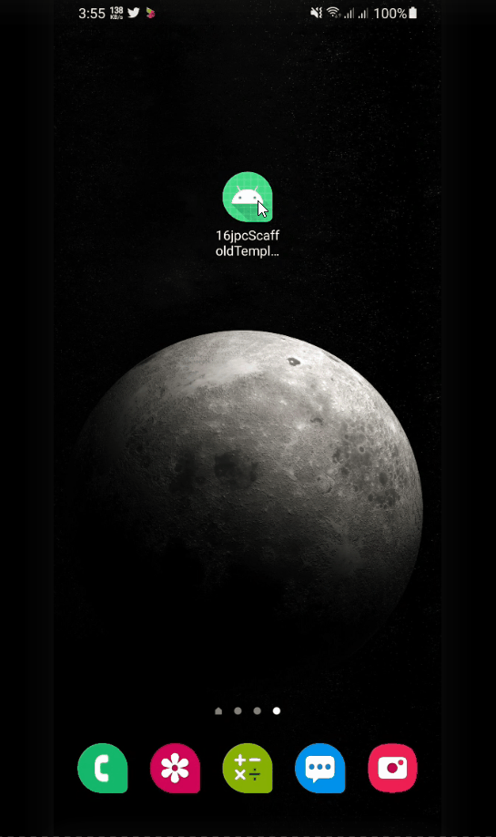

# Scaffold

- [Scaffold](#scaffold)
  - [Intro](#intro)
  - [Building Templates with Scaffold](#building-templates-with-scaffold)

## Intro

Compose provides convenient layouts for combining Material Components into common screen patterns. Composables such as Scaffold provide slots for various components and other screen elements.

```kotlin
@Composable
fun Scaffold(
    modifier: Modifier! = Modifier,
    scaffoldState: ScaffoldState! = rememberScaffoldState(),
    topBar: (@Composable () -> Unit)? = {},
    bottomBar: (@Composable () -> Unit)? = {},
    snackbarHost: (@Composable (SnackbarHostState) -> Unit)? = { SnackbarHost(it) },
    floatingActionButton: (@Composable () -> Unit)? = {},
    floatingActionButtonPosition: FabPosition! = FabPosition.End,
    isFloatingActionButtonDocked: Boolean! = false,
    drawerContent: (@Composable @ExtensionFunctionType ColumnScope.() -> Unit)? = null,
    drawerGesturesEnabled: Boolean! = true,
    drawerShape: Shape! = MaterialTheme.shapes.large,
    drawerElevation: Dp! = DrawerDefaults.Elevation,
    drawerBackgroundColor: Color! = MaterialTheme.colors.surface,
    drawerContentColor: Color! = contentColorFor(drawerBackgroundColor),
    drawerScrimColor: Color! = DrawerDefaults.scrimColor,
    backgroundColor: Color! = MaterialTheme.colors.background,
    contentColor: Color! = contentColorFor(backgroundColor),
    content: (@Composable (PaddingValues) -> Unit)?
): Unit
```

- [https://developer.android.com/jetpack/compose/layouts/material#scaffold](https://developer.android.com/jetpack/compose/layouts/material#scaffold)

## Building Templates with Scaffold

<div align="center">

</div>

Dependencies


```xml
def nav_version = "2.4.1"
//    implementation "androidx.navigation:navigation-compose:$nav_version"
    implementation "com.google.accompanist:accompanist-navigation-animation:0.24.5-alpha"
    implementation "com.google.accompanist:accompanist-systemuicontroller:0.24.5-alpha"
    implementation 'androidx.core:core-splashscreen:1.0.0-beta01'
```

MainActivity && Scaffold

```kotlin
class MainActivity : ComponentActivity() {
    private val viewModel by viewModels<MainViewModel>()
    override fun onCreate(savedInstanceState: Bundle?) {
        val splashScreen = installSplashScreen()
        super.onCreate(savedInstanceState)
        splashScreen.apply {
            setKeepOnScreenCondition {
                viewModel.loading.value
            }
            setOnExitAnimationListener { splashScreenProvider ->
                val splashScreenView = splashScreenProvider.view
                val anim = ObjectAnimator.ofFloat(
                    splashScreenView,
                    View.TRANSLATION_Y,
                    0f,
                    splashScreenView.height.toFloat()
                )
//                anim.interpolator = BounceInterpolator()
                anim.interpolator = AnticipateInterpolator()
                anim.duration = 500L
                anim.doOnEnd { splashScreenProvider.remove() }
                anim.start()
            }
        }
        setContent {
            ScaffoldTemplateTheme {
                AppScaffold(viewModel)
            }
        }
    }
}

@OptIn(ExperimentalAnimationApi::class)
@Composable
fun AppScaffold(viewModel: MainViewModel) {

    val navController = rememberAnimatedNavController()
    val scaffoldState =
        rememberScaffoldState(rememberDrawerState(initialValue = DrawerValue.Closed))
    val scope = rememberCoroutineScope()
    val currentScreen by viewModel.currentScreen.collectAsState()
    Log.d("route", currentScreen.toString())
    var topBar: @Composable () -> Unit = {
        if (currentScreen != Screens.AuthScreen.Login && currentScreen != Screens.AuthScreen.Register) {
            TopBar(
                title = currentScreen!!.title,
                buttonIcon = Icons.Filled.Menu,
                onButtonClicked = {
                    scope.launch {
                        scaffoldState.drawerState.open()
                    }
                }
            )
        }
        if (currentScreen == Screens.DrawerScreens.Help || currentScreen == Screens.DrawerScreens.Account) {
//            topBar = {
            TopBar(
                title = Screens.DrawerScreens.Help.title,
                buttonIcon = Icons.Filled.ArrowBack,
                onButtonClicked = {
                    navController.popBackStack()
                }
            )
//            }
        }
    }


    val bottomBar: @Composable () -> Unit = {
        when (currentScreen) {
            Screens.HomeScreens.Home, Screens.HomeScreens.Favorite, Screens.HomeScreens.Notification -> {
                BottomBar(
                    navController = navController,
                )
            }
            else -> null
        }
//        if (currentScreen != Screens.AuthScreen.Login && currentScreen != Screens.AuthScreen.Register) {
//
//        }
    }

    Scaffold(
        topBar = {
            topBar()
        },
        bottomBar = {
            bottomBar()
        },
        scaffoldState = scaffoldState,
        drawerContent = {
            Drawer { route ->
                scope.launch {
                    scaffoldState.drawerState.close()
                }
                navController.navigate(route) {
                    popUpTo(Screens.HomeScreens.Home.route) {
//                    popUpTo(navController.graph.findStartDestination().id) {
                        saveState = true
                    }
                    // Avoid multiple copies of the same destination when
                    // reselecting the same item
                    launchSingleTop = true
                    // Restore state when reselecting a previously selected item
                    restoreState = true
                }
            }
        },
        drawerGesturesEnabled = scaffoldState.drawerState.isOpen,
    ) {
        BuildNavigation(viewModel = viewModel, navController = navController)
    }
}

@OptIn(ExperimentalAnimationApi::class)
@Composable
fun BuildNavigation(viewModel: MainViewModel, navController: NavHostController) {
    AnimatedNavHost(
        navController = navController,
        startDestination = AUTH_ROUTE,
    ) {
        authGraph(navController = navController, viewModel = viewModel)
        homeGraph(navController = navController, viewModel = viewModel)
    }
}

@OptIn(ExperimentalAnimationApi::class)
fun NavGraphBuilder.authGraph(navController: NavHostController, viewModel: MainViewModel) {
    navigation(startDestination = Screens.AuthScreen.Login.route, route = AUTH_ROUTE) {
        composable(Screens.AuthScreen.Login.route) {
            LoginScreen(
                navController,
                viewModel
            )
        }
        composable(Screens.AuthScreen.Register.route) { RegisterScreen(navController, viewModel) }
    }
}

@OptIn(ExperimentalAnimationApi::class)
fun NavGraphBuilder.homeGraph(navController: NavHostController, viewModel: MainViewModel) {
    navigation(startDestination = Screens.HomeScreens.Home.route, route = MAIN_ROUTE) {
        //Passing viewModel -> For Managing TopAPP and Drawer
        composable(Screens.HomeScreens.Home.route) { Home(viewModel = viewModel) }
        composable(Screens.HomeScreens.Favorite.route) { Favorite(viewModel = viewModel) }
        composable(Screens.HomeScreens.Notification.route) { Notification(viewModel = viewModel) }
        composable(Screens.DrawerScreens.Account.route) { Account(viewModel = viewModel) }
        composable(Screens.DrawerScreens.Help.route) { Help(viewModel = viewModel) }
    }

}
```
