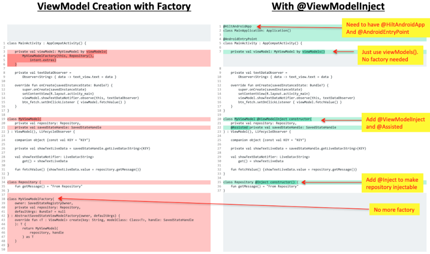

# Dagger Hilt - Dependency Injection in Android

- [Dagger Hilt - Dependency Injection in Android](#dagger-hilt---dependency-injection-in-android)
	- [Dependency Injection](#dependency-injection)
	- [Automated dependency injection - Dagger Hilt](#automated-dependency-injection---dagger-hilt)
		- [Adding dependencies](#adding-dependencies)
		- [@HiltAndroidApp](#hiltandroidapp)
		- [@AndroidEntryPoint](#androidentrypoint)
		- [@Inject - Creating Hilt dependencies🚀](#inject---creating-hilt-dependencies)
		- [@Module](#module)
			- [Hilt and Interface🚀](#hilt-and-interface)
				- [multiple classes of same interface](#multiple-classes-of-same-interface)
			- [Hilt and third-party libraries🚀](#hilt-and-third-party-libraries)
		- [Hilt with primitive types + Named parameters for same types](#hilt-with-primitive-types--named-parameters-for-same-types)
	- [with ViewModel](#with-viewmodel)

## Dependency Injection

Classes often require references to other classes. For example, a `Mobile` class might need a reference to `Battery` class, `Processor` class etc. These required classes are called dependencies, and in this example the  `Mobile` class is dependent on having an instance of the `Battery` and `Processor` classes to run.

```kotlin
class Battery(){}
class Processor(){}
class Mobile{
    var battery :Battery? =null
    var processor : Processor? = null
    init {
        battery = Battery()
        processor = Processor()
    }
}
```

So, Problems in this example can be as follows:

- violation of first and fifth principle of `S.O.L.I.D`
  - `first: single responsibility principle` - Each class should have one responsibility, one single purpose. So the `Mobile` class should not have the responsibility to create the `Battery` and `Processor`.
  - `second: Dependency Injection principle` - This states that a class should not configure its dependencies statically but should be configured by some other class from outside.

- Every time a new instance of `Mobile` is created, it will have to create a new instance of `Battery` and `Processor` classes. This is not efficient. If we already have the instances of these classes, we can not pass them to the `Mobile` class.

That's why we need **dependency injection**! With this approach you take the dependencies of a class and provide them rather than having the class instance obtain them itself.

What does the code look like with dependency injection? Instead of each instance of `Mobile` constructing its own `Processor` and `Battery`  objects on initialization, it receives them as a parameter in its constructor:

```kotlin
class Mobile(
    var battery: Battery? = null,
    var processor: Processor? = null
)

// Dependency Injection
val mobile = Mobile(Battery("500mAh"),Processor("Snapdragon"))
```

There are two major ways to do dependency injection in Android:

- `Constructor Injection`. This is the way described above. You pass the dependencies of a class to its constructor.
- `Field Injection (or Setter Injection)`. Certain Android framework classes such as activities and fragments are instantiated by the system, so constructor injection is not possible. With field injection, dependencies are instantiated after the class is created. The code would look like this:

## Automated dependency injection - Dagger Hilt

The intention behind automated DI containers is to abstract the fulfillment of dependencies from the application itself. Essentially, we split this job out completely, so that the application code no longer has to do it, and instead we ask a third party—the DI container—to get it done.

Hilt is a dependency injection library for Android that reduces the boilerplate of doing manual dependency injection. Doing manual dependency injection requires to construct every class and its dependencies by hand, and to use containers to reuse and manage dependencies.

Hilt provides a standard way to use DI in your application by providing containers for every Android class in the project and managing their lifecycles automatically. Hilt is built on top of the popular DI library Dagger to benefit from the compile-time correctness, runtime performance, scalability, and Android Studio support that Dagger provides.

- [https://developer.android.com/training/dependency-injection/hilt-android](https://developer.android.com/training/dependency-injection/hilt-android)
- [https://developer.android.com/training/dependency-injection/hilt-cheatsheet](https://developer.android.com/training/dependency-injection/hilt-cheatsheet)

### Adding dependencies

project's root `build.gradle` file:

```groovy
buildscript {
    dependencies {
        classpath 'com.google.dagger:hilt-android-gradle-plugin:2.38.1'
    }
}
```

Then, apply the Gradle plugin and add these dependencies in `app/build.gradle` file:

```groovy
plugins {
  id 'kotlin-kapt'
  id 'dagger.hilt.android.plugin'
}

dependencies {
    implementation "com.google.dagger:hilt-android:2.38.1"
    kapt "com.google.dagger:hilt-compiler:2.38.1"
}
```

> Error: Execution failed for task ':app:kaptDebugKotlin'.

try add to `gradle.properties`:

```groovy
kapt.use.worker.api=false
```

> Error: Hilt Activity must be attached to an @HiltAndroidApp Application. Did you forget to specify your Application's class name in your manifest's <application />'s android:name attribute?

In `AndroidManifest.xml` file add this:

```xml
<application
        android:name=".MyApplication"
 </application>
```


### @HiltAndroidApp

All apps that use Hilt must contain an Application class that is annotated with @HiltAndroidApp.

`@HiltAndroidApp `triggers Hilt's code generation, including a base class for your application that serves as the application-level dependency container.

```kotlin
import android.app.Application
import dagger.hilt.android.HiltAndroidApp

@HiltAndroidApp
class MyApplication : Application() {}
```

### @AndroidEntryPoint

Once Hilt is set up in your Application class and an application-level component is available, Hilt can provide dependencies to other Android classes that have the `@AndroidEntryPoint` annotation:


```kotlin
@AndroidEntryPoint
class MainActivity : ComponentActivity() {}
```

Hilt currently supports the following Android classes:

- `Application` (by using `@HiltAndroidApp`)
- `ViewModel` (by using `@HiltViewModel`)
- `Activity`
- `Fragment`
- `View`
- `Service`
- `BroadcastReceiver`

### @Inject - Creating Hilt dependencies🚀

Make this change to the all the classes:

```kotlin
class Battery @Inject constructor() {}
class Processor @Inject constructor() {}
class Mobile @Inject constructor(
////    var battery: Battery? = null, avoid a constructor with default arguments
////    error: Types may only contain one injected constructor
////    https://stackoverflow.com/questions/55240472/types-may-only-contain-one-inject-constructor
    var battery: Battery,
    var processor: Processor
) {
    fun print() {
        Log.d("inject", "Mobile Created")
    }
}
```

`@Inject` gives Hilt access to the constructor of `Mobile`, `Battery`, `Processor`. This means that now Hilt can generate instances of these classes.


Make the following change to `MainActivity`:

```kotlin
@AndroidEntryPoint
class MainActivity : ComponentActivity() {

    @Inject
    lateinit var mobile: Mobile
    // val mobile = Mobile(Battery("500mAh"), Processor("Snapdragon"))

    override fun onCreate(savedInstanceState: Bundle?) {
        super.onCreate(savedInstanceState)
        mobile.print()
        setContent {
            DaggerHiltTheme {
                App()
            }
        }
    }
}
```

**`@Inject` here has a different purpose. It identifies the injectable field. Injectable means that Hilt can supply the instantiated dependencies to it.**

### @Module

Apart from the `@Inject` annotation, there's another way to tell Dagger how to provide an instance of a class: the information inside Dagger modules.

#### Hilt and Interface🚀

```kotlin
interface Accessory {
    fun madeYear()
}
class Battery @Inject constructor() : Accessory {
    override fun madeYear() {}
}

class Mobile @Inject constructor(
    var battery: Accessory,
    var processor: Processor
) {
    fun print() {
        Log.d("inject", "Mobile Created")
    }
}
```

However, when you run your app, it crashes at compile time. Hilt is unable to implement the interface. It does not know how to. Interfaces do not have constructors like classes do. It is impossible to `@Inject` them.

```kotlin
@Module
@InstallIn(ActivityComponent::class)
abstract class AccessoryModule {
    @Binds
    abstract fun BatteryImpl(battery: Battery): Accessory
}
```

A `module` informs Hilt how to provide dependencies when it cannot access the constructor. `@Module` is used to identify modules.

`@InstallIn(ActivityComponent)` declares that the following implementation will be alive only as long as the activity is active. The activity is, therefore, the component.

`@Binds` tells Hilt which implementation to use when it needs to provide an **instance of an interface**. The information on how to provide the implementation is in the function parameters.

##### multiple classes of same interface

Now modify `Processor` as well.

```kotlin
interface Accessory {
    fun madeYear()
}
class Battery @Inject constructor() : Accessory {
    override fun madeYear() {}
}
class Processor @Inject constructor() : Accessory {
    override fun madeYear() {
    }
}
class Mobile @Inject constructor(
    var battery: Accessory,
    var processor: Accessory
) {
    fun print() {
        Log.d("inject", "Mobile Created")
    }
}
```

It seems that Hilt is using `BatteryImpl` to generate instances of `Processor` as `Battery`! We need to differentiate them somehow.

Add the following code outside `AccessoryModule` class but in the same file:

```kotlin
@Qualifier
annotation class BatteryQualifier

@Qualifier
annotation class ProcessorQualifier
```

You will use these qualifiers to differentiate the Processor and Battery implementation.

```kotlin
@Module
@InstallIn(ActivityComponent::class)
abstract class AccessoryModule {
    @BatteryQualifier
    @Binds
    abstract fun BatteryImpl(battery: Battery): Accessory
    @ProcessorQualifier
    @Binds
    abstract fun ProcessorImpl(processor: Processor): Accessory
}
@Qualifier
annotation class BatteryQualifier

@Qualifier
annotation class ProcessorQualifier

class Mobile @Inject constructor(
    @BatteryQualifier
    var battery: Accessory,
    @ProcessorQualifier
    var processor: Accessory
) {
    fun print() {
        Log.d("inject", "Mobile Created")
    }
}
```

#### Hilt and third-party libraries🚀

Hilt works well when we have access to constructors. But what if you can’t access constructors? This happens when you import 3rd party libraries. You don’t own the classes. Has the party stopped?

```kotlin
@Module
@InstallIn(SingletonComponent::class)
object GsonModule {
    @Provides
    fun provideGson(): Gson {
        return Gson()
    }
}
```

Through `@Provides`, the annotated function gives Hilt the following information:

- The `return` type tells Hilt what type the function provides instances of.
- The `parameters` tell Hilt the dependencies required to provide the type. In our case, there are none.
- The `function` body tells Hilt how to provide an instance of the corresponding type. Hilt executes the function body every time it needs to provide an instance of that type.

### Hilt with primitive types + Named parameters for same types

```kotlin
class Battery @Inject constructor(
    @Named("battery")
    val capacity: String
) {}

class Processor @Inject constructor(
    @Named("processor")
    val company: String
) {}

@Module
@InstallIn(SingletonComponent::class)
class StringModule {
    @Provides
    @Named("battery")
    fun getBatteries() = "5000mAh"

    @Provides
    @Named("processor")
    fun getProcessor() = "5000mAh"
}

class Mobile @Inject constructor(
    var battery: Battery,
    var processor: Processor
) {
    fun print() {
        Log.d("inject", "Mobile Created")
    }
}
```

## with ViewModel

With hilt, you can avoid the boilerplate of creating a ViewModel class using factory methods.

<div align="center">

</div>

```kotlin
data class User(val id: Long,val name: String,val email: String)

@Singleton
class UserRepository @Inject constructor() {
    fun getUser(id: Long): User? {
        return getUsers().find { it.id == id }
    }
    fun getUsers(): List<User> {
        return listOf(
            User(id = 123, name = "James Bond", "jamesbond@007.com"),
            User(id = 345, name = "Batman", "batman@cave.com"),
            User(id = 999, name = "Arya Stark", "arya@winterfell.com")
        )
    }
}

@HiltViewModel
class HomeScreenViewModel @Inject constructor(private val userRepository: UserRepository) : ViewModel() {
    private val _users = MutableStateFlow(userRepository.getUsers())
    val users: StateFlow<List<User>> = _users
}

@HiltViewModel
class UserDetailScreenViewModel @Inject constructor(private val userRepository: UserRepository) :
    ViewModel() {
    private val _user = MutableStateFlow<User?>(null)
    val user: StateFlow<User?> = _user

    fun load(userId: Long) {
        _user.value = userRepository.getUser(id = userId)
    }
}

@Composable
fun UserDetailScreen(navController: NavController, vm: UserDetailScreenViewModel, userId: Long) {
    Column {
        vm.load(userId = userId)
        val user by vm.user.collectAsState()
        Column(Modifier.padding(all = 16.dp)) {
            Text(text = "Hello, I'm ${user?.name}")
            Text(text = "My email is ${user?.email}")
        }
    }

}

@Composable
fun HomeScreen(navController: NavController, vm: HomeScreenViewModel) {
    Column {
        val users by vm.users.collectAsState()
        users.forEach { user ->
            ClickableText(text = AnnotatedString(user.name), Modifier.padding(all = 16.dp),
                onClick = {
                    navController.navigate("users/${user.id}")
                })
        }
    }
}

@AndroidEntryPoint
class MainActivity : ComponentActivity() {
    override fun onCreate(savedInstanceState: Bundle?) {
        super.onCreate(savedInstanceState)
        setContent {
            DaggerHiltTheme {
                Surface(color = MaterialTheme.colors.background) {
                    val navController = rememberNavController()
                    NavHost(navController = navController, startDestination = "home") {
                        composable("home") {
                            val vm: HomeScreenViewModel by viewModels()
                            HomeScreen(navController, vm)
                        }
                        composable("users/{userId}") { backStackEntry ->
                            val vm: UserDetailScreenViewModel by viewModels()
                            UserDetailScreen(navController, vm, (backStackEntry.arguments?.getString("userId", "") ?: "").toLong())
                        }
                    }
                }
            }
        }
    }
}
```