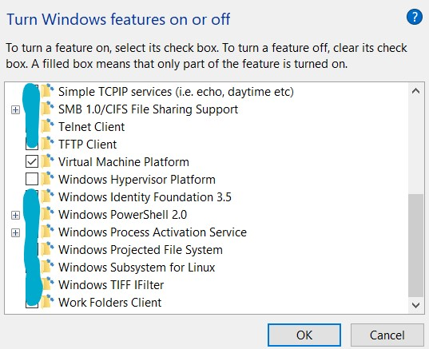
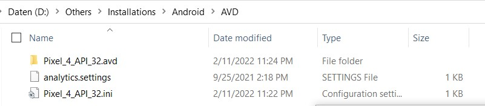
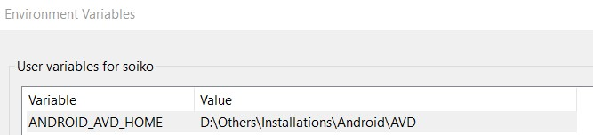
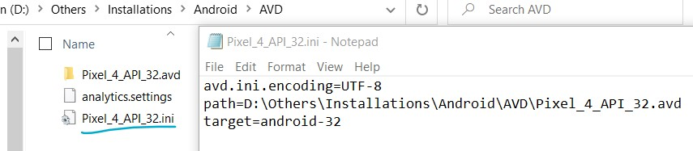
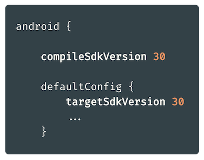
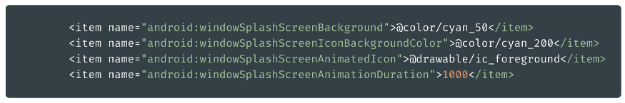
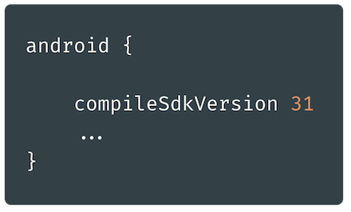

# Android

- [Android](#android)
	- [Setup and Settings](#setup-and-settings)
		- [Android Emulator - AMD Processor](#android-emulator---amd-processor)
		- [Changing AVD installation location](#changing-avd-installation-location)
	- [`CompileSdkVersion` and `targetSdkVersion`](#compilesdkversion-and-targetsdkversion)
		- [`compileSdkVersion`](#compilesdkversion)
		- [`targetSdkVersion`](#targetsdkversion)

## Setup and Settings

### Android Emulator - AMD Processor

- Windows Features:

### Changing AVD installation location

Moving avd directory from it's default `C:\users\<username>\.android\avd` to `D:\Others\Installations\Android\AVD`

- Move avd directory to desired location (ex. `D:\Others\Installations\Android\AVD`)

- Change or add environment variable `ANDROID_AVD_HOME` : `D:\Others\Installations\Android\AVD`

- If you have already AVD, change path of `avdName.ini `to `D:\Others\Installations\Android\AVD\Pixel_4_API_32.avd`

[https://stackoverflow.com/questions/40501341/how-can-i-change-the-path-to-android-avd-in-my-android-studio](https://stackoverflow.com/questions/40501341/how-can-i-change-the-path-to-android-avd-in-my-android-studio)

## `CompileSdkVersion` and `targetSdkVersion`

Both `compileSdkVersion` and `targetSdkVersion` are crucial to handle forward compatibility in Android — so they both are connected with what to do when the new Android SDK version appears.

### `compileSdkVersion`

`compileSdkVersion` defines **which Android SDK version will be used by gradle to compile the app**.

In Android 12, so in SDK version `31`, there was a new API introduced, that allows us to easily implement a splash screen. In this new API, the splash screen can be customized using those properties:

If we want to use that API in our app you first have to:

- Download SDK version `31` in Android Studio,
- Update `compileSdkVersion` to `31` in `build.gradle[Module]` file, then click on `Sync Now`.

Only then we can see these new properties. And only then we can use this new splash screen API in your code.

### `targetSdkVersion`

`targetSdkVersion` is a property that tells the system for which Android version the app was designed and tested on.

for more - [https://proandroiddev.com/compilesdkversion-and-targetsdkversion-what-is-the-difference-b4227c663ba8](https://proandroiddev.com/compilesdkversion-and-targetsdkversion-what-is-the-difference-b4227c663ba8)